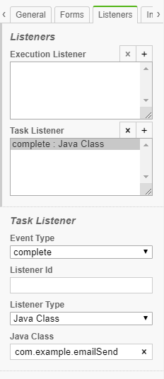
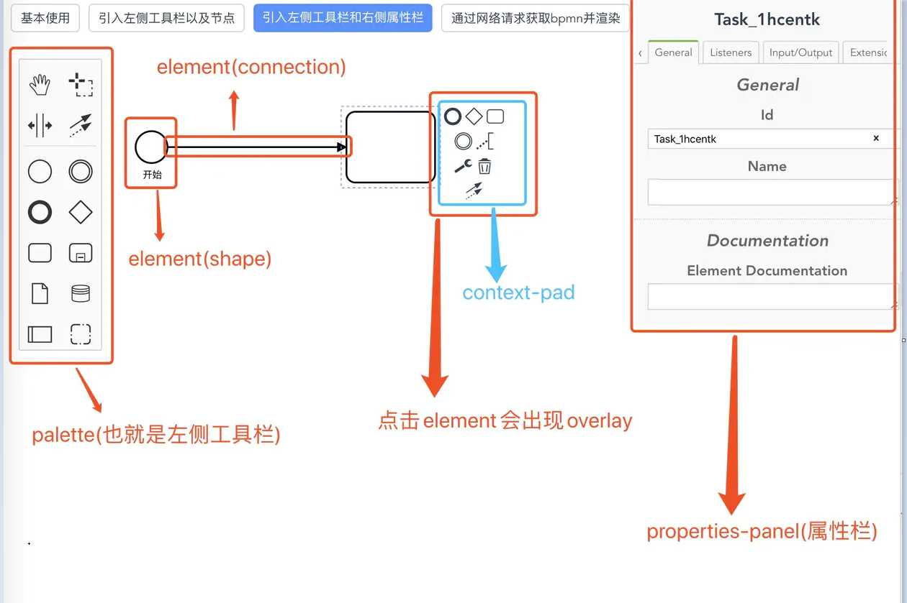

## Quick Start

[官方文档](https://docs.camunda.org/manual/7.15/introduction/)

通过容器启动一个Camunda服务：

```sh
docker run -d --name camunda -p 8080:8080 camunda/camunda-bpm-platform:run-latest
# 用户密码 demo/demo
```

创建模型：Camunda Modeler [[download](https://camunda.com/download/modeler/)] [[Github](https://github.com/camunda/camunda-modeler)]


在线编辑（https://bpmn.io/）

## 介绍

Camunda is a Java-based framework supporting **BPMN** for workflow and process automation, CMMN for Case Management and DMN for Business Decision Management.


WebApp:

+ Tasklist
+ Cockpit 驾驶舱
+ Admin 超管设置（用户、分组、租户、系统等）

### 架构

 

+ Api: 面向服务的API，允许Java应用程序与流程引擎交互。
+ BPMN Core Engine: 解析BPMN2.0xml文件为java对象和一组BPMN行为实现。
+ Job Executor:作业执行器负责处理异步后台工作，如进程中的计时器或异步延续。
+ Persistence:流程引擎具有一个持久层，负责将流程实例状态持久化到关系数据库。使用了MyBatis

## 说明

### 概念


+ process definition 流程定义；简单的认为就是画的流程图
+ process instance 流程图实例。
+ Task 任务，当流程流转到某个阶段，需要用户审核或者其他操作的时候，这个需要用户来完成的操作就是一个任务，除了用户任务之外，还有系统任务等其他任务
+ 执行人： 让某个用户执行，可以直接指定、指定候选人、指定候选组
+ Gateway： 网关，条件判断： 有 Inclusive、Exclusive和Parallel
+ 表单： 分内置和外联表单、业务表单
+ Execution 流程执行实例。 如果一个流程包含多个执行路径，就会有多个execution
+ Activity Instance 活动实例与执行的概念相近，但采用了不同的视角，虽然可以将执行像想为在流程中流动的令牌，但活动实例表示活动（任务、子流程）的单个实例。因此，活动实例的概念更面向状态
+ Process Variable 流程变量。是业务和流程引擎之间交互信息的载体。变量分为全局变量和本地变量
+ Tasklist 即任务列表，也就是待办任务。当流程节点是人工任务类型时，才可产生任务列表。
+ Job&Job Definition 作业执行器。作业执行器是一个调度组件，负责执行异步后台工作。
+ **Tenant** 租户
+ listener ： Task中可以定义一些监听器，用于完成一些复杂的逻辑业务。

  

**ProcessEngine** 核心接口，提供了工作流所有的操作的api

1. RuntimeService 处理一个流程定义的运行实例(executing instance)，用于开启流程实例、删除流程实例、以及搜索流程实例等操作
2. TaskService 用于用户任务的认领、完成、分发等操作
3. IdentityService 用于提供身份认证以及管理用户和用户组
4. HistoryService 用于查询历史流程实例、历史任务以及历史流程变量等
5. FormService 用户内外联表单的渲染、通过提交表单开启流程实例、通过提交表单完成任务等
6. RepositoryService 提供用于管理和操作部署和流程定义的操作。
   + 查询引擎已知的部署和进程定义。
   + 挂起和激活进程定义。
   + 检索各种资源，例如引擎自动生成的部署或流程图中包含的文件。

7. HistoryService 历史数据搜集

8. ManagementService 返回数据表和结构

9. FilterService 管理filter

10. ExternalTaskService
11. CaseService for case instance (like RuntimeService )


#### Listener定义

可以直接定义java类

 

或者通过注解attach到对应的任务实例：

```java
@Component
public class CCListener {
    private Logger logger= LoggerFactory.getLogger(CCListener.class);

    @EventListener(condition = "#delegateTask.eventName=='create' && #delegateTask.name=='CCTask'")
    public void Notify(){

    }
}
```


> 参考 
>
> https://www.qyh.me/articles/camunda-get-started
>
> https://blog.maxisvest.com/camunda%E5%BC%95%E6%93%8E%E5%88%9D%E6%8E%A2/


### 数据库

https://docs.camunda.org/manual/7.15/user-guide/process-engine/database/database-schema/

### REST API

https://docs.camunda.org/manual/7.15/reference/rest/

## WEB集成

[徐蒙的分享](http://218.3.150.105:8000/xu-meng/share/2021/06/22/2703/)

使用bpmnjs



想要使用右侧的属性栏就得安装上一个名为bpmn-js-properties-panel的插件。为了二次开发的方便已经下载集成在web项目文件下。可查看目录文件。

参考：

云程BPM系统 https://www.yunbangong100.com:31110/app/group

Scalable Form Platform(表单设计器)：https://scalable-form-platform.github.io/#/

bpmn.js教程：https://juejin.cn/post/6844904017584193544

camunda接口：https://docs.camunda.org/manual/7.15/reference/rest/


## Step By Step

1. 创建spring-boot项目，引入camunda

2. 编写application.yml

3. 编写保存模型 .bpmn

4. META-INF下添加processes.xml

   ```xml
   <process-application
           xmlns="http://www.camunda.org/schema/1.0/ProcessApplication"
           xmlns:xsi="http://www.w3.org/2001/XMLSchema-instance">
   
       <process-archive>
           <process-engine>default</process-engine>
           <properties>
               <property name="isDeleteUponUndeploy">false</property>
               <property name="isScanForProcessDefinitions">true</property>
           </properties>
       </process-archive>
   
   </process-application>
   ```

   

5. 拷贝bpmn文件到resources目录

6. 启动spring-boot，访问localhost:8080


## READ MORE

### Process Engine API

在spring-boot程序中使用

```java
@Autowired
private RepositoryService repositoryService;
```

+ 

### Process Engine Concepts

##### Process Definitions 过程定义

```java
List<ProcessDefinition> processDefinitions = repositoryService.createProcessDefinitionQuery()
    .processDefinitionKey("invoice") //key
    .orderByProcessDefinitionVersion()
    .asc()
    .list();
```

##### Process Instance 过程实例

启动一个实例

```java
ProcessInstance instance = runtimeService.startProcessInstanceByKey("invoice");
```

通过fluent builder创建任意Activities集合的过程实例

```java
ProcessInstance instance = runtimeService.createProcessInstanceByKey("invoice")
  .startBeforeActivity("SendInvoiceReceiptTask")
  .setVariable("creditor", "Nice Pizza Inc.")
  .startBeforeActivity("DeliverPizzaSubProcess")
  .setVariableLocal("destination", "12 High Street")
  .execute();
```

##### Job&Job Definitions

Camunda进程引擎包含一个名为Job Executor的组件。作业执行器是一个调度组件，负责执行异步后台工作 (例如定时器)

查询：

```java
managementService.createJobDefinitionQuery()
  .processDefinitionKey("orderProcess")
  .list()
```

