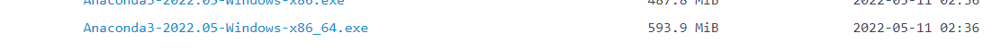

## 下载安装

https://mirrors.tuna.tsinghua.edu.cn/anaconda/archive/?C=M&O=D

+=+

这里选择安装了 

安装完成将其设置成环境变量：%AnacondaHome% 和 %AnacondaHome%\Scripts

添加国内下载源： .condarc文件

```yaml
channels:
  - http://mirrors.tuna.tsinghua.edu.cn/anaconda/cloud/conda-forge/
  - http://mirrors.tuna.tsinghua.edu.cn/anaconda/pkgs/main/
  - http://mirrors.tuna.tsinghua.edu.cn/anaconda/pkgs/free/
show_channel_urls: true
```


> 安装包错误时
>
> 记得设置Python国内镜像地址，在User用户下.pip配置
>
> ```ini
> [global]
> index-url = https://pypi.tuna.tsinghua.edu.cn/simple
> [install]
> trusted-host=mirrors.aliyun.com
> ```
>
> 同时记得 **关闭科学上网工具**


Conda常见命令：

```sh
# 搜索时显示通道地址
conda config --set show_channel_urls yes

# 查看通道地址
conda config --show channels

# 查看虚拟环境
conda env list

# 创建一个名为noti的虚拟环境，包含第三方库jupyter notebook
conda create -n noti jupyter notebook
activate noti
```


启动Anaconda Navigator


启动[](http://localhost:8889/tree?token=17e620cf8207b7e54485b7c21acb6b26fae25cf37e6ecf19)


## 使用PyTorch实现BP神经网络

ref https://www.i4k.xyz/article/weixin_44698389/105140349

BP算法(即**误差反向传播算法**)适合于多层神经元网络的一种学习算法，它建立在梯度下降法的基础上。
BP算法的学习过程由正向传播过程和反向传播过程组成。
正向传播：计算输入通过隐藏层之后的输出结果（y_predict)。将y_predict和y_true的**误差的平方和**作为目标函数（loss）。
反向传播：逐层求出目标函数对各神经元权值的偏导数，构成目标函数对权值向量的梯度值，作为修改权值的依据。
网络的学习在权值修改过程中完成。误差达到所期望值时，网络学习结束。


> <Pytorch搭建BP神经网络>
>
> https://www.cnblogs.com/lemon-567/p/14441137.html


实验过程：

```python
# 安装pytorch
!pip install torch -i https://pypi.tuna.tsinghua.edu.cn/simple
```

    Looking in indexes: https://pypi.tuna.tsinghua.edu.cn/simple
    Requirement already satisfied: torch in c:\users\yww08\anaconda3\lib\site-packages (1.12.1)
    Requirement already satisfied: typing-extensions in c:\users\yww08\anaconda3\lib\site-packages (from torch) (3.7.4.3)


```python
# -*- coding: utf-8 -*
import numpy as np
import torch
from torch import nn
from torch.autograd import Variable
from torch.utils.data import DataLoader
import matplotlib.pyplot as plt
x = [
    [0, 0],
    [0, 1],
    [1, 0],
    [1, 1],
        ]
y=[[0], [1], [1], [0]]
x=np.array(x)
y=np.array(y)
x = torch.from_numpy(x).float()
y = torch.from_numpy(y).float()
train_data = zip(x, y)
test_data = zip(x, y)
train_data = DataLoader(list(train_data), batch_size=32, shuffle=True)  # 训练数据
test_data  = DataLoader(list(test_data), batch_size=64, shuffle=False)  # 测试数据

class BPNNModel(torch.nn.Module):
    def __init__(self):
        # 调用父类的初始化函数，必须要的
        super(BPNNModel, self).__init__()

        # 创建四个Sequential对象，Sequential是一个时序容器，将里面的小的模型按照序列建立网络
        self.layer1 = nn.Sequential(nn.Linear(2, 5), nn.ReLU())
        # self.layer2 = nn.Sequential(nn.Linear(400, 200), nn.ReLU())
        # self.layer3 = nn.Sequential(nn.Linear(200, 100), nn.ReLU())
        self.layer4 = nn.Sequential(nn.Linear(5, 1))

    def forward(self, img):
        # 每一个时序容器都是callable的，因此用法也是一样。
        img = self.layer1(img)
        # img = self.layer2(img)
        # img = self.layer3(img)
        img = self.layer4(img)
        return img


# 创建和实例化一个整个模型类的对象
model = BPNNModel()
# 打印出整个模型
print(model)


# Step 3:============================定义损失函数和优化器===================
criterion = nn.MSELoss()
# 我们优先使用随机梯度下降，lr是学习率: 
optimizer = torch.optim.SGD(model.parameters(), 3e-3)


# Step 4:============================开始训练网络===================
# 为了实时观测效果，我们每一次迭代完数据后都会，用模型在测试数据上跑一次，看看此时迭代中模型的效果。
# 用数组保存每一轮迭代中，训练的损失值和精确度，也是为了通过画图展示出来。
train_losses = []
train_acces = []
# 用数组保存每一轮迭代中，在测试数据上测试的损失值和精确度，也是为了通过画图展示出来。
eval_losses = []
eval_acces = []

for e in range(10000):


    # 4.1==========================训练模式==========================
    train_loss = 0
    train_acc = 0
    model.train()   # 将模型改为训练模式

    # 每次迭代都是处理一个小批量的数据，batch_size是64
    for im, label in train_data:

        # 计算前向传播，并且得到损失函数的值
        out = model(im)
        loss = criterion(out, label)

        # 反向传播，记得要把上一次的梯度清0，反向传播，并且step更新相应的参数。
        optimizer.zero_grad()
        loss.backward()
        optimizer.step()

        # 记录误差
        train_loss += loss.item()

    train_losses.append(train_loss / len(train_data))


    # 4.2==========================每次进行完一个训练迭代，就去测试一把看看此时的效果==========================
    # 在测试集上检验效果
    eval_loss = 0
    eval_acc = 0
    model.eval()  # 将模型改为预测模式

    # 每次迭代都是处理一个小批量的数据，batch_size是128
    for im, label in test_data:
        im = Variable(im)  # torch中训练需要将其封装即Variable，此处封装像素即784
        label = Variable(label)  # 此处为标签

        out = model(im)  # 经网络输出的结果
        # label = label.unsqueeze(1)
        loss = criterion(out, label)  # 得到误差

        # 记录误差
        eval_loss += loss.item()

    eval_losses.append(eval_loss / len(test_data))
    # eval_acces.append(eval_acc / len(test_data))
    print('epoch: {}, Train Loss: {:.6f},Eval Loss: {:.6f}'
          .format(e, train_loss / len(train_data),eval_loss / len(test_data)))
plt.title('train loss')
plt.plot(np.arange(len(train_losses)), train_losses)
plt.plot(np.arange(len(train_acces)), train_acces)
plt.title('train acc')
plt.plot(np.arange(len(eval_losses)), eval_losses)
plt.title('test loss')
plt.plot(np.arange(len(eval_acces)), eval_acces)
plt.title('test acc')
plt.show()
for i in range(10):
    out = model(x[i, :])
    print("predict:","   ",out.detach().numpy())

```


```python
# -*- coding: utf-8 -*
import numpy as np
import torch
from torch import nn
from torch.autograd import Variable
from torch.utils.data import DataLoader
import matplotlib.pyplot as plt

n,d_in,h,d_out=64,1000,100,10 # 设置输入的样本数，维数，隐藏层的个数，输出层的维数
x=torch.rand(n,d_in)
w1=torch.rand(d_in,h)
bias1=torch.rand(n,h)
w2=torch.rand(h,d_out)
bias2=torch.rand(n,d_out)
y=torch.rand(n,d_out)

learning_rate=0.1
```


```python
for t in range(500):
    cov1=x.mm(w1)+bias1   # mm实现矩阵相乘
    relu_1=cov1.clamp(min=0) # relu激活函数 clamp函数为夹子
    y_predict=relu_1.mm(w2) + bias2
    # 计算损失函数
    loss=(y_predict-y).pow(2).mean().item()  # 求平方pow(2)
    print("pytorch自己构建梯度实现，第{}次的损失为：{}".format(t,loss))
    # backward pass(反向传播计算梯度）
    grad_y_predict=2*(y_predict-y)
    grad_w2=relu_1.t().mm(grad_y_predict)
    grad_bias2=grad_y_predict
    grad_relu1=grad_y_predict.mm(w2.t())   # 转置用t()
    grad_cov1 = grad_relu1.clone()   # 复制用clone()
    grad_cov1[cov1<0]=0
    grad_w1=x.t().mm(grad_cov1)
    grad_bias1 = grad_cov1
    # 更新参数w1和w2,bias1和bias2
    w1-=learning_rate*grad_w1
    w2 -= learning_rate * grad_w2
    bias1-= learning_rate * grad_bias1
    bias2-= learning_rate * grad_bias2
```


```python
# 通过Torch API实现的BP神经网络
class Net(nn.Module):
    def __init__(self,d_in,h,d_out):
        super(Net,self).__init__()
        self.Linear1=nn.Linear(d_in,h)
        self.Relu=nn.ReLU()
        self.Linear2=nn.Linear(h,d_out)
    def forward(self,x):
        x=self.Relu(self.Linear1(x))
        y_pre=self.Linear2(x)
        return (y_pre)
model=Net(d_in,h,d_out)

# model=torch.nn.Sequential(torch.nn.Linear(d_in,h),
#                           torch.nn.ReLU(),
#                           torch.nn.Linear(h,d_out))

optimizer=torch.optim.SGD(model.parameters(),lr=learning_rate)
loss_function=nn.MSELoss()

for t in range(500):
    y_predict=model(x)
    loss=loss_function(y_predict,y)
    if t>450:
        print("pytorch实现，第{}次的损失为：{}".format(t,loss.item()))
    optimizer.zero_grad()
    loss.backward()
    optimizer.step()
```

    。。。
    pytorch实现，第483次的损失为：0.000463884964119643
    pytorch实现，第484次的损失为：0.00046072498662397265
    pytorch实现，第485次的损失为：0.0004567208234220743
    pytorch实现，第486次的损失为：0.00045233164564706385
    pytorch实现，第487次的损失为：0.00044844922376796603
    pytorch实现，第488次的损失为：0.0004496783367358148
    pytorch实现，第489次的损失为：0.00044512111344374716
    pytorch实现，第490次的损失为：0.00044250814244151115
    pytorch实现，第491次的损失为：0.0004386477521620691
    pytorch实现，第492次的损失为：0.0004426171653904021
    pytorch实现，第493次的损失为：0.00044008647091686726
    pytorch实现，第494次的损失为：0.0004413002170622349
    pytorch实现，第495次的损失为：0.00044091432937420905
    pytorch实现，第496次的损失为：0.0004454837180674076
    pytorch实现，第497次的损失为：0.0004424555227160454
    pytorch实现，第498次的损失为：0.0004446159000508487
    pytorch实现，第499次的损失为：0.0004414873546920717
