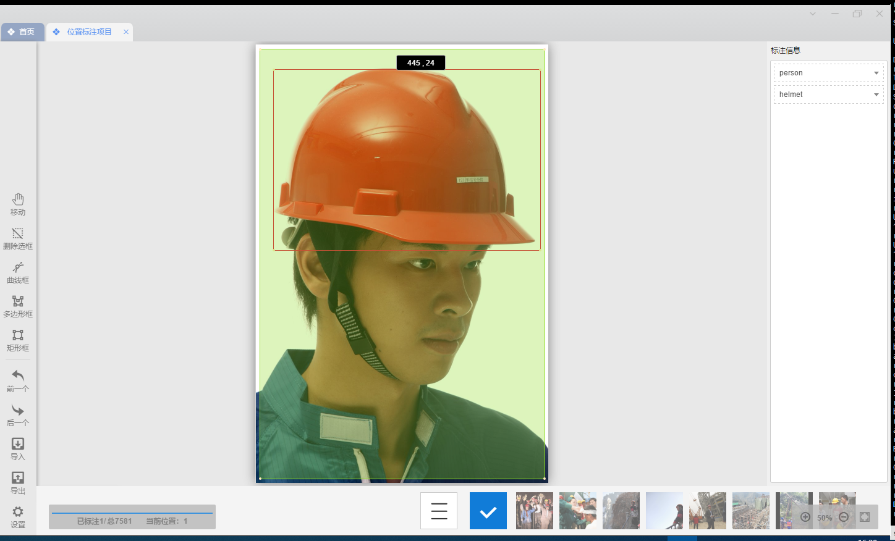
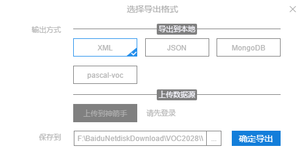

## 安全帽检测

资源：

1. 智慧工地安全帽识别 https://github.com/wujixiu/helmet-detection 

   基于SSD框架，使用[SSD-RPA](https://github.com/wujixiu/helmet-detection.git)获得83.89%mPA。输出了适合移动端的模型。

   

2. 基于目标检测工地安全帽和禁入危险区域识别系统，🚀😆附 YOLOv5 训练自己的数据集超详细教程🚀😆2021.3新增可视化界面❗❗

   https://github.com/PeterH0323/Smart_Construction

   该项目是使用 `YOLOv5 v2.x` 的程序来训练在智能工地安全领域中头盔目标检测的应用

   

3. 安全帽佩戴数据集

   https://github.com/njvisionpower/Safety-Helmet-Wearing-Dataset

   


## [YOLOv5](https://ultralytics.com/yolov5) 🚀

[YOLOv5](https://ultralytics.com/yolov5) 🚀 is a family of compound-scaled object detection models trained on the COCO dataset, and includes simple functionality for Test Time Augmentation (TTA), model ensembling, hyperparameter evolution, and export to ONNX, CoreML and TFLite.

[YOLOv5](https://github.com/ultralytics/yolov5/blob/master/.github/README_cn.md)🚀是一个在COCO数据集上预训练的物体检测架构和模型系列，它代表了[Ultralytics](https://ultralytics.com/)对未来视觉AI方法的公开研究，其中包含了在数千小时的研究和开发中所获得的经验和最佳实践。

安装

在[**Python>=3.7.0**](https://www.python.org/) 的环境中克隆版本仓并安装 [requirements.txt](https://github.com/ultralytics/yolov5/blob/master/requirements.txt)，包括[**PyTorch>=1.7**](https://pytorch.org/get-started/locally/)。

```
git clone https://github.com/ultralytics/yolov5  # 克隆
cd yolov5
pip install -r requirements.txt  # 安装
```


## 开源安全帽检测SmartConstruction项目

### >> 推断、侦测、检测、inference

使用已有模型：**权重文件**：[百度云](https://pan.baidu.com/s/1ELPhtW-Q4G8UqEr4YrV_5A)，提取码: `b981`

```shell
# 创建python虚拟环境
python -m venv helmet
cd helmet
Scripts/activate.exe


pip install -r requirements.txt -i https://pypi.tuna.tsinghua.edu.cn/simple/
python detect.py --source 000002.jpg --weights helmet_head_person_s.pt

python detect.py --source 0  # webcam
                          img.jpg  # image
                          vid.mp4  # video
                          screen  # screenshot
                          path/  # directory
                          'path/*.jpg'  # glob
                          'https://youtu.be/Zgi9g1ksQHc'  # YouTube
                          'rtsp://example.com/media.mp4'  # RTSP, RTMP, HTTP stream
                          
                          
```


#### 问题：

```
ImportError: DLL load failed while importing _multiarray_umath: 找不到指定的模块
> 删除重新引入numpy
pip uninstall numpy
```


### >> 训练、training

使用工具 [精灵标注助手](http://www.jinglingbiaozhu.com/) 标注







DarkNet [https://github.com/pjreddie/darknet]


## 火光监测

https://github.com/gengyanlei/fire-smoke-detect-yolov4

fire-smoke-detect-yolov4-yolov5 and fire-smoke-detection-dataset 火灾检测，烟雾检测


Clone本地

pip install -r requirement


执行detect报错

```sh
DLL load failed while importing _imaging
```

pip show pillow

pip uninstall pillow

pip install pillow==8.3.2 -i https://pypi.tuna.tsinghua.edu.cn/simple/