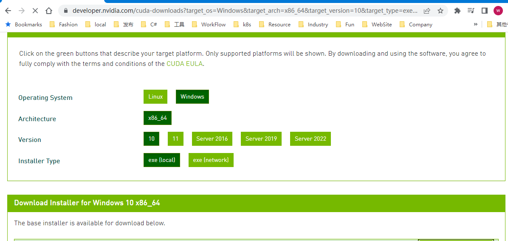

## PyTorch介绍

[Github](https://github.com/pytorch/pytorch)   [视频教程](https://www.bilibili.com/video/BV12M4y1g74r?is_story_h5=false&p=1&share_from=ugc&share_medium=iphone&share_plat=ios&share_session_id=28D12890-5065-4EAB-8310-115DB7E2C661&share_source=QQ&share_tag=s_i&timestamp=1661752951&unique_k=2QNuNi6)   

> 2002年Torch机器学习框架，支持Lua。2006年Facebook发布PyTorch。
>
> 2016.10发布0.1，THNN后端； 2018.12发布1.0，CAFFE2后端。

同类框架


+ Google阵营：Theano 》TensorFlow 1》TensorFlow2 》 +Keras

+ Facebook阵营：Torch7》Caffe》PyTorch+Caffe2

+ Amazon阵营：MXNet


TensorFlow VS PyTorch

> 静态图v.s.动态图. 
>
> 这里的动态图是指，运行时可以动态修改变量公式，查看运行时参数，比较灵活，适合学习科研。
>
> 而TensorFlow有比较完善的生态系统和工业部署支撑，适合在工业应用环境部署。


PyTorch适用于新手和研究员，以下是pytorch的一些生态。

> 组成：NLP 自然语言处理库。TorchVision图像视觉处理； Geometric 图神经网络框架；Fast.AI 深度学习库； 
>
> **ONNX**（英语：Open Neural Network Exchange）是一种针对机器学习所设计的开放式的文件格式，用于存储训练好的模型。它使得不同的人工智能框架（如Pytorch、MXNet）可以采用相同格式存储模型数据并交互。


## 环境安装

+ Python3.7+Anaconda 5.3.1
+ CUDA 10.0 (NVIDIA显卡 960+)
+ Pycharm Community


Anaconda官网下载安装（略）：清华镜像 https://mirrors.tuna.tsinghua.edu.cn/anaconda/archive/

Cuda官网下载及安装：




安装完成后，添加到环境变量。（C:\Program Files\NVIDIA GPU Computing Toolkit\CUDA\v10.0\bin)

```shell
mvcc -V
```

安装Pytorch

https://pytorch.org/get-started/locally/


验证

```python
import torch

print(torch.__version__)
print('gpu:',torch.cuda.is_available())

x=torch,rand(5,3)
print(x)

```

