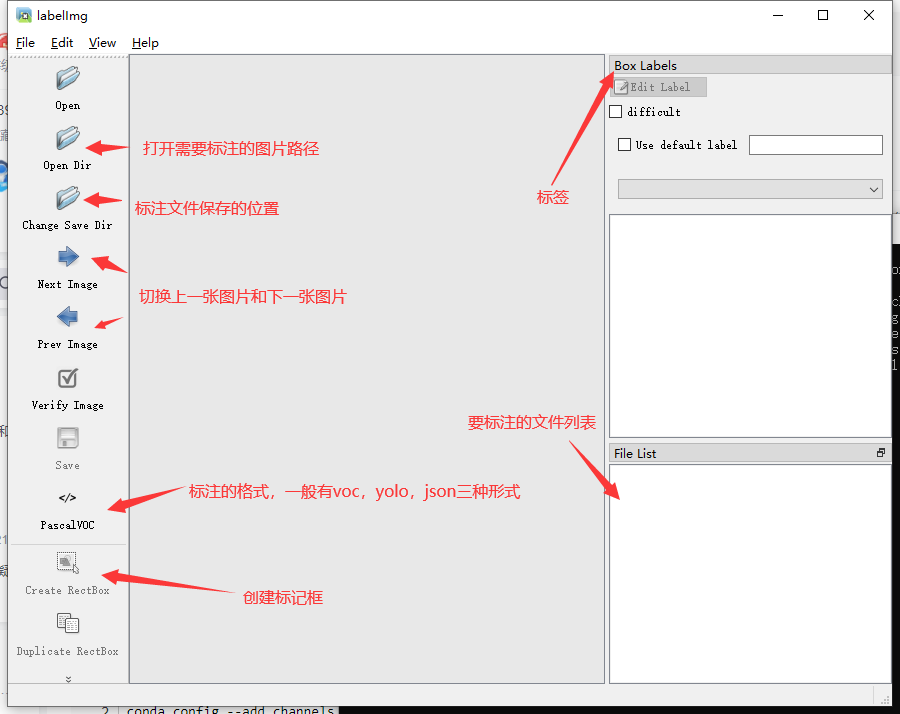

## [YOLOv5](https://ultralytics.com/yolov5) 🚀 口罩检测

[YOLOv5](https://ultralytics.com/yolov5) 🚀 is a family of compound-scaled object detection models trained on the COCO dataset, and includes simple functionality for Test Time Augmentation (TTA), model ensembling, hyperparameter evolution, and export to ONNX, CoreML and TFLite.

[YOLOv5](https://github.com/ultralytics/yolov5/blob/master/.github/README_cn.md)🚀是一个在COCO数据集上预训练的物体检测架构和模型系列，它代表了[Ultralytics](https://ultralytics.com/)对未来视觉AI方法的公开研究，其中包含了在数千小时的研究和开发中所获得的经验和最佳实践。


参考文献：https://blog.csdn.net/ECHOSON/article/details/121939535

马云地址：https://gitee.com/song-laogou/yolov5-mask-42

设置Conda国内镜像地址

```shell
conda config --remove-key channels
conda config --add channels https://mirrors.ustc.edu.cn/anaconda/pkgs/main/
conda config --add channels https://mirrors.ustc.edu.cn/anaconda/pkgs/free/
conda config --add channels https://mirrors.bfsu.edu.cn/anaconda/cloud/pytorch/
conda config --set show_channel_urls yes
pip config set global.index-url https://mirrors.ustc.edu.cn/pypi/web/simple
```

创建conda虚拟环境

```shell
conda create -n yolo5 python==3.8.5
conda activate yolo5
```

安装pytorch（略）

安装pycocotools

```
pip install pycocotools-windows
pip install -r requirements.txt
```


测试：

```
python detect.py --source data/images/bus.jpg --weights pretrained/yolov5s.pt
```


### 训练

安装labelimg打标工具

```shell
pip install labelimg -i https://mirror.baidu.com/pypi/simple
labelimg
```



打标后数据目录：

```shell
YOLO_Mask
└─ score
       ├─ images
       │    ├─ test # 下面放测试集图片
       │    ├─ train # 下面放训练集图片
       │    └─ val # 下面放验证集图片
       └─ labels
              ├─ test # 下面放测试集标签
              ├─ train # 下面放训练集标签
              ├─ val # 下面放验证集标签

```

to be continue...