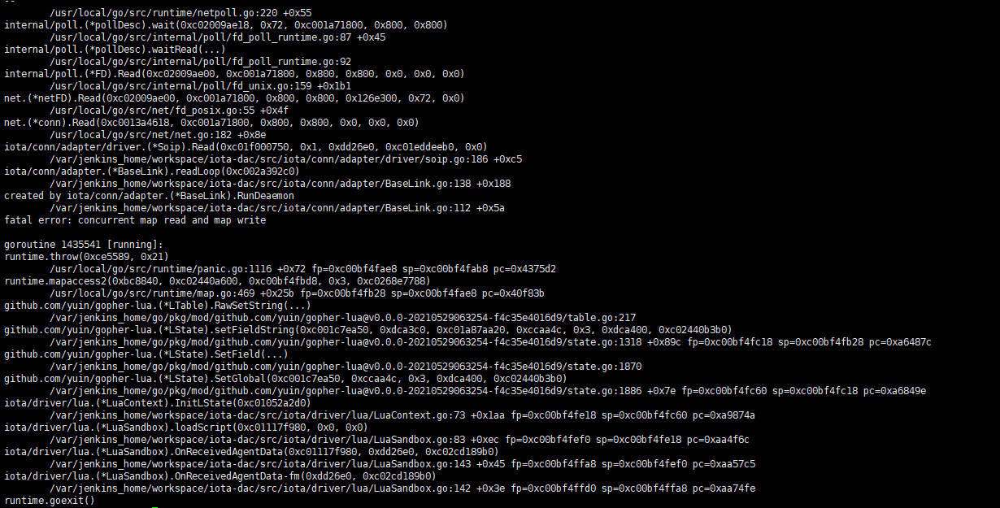

## 20220517 DAC 异常中断故障排查

### 问题原因

1. DAC-TEST（协议测试服务）进程泄漏导致iota-m2线程和内存溢出，iota-m2上的zookeeper服务挂起。

2. DAC 监听zookeeper中资源分配，对异常的处理保护不当，导致DAC关停所有Thing的采集。

### 解决方法

1. 针对问题2，修改DAC代码，保证zk异常情况下不会对现有Thing做关停
2. 针对问题1，
   + 先确保DAC-TEST服务K8S资源限制，保证这个不太关键的服务不过度占用服务器资源。
   
     

1. iota-n3节点异常

### 解决方法

原iota-dac亲和在n3节点，去掉该K8S亲和属性

### 定位过程

18点出现 `数据大面积中断` 短信告警。

登录服务器，发现部分DAC实例重启次数较多，进入容器查看/runtime/logs/fatal.log,发现故障为：




同时，测试同事找到关键中断结构物 `乌江`, 发现在DAC-13实例上，重启该实例。

观察一段时间，该结构物数据未恢复；而重启后的13实例**未出现重启**现象。断定 该故障 不是造成大面积中断的元凶。


登录iota-n3节点，观察服务器性能：

```
htop 查看cpu、内存、磁盘io， 比较正常
df -h 查看本地磁盘容量，正常
dmon 查看网络io情况
```

在准备查看网络`io`时，安装`dmon`工具，出现安装卡顿的现象。由此怀疑 iota-n3 节点存在异常。


**验证**

修改编排器代码中 dac 容器部署模板yaml文件，去掉亲和n3节点的配置，重启 iota-dac-13实例到 iota-m2 节点，乌江数据恢复。  

**由此断定 iota-n3 服务器节点异常；**


**处理**

```sh
ki && ka 查看现在iota-n3上的服务，发现只有dac在上面
执行：
kubectl drain iota-n3 ； 清空n3节点的pod 并关闭起k8s调度
```


**后续**

服务器故障今日由@龙哥 @涛涛协助继续排查；恢复服务器或执行重启操作


END