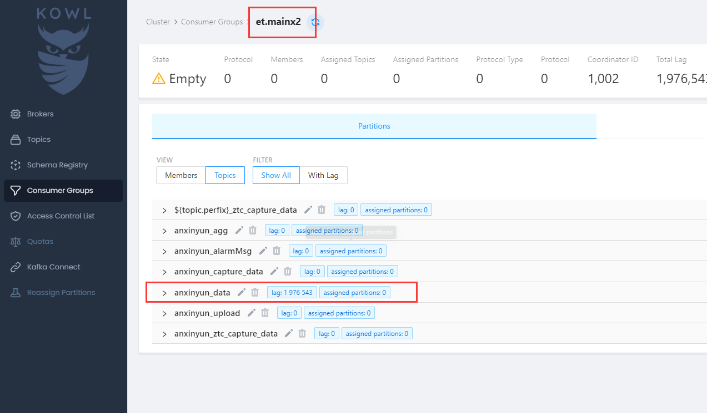
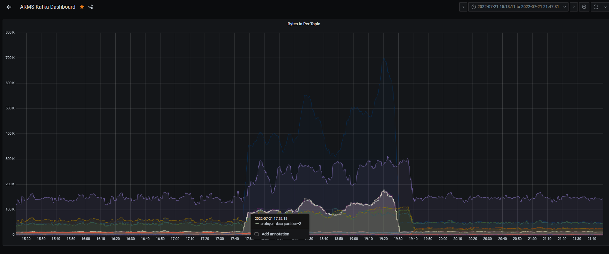

> 20220721 晚18点之后安心云数据出现积压，积压大约30~60min

## 问题原因

**知物云集群Kafka不稳定，重启操作执行不当**

知物云这两天一致间歇性出现数据（告警）中断情况，初步定位是Kafka环境异常，故对Kafka执行重启维护。

知物云集群Kafka重启后，包括以太和知物云ET，重新消费历史数据，导致数据流量增加，传导到安心云出现积压！！


## 解决方法

**故障教训**

再遇同样问题，需要重启维护Kafka，观察应用进程的日志，如果存在消费历史数据的情况,需手动重置Kafka的偏移量.

```shell
./kafka-consumer-groups.sh --bootstrap-server iota-m2:6667 --group iota-inline-invoker-ack-consumer-0 --reset-offsets --to-latest --execute --topic et.mains5
```


**同时，建议提升包括知物云在内的性能指标监控**

建议提高数据中断检测频率，当数据库中最新数据低于当前时间-5~10min，即可认为存在积压或中断。

知物云集群运维工具完善：目前安心云很多运维工具和经验，可移植到知物云。例如性能监控**prometheus**和**Kafka KOWL**工具。

完善性能指标监控： 接上，首先完善上述监控工具的应用。另外，对内部数据流量TPS指标进行抓取监控

性能瓶颈预测：接上，基于目前Flink程序并行度和出现积压时的数据TPS，估算我们程序的处理能力。

水平伸缩提升处理能力：接上，当数据流量高于处理能力，出现数据积压时，应 在集群上**扩展Kafka分片数和提高FLINK任务的并行度**。


**后期方案**

两套集群的合并运维，共用监控和运维工具


## 排查过程

知物云数据积压

查看Kafka消费情况：


显示该消费组出现重平衡状态。同时看了其他几个消费组id，有部分也处在该异常状态，初步判断kafka状态存在异常。

通过远程查看知物云集群`ambari`，发现kafka服务启动状态正常。

远程知物云集群各服务器，观察cpu、内存性能指标，还算正常。

当天重启ET进程，数据暂时恢复，后续有间断出现，故在计划在21号下班后进行Kafka重启运维


2022-07-21 19左右发现安心云数据出现积压

登录KOWL（https://kafka.anxinyun.cn/）查看消费情况，出现明显积压，且lag条数没有减少迹象。后选择重启ET服务并选择丢弃这部分未处理的数据。



从监控工具（https://monitor.anxinyun.cn/）发现安心云Kafka中数据量在17:50左右激增。基本与上述知物云集群kafka重启时间一致。故推断：以太**工作流引擎**，在kafka重启后，重新消费历史数据，并将这部分数据重新推送到安心云，导致数据量激增。

