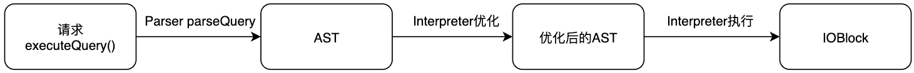

### Clickhouse调优


我们有一个alarm表会记录所有设备的告警信息，同一设备同种类型的告警，会记录成一条数据，更新时间和次数字段，但是当前数据是存储在clickhouse的。

`Clickhouse`作为一款[OLAP数据库](https://cloud.tencent.com/product/cdwpg?from=10680)，对数据更新的支持比较弱，而且并不支持标准的SQL update/delete语法；它提供的alter table ...... update/delete 语法也是异步的，即收到命令后先返回给客户端成功，至于什么时候数据真正更新成功是不确定的。

因此在业务需要数据更新的场景下（如`Mysql`同步到`Clickhouse`），通常会使用`ReplacingMergeTree`或`CollapsingMergeTree`的数据合并逻辑绕行实现异步更新，这样一方面可以保证数据的最终一致性，另一方面`Clickhouse`性能开销也会比alter table小。但这种方式有一个缺点是`MergeTree`引擎的数据合并过程（merge）是`Clickhouse`基于策略控制的，执行时间比较随机，因此数据一致性缺少时间保证，极端情况下数据过了一天也没有完全合并。

性能？一致性？要做综合评估

而Optimize Table这个命令可以强制触发`MergeTree`引擎的数据合并，可以用来解决数据合并时间不确定的问题。

**Optimize Table执行过程源码解析**

`Clickhouse`在收到一个SQL语句后，会通过如下的流程执行`SQL：Parser`（解析SQL语法，转化为AST）-> Interpreter（优化生成执行计划 RBO）-> Interpreter::`executeImpl`（通过Block Stream读取或写入数据）[1]。Optimize Table语句也不例外，只不过Optimize语句没有复杂的执行计划。



`Clickhouse`收到Optimize Table命令后会调用到`ParserOptimizeQuery`::`parseImpl`()解析命令。

在笔者的实际使用中，`Clickhouse`集群使用32核64G机器，单表原始数据量在1TB以内的情况下，Optimize执行周期在5min-10min都没什么压力。


### [迁移](https://stackoverflow.com/questions/68716267/is-it-possible-to-change-a-table-engine-of-an-existed-clickhouse-table)

原来的`MergeTree`引擎需要修改成`ReplacingMergeTree`

```sql
select * from alarm.alarms where "SourceId"='f12ae78f-85ab-4d7a-8f82-75b06b442bb0' limit 1000

CREATE TABLE alarm.alarms2
(
    `AlarmId` String,
    `SourceId` String,
    `SourceTypeId` Int32,
    `SourceName` String,
    `StructureId` Int32,
    `InitialLevel` Int32,
    `CurrentLevel` Int32,
    `StartTime` DateTime64(3, 'Asia/Shanghai'),
    `EndTime` DateTime64(3, 'Asia/Shanghai'),
    `AlarmCount` Int32,
    `AlarmTypeCode` LowCardinality(String),
    `AlarmTypeId` Int32,
    `AlarmCode` LowCardinality(String),
    `AlarmContent` String,
    `State` Int32,
    `AlarmGroup` Int32,
    `AlarmGroupUnit` Int32,
    `AlarmAdviceProblem` String,
    `Notice` String,
    `ver` DateTime64(3, 'Asia/Shanghai')
)
ENGINE = ReplacingMergeTree
ORDER BY AlarmId
SETTINGS index_granularity = 8192


alter table alarm.alarms2 attach partition tuple() from alarm.alarms;

optimize table alarm.alarms2 final;

-- 必须定义ver字段，ReplacingMergeTree才能取到最终的数据
-- ver — column with version. Type UInt*, Date or DateTime. Optional parameter.
-- When merging, ReplacingMergeTree from all the rows with the same sorting key leaves only one:
-- Last in the selection, if ver not set.
-- With the maximum version, if ver specified.

-- 查询的时候增加 final字段，
select * from alarm.alarms2 final where "SourceId"='f12ae78f-85ab-4d7a-8f82-75b06b442bb0' limit 1000 
```


### 其他

通过`MaterializedPostgreSQL`全量同步`pg`数据库

```sql
https://clickhouse01.anxinyun.cn?allow_experimental_database_materialized_postgresql=1

CREATE DATABASE IF NOT EXISTS pepca4
ENGINE = MaterializedPostgreSQL('10.8.40.102:32345', 'pep-ca', 'postgres', 'postgres')
SETTINGS materialized_postgresql_max_block_size = 65536,
        materialized_postgresql_schema = 'public'
```


### 参考

[1] https://stackoverflow.com/questions/68716267/is-it-possible-to-change-a-table-engine-of-an-existed-clickhouse-table

[2] https://cloud.tencent.com/developer/article/1888949