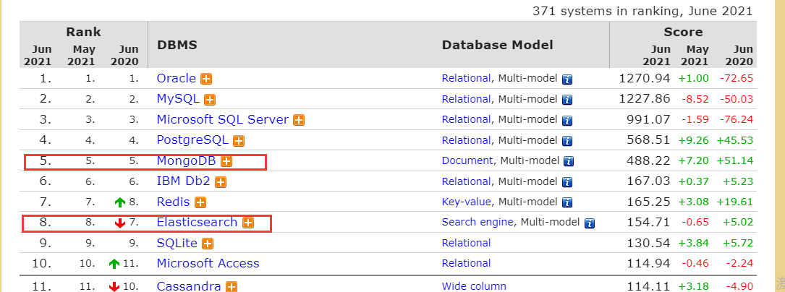

## scala

在项目pom.xml中引入：

```xml
<!-- https://mvnrepository.com/artifact/org.mongodb.scala/mongo-scala-driver -->
<dependency>
    <groupId>org.mongodb.scala</groupId>
    <artifactId>mongo-scala-driver_${scala.version}</artifactId>
    <version>4.2.3</version>
</dependency>
```

TIPs

> 1. Document有两种：immutable和mutable；immutable document插入时如果不指定_id,系统会自动分配，且不会返回给用户。
>
> 2. 所有的方法会的是 `Observables`对象，这是一种 “cold” streams ，并不会立即执行，直至它被subscribed。

构建Document:

> `scala`数据类型转`Bson`数据类型

```scala

object BsonValueConvert {

    // scala -> Document
    def mapToDocument(obj: Map[String, Any]): Document = Document(mapToBsonDocument(obj))

    // scala -> BsonDocument
    def mapToBsonDocument(obj: Map[String, Any]): BsonDocument = BsonDocument(obj.map(writePair))


    // java -> Document
    def mapToDocument(obj: java.util.Map[String, Object]): Document = Document(mapToBsonDocument(obj))

    // java -> BsonDocument
    def mapToBsonDocument(obj: java.util.Map[String, Object]): BsonDocument = BsonDocument(obj.map(writePair))

    // Document -> scala Map
    def documentToMap(b: Document): Map[String, Any] = b.map(writeMapPair).toMap

    // BsonDocument -> scala Map
    def bsonDocumentToMap(b: BsonDocument): Map[String, Any] = b.toMap.map(writeMapPair)

    /**
      * 数据格式转换
      *
      * @param p scala/java Map
      * @return String->BsonValue pair
      */
    def writePair(p: (String, Any)): (String, BsonValue) = (p._1, p._2 match {
        case value: String => BsonString(value)
        case value: Double => BsonDouble(value)
        case value: Int => BsonInt32(value)
        case value: Boolean => BsonBoolean(value)
        case value: Long => BsonInt64(value)
        case value: Date => BsonDateTime(value.getTime)
        case value: DateTime => BsonDateTime(value.getMillis)
        case value: Map[String, Any] => mapToBsonDocument(value)
        case value: java.util.Map[String, Object] => mapToBsonDocument(value)
        case _ => BsonNull()
    })

    def writeMapPair(p: (String, BsonValue)): (String, Any) = (p._1, p._2 match {
        case v: BsonString => v.getValue
        case v: BsonDouble => v.getValue
        case v: BsonInt32 => v.getValue
        case v: BsonBoolean => v.getValue
        case v: BsonInt64 => v.getValue
        case v: BsonDateTime => new DateTime(v.getValue)
        case v: BsonNull => null
        case v: BsonDocument => bsonDocumentToMap(v)
        case v => v
    })
}
```

CRUD操作：

```scala
// 类似ES index操作。如果id相同则覆盖数据。使用bulkWrite写入
val opt = new ReplaceOptions().upsert(true)
val acts = mapDocs.map(d => {
    val doc = BsonValueConvert.mapToDocument(d.getSource)
    if (!autoGenerated && d.getId.nonEmpty) {
        doc.append("_id", BsonString(d.getId))
        ReplaceOneModel(equal("_id", d.getId), doc, opt)
    } else {
        InsertOneModel(doc)
    }
})
val f = collection(indexName).bulkWrite(acts).toFutureOption()

// 读取数据
import org.mongodb.scala.model._
val f = collection(indexName).find(and(
    in("sensor", stationId: _*),
    gte("collect_time", BsonDateTime(startDateTime.getMillis)),
    lt("collect_time", BsonDateTime(endDateTime.getMillis))))
.toFuture()
val r = Await.result(f, Duration.create(mQueryTimeoutMillis, TimeUnit.MILLISECONDS))
if (r == null || r.isEmpty) {
    info(s"query $indexName at [${stationId.mkString(",")}] from $startDateTime to $endDateTime timeout $mQueryTimeoutMillis ms")
    List()
} else {
    r.map(BsonValueConvert.documentToMap)
    .map(map2ThemeData)
    .filter(_ != null)
    .toList
}
```

## Node.js

```shell
npm install mongodb
```

CRUD

```js
// 创建连接
this.client = new MongoClient("mongodb://localhost:27017", {
    useNewUrlParser: true,
    useUnifiedTopology: true,
});
this.client.connect()
    .then(() => {
    this.db = this.client.db("db")
})

// insert many
this.db.collection(elem._index).insertMany(arr)

```

Query:

```js
const { MongoClient } = require("mongodb");

class mongoQuery {
    async get(sensor, start, end) {
        this.client = new MongoClient("mongodb://localhost:27017", {
            useNewUrlParser: true,
            useUnifiedTopology: true,
        });
        await this.client.connect()
        this.db = this.client.db("test2")
        this.collection = this.db.collection("anxinyun_themes")

        const query = {
            $and: [
                { sensor: { $in: [4054] } },
                { collect_time: { $gte: "2020-06-01" } },
                { collect_time: { $lt: "2021-06-08" } }
            ]
        }

        const query2 = {
            sensor: 4054,
            collect_time: {
                $gte: new Date(new Date().setHours(0, 0, 0)),
                $lt: new Date(new Date().setHours(23, 59, 59)),
            }
        }

        const options = {
            // sort by collect_time desc
            sort: { collect_time: -1 },
            // Include only the `sensor` `data` and `collect_time` fields in each returned document
            projection: { _id: 0, sensor: 1, data: 1, collect_time: 1 },
        }

        console.log(query2);
        const cursor = this.collection.find(query2, options);
        // print a message if no documents were found
        if ((await cursor.count()) === 0) {
            console.log("No theme datas found!");
            return [];
        }
        // replace console.dir with your callback to access individual elements
        return await cursor.toArray()
    }
}

module.exports = {
    mongoQuery
}
```


## 数据迁移

改写[elasticsearch-dump](https://github.com/yinweiwen/elasticsearch-dump)项目，使支持es > mongo的数据导出。

```shell
C:\Program Files\nodejs\node.exe .\bin\elasticdump --input=http://10.8.30.155:9200/anxinyun_themes --output=mongodb://localhost:27017 --limit=1000 --type=data
```


注意：

1. ```shell
   (node:25064) UnhandledPromiseRejectionWarning: Error: key PM2.5 must not contain '.'
       at serializeInto (e:\Github\elasticsearch-dump\node_modules\bson\lib\bson\parser\serializer.js:921:19)
       ...
   ```
```
   如果字段中包含'.' , mongodb的 js库会操作失败，返回如上内容


2. 默认source中时间字段被解析成字符串，所以需要在转入mongo之前进行转换

   ```js
   if(elem._source.collect_time){
       targetElem.collect_time=new Date(elem._source.collect_time)
   }
   if(elem._source.create_time){
       targetElem.create_time=new Date(elem._source.create_time)
   }
```

   

## 性能对比

截止2021-6，两个数据库引擎在db-engine上的排名如下。其中mongo在nosql中排行第一，而ElasticSearch以其全文索引快速搜索的优势，也有不俗的表现。



我们使用修改后的elasticsearch-dump,将测试环境的 anxinyun_themes 索引下的数据全部导入本机mongodb test数据库 anxinyun_themes 集合中。总计~**1.2M** 条记录。

| 项目                             | ES                              | Mongo                              |
| -------------------------------- | :------------------------------ | ---------------------------------- |
| 存储空间                         | **242.3mb （488.8mb包含副本）** | 463.4MB (包含索引)                 |
| 查询效率（测点HD 6-1~6-8号数据） | 386ms                           | **111ms** (索引后)  ~1s （索引前） |
| 插入效率(批次100)                | 83.5ms                          | **28.6 ms**                        |
| 插入效率(批次500)                | 137.6 ms                        | **89.2 ms**                        |
| 插入效率(批次1000)               | 223.8 ms                        | **82.0 ms**                        |

测试文件地址
> FS-Anxinyun\trunk\codes\services\et\comm_utils\src\test\scala\MongoBenchmark.scala
>
> FS-Anxinyun\trunk\codes\services\et\comm_utils\src\test\scala\ElasticBenchmark.scala

## 总结

es和mongodb都是已json为数据格式的nosql，都支持CRUD/聚合和全文索引/分片和副本/海量数据。

|                             | ElasticSearch            | MongoDB                                               |
| --------------------------- | ------------------------ | ----------------------------------------------------- |
|                             | **天生分布式，开箱即用** | “Shard+ConfigServer+QueryRouters”实现分布式，配置复杂 |
|                             | **全文检索强大灵活**     | 全文检索支持一般                                      |
|                             | 全字段自动索引(倒排)     | 需手动添加索引（B+树）                                |
|                             | java实现，RESTful接口    | C++                                                   |
| 在我们的业务场景中          |                          |                                                       |
| 查询效率 (测点ID和时间范围) |                          | **更优**                                              |
| 插入效率 (upsert)           |                          | **更优**                                              |

本文主要是探索一种替换目前数据存储方案的可能性，因为在使用过程中我们发现了针对目前存储的数据结构，ES存在的一些弊端：

1. 集群扰动。节点或分片未知故障（虽然设置了副本分片，但是仍然有可能出现服务整体宕机的情况）
2. 故障恢复困难。（有时需要几天的时间恢复集群）
3. 数据的字段数一直在增长，数据体积不断叠加增长
4. 数据字段格式固定（根据第一次入库时动态创建）

综上，ES在部署上更简单，支持任意组合的查询，但成本较高（高内存消耗)。而mongodb在我们这种只对某个字段进行索引查询，无全文索引需求的场景更加适用，并且高并发写性能更优，但是其部署和后期扩展都是比较复杂的。


参考：

> [从MongoDB迁移到ES后，我们减少了80%的服务器](https://baijiahao.baidu.com/s?id=1663861054509638147&wfr=spider&for=pc)
>
> [回怼篇：我 10 亿级 ES 数据迁到 MongoDB 节省 90% 成本！](https://www.infoq.cn/article/ypf6m08G0AbkZL6ePY6A)

**todo**

1. flink mongo-sink实现：

   [StreamFileSink](https://github.com/apache/flink/blob/master/flink-streaming-java/src/main/java/org/apache/flink/streaming/api/functions/sink/filesystem/StreamingFileSink.java) 

   [简单实现Sink到MongoDB](https://zhuanlan.zhihu.com/p/86458138)

   

   

   

