## FLINK-ET问题 2021128

11-25 20:20

> Cannot refresh redis cluster topology

 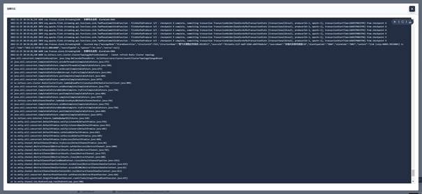


11-25 08:00

> No Route to HOST: /10.96.7.151：6379

 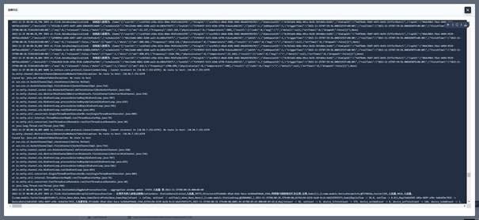


11-25 07:00

> io.lettuce.core.RedisCommandInterruptedException

 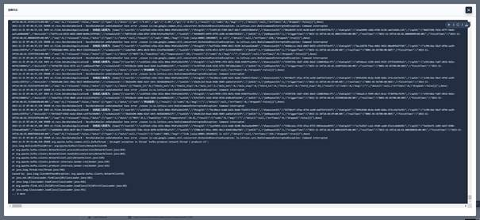


11-25 07:00

> No route to host: /10.96.14.187:6379

 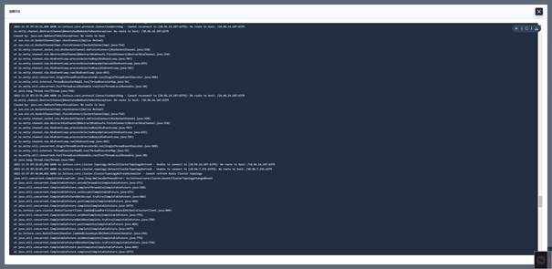


## 解决办法：

1. 升级lettuce

   现在使用的版本是：

 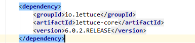

https://github.com/lettuce-io/lettuce-core/issues/1882 中描述了`Cannot refresh redis cluster topology`的BUG。

 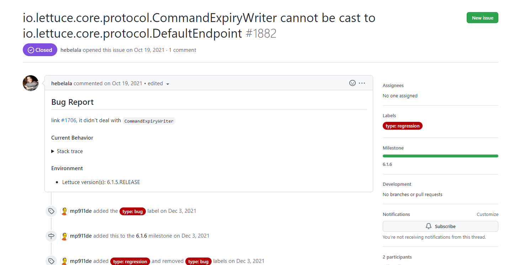

建议升级到：

```xml
<dependency>
  <groupId>io.lettuce</groupId>
  <artifactId>lettuce-core</artifactId>
  <version>6.2.1.RELEASE</version>
</dependency>
```


2. ConfigCenter写入公式失败

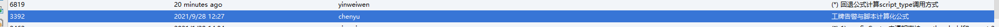

​	回退代码后重新构建

> 历史遗留代码长期未升级。本次带出去故障。


3. Taskmanager重启问题 :star::star::star::star:

   Flink Taskmanager的CPU cores问题

   目前商用通过k8s部署的1.9.3，每个Taskmanager显示占用1核。

   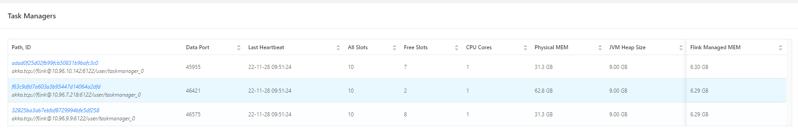

| kubernetes.taskmanager.cpu | -1.0 | Double | The number of cpu used by task manager. By default, the cpu is set to the number of slots per TaskManager |
| -------------------------- | ---- | ------ | ------------------------------------------------------------ |
|                            |      |        | 默认情况是多少个slot就有多少cpucores                         |


查看重启的Taskmanager POD信息，发现Exit Code（137）,为OOM故障

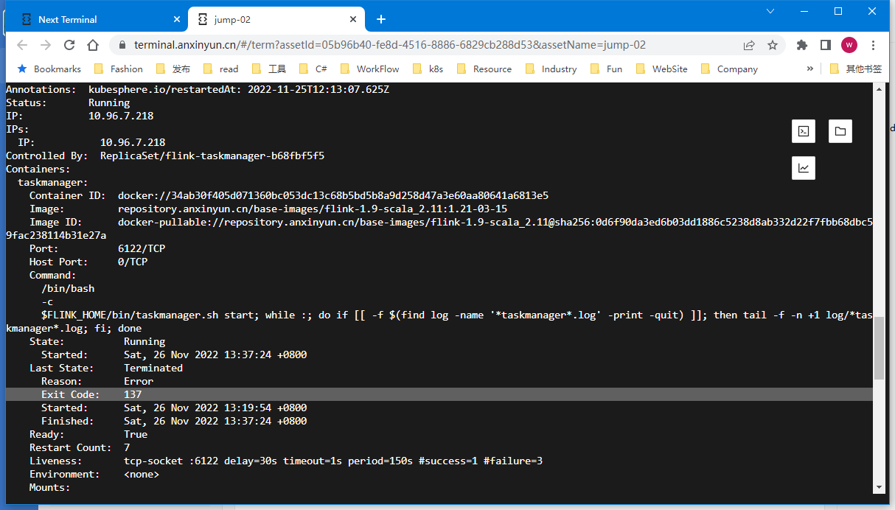

[How to Fix OOMKilled Kubernetes Error (Exit Code 137)](https://komodor.com/learn/how-to-fix-oomkilled-exit-code-137/)

**内存溢出导致TASKMANAGER重启。**

 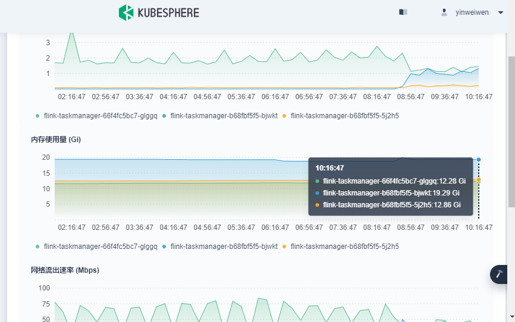


TaskManager中内存分布：

Memory

JVM (Heap/Non-Heap)

| Type         | Committed | Used    | Maximum |
| :----------- | :-------- | :------ | :------ |
| **Heap**     | 9.00 GB   | 3.64 GB | 9.00 GB |
| **Non-Heap** | 721 MB    | 631 MB  | -1 B    |
| **Total**    | 9.70 GB   | 4.25 GB | 9.00 GB |

Outside JVM

| Type       | Count  | Used    | Capacity |
| :--------- | :----- | :------ | :------- |
| **Direct** | 32,861 | 1.01 GB | 1.01 GB  |
| **Mapped** | 0      | 0 B     | 0 B      |

Network

Memory Segments

| Type          | Count  |
| :------------ | :----- |
| **Available** | 32,315 |
| **Total**     | 32,768 |

Garbage Collection

| Collector               | Count  | Time       |
| :---------------------- | :----- | :--------- |
| **G1_Young_Generation** | 28,188 | 11,381,095 |
| **G1_Old_Generation**   | 1      | 147        |

在Flink 1.13.6UI中体现如下:


## Flink压力中断


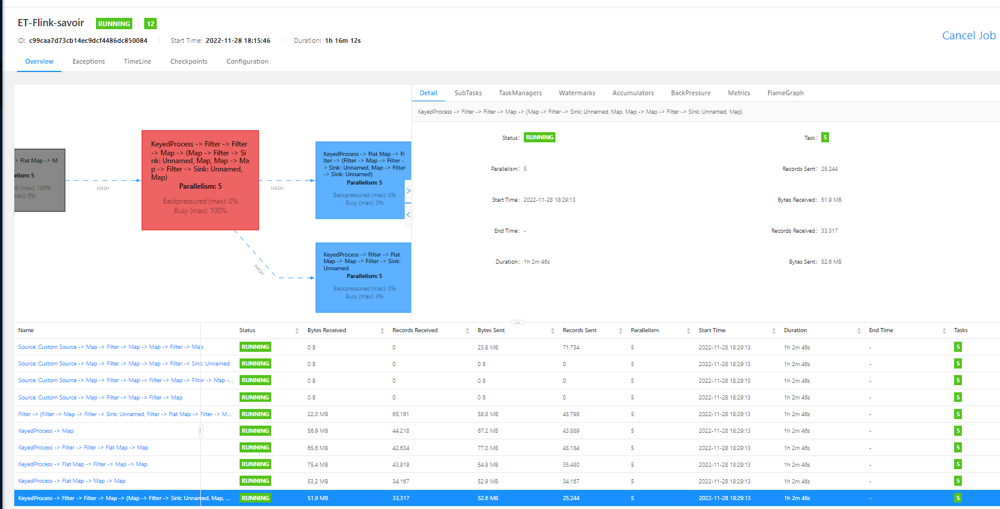

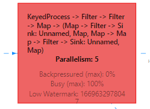

背压100%。 同时在取消的时候，5个subtask中有一个一直处在Canceling状态。


## 附：FLINK内存管理

JVM的内存管理

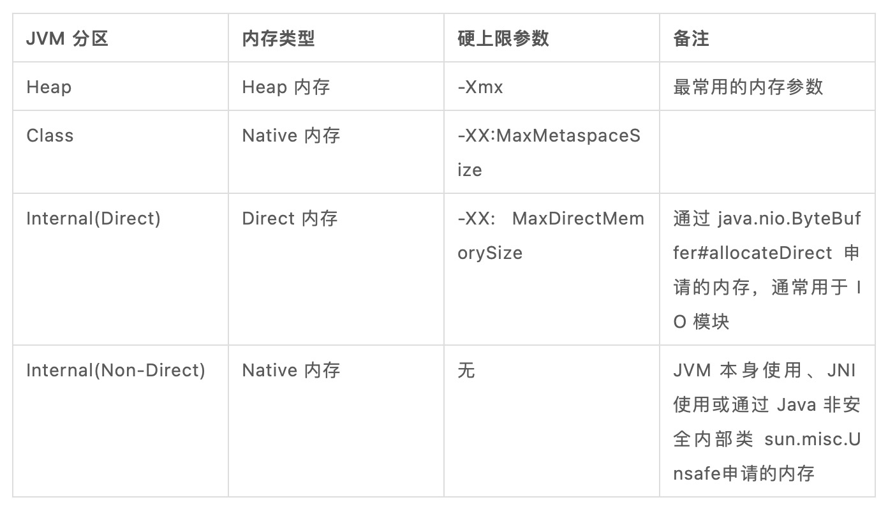

> Native == Off-heap Non-Direct

Flink 对于 Off-Heap 内存的管理策略可以分为三种:

● 硬限制（Hard Limit）: 硬限制的内存分区是 Self-Contained 的，Flink 会保证其用量不会超过设置的阈值（若内存不够则抛出类似 OOM 的异常），
● 软限制（Soft Limit）: 软限制意味着内存使用长期会在阈值以下，但可能短暂地超过配置的阈值。
● 预留（Reserved）: 预留意味着 Flink 不会限制分区内存的使用，只是在规划内存时预留一部分空间，但不能保证实际使用会不会超额。

> Self-contained的分区中如果内存超出限制，则会报出OOM异常。否则，会按照JVM管理的分区中内存限制进行判断，在其实际值增长导致 JVM 分区也内存耗尽时，JVM 会报其所属的 JVM 分区的 OOM （比如 java.lang.OutOfMemoryError: Jave heap space）。

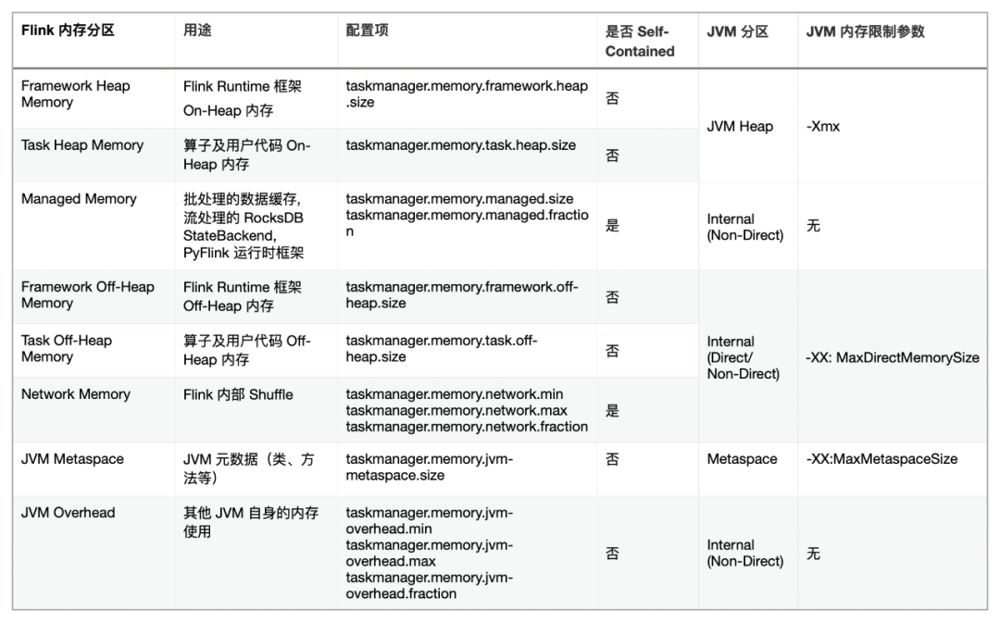

Flink的内存分配

 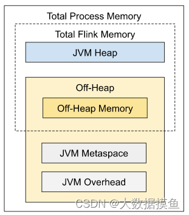 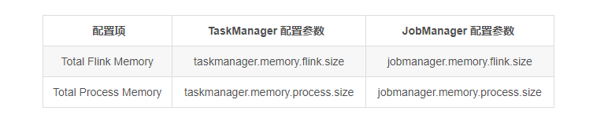

包括：

+ Flink总内存：  JVM 堆内存（Heap Memory）和堆外内存（Off-Heap Memory）。 其中堆外内存包括直接内存（Direct Memory）和本地内存（Native Memory）。
+ 运行Flink的JVM内存

TaskManager的内存分配：

 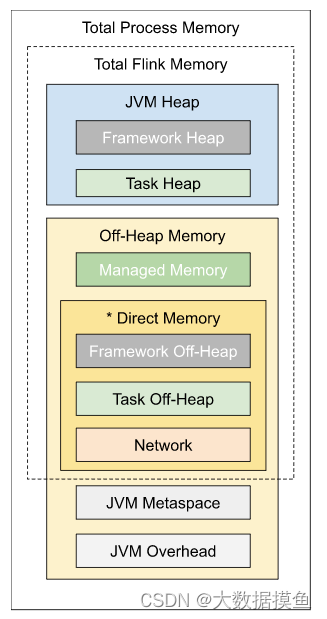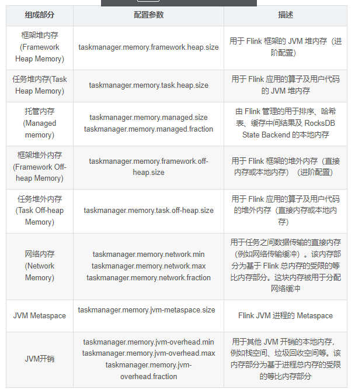


## Refer

+ [详解 Flink 容器化环境下的 OOM Killed](https://developer.aliyun.com/article/780954)

+ 