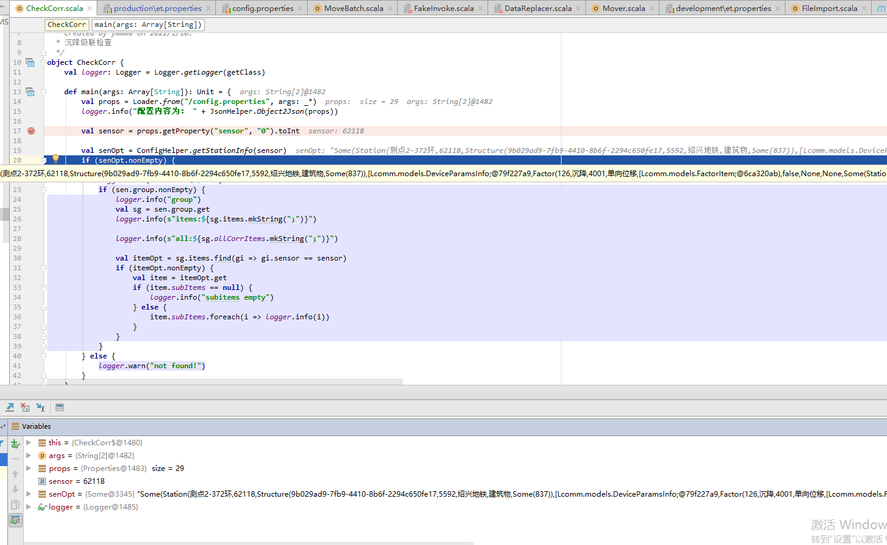

IDEA远程调试

1. Run -> Edit Configurations...
2. Click the "+" in the upper left
3. Select the "Remote" option in the left-most pane
4. Choose a name (I named mine "remote-debugging")
5. Click "OK" to save:


在安信服务器上，执行java命令：

```shell
export JAVA_OPTS="-agentlib:jdwp=transport=dt_socket,server=y,suspend=n,address=5005"

java -agentlib:jdwp=transport=dt_socket,server=y,suspend=y,address=5005 -cp data-mover-1.0-SNAPSHOT-allinone.jar Tool.CheckCorr sensor=62118 redis.host=anxin-m2
```

其中 `suspend=y` 让进程挂起直到debug程序attach上来；


运行IDEA Debug


