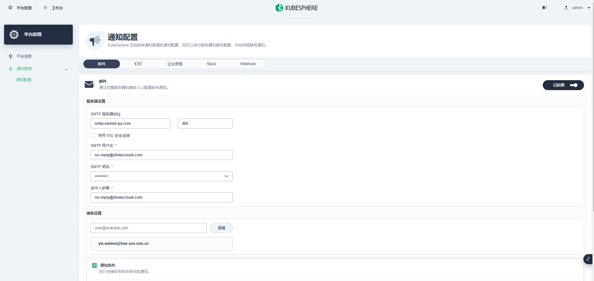
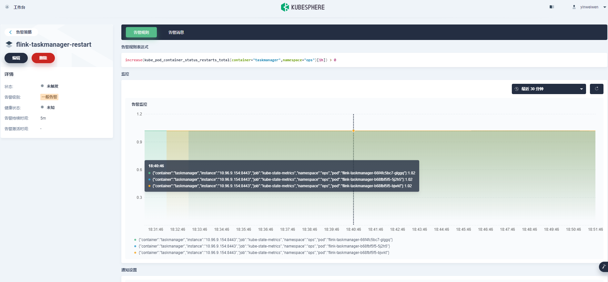

Kubesphere启用告警

admin登录 > Platform > CRDs > ClusterConfiguration


```YAML
alerting:
    enabled: true # Change "false" to "true"
notification:
    enabled: true # Change "false" to "true"
```

检查是否启用:

```sh
kubectl logs -n kubesphere-system $(kubectl get pod -n kubesphere-system -l app=ks-installer -o jsonpath='{.items[0].metadata.name}') -f
```


设置邮件服务器 (平台设置>通知设置)




在具体的项目下，设置告警策略：

```promql
increase(kube_pod_container_status_restarts_total{container="taskmanager",namespace="ops"}[1h]) > 0
```



设置接收人接收策略(平台设置>通知设置)

