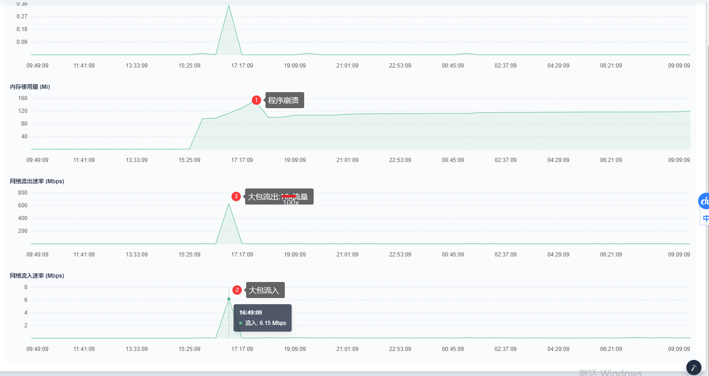
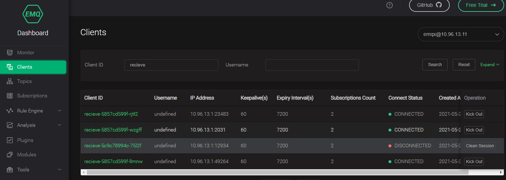
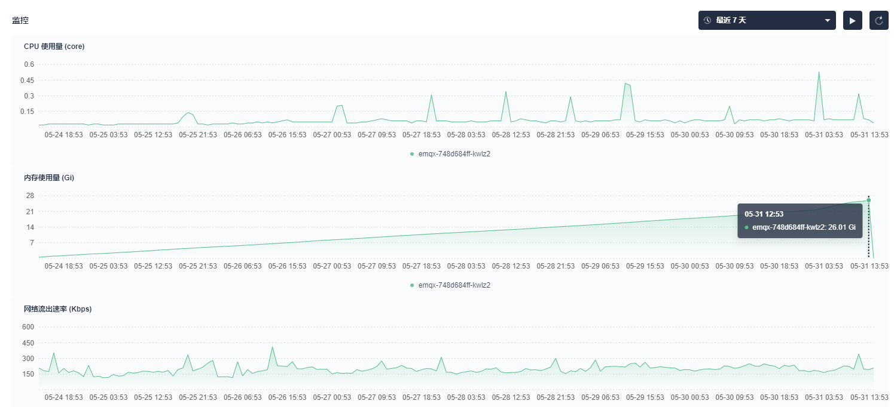
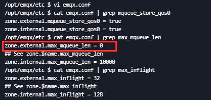

# MQTT数据接收进程问题排查（之二）

## 问题又来了

昨天通过EMQX的**共享订阅**，实现了recv进程的横向扩展，加之之前博客看到的问题是处理效率导致，兴高采烈的升级了程序。

运行不到一天，观察发现，3个实例中有2个出现了重启现象。之前的问题并没有能够解决。

通过KUBESPHERE监控查看：




程序出现问题重启之前，从流量监控看，流入有大包（10min窗口内达6.15M）。同时流出的流量大概是100x的流入。之后一段时间内存成线性增长（后续消息堆积）直至程序崩溃。

结合之前日志中观察，很可能是因为出现大包（**Large message**），kafka发送异常、重试，导致资源耗尽。

## 先做保护

在Mqtt client消息回调函数中，过滤掉Kafka不能消化的大包

```java
public void messageArrived(String topic, MqttMessage mqttMessage) throws Exception {
    ...
    byte[] bts = mqttMessage.getPayload();
    if (bts.length > maxBytes) {
        logger.info("large message. " + bts.length + ". Time:" + time + "  Topic:" + topic + "-" + topic);
        return;
    }
    ...
}
```


## 为什么流出=100x流入？

1. 已知的 2x3 倍

receive进程中设置了重试次数**3**, 如下：

`dac.mqtt.recv.PahoMqttApp.java`

```java
props.put("bootstrap.servers", this.props.getProperty("kafka.brokers"));
props.put("acks", this.props.getProperty("kafka.producer.acks", "1")); // 主分片应答
props.put("retries", this.props.getProperty("kafka.producer.retries", "3")); // 重试次数3
props.put("batch.size", this.props.getProperty("kafka.producer.batch.size", "1638400")); // 分批大小
props.put("linger.ms", this.props.getProperty("kafka.producer.linger.ms", "5")); // 发送检查 5ms
props.put("key.serializer", "org.apache.kafka.common.serialization.StringSerializer");
props.put("value.serializer", "org.apache.kafka.common.serialization.StringSerializer");
props.put("max.request.size", 12695150); // 最大请求包
```
另外，发送的消息中ProducerRecord设置了Key属性(使用message整体作为Key，所以体积约为原先**2**倍)

```java
ProducerRecord<String, String> record = new ProducerRecord<String, String>(kf, message, message);
```

2. 剩下的16倍。

   **猜测**：`anxinyun_data` topic下有4个分片，分布在4个broker上， kafka重试的时候是否会对各个broker上的分片进行轮询尝试？

   查看源码中的处理。 


### 消息发布语义 （Message Delivery Semantics）

- *At most once*—Messages may be lost but are never redelivered.
- *At least once*—Messages are never lost but may be redelivered.
- *Exactly once*—this is what people actually want, each message is delivered once and only once.

producer的ack参数

- 0 producer将消息发送到broker，不等待响应。
- 1 发送后等待broker的响应，如果没有确认接收消息，producer将基于retry配置进行重试（retries 重试次数，默认0）。在此模式下，确认消息是由broker的主分片(Leader partition)发出，副本在拷贝过程中仍然可能出现数据丢失
- ALL Broker在最小副本数同步完成后才会发出确认消息（The broker sends acknowledgment only after replication based on the `min.insync.replica` property. ）

### 大消息处理

参考 [[调节kafka消费信息的大小]](https://www.cnblogs.com/xingfengzuolang/p/10762464.html)

10k左右大小吞吐量性能最佳，当消息体过大时建议

- 文件存储，消息内发文件链接
- 消息切片，消费端组合
- 生产端 `compression.codec` 和`commpressed.topics`可以开启压缩功能，压缩算法可以使用GZip或Snappy。

broker配置：

-   **message.max.bytes** (默认:1000000； ~1M) – broker能接收消息的最大字节数，这个值应该比消费端的fetch.message.max.bytes更小才对，否则broker就会因为消费端无法使用这个消息而挂起。
-   **log.segment.bytes** (默认: 1GB) – kafka数据文件的大小，确保这个数值大于一个消息的长度。一般说来使用默认值即可（一般一个消息很难大于1G，因为这是一个消息系统，而不是文件系统）。
-   **replica.fetch.max.bytes** (默认: 1MB) – broker可复制的消息的最大字节数。这个值应该比message.max.bytes大，否则broker会接收此消息，但无法将此消息复制出去，从而造成数据丢失。

Consumer配置：

- **fetch.message.max.bytes** (默认 1MB) – 消费者能读取的最大消息。这个值应该大于或等于message.max.bytes。

Producer配置：

- **max.request.size**：该参数是指定发送消息的最大尺寸，默认是1M，单位是字节。
- **buffer.memory**：该参数是指定缓冲区的打小，默认是32M，单位是字节


### Producer源码

代码中部分概念：

```json
Node -- Kafka Node

```

发送部分源码摘要：<并未找到重试时对所有node的尝试代码 TODO>

```java
// producer.internals.Sender
public class Sender{
	/**
     * The main run loop for the sender thread
     */
    public void run() {
        log.debug("Starting Kafka producer I/O thread.");

        // main loop, runs until close is called
        while (running) {
            try {
                long pollTimeout = sendProducerData(now);
                client.poll(pollTimeout, now);
            } catch (Exception e) {
                log.error("Uncaught error in kafka producer I/O thread: ", e);
            }
        }
    ...
    }

    private long sendProducerData(long now) {
            // 获取准备发送数据的分区信息
            RecordAccumulator.ReadyCheckResult result = this.accumulator.ready(cluster, now);
            ...准备更新partitions without leaders
            ...删除未准备的节点

            // create produce requests
            Map<Integer, List<ProducerBatch>> batches = this.accumulator.drain(cluster, result.readyNodes,
                    this.maxRequestSize, now);
            ...
            sendProduceRequests(batches, now);  // client.send(clientRequest, now);
            return pollTimeout;
        }
    }
...
}


// 队列缓存消息记录
class RecordAccumulator{
    ...
    // 加入队列    
    public RecordAppendResult append(TopicPartition tp,...){}
         /**
     * Get a list of nodes whose partitions are ready to be sent, and the earliest time at which any non-sendable
     * partition will be ready; Also return the flag for whether there are any unknown leaders for the accumulated
     * partition batches.
     */
    public ReadyCheckResult ready(Cluster cluster, long nowMs) {
        
    }
    // Drain all the data for the given nodes and collate them into a list of batches
    public Map<Integer, List<ProducerBatch>> drain(...){} 
}

class KafkaProducer{
    private Future<RecordMetadata> doSend(ProducerRecord<K, V> record, Callback callback) {
        ... RecordAccumulator.append(...) // 队列满了 this.sender.wakeup();激活client
    }
}

// 底层的发送 网络客户端
class NetworkClient(){
    ...
    private void doSend(ClientRequest clientRequest, boolean isInternalRequest, long now, AbstractRequest request) {
        ...
        RequestHeader header = clientRequest.makeHeader(request.version());
        ...
        Send send = request.toSend(nodeId, header); // make send (NetworkSend extends ByteBufferSend)
        InFlightRequest inFlightRequest = new InFlightRequest(...);
        this.inFlightRequests.add(inFlightRequest); // add to inflight
        selector.send(inFlightRequest.send);
    }
    ...
}

// A nioSelector interface for doing non-blocking multi-connection network I/O.
public class Selector{
    public void send(Send send) {
        channel.setSend(send);
    }
    
    public void poll(long timeout){
        ...
         //poll from channels where the underlying socket has more data
         pollSelectionKeys(readyKeys, false, endSelect);
    }
    
    // handle any ready I/O on a set of selection keys
    void pollSelectionKeys(Set<SelectionKey> selectionKeys,
                                   boolean isImmediatelyConnected,
                                   long currentTimeNanos) {
        /* if channel is ready write to any sockets that have space in their buffer and for which we have data */
        if (channel.ready() && key.isWritable()) {
            Send send = channel.write();
            if (send != null) {...}
        }
    }
}

public class KafkaChannel{
     public void setSend(Send send) {
        this.send = send;  // Send : 处理中的数据发送接口模型。 包含：地址信息、完成、写、大小
        this.transportLayer.addInterestOps(SelectionKey.OP_WRITE);
    }
    
    public Send write() throws IOException {
        if (send != null && send(send)) {            ...        }
    }
    
    private boolean send(Send send) throws IOException {
        send.writeTo(transportLayer);
        return send.completed();
    }
}
```


## 后续问题持续跟踪

### 升级问题 0525

在使用共享订阅的时候，**升级**recv导致原订阅者出现DISCONNECTED状态，出现数据丢失。如下图：



这是因为代码里默认指定了Clean Session为false，即保留会话。这样在client id下线后，共享订阅的会话依然保留，数据就分流丢失了。

**解决方法：** 设置 Clean Session=true

另外，因为我们指定了clientid为容器实例名称，进程异常重启时容器ID不变，mqtt客户端id也不会变化，重连后恢复保留会话，故数据没有丢失。


### EMQX代理问题 0531

emqx进程内存持续增长导致重启。



#### 查看EMQX代理飞窗和消息队列

https://docs.emqx.cn/broker/v4.3/advanced/inflight-window-and-message-queue.html#%E7%AE%80%E4%BB%8B

emq将多个未确认的报文存放在飞行窗口（Inflight Window）中直至确认。

当报文超出限制（max_inflight)后续报文不再发送，存储在MessageQueue。

当客户端离线时，Message Queue 还会被用来存储 QoS 0 消息，这些消息将在客户端下次上线时被发送。这功能默认开启，当然你也可以手动关闭，见 `mqueue_store_qos0`。

需要注意的是，如果 Message Queue 也到达了长度限制，后续的报文将依然缓存到 Message Queue，但相应的 Message Queue 中最先缓存的消息将被丢弃。如果队列中存在 QoS 0 消息，那么将优先丢弃 QoS 0 消息。因此，根据你的实际情况配置一个合适的 Message Queue 长度限制（见 `max_mqueue_len`）是非常重要的。

| 配置项            | 类型    | 可取值          | 默认值                                | 说明                                                   |
| ----------------- | ------- | --------------- | ------------------------------------- | ------------------------------------------------------ |
| max_inflight      | integer | >= 0            | 32 *(external)*, 128 *(internal)*     | Inflight Window 长度限制，0 即无限制                   |
| max_mqueue_len    | integer | >= 0            | 1000 *(external)*, 10000 *(internal)* | Message Queue 长度限制，0 即无限制                     |
| mqueue_store_qos0 | enum    | `true`, `false` | true                                  | 客户端离线时 EMQ X 是否存储 QoS 0 消息至 Message Queue |

生产环境EMQ X配置如下：



```shell
## Maximum queue length. Enqueued messages when persistent client disconnected,
## or inflight window is full. 0 means no limit.
##
## Value: Number >= 0
zone.external.max_mqueue_len = 0 
# 改成10000
```

