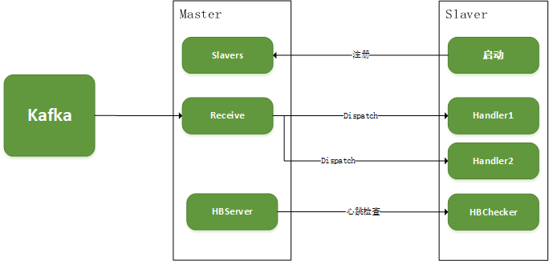

## Upload优化升级总结

在郑兴和钟艳修改为Actor-Remote的基础前提下，新增了报表服务端过滤功能，数据整体调用流程描述下：




### 注册

Master和Slaver使用Actor Remote模式

```yaml
akka {
  actor {
    provider = "akka.remote.RemoteActorRefProvider"
  }
  remote {
    enabled-transport = "akka.remote.RemoteActorRefProvider"
    netty.tcp{
      hostname = %s
      port = %s
    }
  }
}
```

绑定的host为本机容器IP，端口默认均为2553。以下是在k8s中配置容器ip的方法：

```yaml

    spec:
      containers:
      - name: savoir-et-upload-master
        image: registry.cn-hangzhou.aliyuncs.com/fs-cloud/savoir_upload:116.22-08-04
        args: [ "ipMaster=$(MY_POD_IP)"]
        env:
          - name: MY_POD_IP
            valueFrom:
              fieldRef:
                apiVersion: v1
                fieldPath: status.podIP
```


**MASTER启动：**

必须先与Slaver启动，启动Actor System之后，将本机IP写入Redis中，KEY为“upload_server”


**SLAVER启动：**

1. 创建本地Client的`ActorSystem`。
2. 从Redis中获取Master服务地址，如果未找到将报错重启
3. 根据Consumers配置决定启动的`UploadActor`实例。依次像MASTER发送`Registry`消息。


Master接收到注册消息后，将构造Slaver实例，其中包含

+ 处理类名称，例如`http_comm_son1`
+ 根据Handler名称实例化uploader上报任务实例
+ Slaver Actor的路径
+ Slaver Actor的`ActorRef`


###  分发

不再将数据全部推送到注册的工作节点，而是通过如下分发规则：

根据uploader实例中是否重写uploader方法，判断该任务节点是否需要进行数据推送.

```scala
val upStationData: Boolean = {
        worker.getClass.getMethods.filter(a => a.getName == "upload")
            .filter(c => c.getDeclaringClass.getName != classOf[uploader].getName) // 当前类中重写的upload方法
            .exists(c => c.getParameterTypes()(0).getName.contains("StationData"))
    }
```

MASTER任务分发前先通过uploader实例的filter方法进行过滤，只分发工作节点必要的数据

```scala
override def upload(data: Array[StationData]): Unit = {
        try {
            val filterd = worker.filter(data)
            if (filterd.nonEmpty) {
                actor ! filterd
                info(s"send data to [slave-$handler] ${filterd.map(_._q()).mkString(";")}")
            }
        } catch {
            case e: Exception =>
                warn(s"send data to [slave-$handler] error:$e")
        }
    }
```

> 注意：过滤前需要执行validate()以保证工作实例中配置定时更新。validate方法已经写在基类uploader的filter方法中。如果重写filter方法，需要首先调用`super.filter`。

上报任务类自定义过滤数据的方法，包括如下两种：

1. 对`configThings`和/或`configStructs`赋值，数据将根据配置结构物(Thing)进行筛选分发

   ```scala
   var configThings: Array[String] = Array()
   var configStructs: Array[Int] = Array()
   ```

   我们一般在Refresh方法刷新配置的时候进行赋值，如在 `bbwfjcMqtt` 项目上报类中

   ```scala
   override def refresh(): Unit = {
       ...
     configs = JsonHelper.Json2Object[Array[BBWFJCConfig]](s)._1.get
     configThings = configs.flatMap(_.things.keys) // 包含的结构物ThingID数组
       ...
   }
   ```

2. 重写filter方法

   通过重写filter方法，实现数据分发前的过滤。写法通常如下：

   ```scala
   override def filter(data: Array[StationData]): Array[StationData] = {
       super.filter(data).filter(d => configs.exists(c => c.filter.f(d)))
   }
   ```

   

### 心跳

通过配置项 `actor.hb.enable = true` 打开心跳检查（默认打开）。

服务端周期进行心跳分发。默认周期5分钟

```scala
akkaSystem.scheduler.schedule(hbIntervalMinutes minutes, hbIntervalMinutes minutes, masterActor, HB("tick"))
```

客户端周期进行心跳检查。周期1分钟

```scala
clientSystem.scheduler.schedule(1 minutes, 1 minutes, actors.head, CheckHB(DateTime.now))
```

当客户端收到的心跳超期**心跳分发周期两倍**，认为心跳死亡，客户端重启。