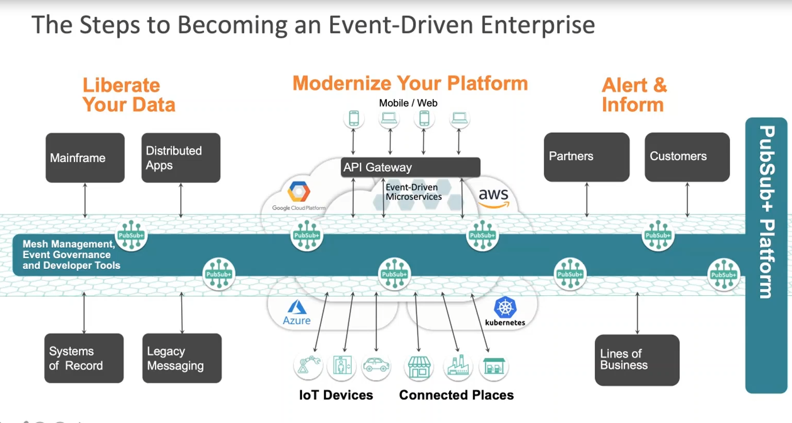
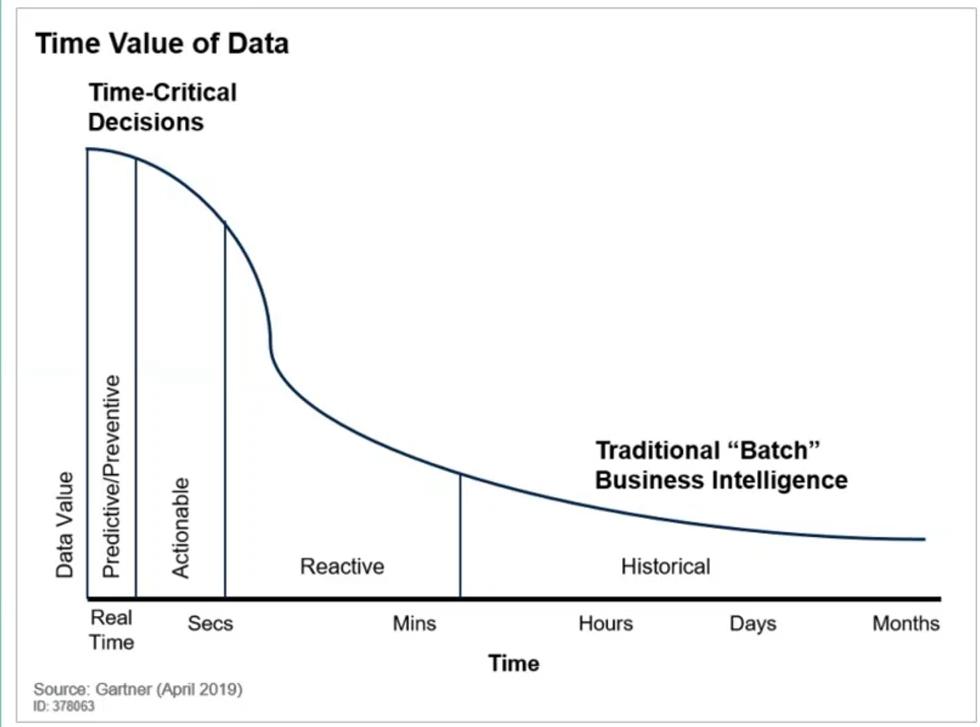

https://thenewstack.io/project-flogo-a-lightweight-runtime-for-edge-computing/

[GitHub](https://github.com/tibcosoftware/flogo)

AWS Greengrass、Azure IoT Edge 和 Google Cloud IoT Edge 将 IoT 平台服务扩展到边缘。但这些服务与各自的云平台服务紧密耦合。需要客户可以在本地部署的与云无关、与平台无关的边缘计算平台。

[TIBCO 的Flogo 项目](https://www.flogo.io/)是一个轻量级的边缘计算平台

Flogo 中的触发器连接到入站和出站通道，例如 REST、MQTT、CoAP、Kafka 主题、Cron 作业，甚至是直接通过 CLI 发送的参数。


## GET START

启动UI

```sh
docker run -it -p 3303:3303 flogo/flogo-docker eula-accept
```




