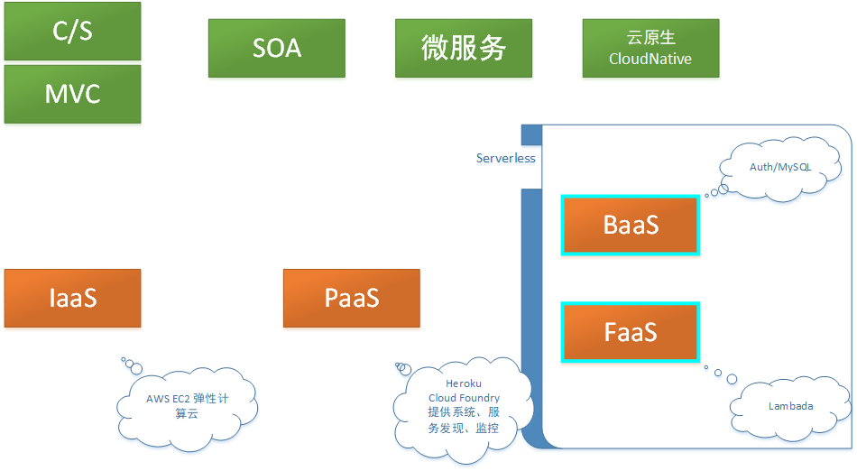

## FaaS

Serverless（无服务器架构）指的是由开发者实现的服务端逻辑运行在无状态的计算容器中，它由事件触发， 完全被第三方管理，其业务层面的状态则被开发者使用的数据库和存储资源所记录。

serverless与容器虚拟机分层概念：

NO SILVER BULLET！NO SILVER BULLET！NO SILVER BULLET！

云计算的发展过程

Function-as-a-Service景观图（图片来自`https://github.com/amyers1793/FunctionasaServiceLandscape`)

FaaS本质上是一种事件驱动的由消息触发的服务，FaaS供应商一般会集成各种同步和异步的事件源，通过订阅这些事件源，可以突发或者定期的触发函数运行。

基于K8S的无服务FaaS框架有：

- [faas-netes](https://github.com/alexellis/faas-netes) - Enable Kubernetes as a backend for Functions as a Service (OpenFaaS) https://github.com/alexellis/faas
- [fn](https://github.com/fnproject/fn) - The container native, cloud agnostic serverless platform. [http://fnproject.io](http://fnproject.io/)
- [funktion](https://github.com/funktionio/funktion/) - a CLI tool for working with funktion https://funktion.fabric8.io/
- [fx](https://github.com/metrue/fx) - Poor man's serverless framework based on Docker, Function as a Service with painless.
- [IronFunctions](https://github.com/iron-io/functions) - IronFunctions - the serverless microservices platform. [http://iron.io](http://iron.io/)
- [kubeless](https://github.com/kubeless/kubeless) - Kubernetes Native Serverless Framework [http://kubeless.io](http://kubeless.io/)
- [nuclio](https://github.com/nuclio/nuclio) - High-Performance Serverless event and data processing platform
- :star2: [OpenFaaS](https://github.com/openfaas/faas) - OpenFaaS - Serverless Functions Made Simple for Docker & Kubernetes https://blog.alexellis.io/introducing-functions-as-a-service/
- [OpenWhisk](https://openwhisk.incubator.apache.org/) - Apache OpenWhisk (Incubating) is a serverless, open source cloud platform that executes functions in response to events at any scale.
- [Knative](https://knative.dev/) - Kubernetes-based platform to deploy and manage modern serverless workloads.

## OpenFaaS

+ 持续集成层 CI / GitOps layer
+ 应用层¶](https://docs.openfaas.com/architecture/stack/#application-layer)
  - [The OpenFaaS gateway](https://docs.openfaas.com/architecture/gateway/) 提供管理函数的RESTAPI.
  - [NATS](https://github.com/nats-io) i异步函数队列
  - [Prometheus](https://prometheus.io/) 提供指标

+ 基础设施层：Kubernetes、Pod、Container Registry

[faas-netes](https://github.com/openfaas/faas-netes/) 是OpenFaaS最受欢迎的编排提供者。[https://github.com/openfaas/faas-netes]

自动伸缩：

| -                                    | -                                                            |
| ------------------------------------ | ------------------------------------------------------------ |
| com.openfaas.scale.max               | 最大副本数                                                   |
| com.openfaas.scale.min               | 最小副本数                                                   |
| com.openfaas.scale.zero              | 是否运行副本数为0                                            |
| com.openfaas.scale.zero-duration     | 空闲多久后将副本置为0                                        |
| com.openfaas.scale.target            | 每个副本调节的目标负载  50                                   |
| com.openfaas.scale.target-proportion | 目标副本占比 0.90                                            |
| com.openfaas.scale.type              | 调节模式 rps`, `capacity`, `cpu rps: 函数每秒处理完成的请求数  capacity: inflight requests的个数 |

## References

jimmysong https://jimmysong.io/kubernetes-handbook/usecases/openfaas-quick-start.html

Official https://docs.openfaas.com/architecture/stack/