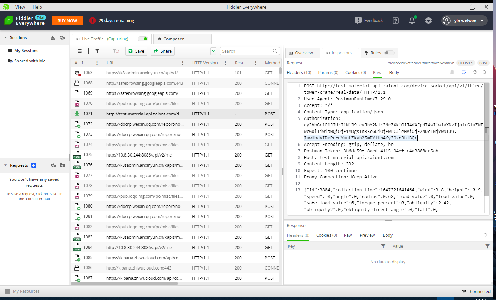
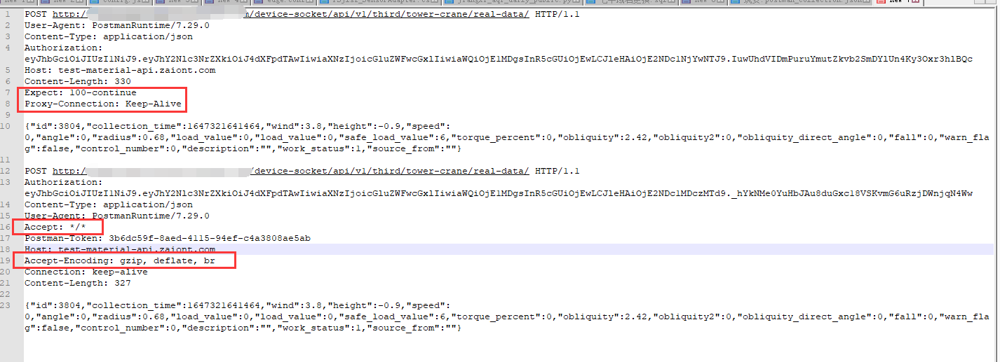

问题：

通过Postman上传成功，但是在C#中用 `HttpWebRequest` 一致超时

通过Fiddler抓取出站HTTP包，对比程序和Postman发送的内容



对比差异：



最终调试知道： C#中头Expect影响

参考：https://stackoverflow.com/questions/14063327/how-to-disable-the-expect-100-continue-header-in-httpwebrequest-for-a-single

设置：

```c#
System.Net.ServicePointManager.Expect100Continue = false;
```


完工