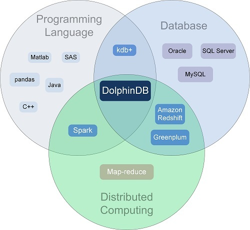
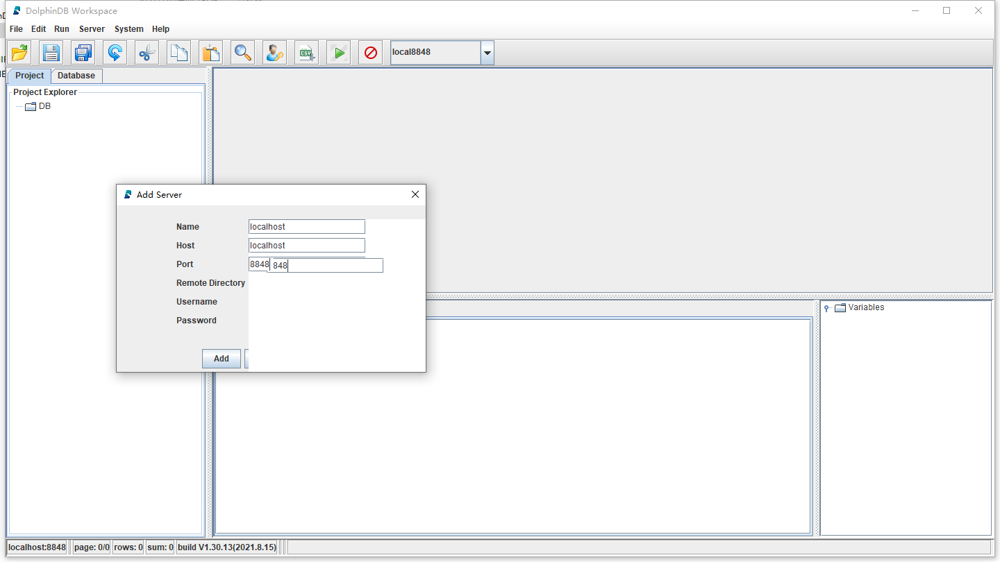
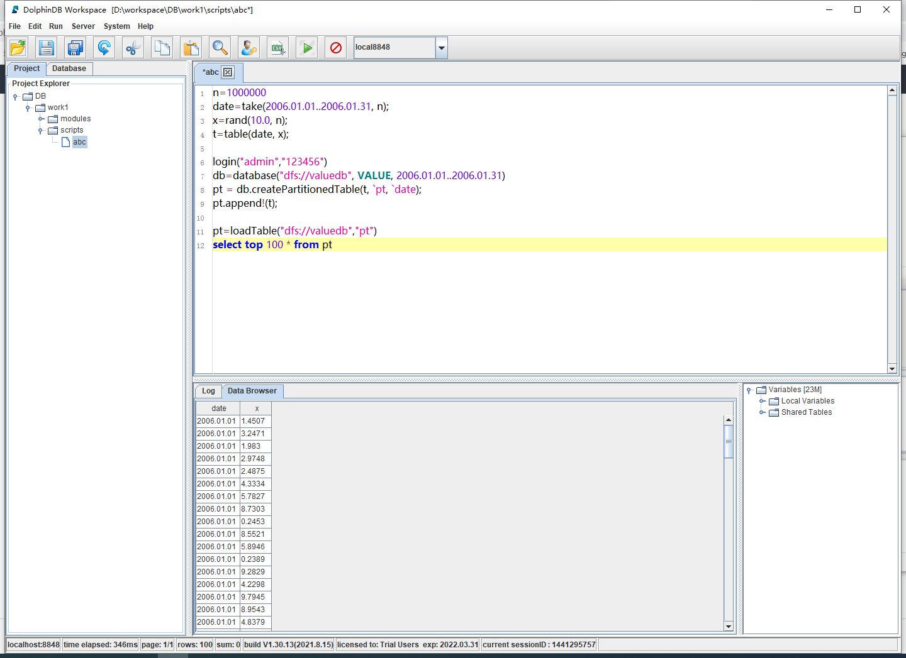
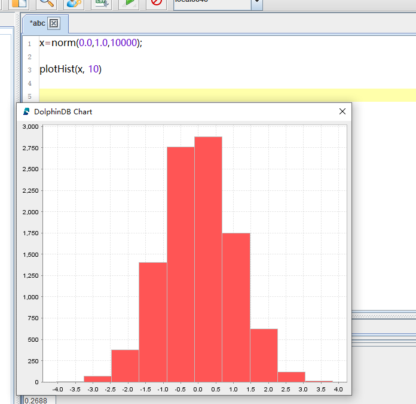
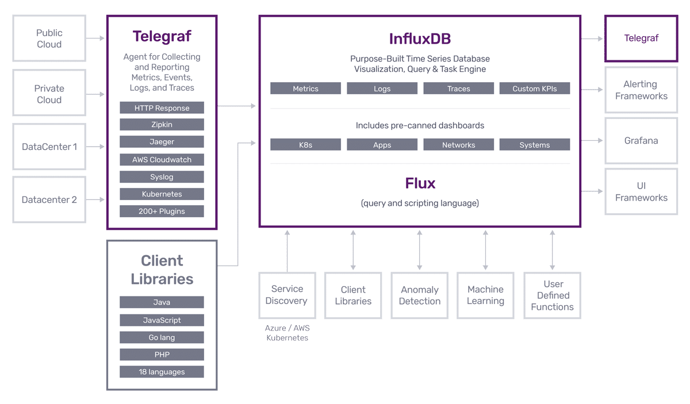
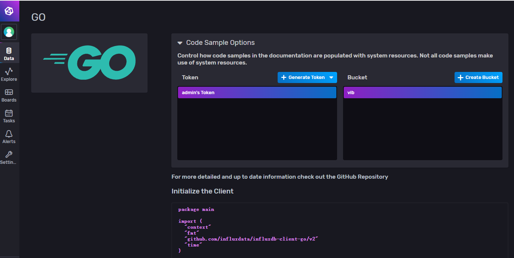

## IoT嵌入式 EMbedded系统中(时序)数据库选型

边缘计算的

基于嵌入式开发板(目前预研使用Raspberry/飞凌NXP开发版)实现边缘计算网关，本文档针对IoT数据存储，考虑数据库的选型。

硬件环境：Cortex-A72 / 2GB DDR4 / 8GB eMMC

操作系统: Linux (Ubuntu-18+)

我们纳入考虑的数据库，应该具备如下的特征

> + 体积小
>   + 数据库服务本身应占用较低的系统资源
> + 压缩能力
>   + 数据存储占用的空间体积小
> + 自动Rotate
>   + 边缘存储容量有限，按时间窗口滚动存储。数据TTL
> + 高速插入性能
>   + 考虑存储振动、FBG、动挠度等高频数据
> + 支持分片和水平扩展
>   + 提高数据查询性能
> + （类）SQL接口
>   + 易于数据调用
> + 其他：数据类型丰富、自动索引、统计分析能力、云边一体协同
>   + 加分项，可遇不可求

## 选型

| 名称                                                         | 引擎排行 2021.10 | 特点                                                         | 推荐         |
| ------------------------------------------------------------ | ---------------- | ------------------------------------------------------------ | ------------ |
| [FlashDB](https://github.com/armink/FlashDB/blob/master/README_zh.md) | 无 开源          | 1 提供键值对和时序两种<br />2 基于Flash存储优化<br />3 多实例 0内存 K-v增量升级 |              |
| [DolphinDB](https://www.dolphindb.cn/)                       | 167              | 1. 支持linux/arm/windows<br />2. 性能优异：海量工业设备提供毫秒级的接入能力<br />3. 数据库与分布式计算的融合<br /> | :star::star: |
| [InfluxDB](https://www.influxdata.com/)                      | 28 开源          | 1. Go实现开源时序数据库<br />2. 类SQL查询， 内嵌UI， 易于使用<br />3. 开箱即用统计分析函数 | :star:       |
| [Actian Zen](https://www.actian.com/product-overview/)       | 无               | 1. 嵌入式数据库，前称Pervasive PSQL<br />2. 对嵌入式系统 Raspbian、Windows IoT Core/Nano Server支持 |              |
| [TimescaleDB](https://www.timescale.com/)                    | 84 开源          | 1. postgreSQL生态(插件)<br />2. 加速性能。查询性能优于pg/influxdb/mongodb<br />3. 关系和时序并存 |              |
| [Kdb+](https://kx.com/)                                      | 54               | 1. 体积小，运行快<br />2. 内存数据库、解释行语言、有序(时序)列表、赋值顺序、面向表和列编程、强类型<br />3. 低延时，广泛用于物联网、金融领域<br />相关资源 https://www.jianshu.com/p/5487a19a8e7c | :star::star: |
| [Apache Druid](https://druid.apache.org/)                    | 92 开源          | 1. 分布式开源，云原生、流原生、分析型数据库<br />2. 列式存储、原生索引、流批数据摄入<br />[十分钟了解](https://blog.csdn.net/qq_14855971/article/details/105136994) |              |
| [extremeDB](https://www.mcobject.cn/)                        | 211              |                                                              |              |
| [ITTIA](https://www.ittia.com/)                              | 306              |                                                              |              |

其他：Cassandra / ElasticSearch / MongoDd / OpenTSDB / Sqlite / Redis / [HDF5](https://www.hdfgroup.org/downloads/hdf5/)

存储系统

> 外存(硬盘软盘磁带CD等)；我们提到的内存一般只DRAM(动态内存，电平会丢失)，需要额外设电路进行内存刷新
>
> ROM（Read-Only Memory）:只读存储，电脑的硬盘，手机的TF卡（内置存储器:NOR Flash/NAND Flash/eMMC）、嵌入式的Flash
>
> RAM (Random-Access Memory): 随机存储器，对应电脑内存条。RAM速度开，但断电数据会丢失。

> + 

## [DolphinDB](https://www.dolphindb.cn/)

浙江智臾科技 C++实现

+ [高性能 分布式 时序库](https://zhuanlan.zhihu.com/p/40049521)
+ [嵌入式](https://zhuanlan.zhihu.com/p/62235363)支持
+ 强大的计算能力 ，数据库与分布式计算融合



知乎上关于DolphinDB与其他数据库对比的文章，除kdb+外都有一个量级左右的吞吐量提升。

[浙江智臾科技有限公司：时序数据库DolphinDB和TimescaleDB 性能对比测试报告](https://zhuanlan.zhihu.com/p/56982951)

[浙江智臾科技有限公司：时序数据库DolphinDB与Druid的对比测试](https://zhuanlan.zhihu.com/p/56102593)

[浙江智臾科技有限公司：DolphinDB与Elasticserach在金融数据集上的性能对比测试](https://zhuanlan.zhihu.com/p/56092404)

[浙江智臾科技有限公司：DolphinDB与InfluxDB对比测试报告](https://zhuanlan.zhihu.com/p/42287416)

[无敌大饺子：Kdb+有可能不再是最快的时序数据库？](https://zhuanlan.zhihu.com/p/41799930)

### [安装使用](https://gitee.com/dolphindb/Tutorials_CN/blob/master/standalone_server.md)

下载http://www.dolphindb.cn/downloads.html

试验：社区win64版本

运行：dolphindb.exe

```sh
DolphinDB Systems 1.20.22 64 bit Copyright (c) 2011~2021 DolphinDB, Inc. Licensed to Trial Users. Expires on 2022.03.31 (Build:2021.08.25)

>
```

默认webUI http://localhost:8848/

**GUI**

下载 http://www.dolphindb.cn/downloads.html 其他资源

添加server如下：（全屏后不存在花屏的现象）



添加项目，添加脚本，执行。效果如下：



以及绘图（类似python）



### 用户手册

[Dolphin解释性脚本语言](https://www.dolphindb.cn/cn/help/130/Introduction/FeaturesandRoadmap.html)

GoAPI https://gitee.com/dolphindb/api-go/blob/master/README.md


## KDB+

[WIKI](https://iowiki.com/kdbplus/kdbplus_overview.html)


## InfluxDB

目前本地化平台中使用过，目前最流行的时序库。需要验证在嵌入式板中的性能表现和资源消耗。InfluxDB生态如下



InfluxDB2.0

> [下载](https://portal.influxdata.com/downloads/)
>
> Docker:  docker pull influxdb:2.0.9
>
> Windows版本:https://dl.influxdata.com/influxdb/releases/influxdb2-2.0.9-windows-amd64.zip

>  启动 influxd.exe http://localhost:8086/

>  通过Data>Sources>Go查看Go数据接入流程



> 1. ```
>    go get github.com/influxdata/influxdb-client-go/v2
>    ```
>
>    get github超时，需要设置环境变量： GOPROXY=https://goproxy.io,direct  GO111MODULE=on
>
>    或者在GoLand中设置Go Modules(vgo)代理地址 https://goproxy.cn
>
> 2. 


## 附加:边缘物语

查阅相关文章时整理的边缘计算EC相关文章记录，推荐文章 

> 1. [物联网嵌入式数据库的来龙去脉](https://www.embeddedcomputing.com/technology/software-and-os/os-filesystems-libraries/the-ins-and-outs-of-embedded-databases-for-the-iot)
> 2. 

Gartner 预测，到 2020 年将有 **250** 亿台设备连接到物联网，物联网开发人员正在寻找易于使用的软件工具来存储、管理、分析和交流其物联网数据.

边缘计算起源于90年代**Akamai**公司提出的内容分发网络(CDN).

章鱼有**40%**神经元在脑袋里,剩下的**60%**在它的8条腿上,所谓的**用“腿”思考**

边缘计算的基本思想则是**功能缓存(function cache).** 是云计算的延生和补充。端边云三端协同工作

边缘计算的典型**场景**和联想：CDN、自动驾驶、智能安防、区块链、 `智能家居` 、 中小桥、智慧医疗、智能制造、能源和电网控制。

边缘系统中**存储系统**设计面临挑战，需要高密度、低能耗、低延时、高读写速度的存储介质，以及稳定高效的存储引擎服务。

特征： 

:+1: 分布式和低延时计算

:+1: 效率更高、更加智能（AI）、更加节能

:+1: 缓解流量压力、云端存储压力

:+1: 隐私保护，更加安全