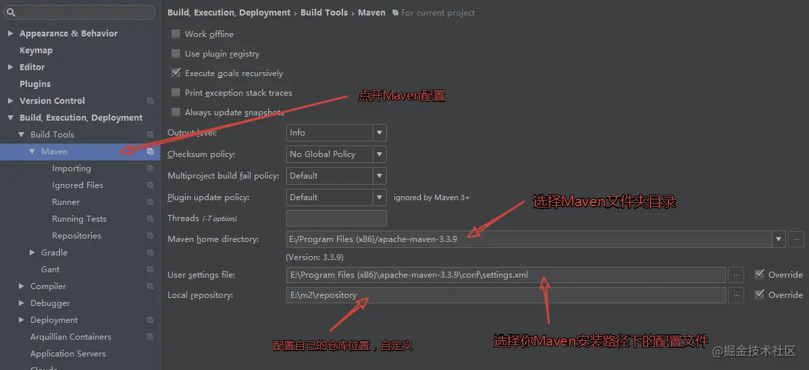
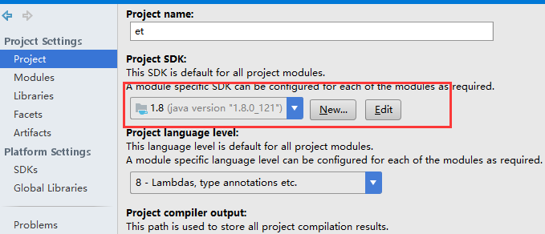
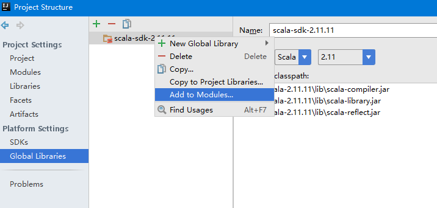
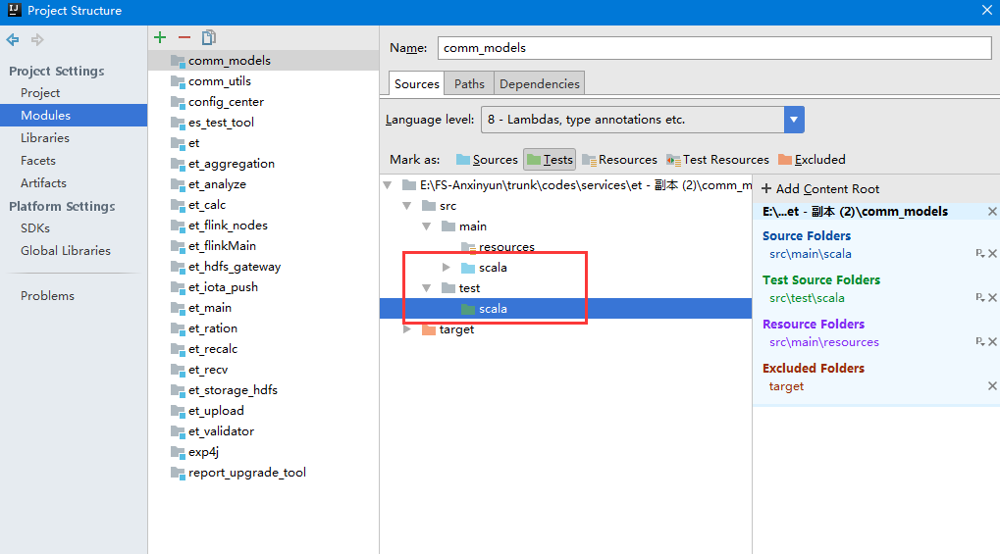
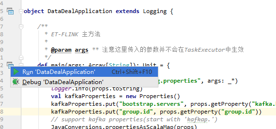
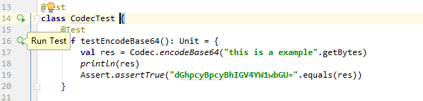
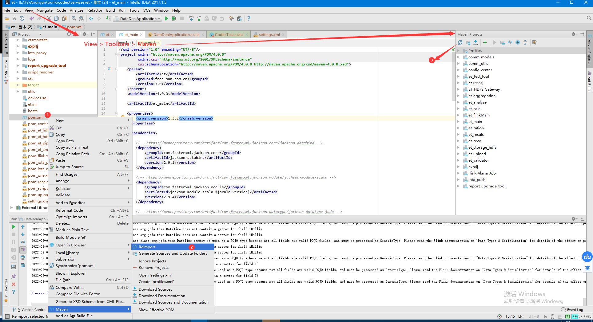
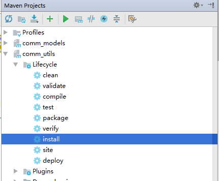

## Scala语言入门

参考：

《[Scala语言规范](https://static.runoob.com/download/Scala%E8%AF%AD%E8%A8%80%E8%A7%84%E8%8C%83.pdf)》

《[Scala入门](https://docs.scala-lang.org/zh-cn/tour/tour-of-scala.html)》

[Scala](https://so.csdn.net/so/search?q=Scala&spm=1001.2101.3001.7020) 是一门多范式（multi-paradigm）的编程语言，设计初衷是要集成面向对象编程和函数式编程的各种特性。

Scala是一种针对JVM将函数和面向对象技术组合在一起的编程语言。


+ 面向对象：一切皆对象

+ 函数式编程：一切皆表达式，每条语句都可以看成一条表达式。函数式的特点是无副作用，不会对输入参数进行修改，scala设计的默认数据结构绝大部分是不可变的。并且在一个良好风格的scala程序中，只需要使用val不可变变量而无需使用var可变变量。

+ 简洁：强大的自动类型推断，隐含类型转换，匿名函数，case类，字符串插值器。

+ 表现力：集合的&和|运算,函数定义的=>符号,for循环<-的符号，Map的 ->符号，以及生成range的 1 to 100等表达。

### 类型

`AnyVal`代表值类型,`AnyRef`代表引用类型.

`Nothing`是所有类型的子类型，也称为底部类型。`Null`是所有引用类型的底部类型。


### 声明与定义

```scala
// 定义变量
var index1 : Int= 1
// 定义常量
val index2 : Int= 1
```

### 类

```scala
// 类名，构造器和默认值
class Point(var x: Int = 0, var y: Int = 0)

// 特质（接口）
trait Iterator[A] {
  def hasNext: Boolean
  def next(): A
}

// 继承
class Cat(val name: String) extends Pet
```

### 方法与函数

```scala
class Test{
    // 定义方法
  def m(x: Int):Int = x + 3
   // 定义函数
  val f = (x: Int) => x + 3
}
```

> 方法可以返回Unit，类似java的void
>
> 方法的返回在最后，可以省略return关键字

### 元组

Tuple2~Tuple22

```scala
val tp= ("sugar",24,true):Tuple3[String,Int,Boolean]
println(tp._1)

// 元组在循环中的应用
val numPairs = List((2, 5), (3, -7), (20, 56))
for ((a, b) <- numPairs) {
  println(a * b)
}
```

### Object和Case Class

Case Class和class的区别：

+ 初始化的时候new字段不是必须
+ 默认实现toString/equals/hashCode/Serializable
+ 支持模式匹配

Object：

+ 通过object实现静态方法和字段
+ 通过与Class同名，即类与伴生对象。共享属性和方法、必须在同一源文件中。

### 模式匹配

```scala
// 类似switch功能
x match {
  case 0 => "zero"
  case 1 => "one"
  case 2 => "two"
  case _ => "other"
}

// case class
def showNotification(notification: Notification): String = {
  notification match {
      // 模式匹配和，模式守卫
    case Email(sender, title, _) if sender.startWith("A") =>
      s"You got an email from $sender with title: $title"
    case SMS(number, message) =>
      s"You got an SMS from $number! Message: $message"
    case VoiceRecording(name, link) =>
      s"you received a Voice Recording from $name! Click the link to hear it: $link"
  }
}
```


## ET 开发环境准备

### 环境

| 环境  | 版本             |
| ----- | ---------------- |
|       |                  |
| IDE   | IDEA 2017.1      |
| java  | JDK1.8           |
| scala | scala 2.11       |
| maven | 内置，可选（>3） |


> 在2018或更高版本中出现模块识别混乱情况，建议使用改版本


### 代码路径

主干：http://10.8.30.22/FS-Anxinyun/trunk/codes/services/et

商用TAG: http://10.8.30.22/FS-Anxinyun/tags/et.flink1.9


### IDEA设置

#### 在IDEA中导入项目：

1. File>Open 直接打开项目
2. File > New > Project from existing source


#### File > Settings打开设置：

1. scala插件： Plugins > Install Jetbrains plugin...

2. Maven设置：如下图，选择内置Maven3或自己安装的maven,需要指定setting files的路径：

   


`settings.xml` [参考](https://www.cnblogs.com/jingmoxukong/p/6050172.html)

```xml
<?xml version="1.0" encoding="UTF-8"?>
<settings xmlns="http://maven.apache.org/SETTINGS/1.0.0"
	xmlns:xsi="http://www.w3.org/2001/XMLSchema-instance"
	xsi:schemaLocation="http://maven.apache.org/SETTINGS/1.0.0
                          http://maven.apache.org/xsd/settings-1.0.0.xsd">

	<!-- 仓库镜像 -->
	<mirrors>
		<mirror>
			<id>central</id>
			<mirrorOf>*</mirrorOf>
			<name>FS-Maven Repositories</name>
			<url>http://10.8.30.22:8081/repository/FS-Maven/</url>
		</mirror>
	</mirrors>
	
    <!-- 根据环境参数来调整构建配置的列表 -->
	<profiles>
		<profile>
			<id>FS-Maven</id>
			<!--包含需要连接到远程仓库的信息 -->
			<repositories>
				<repository>
					<id>FS-Maven</id>
					<name>FS-Maven</name>
					<url>http://10.8.30.22:8081/repository/FS-Maven/</url>
					<releases>
						<enabled>true</enabled>
					</releases>
					<snapshots>
						<enabled>true</enabled>
					</snapshots>
				</repository>
			</repositories>
		</profile>

	</profiles>

	<!-- <localRepository>${env.MAVEN_REP_HOME}/.m2/repository</localRepository> -->
	<!-- 跳过用户交互 -->
	<interactiveMode>true</interactiveMode>
	<usePluginRegistry>false</usePluginRegistry>
	<offline>false</offline>
	
	<!-- 远程服务器验证 -->
	<servers>
		<server>
			<id>fs-releases</id>
			<username>admin</username>
			<password>admin123</password>
		</server>
	</servers>
</settings>
```

#### 项目设置

File > Project Structure

JAVA JDK：

 

SCALA SDK

 

指定文件源类型

 

### 运行程序：

\et_flinkMain\src\main\scala\et\flink\DataDealApplication.scala

 


### 运行单元测试

例如：\comm_utils\src\test\scala\CodecTest.scala

 


### 常见问题：

>1. POM更新 可以使用自动引入
>
>    
>
>2. 代码中包引入报红
>
>   尝试重新引入
>
>    
>
>   构造依赖项目：
>
>   如引入 comm.utils._ 报错，只需将comm.utils项目重新install
>
>    
>
>   或者到comm_utils目录下执行`mvn install`
>
>   如果还是报错：
>
>   可以到本地仓库中删除对应目录后重新执行install
>
>3. 项目生成的.idea文件和 .iml文件是项目文件


## Maven

Maven作为**构建工具：依赖管理器和项目管理工具**

[Maven入门，读完这篇就够了]( https://juejin.cn/post/6844903543711907848)


未完待续

