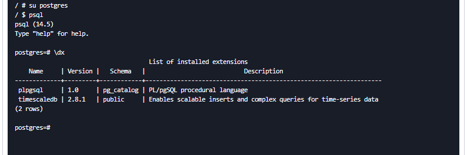

TimescaleDB是基于PostgreSQL数据库打造的一款时序数据库，插件化的形式

```sh
docker run -d --name timescaledb -p 5432:5432 -e POSTGRES_PASSWORD=password timescale/timescaledb-ha:pg14-latest
```

检查容器中是否已安装TimescaleDB扩展




### Refer

https://github.com/timescale/timescaledb 【GITHUB】

https://docs.timescale.com/ 【Official】

https://www.jianshu.com/p/125ff16d79f9 【BLOG】

