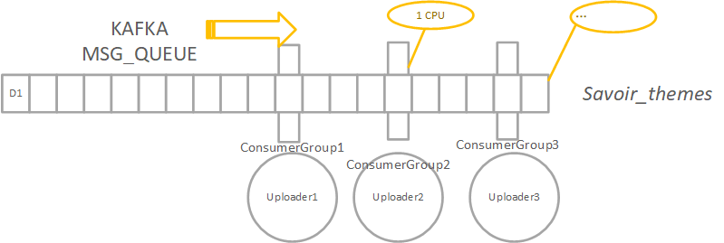
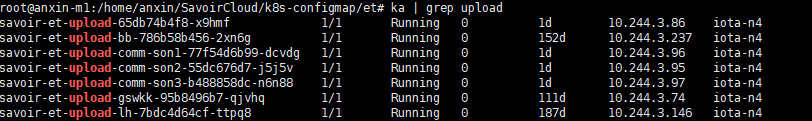
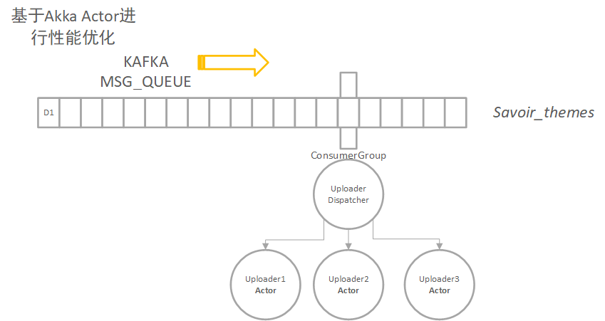
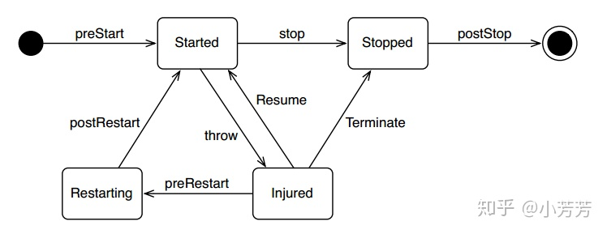
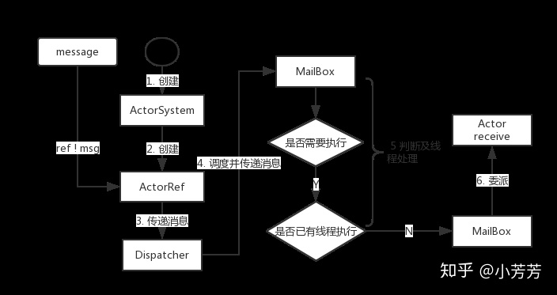

## 当前架构

> et-upload进程，主要用于订阅以太/安心云监测数据，进行上报第三方平台处理。

目前`et-upload`进程，按项目实现不同的handler，实现`uploader`接口。

进程主入口通过 `consumers` 参数传入不同handler类的名称，这样我们就可以通过配置不同的consumers参数，启动多个upload实例，实现多个上报任务的“负载均衡”，实现的架构如下：。



当前进程运行情况：



但是，目前这种架构存在一个弊端，每个upload实例都作为独立的kafka消费者，会消耗过多的服务器计算能力和网络I/O。

> 下图为n4 top命令展示内容，其中前几个进程均为upload进程


> 小迷惑：之前指定upload进程运行在savoir n4节点，这一点被忽略后复制。导致所有upload均运行在n4。


## Actor架构

为减少每个upload实例作kafka消费者造成的过多性能消耗，建立唯一的Kafka消费组，消息再通过Actor Dispatcher分发到多个Remote Actor中。框架如下图所示：




Dispatcher有根据数据进行筛选的逻辑，将需要指定Actor处理的消息筛选后，投递到指定Actor的邮箱中。


需要扩展uploader接口，实现filter方法:

```scala
abstract class uploader {

    def init(): Unit

    def upload(data: Array[IotaData]): Unit = {}

    def upload(data: Array[StationData]): Unit = {}

    def upload(data: Array[RealTimeAggData]): Unit = {}

    def filter(data: Array[IotaData]): Array[IotaData] = data
    def filter(data: Array[StationData]): Array[StationData] = data.filter(d => d.data.nonEmpty && d.data.get.nonEmpty)
    def filter(data: Array[RealTimeAggData]): Array[RealTimeAggData] = data.filter(x => x.data.nonEmpty)

    var debug: Boolean = false // 调试标志
}
```


改造upload主程序，改成类似**主从模式**。**Master**负责创建`ActorRef`调用和分发消息，**Slave**负责处理上报逻辑。

1. Slave

在`application.conf`中增加actor路由设置, 监听

```conf
akka {
  actor {
    provider = "akka.remote.RemoteActorRefProvider"
  }
  remote {
    transport = "akka.remote.netty.NettyRemoteTransport"
    netty {
      hostname = "0.0.0.0"
      port = 2552
    }
 }
}
```

程序入库，根据配置的consumers参数，决定启动具体的上报Actor。

其中Actor实现可参考`UploadActor`，可见，`UploadActor`就是原先upload handler的一个actor封装。

```scala
case class UploadActor(uploader: uploader) extends Actor with Logging {
    override def receive: Receive = {
        case sdata: Array[StationData] =>
            upload(sdata)
        case idata: Array[IotaData] =>
            upload(idata)
        case adata: Array[RealTimeAggData] =>
            upload(adata)
    }
}
```


2. Master

主进程中维护所有`ActorRef`的路由。注意配置的路由的host为upload实例类的名称（如下http_com_A），这要求在部署k8s时容器名称必须和upload同名。

```scala
// application.conf
akka {
  actor {
    deployment {
      /http_com_A {
        remote = "akka://uploadActorSystem@http_com_A:2552"
      }
    }
  }
}

// ActorRef
ActorRef actor = system.actorOf(new Props(http_comm_A.class), "http_com_A");

// 分发消息
val dataA=http_comm_A.filter(data) // 找出A中待处理的数据
actor.tell(dataA, null); // TELL to Remote ACTOR
```


**更多待实现**：

1. master中用反射实现所有actor代码逻辑
2. 升级或故障过程，导致actor服务down，会导致什么后果？
3. 


## [Actor介绍](https://zhuanlan.zhihu.com/p/38662453)

> 高性能改造方法：消息、缓存
>
> 消息传递：1.基于Channel（ZMQ） 2.基于Actor模型
>
> Actor 是由状态（**State**）、行为（`Behavior`）和邮箱（`MailBox`，可以认为是一个消息队列）三部分组成。
>
> **Actor 模型特点**
>
> 1. 对并发模型进行了更高的抽象。
> 2. 使用了异步、非阻塞、高性能的事件驱动编程模型(DDD)。
> 3. 轻量级事件处理（1 GB 内存可容纳百万级别 Actor）。
>
> **Akka Actor**
>
> 1. ActorSystem: 负责管理调度、配置相关参数、日志功能
>
> 2. Actor层次。user下为用户创建的actor路径
>
>    
>
> Actor生命周期：
>
> Actor 在被创建后存在，并且在用户请求关闭时消失。当 Actor 被关闭后，其所有的子Actor 都将被依次地关闭.
>
> AKKA 为 Actor 生命周期的每个阶段都提供了钩子（hook）方法，我们可以通过重写这些方法来管理 Actor 的生命周期。
>
> Actor 被定义为 trait，可以认为就是一个接口，其中一个典型的方法对是`preStart()` 与 `postStop()`，顾名思义，两个方法分别在启动和停止时被调用。
>
> 
>
> 通过ActorRef进行能力调用。
>
> 

基于Akka实现Remote通信

官方文档 https://doc.akka.io/docs/akka/2.1/java/remoting.html


`application.conf`

```conf
akka {
  actor {
    provider = "akka.remote.RemoteActorRefProvider"
  }
  remote {
    transport = "akka.remote.netty.NettyRemoteTransport"
    netty {
      hostname = "127.0.0.1"
      port = 2552
    }
 }
}
```


寻找远端的Actors

```java
ActorRef actor = context.actorFor("akka://app@10.0.0.1:2552/user/serviceA/worker");

// akka://<actorsystemname>@<hostname>:<port>/<actor path>

```

远程创建Actor

```java
akka {
  actor {
    deployment {
      /sampleActor {
        remote = "akka://sampleActorSystem@127.0.0.1:2553"
      }
    }
  }
}

ActorRef actor = system.actorOf(new Props(SampleActor.class), "sampleActor");
actor.tell("Pretty slick", null);
```

