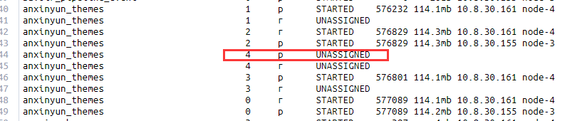

```shell
epoch      timestamp cluster status node.total node.data shards pri relo init unassign pending_tasks max_task_wait_time active_shards_percent
1634713368 07:02:48  es-test red             3         3    300 161    0    0        8             0                  -                 97.4%
```

ElasticSearch <font color='red'>**红**</font> 了!!

查看节点资源使用情况

```sh
GET _cat/nodes?v
ip          heap.percent ram.percent cpu load_1m load_5m load_15m node.role master name
10.8.30.155           62          97   1   13.61   16.02    16.04 mdi       *      node-3
10.8.30.158           49          99   3    1.51    1.76     1.77 mdi       -      node-5
10.8.30.161           54          98   2    0.64    0.76     0.79 mdi       -      node-4
```

查看哪些索引红了

`GET _cat/indices?v`

发现`anxinyun_themes`这个数据老大倒了

查看它的分片：

```sh
GET _cat/shards?v
```

发现出现 UNASSIGNED 的主分片



node-n5上的都变成unassigned了，去看看n5怎么了?

```sh
#磁盘
df -h
文件系统        容量  已用  可用 已用% 挂载点
udev             16G     0   16G    0% /dev
tmpfs           3.2G  8.0M  3.2G    1% /run
/dev/sda2       1.8T  680G  1.1T   40% /
tmpfs            16G   53M   16G    1% /dev/shm
tmpfs           5.0M     0  5.0M    0% /run/lock
tmpfs            16G     0   16G    0% /sys/fs/cgroup

free -m
 总计         已用        空闲      共享    缓冲/缓存    可用
内存：       32057       29211         487         137        2357        2449
交换：           0           0           0
```

ES还是勉强活着的...


查看分片失败原因：

```sh
curl 10.8.30.155:9200/_cluster/allocation/explain?pretty -H "Content-Type:application/json" -d '{"index":"anxinyun_themes","shard":4,"primary":true}'

shard has exceeded the maximum number of retries [5] on failed allocation attempts - manually call [/_cluster/reroute?retry_failed=true] to retry, [unassigned_info[[reason=ALLOCATION_FAILED], at[2021-09-28T09:32:35.523Z], failed_attempts[5], delayed=false, details[failed shard on node [IY_55EEKTb-OF_OqC8AcSw]: failed to create shard, failure IOException[failed to obtain in-memory shard lock]; nested: ShardLockObtainFailedException[[anxinyun_themes][4]: obtaining shard lock timed out after 5000ms]; ], allocation_status[deciders_no]]]
```

两个重点：

1. 出现这个问题的原因是原有分片未正常关闭和清理，所以当分片要重新分配回出问题节点的时候没有办法获得分片锁
2. 这不会造成分片数据丢失，只需要重新触发一次分配

```sh
POST _cluster/reroute?retry_failed
```


修改后集群环境变成 yellow, 查看分片分配状态，发现好多r的分片还是unassigned状态

```sh
too many shards [100] allocated to this node, cluster setting [cluster.routing.allocation.total_shards_per_node=100]
```

原来是分配太多了

```sh
PUT _cluster/settings
{
  "persistent": {
    "cluster.routing.allocation.total_shards_per_node":1000
  },
  "transient": {
    "cluster.routing.allocation.total_shards_per_node":1000
  }
}
```

重新执行分配

```sh
POST _cluster/reroute?retry_failed
```


等了一会

```sh
GET _cat/health?v
epoch      timestamp cluster status node.total node.data shards pri relo init unassign pending_tasks max_task_wait_time active_shards_percent
1634776945 00:42:25  es-test green           3         3    308 162    0    0        0             0                  -                100.0%
```


之前准备的重新分配分片的方法，没有使用，这里也做个记录：

试着把unassigned的分片分配到其他节点

```sh
curl -X POST -H "Content-Type:application/json" -d '{
    "commands" : [ {
      "allocate" : {
          "index" : "anxinyun_theme",
          "shard" : 4,
          "node" : "1NWMrKZpT6KG8I0NUKs1eQ",
          "allow_primary" : true
      }
    }]
}' "http://10.8.30.155:9200/_cluster/reroute"
```

