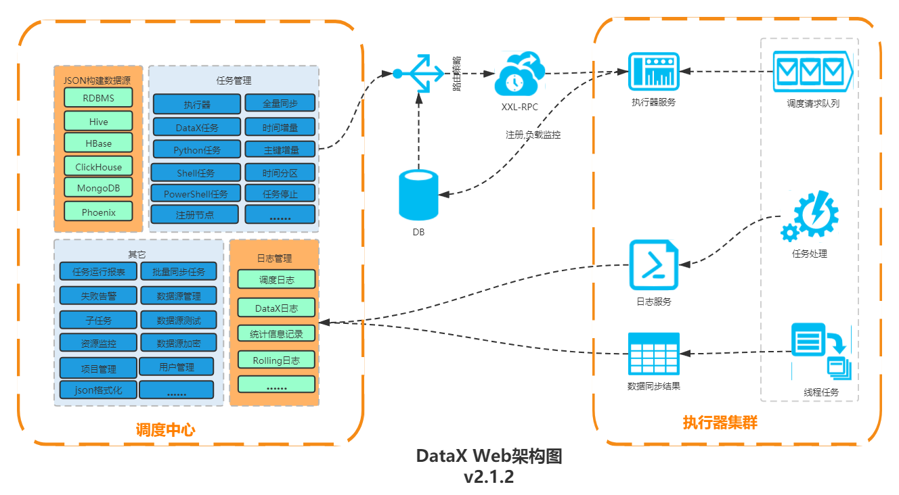
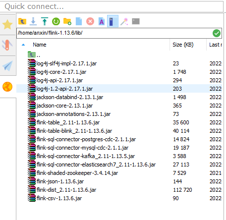
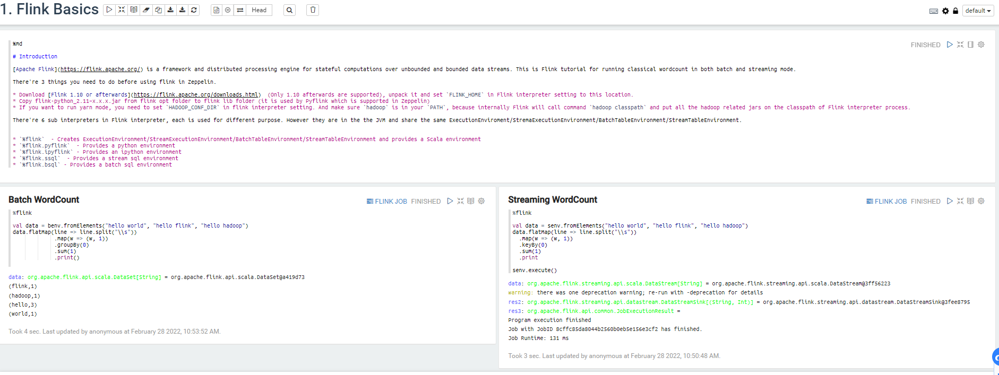
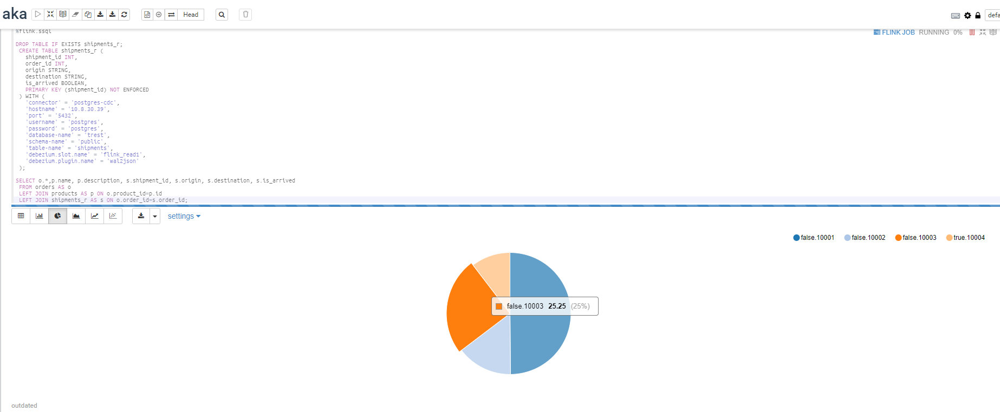
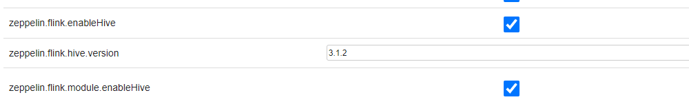
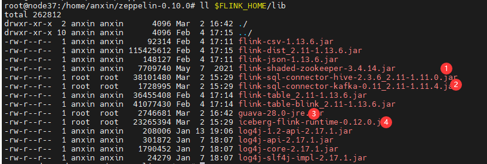
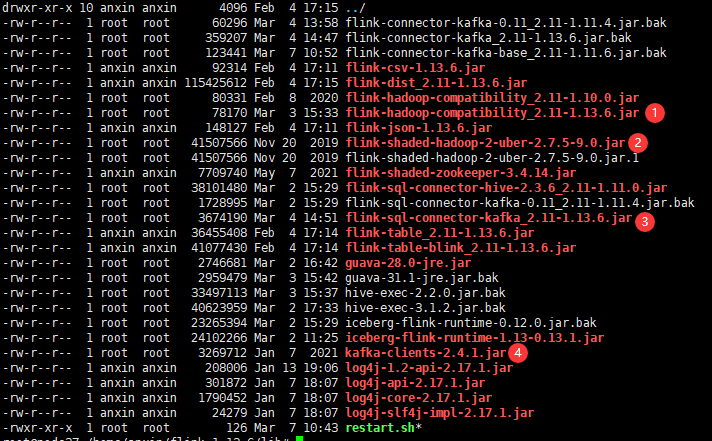
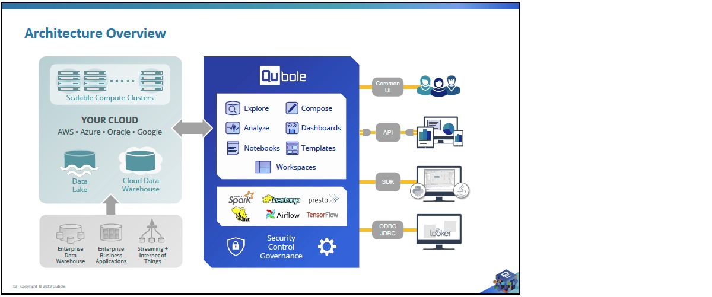

**数据治理技术预研**	


数据目录，它是数据湖中所有[大数据的目录。](https://www.oracle.com/big-data/guide/what-is-big-data.html)通过将元数据应用于数据湖中的所有内容，数据发现和治理变得更加容易。通过将元数据和分层逻辑应用于传入数据，数据集接收必须要的上下文和可跟踪的血缘关系，以便在工作流中有效使用。数据源像一条条小溪，最终将数据倾倒入数据湖中，如果缺乏数据目录的组织级别，最终数据湖会变成数据沼泽。


[Datahub VS Atlas VS Amundsen](https://cloud.tencent.com/developer/article/1746714)

|                             | 搜索 | 推荐 | 表描述 | 数据预览 | 列统计 | 占用指标 | 权限 | 排名 | 数据血统 | 改变通知 | 开源 | 文档 | 支持数据源                                            |
| :-------------------------- | :--- | :--- | :----- | :------- | :----- | :------- | :--- | :--- | :------- | :------- | :--- | :--- | ----------------------------------------------------- |
| Amundsen (Lyft)             | ✔    | ✔    | ✔      | ✔        | ✔      |          | ✔    | ✔    | Todo     | ✔        | ✔    | ✔    | Hive, Redshift, Druid, RDBMS, Presto, Snowflake, etc. |
| Datahub (LinkedIn)          | ✔    |      | ✔      |          |        |          | ✔    | ✔    | ✔        | ✔        | ✔    | ✔    | Hive, Kafka, RDBMS                                    |
| Metacat (Netflix)           | ✔    |      | ✔      |          | ✔      | ✔        |      | Todo |          | Todo     | ✔    |      | Hive, RDS, Teradata, Redshift, S3, Cassandra          |
| Atlas (Apache)              | ✔    |      | ✔      |          |        |          |      |      | ✔        | ✔        | ✔    | ✔    | HBase, Hive, Sqoop, Kafka, Storm                      |
| Marquez (Wework）           | ✔    |      | ✔      |          |        |          |      |      | ✔        |          | ✔    |      | S3, Kafka                                             |
| Databook (Uber)             | ✔    |      | ✔      | ✔        | ✔      |          |      |      | ✔        |          |      |      | Hive, Vertica, MySQL, Postgress, Cassandra            |
| Dataportal (Airbnb)         | ✔    |      | ✔      |          | ✔      |          | ✔    | ✔    |          |          |      |      | Unknown                                               |
| Data Access Layer (Twitter) | ✔    |      | ✔      |          |        |          |      |      | ✔        |          |      |      | HDFS, Vertica, MySQL                                  |
| Lexikon (Spotify)           | ✔    | ✔    | ✔      |          |        |          | ✔    | ✔    |          |          |      |      | Unknown                                               |

## DataHub

[官网入门](https://datahubproject.io/docs/quickstart/)

https://github.com/linkedin/datahub :star:4.7k

DataHub 是一个现代数据目录，旨在支持端到端数据发现、数据可观察性和数据治理。这个可扩展的元数据平台是为开发人员构建的，让他们可以适应快速变革的数据生态系统的复杂性，并让数据从业者在其组织内利用数据的全部价值。


### 安装

python3

```shell
# ubuntu中已经预装python和python3
# 执行python3 -m pip 提示 pip模块找不到
sudo apt-get install python3-pip
```


docker-compose

参考:https://blog.csdn.net/pushiqiang/article/details/78682323

```shell
sudo curl -L "https://github.com/docker/compose/releases/download/1.29.1/docker-compose-$(uname -s)-$(uname -m)" -o /usr/local/bin/docker-compose

sudo chmod +x /usr/local/bin/docker-compose

```


安装DataHub CLI

```sh
python3 -m pip install --upgrade pip wheel setuptools
python3 -m pip uninstall datahub acryl-datahub || true  # sanity check - ok if it fails
python3 -m pip install --upgrade acryl-datahub
datahub version # 或 python3 -m datahub version

```


执行quick-start

```sh
datahub docker quickstart
```


@TODO 启动失败

@安装成功 by DragonLooong


## Amundsen

https://www.amundsen.io/amundsen/

https://github.com/amundsen-io/amundsen :star:3k

Amundsen 是一个数据发现和元数据引擎，用于提高数据分析师、数据科学家和工程师在与数据交互时的工作效率。


Amundsen的架构：

前端：基于Flask的web应用侧，展示层基于React with Redux, Bootstrap, Webpack, and Babel.

搜索：基于ElasticSearch并提供RESTful API进行搜索服务。搜索索引基于Databuilder elasticsearch publisher.

元数据：使用Neo4j代理与Neo4j图形数据库交互，提供元数据服务。Amundsen中的元数据模型如下图：

DataBuilder: 提供数据摄取库构建元数据。


Quick Start:

准备阶段，安装python>=3.7

```sh
# python > 3.7
sudo apt update
sudo apt-get install zlib1g-dev libbz2-dev libssl-dev libncurses5-dev libsqlite3-dev libreadline-dev tk-dev libgdbm-dev libdb-dev libpcap-dev xz-utils libexpat1-dev liblzma-dev libffi-dev libc6-dev
# download https://www.python.org/ftp/python/3.9.10/
sudo mkdir -p /usr/local/python3 #建立安装目录

##编译安装
#后面加上 --enable-optimizations 会自动安装pip3及优化配置
./configure --prefix=/usr/local/python3  --enable-optimizations
make
sudo make install

sudo rm -rf /usr/bin/python3
sudo rm -rf /usr/bin/pip3

#添加python3的软链接
sudo ln -s /usr/local/python3/bin/python3.9 /usr/bin/python3
#添加 pip3 的软链接
sudo ln -s /usr/local/python3/bin/pip3.9 /usr/bin/pip3

# 检查版本
python3 -V
pip3 -V
```

运行官方示例

```sh
$ git clone --recursive https://github.com/amundsen-io/amundsen.git
# For Neo4j Backend
$ docker-compose -f docker-amundsen.yml up

# For Atlas
$ docker-compose -f docker-amundsen-atlas.yml up

# 导入样本数据到Neo4j
cd databuilder

apt-get install python3-venv
pip install -i https://pypi.tuna.tsinghua.edu.cn/simple/ --upgrade setuptools

python3 -m venv venv
source venv/bin/activate
pip3 install --upgrade pip
pip3 install -i https://pypi.tuna.tsinghua.edu.cn/simple/ -r requirements.txt

# maybe you need upgrade setuptools
pip3.4 install --upgrade setuptools

python3 setup.py install
python3 example/scripts/sample_data_loader.py

```

最终通过在docker中运行成功：

```sh
docker run -it -v /home/anxin/amundsen-main:/data python:3.7.12-bullseye /bin/bash
```


### Databuilder

客户端通过Job启动ETL任务，包括task和publisher。

其中task控制Extractor、Transformer、Loader组件，实现Amundsen的ETL流程。


#### [Extractor](https://github.com/amundsen-io/amundsen/tree/main/databuilder/databuilder/extractor "Extractor")

An extractor extracts records from the source. This does not necessarily mean that it only supports [pull pattern](https://blogs.sap.com/2013/12/09/to-push-or-pull-that-is-the-question/ "pull pattern") in ETL. For example, extracting records from messaging bus makes it a push pattern in ETL.

导出器，不仅仅包含拉取模式，例如消息总线中推送过来的消息。

内置了哪些导出器：

DBAPIExtractor 数据库导出

Generic 通用导出

HiveTableLastUpdated  导出最近更新的Hive metastore

HiveTableMetadata 导出Hive metadata

Cassandra 导出apache cassandra数据库metastore

Glue 导出 AWS Glue metastore

Delta-Lake-MetadataExtractor 运行在spark上面，使用Spark sql导出delta-lake 元数据

PostgresMetadataExtractor 导出Postgres或Redshift数据库的表列元数据，包括数据库、架构、表名、表描述、列名、列描述。

RestAPIExtractor  通过构造RESTAPI查询导出数据 [RestAPIQuery](#rest-api-query)。

ElasticsearchMetadataExtractor 导出ES索引的元数据

其他：Neo4j/Altas/BigQuery/Snowflake/Databricks/Superset

#### [Transformer](https://github.com/amundsen-io/amundsen/tree/main/databuilder/databuilder/transformer "Transformer")

A transformer takes a record from either an extractor or from other transformers (via ChainedTransformer) to transform the record.

转换器，处理从Extractor或另一个Transformer中过来的消息。

#### [Loader](https://github.com/amundsen-io/amundsen/tree/main/databuilder/databuilder/loader "Loader")

A loader takes a record from a transformer or from an extractor directly and loads it to a sink, or a staging area. As the loading operates at a record-level, it's not capable of supporting atomicity.

加载到Sink、或者一个输出区域*(staging area).

#### [Task](https://github.com/amundsen-io/amundsen/tree/main/databuilder/databuilder/task "Task")

A task orchestrates an extractor, a transformer, and a loader to perform a record-level operation.

Task调度ETL组件 ，执行记录级别操作

#### [Record](https://github.com/amundsen-io/amundsen/tree/main/databuilder/databuilder/models "Record")

A record is represented by one of [models](https://github.com/amundsen-io/amundsen/tree/main/databuilder/databuilder/models "models").

代表一条模型

#### [Publisher](https://github.com/amundsen-io/amundsen/tree/main/databuilder/databuilder/publisher "Publisher")

A publisher is an optional component. Its common usage is to support atomicity in job level and/or to easily support bulk load into the sink.

publisher是可选组件，支持job级别的自动化或者简单支持批量加载到Sink。

#### [Job](https://github.com/amundsen-io/amundsen/tree/main/databuilder/databuilder/job "Job")

A job is the highest level component in Databuilder, and it orchestrates a task and, if any, a publisher.

Job是Databuilder中层级最高的组件，包括task或publisher。

#### [Model](docs/models.md)

Models are abstractions representing the domain.

Model（模型）是领域代表的抽象

### Neo4j

[Neo4j](https://baike.baidu.com/item/Neo4j)是一个高性能的,NOSQL图形数据库。

在docker-compose中启动：

```yaml
  neo4j:
      image: neo4j:3.5.26
      container_name: neo4j_amundsen
      environment:
        - NEO4J_AUTH=neo4j/test
      ulimits:
        nofile:
        # 限制打开的文件数
          soft: 40000
          hard: 40000
      ports:
          - 7474:7474
          - 7687:7687
      volumes:
          - ./example/docker/neo4j/conf:/var/lib/neo4j/conf
          - ./example/docker/neo4j/plugins:/var/lib/neo4j/plugins
          - ./example/backup:/backup
          - neo4j_data:/data
      networks:
        - amundsennet
```


## Atlas

https://atlas.apache.org/

https://github.com/apache/atlas :star:1.2k

Atlas是一组可扩展的核心基础治理服务，为组织提供开放的元数据管理和治理功能，以构建其数据资产的目录，对这些资产进行分类和治理，并为数据科学家、分析师和数据治理团队提供围绕这些数据资产的协作能力。

- 能够动态创建分类 - 如 PII、EXPIRES_ON、DATA_QUALITY、SENSITIVE
- 集成多重 Hadoop 和非 Hadoop 元数据的预定义类型
- 血统：直观的 UI，可在数据通过各种流程时查看数据沿袭
- 搜索发现：可按类型、分类、属性值或自由文本搜索实体，并支持DSL查询
- 安全：与Apache Ranger集成，支持按分类对数据访问进行授权/数据屏蔽


## Ranger

https://ranger.apache.org/quick_start_guide.html

https://github.com/apache/ranger  :star:582

Apache Ranger™ is a framework to enable, monitor and manage comprehensive data security across the Hadoop platform.


## DataX

DataX是阿里云DataWorks数据集成的开源版本。离线数据同步工具/平台。

> 链接：
>
> 阿里云大数据开发治理平台 [DataWorks](https://www.aliyun.com/product/bigdata/ide)
>
> [DataX3.0介绍](https://github.com/alibaba/DataX/blob/master/introduction.md)

架构： Job > 切分Task> 划分TaskGroup > 执行Task (Read+Channel+Writer)

快速使用：

下载：http://datax-opensource.oss-cn-hangzhou.aliyuncs.com/datax.tar.gz

> 运行前：
>
> + 删除plugin目录下（包含reader，writer目录下）所有 ._开头的文件
>
> + 要在python3环境运行，需要用datax-web项目doc下的py文件拷贝到当前bin下

配置：

```sh
# 查看对应模板
$ python datax.py -r streamreader -w streamwriter
# 保存模板并修改，滞后执行
$ python datax.py ./stream2stream.json 
```


[DataX WEB UI](https://github.com/WeiYe-Jing/datax-web)

任务管理和调度、WEB构建DataX Json、WEB实时日志、运行参数配置等



[DataX Web部署](https://github.com/WeiYe-Jing/datax-web/blob/master/userGuid.md)

datax_admin 控制台： 需指定数据库地址（bin/sql） /邮件发送账户、日志、job线程池等

datax_executor 执行器（通过python_path指定datax engine的运行目录）

+ datax.job.admin admin地址
+ executor.port 执行器端口
+ jsonpath  datax json临时文件保存路径
+ pypath datax启动脚本 `xxx/datax/bin/datax.py`


可以在日志管理中查看任务执行情况和日志输出。


## FlinkX

[DTStack](https://github.com/DTStack)/[chunjun](https://github.com/DTStack/chunjun)

DATAX的升级版，基于flink的分布式数据同步工具。

通过json配置实现批量数据迁移，与Flink-CDC相比，非官方，但有更多的连接方式，但是不支持流式数据处理。

未进一步研究。


## Flink CDC Connectors

[Debezium 简介](https://debezium.io/documentation/reference/1.8/tutorial.html)

Debezium（[DOC](https://materialize.com/docs/guides/cdc-postgres/)） 是一个分布式平台，可将您现有的数据库转换为事件流（CDC）服务。

[官方文档](https://ververica.github.io/flink-cdc-connectors/master/content/about.html)

https://github.com/ververica/flink-cdc-connectors

[FlinkCDC实践](https://www.cnblogs.com/wh984763176/p/14803725.html)


是一个集成Debezium CDC的Flink Connector组件。

第一个例子：

```sh
#准备flink环境，这里下载1.13.5版本到node38节点，执行 bin/start-cluster.sh启动standalone集群，通过38:8081访问flink控制台UI

#下载cdc项目git代码
mvn spotless:apply
mvn clean install -DskipTests
#完后，对应的cdc jar包在.m2目录 F:\Program Files\apache-maven-3.2.3\mavenRepository\.m2\repository\com\ververica
#这里用到 
flink-connector-mysql-cdc-2.2-SNAPSHOT.jar


#拷贝相关cdc的jar包到 FLINK_HOME/lib/.

```

最终client lib下的jar包形态：

 

> 修改： flink-sql-connector-elasticsearch7_2.11-1.13.6.jar  -->  flink-sql-connector-elasticsearch6_2.11-1.13.5.jar
>
> 注意： elasticsearch6连接器参数中需要指定document-type。
>
> 
>
> Postgresql通过逻辑复制(>10.0 logical replication)实际就是一个CDC应用，等价于消费预写式日志 WAL。
>


在sql-client CLI中执行：

[例子来源](https://ververica.github.io/flink-cdc-connectors/master/content/%E5%BF%AB%E9%80%9F%E4%B8%8A%E6%89%8B/mysql-postgres-tutorial-zh.html)

```sql
-- 创建MySql Product对应表，同步数据库表的数据
CREATE TABLE products (
    id INT,
    name STRING,
    description STRING,
    PRIMARY KEY (id) NOT ENFORCED
  ) WITH (
    'connector' = 'mysql-cdc',
    'hostname' = '10.8.30.37',
    'port' = '3306',
    'username' = 'root',
    'password' = '123456',
    'database-name' = 'mydb',
    'table-name' = 'products'
  );
-- 创建订单表映射
CREATE TABLE orders (
   order_id INT,
   order_date TIMESTAMP(0),
   customer_name STRING,
   price DECIMAL(10, 5),
   product_id INT,
   order_status BOOLEAN,
   PRIMARY KEY (order_id) NOT ENFORCED
 ) WITH (
   'connector' = 'mysql-cdc',
   'hostname' = '10.8.30.37',
   'port' = '3306',
   'username' = 'root',
   'password' = '123456',
   'database-name' = 'mydb',
   'table-name' = 'orders'
 );
 -- 创建快递表（PostgreSQL）
 CREATE TABLE shipments (
   shipment_id INT,
   order_id INT,
   origin STRING,
   destination STRING,
   is_arrived BOOLEAN,
   PRIMARY KEY (shipment_id) NOT ENFORCED
 ) WITH (
   'connector' = 'postgres-cdc',
   'hostname' = '10.8.30.39',
   'port' = '5432',
   'username' = 'postgres',
   'password' = 'postgres',
   'database-name' = 'trest',
   'schema-name' = 'public',
   'table-name' = 'shipments',
   'debezium.plugin.name' = 'wal2json'
 );
 
 -- 目标ES数据表
 CREATE TABLE enriched_orders (
   order_id INT,
   order_date TIMESTAMP(0),
   customer_name STRING,
   price DECIMAL(10, 5),
   product_id INT,
   order_status BOOLEAN,
   product_name STRING,
   product_description STRING,
   shipment_id INT,
   origin STRING,
   destination STRING,
   is_arrived BOOLEAN,
   PRIMARY KEY (order_id) NOT ENFORCED
 ) WITH (
     'connector' = 'elasticsearch-6',
     'hosts' = 'http://10.8.30.155:9200',
     'index' = 'enriched_orders',
     'document-type'='_doc'
 );
 
 -- 关联查询形成宽表，插入到ES中
 INSERT INTO enriched_orders
 SELECT o.*,p.name, p.description, s.shipment_id, s.origin, s.destination, s.is_arrived
 FROM orders AS o
 LEFT JOIN products AS p ON o.product_id=p.id
 LEFT JOIN shipments AS s ON o.order_id=s.order_id;
 
```


### MySql启动CDC

```sh
#/etc/mysql/mysql.conf.d

[mysqld]
log-bin=mysql-bin
server-id=1
binlog_format=ROW


show variables like 'log_%'; # 显示ON表示打开
```


### Postgres启动CDC [参考](https://debezium.io/documentation/reference/postgres-plugins.html)

9.6需要使用插件 [wal2json](https://github.com/eulerto/wal2json/blob/master/README.md)。10+版本不需要使用插件。

>decoderbufs
>需要安装一堆插件,在centos上非常难于安装,官方给出的例子也是基于debein操作系统
>
>wal2json
>debezium对wal2json的支持不好,他自己官网说的
>
>pgoutput
>postgres-10 纳入了内核 以下为pgoutput解析出来的逻辑数据

```sh
#安装wal2json
git clone https://github.com/eulerto/wal2json -b master --single-branch \
&& cd wal2json \
&& git checkout d2b7fef021c46e0d429f2c1768de361069e58696 \
&& make && make install \
&& cd .. \
&& rm -rf wal2json

#postgres.conf
# MODULES
shared_preload_libraries = 'wal2json'

# REPLICATION
wal_level = logical
max_wal_senders = 4
max_replication_slots = 4

# 数据库用户权限,至少具有REPLICATION和LOGIN权限 (postgres用户默认有权限) ()
CREATE USER user WITH PASSWORD 'pwd';
ALTER ROLE user replication;
grant CONNECT ON DATABASE test to user;
GRANT SELECT ON ALL TABLES IN SCHEMA public TO user;

# 数据库访问权限 (pg_hba.conf)
local   replication     postgres                        trust
host    replication     postgres        0.0.0.0/0       md5
host    replication     FashionAdmin    0.0.0.0/0       md5
host    replication     FashionAdmin    ::1/128         md5

# 重启pg服务
service postgresql restart

# 测试wal2json是否启用
pg_recvlogical -d trest --slot test_slot --create-slot -P wal2json

pg_recvlogical -d trest --slot test_slot --start -o pretty-print=1 -f -

# 删除槽
pg_recvlogical -d trest --slot test_slot --drop-slot

# 查看当前
select * from pg_replication_slots;
# 删除槽
select * from  pg_drop_replication_slot('flink_read_xq_persons');
# 最大槽数
show max_replication_slots;
```


在157环境安装wal2json; （ubuntu20 postgresql-10）

```sh

Import the repository key from https://www.postgresql.org/media/keys/ACCC4CF8.asc:

sudo apt install curl ca-certificates gnupg
curl https://www.postgresql.org/media/keys/ACCC4CF8.asc | gpg --dearmor | sudo tee /etc/apt/trusted.gpg.d/apt.postgresql.org.gpg >/dev/null
Create /etc/apt/sources.list.d/pgdg.list. The distributions are called codename-pgdg. In the example, replace buster with the actual distribution you are using. File contents:

deb http://apt.postgresql.org/pub/repos/apt buster-pgdg main
(You may determine the codename of your distribution by running lsb_release -c). For a script version of the above file creation, presuming you are using a supported release:

sudo sh -c 'echo "deb http://apt.postgresql.org/pub/repos/apt $(lsb_release -cs)-pgdg main" > /etc/apt/sources.list.d/pgdg.list'
```


### 报错记录

1. java.io.StreamCorruptedException: unexpected block data

   类加载顺序问题，flink默认是child-first，在flink的flink-conf.yaml文件中添加`classloader.resolve-order: parent-first` 改成parent-first，重启集群即可。


## Zeppelin Flink解释器

数据科学笔记本。

开发人员将**Jupyter**描述为“*多语言交互式计算环境*”。Jupyter Notebook 是一个基于 Web 的交互式计算平台，结合了实时代码、方程式、叙述性文本、可视化、交互式仪表板和其他媒体。 `流行`  `Python`

另一方面，**Apache Zeppelin**被详细描述为“*支持交互式数据分析的基于 Web 的笔记本*”。支持交互式数据分析的基于 Web 的笔记本。您可以使用 SQL、Scala 等工具制作精美的数据驱动、交互式和协作文档。 `大数据` `Python Scala` `SQL`

Jupyter 和 Apache Zeppelin 主要可以归类为**“数据科学笔记本”**工具。

与jupyter[详细比较](https://stackshare.io/stackups/jupyter-vs-zeppelin)。


[官方](https://zeppelin.apache.org/docs/latest/interpreter/flink.html)文档翻译：

在 Zeppelin 0.9 中，我们重构了 Zeppelin 中的 Flink 解释器以支持最新版本的 Flink。**仅支持 Flink 1.10+，旧版本的 flink 将无法使用。** Zeppelin 支持 Apache Flink，Flink 解释器组由下面列出的五个**解释器**(interpreter)组成。

|      姓名       |           班级            |                             描述                             |
| :-------------: | :-----------------------: | :----------------------------------------------------------: |
|     %flink      |       Flink 解释器        | 创建 ExecutionEnvironment/StreamExecutionEnvironment/BatchTableEnvironment/StreamTableEnvironment 并提供 **Scala** 环境 |
| %flink.pyflink  |      PyFlink 解释器       |                        提供python环境                        |
| %flink.ipyflink |      IPyFlink解释器       |                      提供 ipython 环境                       |
|   %flink.ssql   | FlinkStreamSqlInterpreter |                       提供流式sql环境                        |
|   %flink.bsql   | FlinkBatchSqlInterpreter  |                      提供批处理sql环境                       |

### 特点

|         特征         |                             描述                             |
| :------------------: | :----------------------------------------------------------: |
| 支持多个版本的 Flink |       您可以在一个 Zeppelin 实例中运行不同版本的 Flink       |
| 支持多个版本的Scala  |    您可以在 Zeppelin 实例上运行不同的 Scala 版本的 Flink     |
|     支持多种语言     | 支持Scala、Python、SQL，此外你还可以跨语言协作，例如你可以编写Scala UDF并在PyFlink中使用它 |
|   支持多种执行模式   |         Local \| Remote \| Yarn \|  Yarn Application         |
|       支持Hive       |                        支持 Hive 目录                        |
|      交互式开发      |               交互式开发用户体验提高您的生产力               |
|   Flink SQL 的增强   | * 一个笔记本同时支持流式和批处理sql<br /> * 支持sql注释（单行注释/多行注释）<br /> * 支持高级配置（jobName，并行度）<br /> * 支持多条insert语句 |
|        多租户        |    多个用户可以在一个 Zeppelin 实例中工作而不会相互影响。    |
|    休息 API 支持     | 你不仅可以通过 Zeppelin notebook UI 提交 Flink 作业，还可以通过它的 rest api 来提交（你可以使用 Zeppelin 作为 Flink 作业服务器）。 |

### 快速启动

（dockers， 映射本地flink二进制程序到容器中, 验证本地模式）（8081端口：flink UI）

```bash
docker run -u $(id -u) -p 8080:8080 --rm \
-v /home/anxin/flink-1.13.6:/opt/flink \
-v /home/anxin/zeppelin-0.10.0/notebook:/notebook \
-v /home/anxin/zeppelin-0.10.0/conf:/opt/zeppelin/conf \
-v /home/anxin/zeppelin-0.10.0/interpreter:/opt/zeppelin/interpreter \
-v /home/anxin/jdk8_322/jdk8u322-b06:/usr/jdk8 \
-v /usr/hdp/3.1.4.0-315/hadoop:/usr/hdp \
-e FLINK_HOME=/opt/flink  \
-e HADOOP_HOME=/usr/hdp \
-e JAVA_HOME=/usr/jdk8 \
-e ZEPPELIN_NOTEBOOK_DIR='/notebook' \
-e ZEPPELIN_INTERPRETER_DEP_MVNREPO=http://10.8.30.22:8081/repository/FS-Maven/ \
--name zeppelin apache/zeppelin:0.10.0
```

修改解释器配置：

http://10.8.30.37:8080/

用户 > Interpreter > 搜索Flink > Edit > ... > Save


执行示例程序：

Notebook > Flink Basics




### 架构


上图是 Flink on Zeppelin 的架构。左侧的 Flink 解释器实际上是一个 Flink 客户端，负责编译和管理 Flink 作业生命周期，例如提交、取消作业、监控作业进度等。右侧的 Flink 集群是执行 Flink 作业的地方。它可以是 MiniCluster（本地模式）、Standalone 集群（远程模式）、Yarn 会话集群（yarn 模式）或 Yarn 应用会话集群（yarn-application 模式）

Flink 解释器中有两个重要的组件：Scala shell & Python shell

- Scala shell 是 Flink 解释器的入口点，它会创建 Flink 程序的所有入口点，例如 ExecutionEnvironment，StreamExecutionEnvironment 和 TableEnvironment。Scala shell 负责编译和运行 Scala 代码和 sql。
- Python shell 是 PyFlink 的入口，它负责编译和运行 Python 代码。


### 配置

连接到Flink集群：

|            财产             | 默认  |                             描述                             |
| :-------------------------: | :---: | :----------------------------------------------------------: |
|        `FLINK_HOME`         |       |  Flink 安装位置。必须指定，否则不能在 Zeppelin 中使用 Flink  |
|      `HADOOP_CONF_DIR`      |       |       hadoop conf的位置，如果在yarn模式下运行必须设置        |
|       `HIVE_CONF_DIR`       |       |   hive conf 的位置，如果要连接到 hive 元存储，必须设置此项   |
|    flink.execution.mode     | local | Execution mode of Flink, e.g. local \| remote \|yarn \|yarn-application |
| flink.execution.remote.host |       |           运行 JobManager 的主机名。仅用于远程模式           |
| flink.execution.remote.port |       |            运行 JobManager 的端口。仅用于远程模式            |

### 第三方依赖

通过[内联配置](https://zeppelin.apache.org/docs/latest/usage/interpreter/overview.html#inline-generic-configuration)实现具体note下的依赖包：

1. flink.execution.packages。类似pom中添加依赖

   ```sh
   %flink.conf
   
   flink.execution.packages  org.apache.flink:flink-connector-kafka_2.11:1.10.0,org.apache.flink:flink-connector-kafka-base_2.11:1.10.0,org.apache.flink:flink-json:1.10.0
   ```

   

2. flink.execution.jars. 配置外部依赖的jar包文件路径

   ```sh
   %flink.conf
   
   flink.execution.jars /usr/lib/flink-kafka/target/flink-kafka-1.0-SNAPSHOT.jar
   ```

### Flink UDF

在 Zeppelin 中有 4 种方法可以定义 UDF。

- 编写 Scala UDF

  ```scala
  %flink
  
  class ScalaUpper extends ScalarFunction {
    def eval(str: String) = str.toUpperCase
  }
  
  btenv.registerFunction("scala_upper", new ScalaUpper())
  ```

  

- 编写 PyFlink UDF

- 通过 SQL 创建 UDF

  通过IDE编写复杂的UDF库，然后通过SQL语句注册到环境。一般需配合通过flink.udf.jars方式引入库。

  ```sql
  %flink.ssql
  
  CREATE FUNCTION myupper AS 'org.apache.zeppelin.flink.udf.JavaUpper';
  ```

- 通过 flink.udf.jars 配置 udf jar

### Hive

配置：

zeppelin.flink.enableHive=true

HIVE_CONF_DIR

复制：

- flink-connector-hive_2.11–*.jar
- flink-hadoop-compatibility_2.11–*.jar
- hive-exec-2.x.jar


### 本地属性：（解释器上面的参数）

|          Property          | Default |                         Description                          |
| :------------------------: | :-----: | :----------------------------------------------------------: |
|            type            |         | Used in %flink.ssql to 指定流式数据的显示类型 (single, update, append) |
|      refreshInterval       |  3000   |         Used in `%flink.ssql` 指定流式数据刷新周期.          |
|          template          |   {0}   | Used in `%flink.ssql` to specify html template for `single` type of streaming data visualization, And you can use `{i}` as placeholder for the {i}th column of the result. |
|        parallelism         |         | Used in %flink.ssql & %flink.bsql to specify the flink sql job parallelism |
|       maxParallelism       |         | Used in %flink.ssql & %flink.bsql to specify the flink sql job max parallelism in case you want to change parallelism later. For more details, refer this [link](https://ci.apache.org/projects/flink/flink-docs-release-1.10/dev/parallel.html#setting-the-maximum-parallelism) |
|        savepointDir        |         | If you specify it, then when you cancel your flink job in Zeppelin, it would also do savepoint and store state in this directory. And when you resume your job, it would resume from this savepoint. |
|  execution.savepoint.path  |         | When you resume your job, it would resume from this savepoint path. |
|    resumeFromSavepoint     |         | Resume flink job from savepoint if you specify savepointDir. |
| resumeFromLatestCheckpoint |         | Resume flink job from latest checkpoint if you enable checkpoint. |
|          runAsOne          |  false  | All the insert into sql will run in a single flink job if this is true.（让多条SQL insert语句在同一个job中运行） |


### Zeppelin-CDC示例

运行Flink-CDC示例

```conf
%flink.conf

flink.execution.packages  org.apache.flink:flink-connector-kafka_2.11:1.10.0,org.apache.flink:flink-connector-kafka-base_2.11:1.10.0,org.apache.flink:flink-json:1.10.0,org.apache.flink:flink-sql-connector-elasticsearch6_2.11:1.13.5,com.ververica:flink-sql-connector-postgres-cdc:2.1.1,com.ververica:flink-sql-connector-mysql-cdc:2.1.1
```

> SQL指令基本同 [Flink CDC](#Flink CDC Connectors)章节描述

```sql
%flink.ssql

DROP TABLE IF EXISTS products;
-- 创建MySql Product对应表，同步数据库表的数据
CREATE TABLE products (
    id INT,
    name STRING,
    description STRING,
    PRIMARY KEY (id) NOT ENFORCED
  ) WITH (
    'connector' = 'mysql-cdc',
    'hostname' = '10.8.30.37',
    'port' = '3306',
    'username' = 'root',
    'password' = '123456',
    'database-name' = 'mydb',
    'table-name' = 'products'
  );
  
  DROP TABLE IF EXISTS orders;
-- 创建订单表映射
CREATE TABLE orders (
   order_id INT,
   order_date TIMESTAMP(0),
   customer_name STRING,
   price DECIMAL(10, 5),
   product_id INT,
   order_status BOOLEAN,
   PRIMARY KEY (order_id) NOT ENFORCED
 ) WITH (
   'connector' = 'mysql-cdc',
   'hostname' = '10.8.30.37',
   'port' = '3306',
   'username' = 'root',
   'password' = '123456',
   'database-name' = 'mydb',
   'table-name' = 'orders'
 );
 
 
  DROP TABLE IF EXISTS shipments;
 -- 创建快递表（PostgreSQL）
 CREATE TABLE shipments (
   shipment_id INT,
   order_id INT,
   origin STRING,
   destination STRING,
   is_arrived BOOLEAN,
   PRIMARY KEY (shipment_id) NOT ENFORCED
 ) WITH (
   'connector' = 'postgres-cdc',
   'hostname' = '10.8.30.39',
   'port' = '5432',
   'username' = 'postgres',
   'password' = 'postgres',
   'database-name' = 'trest',
   'schema-name' = 'public',
   'table-name' = 'shipments',
   'debezium.plugin.name' = 'wal2json'
 );
 
 
 
  DROP TABLE IF EXISTS enriched_orders;
 -- 目标ES数据表
 CREATE TABLE enriched_orders (
   order_id INT,
   order_date TIMESTAMP(0),
   customer_name STRING,
   price DECIMAL(10, 5),
   product_id INT,
   order_status BOOLEAN,
   product_name STRING,
   product_description STRING,
   shipment_id INT,
   origin STRING,
   destination STRING,
   is_arrived BOOLEAN,
   PRIMARY KEY (order_id) NOT ENFORCED
 ) WITH (
     'connector' = 'elasticsearch-6',
     'hosts' = 'http://10.8.30.155:9200',
     'index' = 'enriched_orders',
     'document-type'='_doc'
 );
 
 -- 关联查询形成宽表，插入到ES中
 INSERT INTO enriched_orders
 SELECT o.*,p.name, p.description, s.shipment_id, s.origin, s.destination, s.is_arrived
 FROM orders AS o
 LEFT JOIN products AS p ON o.product_id=p.id
 LEFT JOIN shipments AS s ON o.order_id=s.order_id;
```


读取任务：

> PG-CDC中需要指定 debezium.slot.name ，否则会报重名错误

```sql
%flink.ssql

DROP TABLE IF EXISTS shipments_r;
 CREATE TABLE shipments_r (
   shipment_id INT,
   order_id INT,
   origin STRING,
   destination STRING,
   is_arrived BOOLEAN,
   PRIMARY KEY (shipment_id) NOT ENFORCED
 ) WITH (
   'connector' = 'postgres-cdc',
   'hostname' = '10.8.30.39',
   'port' = '5432',
   'username' = 'postgres',
   'password' = 'postgres',
   'database-name' = 'trest',
   'schema-name' = 'public',
   'table-name' = 'shipments',
   'debezium.slot.name' = 'flink_read1',
   'debezium.plugin.name' = 'wal2json'
 );
 
SELECT o.*,p.name, p.description, s.shipment_id, s.origin, s.destination, s.is_arrived
 FROM orders AS o
 LEFT JOIN products AS p ON o.product_id=p.id
 LEFT JOIN shipments_r AS s ON o.order_id=s.order_id;
```





> 执行%flink.conf添加引用库时报错，
>
> java.io.IOException: Can not change interpreter properties when interpreter process has already been launched
>
> zeppelin.interpreter.close.cancel_job=false //重启interpreter时不关闭已提交的任务


### Flink-CDC 分库分表的处理办法

https://ververica.github.io/flink-cdc-connectors/master/content/%E5%BF%AB%E9%80%9F%E4%B8%8A%E6%89%8B/build-real-time-data-lake-tutorial-zh.html

```sql
-- Flink SQL
Flink SQL> CREATE TABLE user_source (
    database_name STRING METADATA VIRTUAL,
    table_name STRING METADATA VIRTUAL,
    `id` DECIMAL(20, 0) NOT NULL,
    name STRING,
    address STRING,
    phone_number STRING,
    email STRING,
    PRIMARY KEY (`id`) NOT ENFORCED
  ) WITH (
    'connector' = 'mysql-cdc',
    'hostname' = 'mysql',
    'port' = '3306',
    'username' = 'root',
    'password' = '123456',
    'database-name' = 'db_[0-9]+',
    'table-name' = 'user_[0-9]+'
  );
```


### Zeppelin-IceBerg示例

<[Flink-Zeppelin On FlinkSql](https://blog.csdn.net/baichoufei90/article/details/105294787)>

<[IceBerg简介](https://miaowenting.site/2021/01/20/Apache-Iceberg/)>

< [FlinkSQL On Zeppelin 系列](https://blog.csdn.net/weixin_47482194?type=blog) >

** 大部分时间在解决包冲突. 本次启动是通过二进制程序，未使用docker

#### 库包版本

| 程序或包                                   | 版本                                     |
| ------------------------------------------ | ---------------------------------------- |
| Flink                                      | 1.13.6                                   |
| iceberg-flink-runtime-1.13:0.13.1          | 0.13.1 (对应主干0.12.1在Flink13上的构建) |
| flink-sql-connector-hive-2.3.6_2.11:1.13.5 | 1.13.5                                   |
| flink-sql-connector-kafka_2.11:1.13.6      | 1.13.6                                   |
| Hadoop                                     | Hadoop 3.1.1.3.1.4.0-315                 |
| JDK                                        | 1.8.0_322 (>151)                         |
| Zeppelin                                   | 0.10.0                                   |

#### /etc/profile

```sh
export JAVA_HOME=/home/anxin/jdk8_322/jdk8u322-b06
export JRE_HOME=$JAVA_HOME/jre
export CLASSPATH=.:$CLASSPATH:$JAVA_HOME/lib:$JRE_HOME/lib
export PATH=$JAVA_HOME/bin:$JRE_HOME/bin:$PATH
export HIVE_HOME=/home/anxin/apache-hive-3.1.2-bin
export PATH=$HIVE_HOME/bin:$PATH
export HADOOP_HOME=/usr/hdp/3.1.4.0-315/hadoop
export HADOOP_CONF_DIR=/usr/hdp/3.1.4.0-315/hadoop/conf
export HADOOP_CLASSPATH=`$HADOOP_HOME/bin/hadoop classpath`
export FLINK_HOME=/home/anxin/flink-1.13.6
```

#### 启动程序：

```sh
#启动flink standalone集群
$FLINK_HOME/bin/start-cluster.sh
#启动zeppelin程序 (zeppelin中需要修改：maven镜像地址) （界面设置工作模式和Flink地址端口）
/home/anxin/zeppelin-0.10.0/bin/zeppelin-daemon.sh start
```

#### Notebook:

```sql
%flink.conf
// 设置任务使用的时间属性是eventtime
pipeline.time-characteristic EventTime
// 设置checkpoint的时间间隔
execution.checkpointing.interval 10000
// 确保检查点之间的间隔
execution.checkpointing.min-pause 60000
// 设置checkpoint的超时时间
execution.checkpointing.timeout 60000
// 设置任务取消后保留hdfs上的checkpoint文件
execution.checkpointing.externalized-checkpoint-retention RETAIN_ON_CANCELLATION
flink.execution.packages  joda-time:joda-time:2.10
```

```scala
%flink
import org.apache.flink.table.annotation.{DataTypeHint, InputGroup}
import org.apache.flink.table.functions.ScalarFunction
import org.joda.time.DateTime
import org.joda.time.format.{DateTimeFormat, DateTimeFormatter, DateTimeFormatterBuilder, DateTimeParser}


object DateParser {

    val patterns = List(
        "yyyy-MM-dd'T'HH:mm:ssZ",
        "yyyy-MM-dd'T'HH:mm:ss.SSSSSSSSSZ",
        "yyyy-MM-dd'T'HH:mm:ss.SSSSSSSSZ",
        "yyyy-MM-dd'T'HH:mm:ss.SSSSSSSZ",
        "yyyy-MM-dd'T'HH:mm:ss.SSSSSSZ",
        "yyyy-MM-dd'T'HH:mm:ss.SSSSSZ",
        "yyyy-MM-dd'T'HH:mm:ss.SSSSZ",
        "yyyy-MM-dd'T'HH:mm:ss.SSSZ",
        "yyyy-MM-dd'T'HH:mm:ss.SSZ",
        "yyyy-MM-dd'T'HH:mm:ss.SZ",
        "yyyy/MM/dd HH:mm:ss",
        "yyyy-MM-dd HH:mm:ss",
        "yyyy/MM/dd HH:mm",
        "yyyy-MM-dd HH:mm",
        "yyyy/MM/dd HH:mm:ss.SSS",
        "yyyy-MM-dd HH:mm:ss.SSS",
        "yyyy/MM/dd HH:mm:ss.S",
        "yyyy-MM-dd HH:mm:ss.S",
        "yyyy-MM-dd",
        "yyyy/MM/dd"
    )

    val parsers: Array[DateTimeParser] = patterns.map(pat => DateTimeFormat.forPattern(pat).getParser).toArray
    val formatter: DateTimeFormatter = new DateTimeFormatterBuilder().append(null, parsers).toFormatter

    def parse(str: String): Option[DateTime] = {
        try {
            Some(formatter.parseDateTime(str))
        } catch {
            case e: Exception =>
                None
        }
    }
}

/**
  * Created by cheeyy on 2021/10/27.
  */
class DateCgFunction extends ScalarFunction {

    def eval(@DataTypeHint(inputGroup = InputGroup.UNKNOWN) o: String): String = {
        val datetime: String = o.asInstanceOf[String]
        if (datetime == null) {
            ""
        } else {
            val v = DateParser.parse(datetime)
            if (v.isEmpty) {
                ""
            } else {
                v.get.toString("yyyy-MM-dd HH:mm:ss")
            }
        }
    }
}


stenv.registerFunction("dcFunction",new DateCgFunction());
```

```scala
%flink
import java.sql.Timestamp

import org.apache.flink.table.annotation.{DataTypeHint, InputGroup}
import org.apache.flink.table.functions.ScalarFunction

/**
  * Created by yww08 on 2022/1/18.
  */
class TimeStampFunction extends ScalarFunction {
    def eval(@DataTypeHint(inputGroup = InputGroup.UNKNOWN) o: String): Timestamp = {
        val v = DateParser.parse(o)
        if (v.isEmpty) {
            null
        } else {
            new Timestamp(v.get.getMillis)
        }
    }
}


stenv.registerFunction("tcFunction",new TimeStampFunction());
```

```sql
%flink.ssql


drop table if exists iotaKafkaTable;

create table iotaKafkaTable(
`userId` STRING,
`dimensionId` STRING,
`dimCapId` STRING,
`scheduleId` STRING,
`jobId` STRING,
`jobRepeatId` STRING,
`thingId` STRING ,
`deviceId` STRING,
`taskId` STRING,
`triggerTime` STRING,
`finishTime` STRING,
`seq` STRING,
`result` STRING,
 `data` STRING
)with
('connector' = 'kafka',
'topic'='anxinyun_data',
'properties.bootstrap.servers' = '10.8.30.156:6667,10.8.30.37:6667,10.8.30.38:6667',
'properties.group.id' = 'iot_iceberg' ,
'scan.startup.mode' = 'latest-offset',
'format' = 'json',
'json.ignore-parse-errors'='true'
);


CREATE CATALOG iceberg WITH(
 'type'='iceberg',
 'catalog-type'='hadoop',
 'warehouse'='hdfs://10.8.30.37:8020/user/hadoop3',
 'property-version'='1'
);

CREATE DATABASE if not exists iceberg_db;


CREATE TABLE if not exists iceberg.iceberg_db.iota_raw (
`userId` STRING,
`dimensionId` STRING,
`dimCapId` STRING,
`scheduleId` STRING,
`jobId` STRING,
`jobRepeatId` STRING,
`thingId` STRING ,
`deviceId` STRING,
`taskId` STRING,
`triggerTime` TIMESTAMP,
`day` STRING,
`seq` STRING,
`result` STRING,
 `data` STRING
) PARTITIONED BY (`userId`,`day`)
WITH (
 'table.exec.sink.not-null-enforcer'='DROP'
);

-- insert into iceberg.iceberg_db.iota_raw (userId, dimensionId,dimCapId,scheduleId,jobId,jobRepeatId,thingId,deviceId,taskId,triggerTime,`day`,seq,`result`,data) values('a','a','a','a','a','a','thing123','device123','taskid',TIMESTAMP '2022-03-05 00:00:04.001','2022-03-04','seq1','result1','{"a":"1"}')


insert into iceberg.iceberg_db.iota_raw
 select userId, dimensionId,dimCapId,scheduleId,jobId,jobRepeatId,thingId,deviceId,taskId,
tcFunction(triggerTime),
DATE_FORMAT(dcFunction(triggerTime),'yyyy-MM-dd'),
seq,`result`,data
from iotaKafkaTable;
```

查询：

```sql
%flink.ssql(type=update)
SET table.dynamic-table-options.enabled=true;

select * from iceberg.iceberg_db.iota_raw /*+ OPTIONS('streaming'='true', 'monitor-interval'='1s')*/ where userId='1b2d8739-627e-4b7d-9480-3eee6e9396fe' and thingId='fd7742e7-71cf-4424-8f3c-1cbe591d83c8';
```

批量查询（需要重启flink解释器；新建解释器上运行依然提示batch job无法启动 checkpoint）

```sql
%flink.bsql

-- CREATE CATALOG iceberg WITH(
--  'type'='iceberg',
--  'catalog-type'='hadoop',
--  'warehouse'='hdfs://10.8.30.37:8020/user/hadoop3',
--  'property-version'='1'
-- );

select * from iceberg.iceberg_db.iota_raw where userId='1b2d8739-627e-4b7d-9480-3eee6e9396fe' and thingId='fd7742e7-71cf-4424-8f3c-1cbe591d83c8';

select count(*) from iceberg.iceberg_db.iota_raw where userId='1b2d8739-627e-4b7d-9480-3eee6e9396fe' and thingId='fd7742e7-71cf-4424-8f3c-1cbe591d83c8';
```


#### Hive

如果启用Hive，配置HIVE



```sh

cp xx.jar $FLINK_HOME/lib/hive-exec-3.1.2.jar

export HIVE_CONF_DIR=$HIVE_HOME/conf
```


#### CheckPoint设置

```ini
%flink.conf
// 设置任务使用的时间属性是eventtime
pipeline.time-characteristic EventTime
// 设置checkpoint的时间间隔
execution.checkpointing.interval 10000
// 确保检查点之间的间隔
execution.checkpointing.min-pause 60000
// 设置checkpoint的超时时间
execution.checkpointing.timeout 60000
// 设置任务取消后保留hdfs上的checkpoint文件
execution.checkpointing.externalized-checkpoint-retention RETAIN_ON_CANCELLATION
```


#### 博客整理：

```
>>>>
需要将以下包放入$FLINK_HOME/lib:

flink-connector-hive_2.11-1.10.0.jar
hive-exec-2.3.3.jar
然后设置flink interpreter:

HIVE_CONF_DIR
设为hive-site.xml所在目录
zeppelin.flink.enableHive
设为true，启用hive
zeppelin.flink.hive.version
使用的hive 版本号

>>>>
需要添加一些必要的jar包放在FLINK_HOME//lib下：

flink-hadoop-compatibility_{scala_version}-{flink.version}.jar
flink-shaded-hadoop-2-uber-{hadoop.version}-{flink-shaded.version}.jar
如果要采用Hive来存元数据或访问hive还需要:

flink-connector-hive_2.11-1.10.0.jar
hive-exec-2.3.3.jar
————————————————
版权声明：本文为CSDN博主「迷路剑客」的原创文章，遵循CC 4.0 BY-SA版权协议，转载请附上原文出处链接及本声明。
原文链接：https://blog.csdn.net/baichoufei90/article/details/105294787
```


#### 问题记录：

​	出现包冲突，目前没有好的办法，google

1. java.lang.ClassNotFoundException: org.apache.hadoop.conf.Configuration

   [DEPLECATE] cost N HOURS;  原因：机器上安装的hadoop版本3.1.1，使用hadoop-common包2.8.2

2. Cannot initialize Catalog, org.apache.iceberg.hadoop.HadoopCatalog does not implement Catalog

   [DEPLECATE]

3. NoSuchMethodError: com.google.common.base.Preconditions.checkArgument

   guava版本冲突

   ```sh
   # ls $HIVE_HOME/lib | grep guava
   guava-19.0.jar.bk
   guava-28.0-jre.jar
   jersey-guava-2.25.1.jar
   # ls $HADOOP_HOME/lib/ | grep gua
   guava-28.0-jre.jar
   # ls $FLINK_HOME/lib/ | grep gua
   guava-28.0-jre.jar
   ```

4. class org.apache.flink.kafka.shaded.org.apache.kafka.common.serialization.ByteArrayDeserializer is not an instance of org.apache.kafka.common.serialization.Deserializer

   使用flink-sql-connector-kafka的时候，去掉flink-connector-kafka的引用  https://cloud.tencent.com/developer/article/1842905

5. ClassNotFoundException

   通过在IDEA中查找相关的类（三击SHIFT）所在的JAR包

6. 任务提交，但IceBerg未有文件写入

   ssql未设置CheckPoint

7. java.lang.IllegalArgumentException: Checkpoint is not supported for batch jobs

   batch任务不支持checkpoint设置。定义新的flink解析器（interpreter）。

   

   最终包冲突方法：

   $FLINK_HOME/lib下 (2022-3-3)：

    

   

   $FLINK_HOME/lib下 (2022-3-7)：

   ​	


### Zeppelin-HIVE示例

详见上节中Hive部分，当前未打通


### 权限控制

zeppelin可采用LDAP做身份认证+shiro做权限控制,相关内容可参考:

Apache Shiro Configuration
Apache Shiro authentication for Apache Zeppelin
Apache Zeppelin 基于 kerberos 多租户集成
Zeppelin集成Ldap(FreeIPA)
需要改主机名，会导致hadoop等很多服务不正常
zeppelin集成openldap，以及admin用户设置
————————————————
版权声明：本文为CSDN博主「迷路剑客」的原创文章，遵循CC 4.0 BY-SA版权协议，转载请附上原文出处链接及本声明。
原文链接：https://blog.csdn.net/baichoufei90/article/details/105294787

## 附录：相关阅读

以下信息摘抄自 Oracle Big Data Blog

### [数据湖安全](https://blogs.oracle.com/bigdata/post/6-ways-to-improve-data-lake-security)

1. 建立治理：为所有的数据构建数据湖。作为原始和非结构化数据的存储库，它可以从任何来源提取几乎任何东西。要了解如何管理、处理和使用这些数据，避免形成数据沼泽。通过治理，可以识别所有权、敏感数据的安全规则、数据历史、数据血缘

2. 访问：建立不同级别的用户访问权限

3. 使用机器学习： 一些数据湖平台带有内置的机器学习 (ML) 功能。机器学习的使用可以通过加速原始数据处理和分类来显着降低安全风险

4. 分区和层次结构：当数据被摄取到数据湖中时，将其存储在适当的分区中很重要。在《数据湖最佳实践》中包括原始区、生产区、工作区和敏感区。这里从不同维度划分：时间、原始（原始，包含对敏感的加密后）、受信任（便于用户-科学家、分析师等轻松访问）、精炼（最终输出）

5. 数据生命周期：淘汰陈旧数据，甚至通过ML实现自动实现数据的冷热切换，最大化资源利用率

6. 数据加密：加密对数据安全至关重要，尤其敏感数据


### Qubole

用于分析，人工智能，机器学习的云原生平台。



集成的组件：Spark/Presto/Hive/Quantum/Airflow(工作流ETL)

任何数据湖设计都应包含元数据存储策略，以使业务用户能够搜索、定位和了解湖中可用的数据集。

+ 可以强制创建元数据

+ 自动创建元数据

+ 允许搜索元数据的数据目录

+ 访问和挖掘（Access and Mining）:读取模式

  + Schema on Write -> Schema on Read

+ 数据处理

  + 组合连接不同的数据集

  + Denormalization 反范式化

    > 题外：例如将用户和用户地址表join'存储就属于反范式化设计；范式化虽然节省存储空间、简化更新，但反范式化方便查询。 提升数据库性能的手段就可以包括：索引、物化视图、缓存、反范式化

  + Cleansing, deduplication, householding。清洗、去重、家计

  + 派生计算数据字段

**数据湖平台应提供：**

- 多种数据处理引擎选项，例如 Spark、Hadoop/Hive、Presto 等。这对于支持广泛的用例至关重要。
- 一个基于开放标准的 Metastore，例如 Hive，然后可以从 Hive、Presto 和 Spark SQL 中使用
- 与 AWS Glue 的目录集成。
- 支持可用于从元数据中获取有用信息的 AIR（警报、见解和建议）
- 支持 Kafka Schema 注册表（用于流数据集）。
- 数据仓库解决方案的连接器，例如 Snowflake、Redshift、BigQuery、Azure SQL 数据库等。
- MySQL、Oracle、MongoDB、Vertica、SQL Server 等流行商业数据库的连接器。
- 无服务器计算选项（例如 Presto）可以经济高效地满足交互式查询要求。
- 基于浏览器的统一 UI 供分析师运行查询。
- 用于从 BI 工具（如 Tableau、Looker、Click View、SuperSet、Redash 等）进行查询的 JDBC/ODBC 驱动程序。
- 适用于数据科学家和分析师的 Jupyter/Zeppelin notebook。
- 适用于 Python 和 R 的基于 UI 的数据科学包管理。


### AirFlow

工作流管理平台（Python）

[官网](https://airflow.apache.org/) 、[入门概念](https://www.modb.pro/db/106690)

实操Shell (docker-compose quick-start)

```shell
curl -LfO 'https://airflow.apache.org/docs/apache-airflow/2.2.3/docker-compose.yaml'

# 设置文件夹权限；docker-compose mount dirs
mkdir -p ./dags ./logs ./plugins
echo -e "AIRFLOW_UID=$(id -u)" > .env

# 初始化数据库
docker-compose up airflow-init

# 清理环境；清理目录
# docker-compose down --volumes --remove-orphans

# 启动AirFlow
docker-compose up

```

quick-start中的模块：

- `airflow-scheduler` - The [scheduler](https://airflow.apache.org/docs/apache-airflow/stable/concepts/scheduler.html) monitors all tasks and DAGs, then triggers the task instances once their dependencies are complete.
- `airflow-webserver` - The webserver is available at `http://localhost:8080`.
- `airflow-worker` - The worker that executes the tasks given by the scheduler.
- `airflow-init` - The initialization service.
- `flower` - [The flower app](https://flower.readthedocs.io/en/latest/) for monitoring the environment. It is available at `http://localhost:5555`.
- `postgres` - The database.
- `redis` - [The redis](https://redis.io/) - broker that forwards messages from scheduler to worker.

通过CLI访问：

```shell
docker-compose run airflow-worker airflow info
# 或者
curl -LfO 'https://airflow.apache.org/docs/apache-airflow/2.2.3/airflow.sh'
chmod +x airflow.sh
./airflow.sh info # 显示airflow服务信息
./airflow.sh bash # 进入容器bash
./airflow.sh python # 进入python控制台
```


启动浏览器访问：http://localhost:8080 用户密码 `airflow`

DAG查看界面：


分别以树形和图

 

 

### [大数据处理中的Lambda架构和Kappa架构](https://www.cnblogs.com/xiaodf/p/11642555.html)

+ 数据采集

将应用程序产生的数据和日志等同步到大数据系统中，由于数据源不同，这里的数据同步系统实际上是多个相关系统的组合。数据库同步通常用 Sqoop （目前项目退休，使用spark或flink替代），日志同步可以选择 Flume，打点采集的数据经过格式化转换后通过 Kafka 等消息队列进行传递。

+ 数据处理

这部分是大数据存储与计算的核心，数据同步系统导入的数据存储在 HDFS。MapReduce、Hive、Spark 等计算任务读取 HDFS 上的数据进行计算，再将计算结果写入 HDFS。

+ 数据输出与展示

大数据计算产生的数据还是写入到 HDFS 中，但应用程序不可能到 HDFS 中读取数据，所以必须要将 HDFS 中的数据导出到数据库中。


Lambda架构：


Lambda架构(Lambda Architecture),总共由三层系统组成：

批处理层（Batch Layer），速度处理层（Speed Layer）以及响应查询的服务层（Serving Layer）。

Kappa架构：

以kafka为例说明：


去掉了批处理层，仅保留了速度层。实现流批一体

以下为其他内容补充

### Hudi Pk Iceberg

[终于有人将数据湖讲明白了](https://view.inews.qq.com/a/20210909A0ARO400)

[Hudi设计和架构解读](https://www.cnblogs.com/leesf456/p/12710118.html)

[新一代流式数据湖平台](https://www.infoq.cn/article/08t12zv6ev9spxalpklq)


**网易严选Iceberg应用实践**


Datahub-canal: 主要用途是基于 MySQL 数据库增量日志解析，提供增量数据订阅和消费。 

Flune: Apache Flume是一个分布式、可靠及可用的服务，用于有效地收集、聚合和移动大量日志数据。

DataLake 数据湖

ODS（Operational Data Store）运营数据存储. 面向主题的、集成的、可更新的、当前或接近当前的。
DW（Data Warehouse）数据仓储
DM（Data Market）数据集市


### Schema Registry

>【[Github](https://github.com/confluentinc/schema-registry)】Confluent Schema Registry provides a serving layer for your metadata. It provides a RESTful interface for storing and retrieving your Avro®, JSON Schema, and Protobuf schemas. It stores a versioned history of all schemas based on a specified subject name strategy, provides multiple compatibility settings and allows evolution of schemas according to the configured compatibility settings and expanded support for these schema types. It provides serializers that plug into Apache Kafka® clients that handle schema storage and retrieval for Kafka messages that are sent in any of the supported formats.


[博文](https://www.cnblogs.com/emqx/p/11547881.html)中介绍了EMQ X企业版中Schema Registry功能，处理各类编解码协议。


Schema Registry和Rule Engine在EMQX中的应用：


### Oracle大数据湖服务集成工具

1. ML
2. 数据目录
3. Analytics 集成的数据分析工具
4. Graph Analytics 集成的图形分析工具

