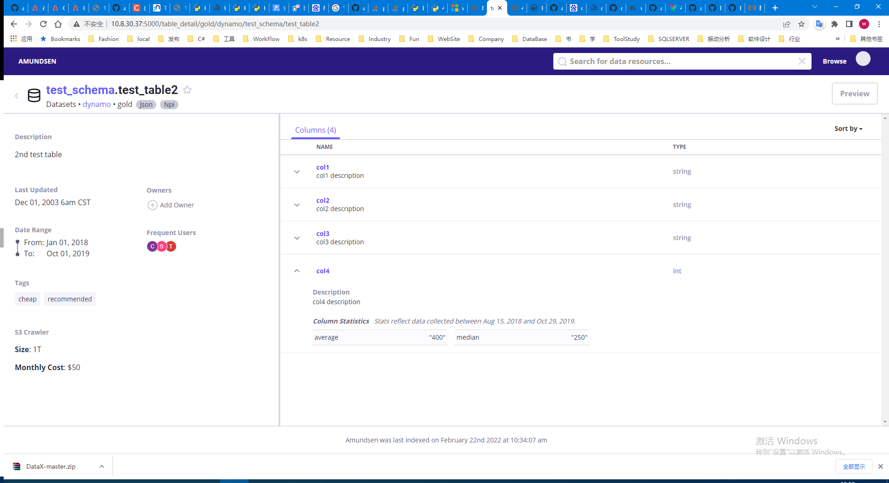
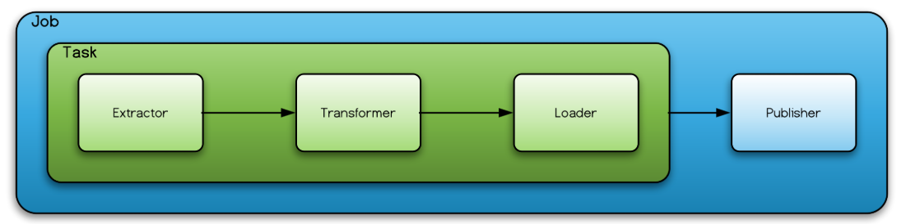
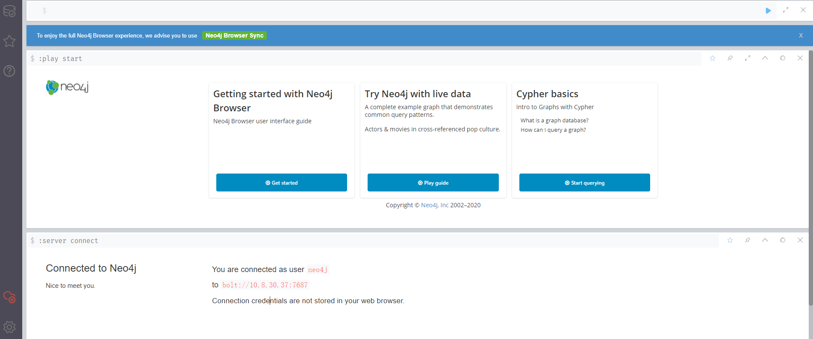
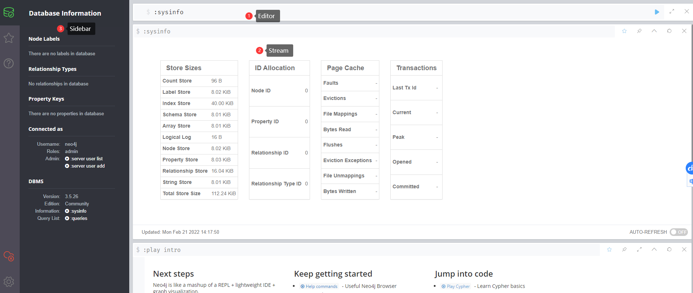
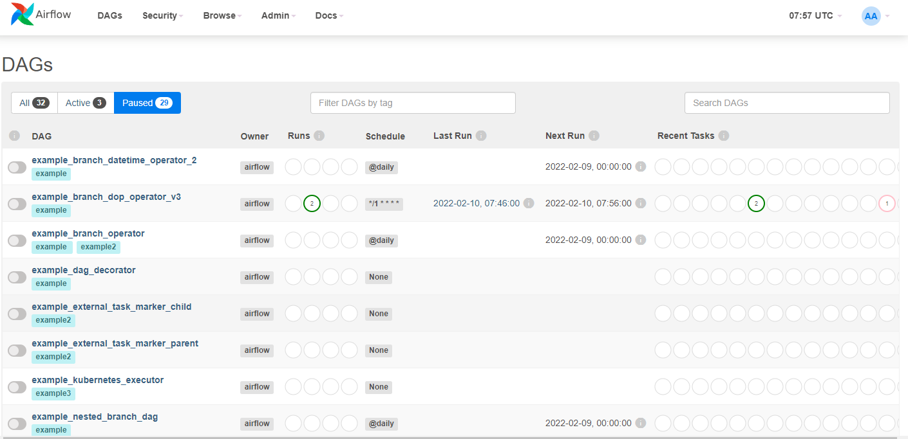
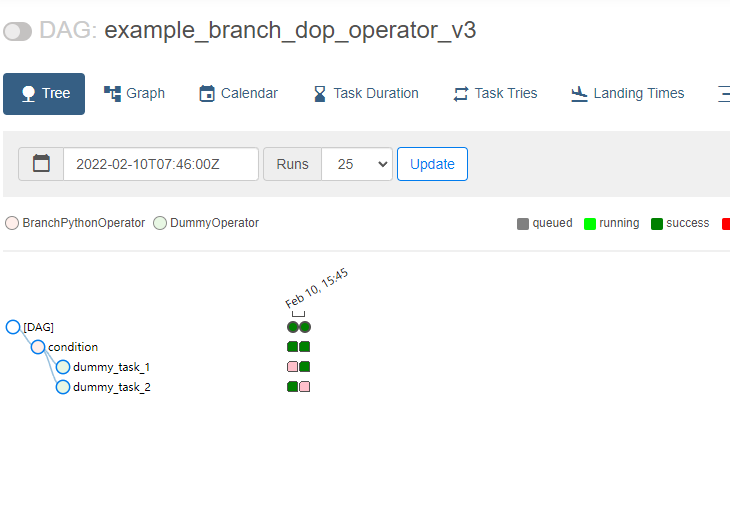
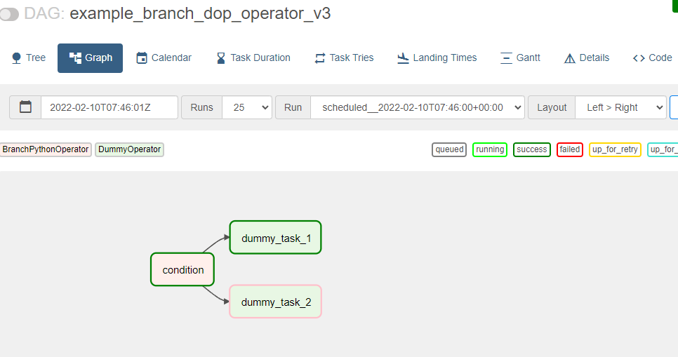
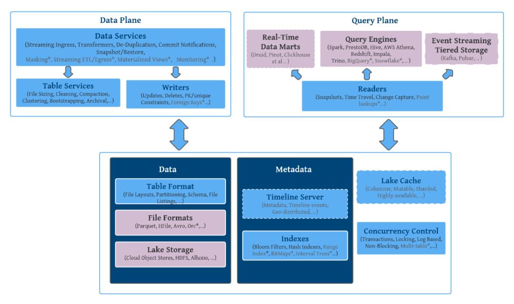
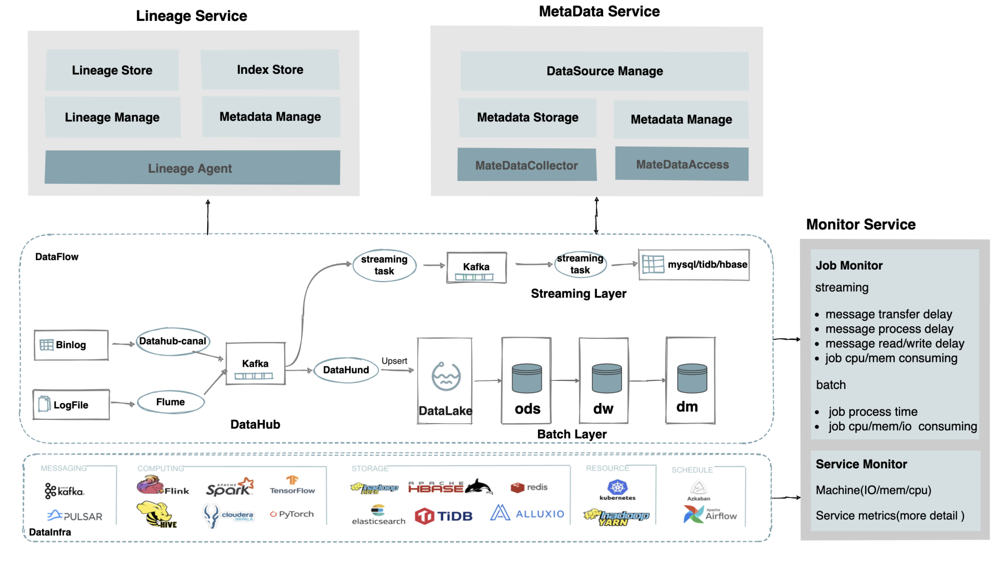

**数据治理技术预研**	


数据目录，它是数据湖中所有[大数据的目录。](https://www.oracle.com/big-data/guide/what-is-big-data.html)通过将元数据应用于数据湖中的所有内容，数据发现和治理变得更加容易。通过将元数据和分层逻辑应用于传入数据，数据集接收必须要的上下文和可跟踪的血缘关系，以便在工作流中有效使用。数据源像一条条小溪，最终将数据倾倒入数据湖中，如果缺乏数据目录的组织级别，最终数据湖会变成数据沼泽。


[Datahub VS Atlas VS Amundsen](https://cloud.tencent.com/developer/article/1746714)

| 搜索                        | 推荐 | 表描述 | 数据预览 | 列统计 | 占用指标 | 权限 | 排名 | 数据血统 | 改变通知 | 开源 | 文档 | 支持数据源 |                                                       |
| :-------------------------- | :--- | :----- | :------- | :----- | :------- | :--- | :--- | :------- | :------- | :--- | :--- | :--------- | ----------------------------------------------------- |
| Amundsen (Lyft)             | ✔    | ✔      | ✔        | ✔      | ✔        |      | ✔    | ✔        | Todo     | ✔    | ✔    | ✔          | Hive, Redshift, Druid, RDBMS, Presto, Snowflake, etc. |
| Datahub (LinkedIn)          | ✔    |        | ✔        |        |          |      | ✔    | ✔        | ✔        | ✔    | ✔    | ✔          | Hive, Kafka, RDBMS                                    |
| Metacat (Netflix)           | ✔    |        | ✔        |        | ✔        | ✔    |      | Todo     |          | Todo | ✔    |            | Hive, RDS, Teradata, Redshift, S3, Cassandra          |
| Atlas (Apache)              | ✔    |        | ✔        |        |          |      |      |          | ✔        | ✔    | ✔    | ✔          | HBase, Hive, Sqoop, Kafka, Storm                      |
| Marquez (Wework）           | ✔    |        | ✔        |        |          |      |      |          | ✔        |      | ✔    |            | S3, Kafka                                             |
| Databook (Uber)             | ✔    |        | ✔        | ✔      | ✔        |      |      |          | ✔        |      |      |            | Hive, Vertica, MySQL, Postgress, Cassandra            |
| Dataportal (Airbnb)         | ✔    |        | ✔        |        | ✔        |      | ✔    | ✔        |          |      |      |            | Unknown                                               |
| Data Access Layer (Twitter) | ✔    |        | ✔        |        |          |      |      |          | ✔        |      |      |            | HDFS, Vertica, MySQL                                  |
| Lexikon (Spotify)           | ✔    | ✔      | ✔        |        |          |      | ✔    | ✔        |          |      |      |            | Unknown                                               |

## DataHub

[官网入门](https://datahubproject.io/docs/quickstart/)

https://github.com/linkedin/datahub :star:4.7k

DataHub 是一个现代数据目录，旨在支持端到端数据发现、数据可观察性和数据治理。这个可扩展的元数据平台是为开发人员构建的，让他们可以适应快速变革的数据生态系统的复杂性，并让数据从业者在其组织内利用数据的全部价值。


### 安装

python3

```shell
# ubuntu中已经预装python和python3
# 执行python3 -m pip 提示 pip模块找不到
sudo apt-get install python3-pip
```


docker-compose

参考:https://blog.csdn.net/pushiqiang/article/details/78682323

```shell
sudo curl -L "https://github.com/docker/compose/releases/download/1.29.1/docker-compose-$(uname -s)-$(uname -m)" -o /usr/local/bin/docker-compose

sudo chmod +x /usr/local/bin/docker-compose

```


安装DataHub CLI

```sh
python3 -m pip install --upgrade pip wheel setuptools
python3 -m pip uninstall datahub acryl-datahub || true  # sanity check - ok if it fails
python3 -m pip install --upgrade acryl-datahub
datahub version # 或 python3 -m datahub version

```


执行quick-start

```sh
datahub docker quickstart
```


@TODO 启动失败


## Amundsen

https://www.amundsen.io/amundsen/

https://github.com/amundsen-io/amundsen :star:3k

Amundsen 是一个数据发现和元数据引擎，用于提高数据分析师、数据科学家和工程师在与数据交互时的工作效率。


Amundsen的架构：

前端：基于Flask的web应用侧，展示层基于React with Redux, Bootstrap, Webpack, and Babel.

搜索：基于ElasticSearch并提供RESTful API进行搜索服务。搜索索引基于Databuilder elasticsearch publisher.

元数据：使用Neo4j代理与Neo4j图形数据库交互，提供元数据服务。Amundsen中的元数据模型如下图：

DataBuilder: 提供数据摄取库构建元数据。


Quick Start:

准备阶段，安装python>=3.7

```sh
# python > 3.7
sudo apt update
sudo apt-get install zlib1g-dev libbz2-dev libssl-dev libncurses5-dev libsqlite3-dev libreadline-dev tk-dev libgdbm-dev libdb-dev libpcap-dev xz-utils libexpat1-dev liblzma-dev libffi-dev libc6-dev
# download https://www.python.org/ftp/python/3.9.10/
sudo mkdir -p /usr/local/python3 #建立安装目录

##编译安装
#后面加上 --enable-optimizations 会自动安装pip3及优化配置
./configure --prefix=/usr/local/python3  --enable-optimizations
make
sudo make install

sudo rm -rf /usr/bin/python3
sudo rm -rf /usr/bin/pip3

#添加python3的软链接
sudo ln -s /usr/local/python3/bin/python3.9 /usr/bin/python3
#添加 pip3 的软链接
sudo ln -s /usr/local/python3/bin/pip3.9 /usr/bin/pip3

# 检查版本
python3 -V
pip3 -V
```

运行官方示例

```sh
$ git clone --recursive https://github.com/amundsen-io/amundsen.git
# For Neo4j Backend
$ docker-compose -f docker-amundsen.yml up

# For Atlas
$ docker-compose -f docker-amundsen-atlas.yml up

# 导入样本数据到Neo4j
cd databuilder

apt-get install python3-venv
pip install -i https://pypi.tuna.tsinghua.edu.cn/simple/ --upgrade setuptools

python3 -m venv venv
source venv/bin/activate
pip3 install --upgrade pip
pip3 install -i https://pypi.tuna.tsinghua.edu.cn/simple/ -r requirements.txt

# maybe you need upgrade setuptools
pip3.4 install --upgrade setuptools

python3 setup.py install
python3 example/scripts/sample_data_loader.py

```

最终通过在docker中运行成功：

```sh
docker run -it -v /home/anxin/amundsen-main:/data python:3.7.12-bullseye /bin/bash
```




### Databuilder

客户端通过Job启动ETL任务，包括task和publisher。

其中task控制Extractor、Transformer、Loader组件，实现Amundsen的ETL流程。



#### [Extractor](https://github.com/amundsen-io/amundsen/tree/main/databuilder/databuilder/extractor "Extractor")

An extractor extracts records from the source. This does not necessarily mean that it only supports [pull pattern](https://blogs.sap.com/2013/12/09/to-push-or-pull-that-is-the-question/ "pull pattern") in ETL. For example, extracting records from messaging bus makes it a push pattern in ETL.

导出器，不仅仅包含拉取模式，例如消息总线中推送过来的消息。

内置了哪些导出器：

DBAPIExtractor 数据库导出

Generic 通用导出

HiveTableLastUpdated  导出最近更新的Hive metastore

HiveTableMetadata 导出Hive metadata

Cassandra 导出apache cassandra数据库metastore

Glue 导出 AWS Glue metastore

Delta-Lake-MetadataExtractor 运行在spark上面，使用Spark sql导出delta-lake 元数据

PostgresMetadataExtractor 导出Postgres或Redshift数据库的表列元数据，包括数据库、架构、表名、表描述、列名、列描述。

RestAPIExtractor  通过构造RESTAPI查询导出数据 [RestAPIQuery](#rest-api-query)。

ElasticsearchMetadataExtractor 导出ES索引的元数据

其他：Neo4j/Altas/BigQuery/Snowflake/Databricks/Superset

#### [Transformer](https://github.com/amundsen-io/amundsen/tree/main/databuilder/databuilder/transformer "Transformer")

A transformer takes a record from either an extractor or from other transformers (via ChainedTransformer) to transform the record.

转换器，处理从Extractor或另一个Transformer中过来的消息。

#### [Loader](https://github.com/amundsen-io/amundsen/tree/main/databuilder/databuilder/loader "Loader")

A loader takes a record from a transformer or from an extractor directly and loads it to a sink, or a staging area. As the loading operates at a record-level, it's not capable of supporting atomicity.

加载到Sink、或者一个输出区域*(staging area).

#### [Task](https://github.com/amundsen-io/amundsen/tree/main/databuilder/databuilder/task "Task")

A task orchestrates an extractor, a transformer, and a loader to perform a record-level operation.

Task调度ETL组件 ，执行记录级别操作

#### [Record](https://github.com/amundsen-io/amundsen/tree/main/databuilder/databuilder/models "Record")

A record is represented by one of [models](https://github.com/amundsen-io/amundsen/tree/main/databuilder/databuilder/models "models").

代表一条模型

#### [Publisher](https://github.com/amundsen-io/amundsen/tree/main/databuilder/databuilder/publisher "Publisher")

A publisher is an optional component. Its common usage is to support atomicity in job level and/or to easily support bulk load into the sink.

publisher是可选组件，支持job级别的自动化或者简单支持批量加载到Sink。

#### [Job](https://github.com/amundsen-io/amundsen/tree/main/databuilder/databuilder/job "Job")

A job is the highest level component in Databuilder, and it orchestrates a task and, if any, a publisher.

Job是Databuilder中层级最高的组件，包括task或publisher。

#### [Model](docs/models.md)

Models are abstractions representing the domain.

Model（模型）是领域代表的抽象

### Neo4j

[Neo4j](https://baike.baidu.com/item/Neo4j)是一个高性能的,NOSQL图形数据库。

在docker-compose中启动：

```yaml
  neo4j:
      image: neo4j:3.5.26
      container_name: neo4j_amundsen
      environment:
        - NEO4J_AUTH=neo4j/test
      ulimits:
        nofile:
        # 限制打开的文件数
          soft: 40000
          hard: 40000
      ports:
          - 7474:7474
          - 7687:7687
      volumes:
          - ./example/docker/neo4j/conf:/var/lib/neo4j/conf
          - ./example/docker/neo4j/plugins:/var/lib/neo4j/plugins
          - ./example/backup:/backup
          - neo4j_data:/data
      networks:
        - amundsennet
```






## Atlas

https://atlas.apache.org/

https://github.com/apache/atlas :star:1.2k

Atlas是一组可扩展的核心基础治理服务，为组织提供开放的元数据管理和治理功能，以构建其数据资产的目录，对这些资产进行分类和治理，并为数据科学家、分析师和数据治理团队提供围绕这些数据资产的协作能力。

- 能够动态创建分类 - 如 PII、EXPIRES_ON、DATA_QUALITY、SENSITIVE
- 集成多重 Hadoop 和非 Hadoop 元数据的预定义类型
- 血统：直观的 UI，可在数据通过各种流程时查看数据沿袭
- 搜索发现：可按类型、分类、属性值或自由文本搜索实体，并支持DSL查询
- 安全：与Apache Ranger集成，支持按分类对数据访问进行授权/数据屏蔽


## Ranger

https://ranger.apache.org/quick_start_guide.html

https://github.com/apache/ranger  :star:582

Apache Ranger™ is a framework to enable, monitor and manage comprehensive data security across the Hadoop platform.


## DataX

DataX是阿里云DataWorks数据集成的开源版本。离线数据同步工具/平台。

> 链接：
>
> 阿里云大数据开发治理平台 [DataWorks](https://www.aliyun.com/product/bigdata/ide)
>
> [DataX3.0介绍](https://github.com/alibaba/DataX/blob/master/introduction.md)

架构： Job > 切分Task> 划分TaskGroup > 执行Task (Read+Channel+Writer)

快速使用：

下载：http://datax-opensource.oss-cn-hangzhou.aliyuncs.com/datax.tar.gz

配置：

```sh
# 查看对应模板
$ python datax.py -r streamreader -w streamwriter
# 保存模板并修改，滞后执行
$ python datax.py ./stream2stream.json 
```


[DataX WEB UI](https://github.com/WeiYe-Jing/datax-web)

任务管理和调度、WEB构建DataX Json、WEB实时日志、运行参数配置等


以下信息摘抄自 Oracle Big Data Blog

## [数据湖安全](https://blogs.oracle.com/bigdata/post/6-ways-to-improve-data-lake-security)

1. 建立治理：为所有的数据构建数据湖。作为原始和非结构化数据的存储库，它可以从任何来源提取几乎任何东西。要了解如何管理、处理和使用这些数据，避免形成数据沼泽。通过治理，可以识别所有权、敏感数据的安全规则、数据历史、数据血缘

2. 访问：建立不同级别的用户访问权限

3. 使用机器学习： 一些数据湖平台带有内置的机器学习 (ML) 功能。机器学习的使用可以通过加速原始数据处理和分类来显着降低安全风险

4. 分区和层次结构：当数据被摄取到数据湖中时，将其存储在适当的分区中很重要。在《数据湖最佳实践》中包括原始区、生产区、工作区和敏感区。这里从不同维度划分：时间、原始（原始，包含对敏感的加密后）、受信任（便于用户-科学家、分析师等轻松访问）、精炼（最终输出）

5. 数据生命周期：淘汰陈旧数据，甚至通过ML实现自动实现数据的冷热切换，最大化资源利用率

6. 数据加密：加密对数据安全至关重要，尤其敏感数据


## Oracle大数据湖服务集成工具

1. ML
2. 数据目录
3. Analytics 集成的数据分析工具
4. Graph Analytics 集成的图形分析工具


## Qubole

用于分析，人工智能，机器学习的云原生平台。


集成的组件：Spark/Presto/Hive/Quantum/Airflow(工作流ETL)

任何数据湖设计都应包含元数据存储策略，以使业务用户能够搜索、定位和了解湖中可用的数据集。

+ 可以强制创建元数据

+ 自动创建元数据

+ 允许搜索元数据的数据目录

+ 访问和挖掘（Access and Mining）:读取模式

  + Schema on Write -> Schema on Read

+ 数据处理

  + 组合连接不同的数据集

  + Denormalization 反范式化

    > 题外：例如将用户和用户地址表join'存储就属于反范式化设计；范式化虽然节省存储空间、简化更新，但反范式化方便查询。 提升数据库性能的手段就可以包括：索引、物化视图、缓存、反范式化

  + Cleansing, deduplication, householding。清洗、去重、家计

  + 派生计算数据字段

**数据湖平台应提供：**

- 多种数据处理引擎选项，例如 Spark、Hadoop/Hive、Presto 等。这对于支持广泛的用例至关重要。
- 一个基于开放标准的 Metastore，例如 Hive，然后可以从 Hive、Presto 和 Spark SQL 中使用
- 与 AWS Glue 的目录集成。
- 支持可用于从元数据中获取有用信息的 AIR（警报、见解和建议）
- 支持 Kafka Schema 注册表（用于流数据集）。
- 数据仓库解决方案的连接器，例如 Snowflake、Redshift、BigQuery、Azure SQL 数据库等。
- MySQL、Oracle、MongoDB、Vertica、SQL Server 等流行商业数据库的连接器。
- 无服务器计算选项（例如 Presto）可以经济高效地满足交互式查询要求。
- 基于浏览器的统一 UI 供分析师运行查询。
- 用于从 BI 工具（如 Tableau、Looker、Click View、SuperSet、Redash 等）进行查询的 JDBC/ODBC 驱动程序。
- 适用于数据科学家和分析师的 Jupyter/Zeppelin notebook。
- 适用于 Python 和 R 的基于 UI 的数据科学包管理。


## AirFlow

工作流管理平台（Python）

[官网](https://airflow.apache.org/) 、[入门概念](https://www.modb.pro/db/106690)

实操Shell (docker-compose quick-start)

```shell
curl -LfO 'https://airflow.apache.org/docs/apache-airflow/2.2.3/docker-compose.yaml'

# 设置文件夹权限；docker-compose mount dirs
mkdir -p ./dags ./logs ./plugins
echo -e "AIRFLOW_UID=$(id -u)" > .env

# 初始化数据库
docker-compose up airflow-init

# 清理环境；清理目录
# docker-compose down --volumes --remove-orphans

# 启动AirFlow
docker-compose up

```

quick-start中的模块：

- `airflow-scheduler` - The [scheduler](https://airflow.apache.org/docs/apache-airflow/stable/concepts/scheduler.html) monitors all tasks and DAGs, then triggers the task instances once their dependencies are complete.
- `airflow-webserver` - The webserver is available at `http://localhost:8080`.
- `airflow-worker` - The worker that executes the tasks given by the scheduler.
- `airflow-init` - The initialization service.
- `flower` - [The flower app](https://flower.readthedocs.io/en/latest/) for monitoring the environment. It is available at `http://localhost:5555`.
- `postgres` - The database.
- `redis` - [The redis](https://redis.io/) - broker that forwards messages from scheduler to worker.

通过CLI访问：

```shell
docker-compose run airflow-worker airflow info
# 或者
curl -LfO 'https://airflow.apache.org/docs/apache-airflow/2.2.3/airflow.sh'
chmod +x airflow.sh
./airflow.sh info # 显示airflow服务信息
./airflow.sh bash # 进入容器bash
./airflow.sh python # 进入python控制台
```


启动浏览器访问：http://localhost:8080 用户密码 `airflow`

DAG查看界面：



分别以树形和图

 

 

## [大数据处理中的Lambda架构和Kappa架构](https://www.cnblogs.com/xiaodf/p/11642555.html)

+ 数据采集

将应用程序产生的数据和日志等同步到大数据系统中，由于数据源不同，这里的数据同步系统实际上是多个相关系统的组合。数据库同步通常用 Sqoop （目前项目退休，使用spark或flink替代），日志同步可以选择 Flume，打点采集的数据经过格式化转换后通过 Kafka 等消息队列进行传递。

+ 数据处理

这部分是大数据存储与计算的核心，数据同步系统导入的数据存储在 HDFS。MapReduce、Hive、Spark 等计算任务读取 HDFS 上的数据进行计算，再将计算结果写入 HDFS。

+ 数据输出与展示

大数据计算产生的数据还是写入到 HDFS 中，但应用程序不可能到 HDFS 中读取数据，所以必须要将 HDFS 中的数据导出到数据库中。


Lambda架构：


Lambda架构(Lambda Architecture),总共由三层系统组成：

批处理层（Batch Layer），速度处理层（Speed Layer）以及响应查询的服务层（Serving Layer）。

Kappa架构：

以kafka为例说明：


去掉了批处理层，仅保留了速度层。实现流批一体

以下为其他内容补充

## Hudi Pk Iceberg

[Hudi设计和架构解读](https://www.cnblogs.com/leesf456/p/12710118.html)

[新一代流式数据湖平台](https://www.infoq.cn/article/08t12zv6ev9spxalpklq)



**网易严选Iceberg应用实践**



Datahub-canal: 主要用途是基于 MySQL 数据库增量日志解析，提供增量数据订阅和消费。 

Flune: Apache Flume是一个分布式、可靠及可用的服务，用于有效地收集、聚合和移动大量日志数据。

DataLake 数据湖

ODS（Operational Data Store）运营数据存储. 面向主题的、集成的、可更新的、当前或接近当前的。
DW（Data Warehouse）数据仓储
DM（Data Market）数据集市


## Schema Registry

>【[Github](https://github.com/confluentinc/schema-registry)】Confluent Schema Registry provides a serving layer for your metadata. It provides a RESTful interface for storing and retrieving your Avro®, JSON Schema, and Protobuf schemas. It stores a versioned history of all schemas based on a specified subject name strategy, provides multiple compatibility settings and allows evolution of schemas according to the configured compatibility settings and expanded support for these schema types. It provides serializers that plug into Apache Kafka® clients that handle schema storage and retrieval for Kafka messages that are sent in any of the supported formats.


[博文](https://www.cnblogs.com/emqx/p/11547881.html)中介绍了EMQ X企业版中Schema Registry功能，处理各类编解码协议。


Schema Registry和Rule Engine在EMQX中的应用：

