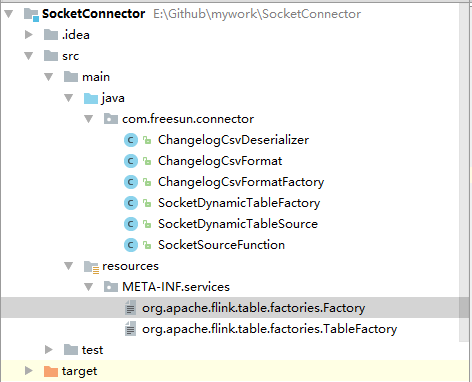

## 用户自定义的Source和Sink

+ 元数据
+ 计划 
+ 运行时

扩展方法:

继承 `org.apache.flink.table.factories.DynamicTableSourceFactory`可以实现构造一个`DynamicTableSource`. 在 JAR 文件中，可以将对新实现的引用添加到服务文件中：META-INF/services/org.apache.flink.table.factories.Factory

+ ScanTableSource 在运行时扫描来自外部存储系统的所有行

+ LookupTableSource 在运行时通过一个或多个键查找外部存储系统中的行

### 示例

socket 支持insert/delete的SQL连接器. 

`SocketDynamicTableFactory` table工厂，参数解析，标签名称'socket'
`SocketDynamicTableSource`  继承ScanTableSource,并对SocketSourceFunction进行调用
`SocketSourceFunction`  socket连接管理，读取分割和解析

`ChangelogCsvFormatFactory`  csv-changelog格式工厂

`ChangelogCsvDeserializer` csv反序列化
`ChangelogCsvFormat ` csv格式

> 两个工厂类需要加入到 META-INF.services中Factory中。

