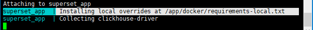
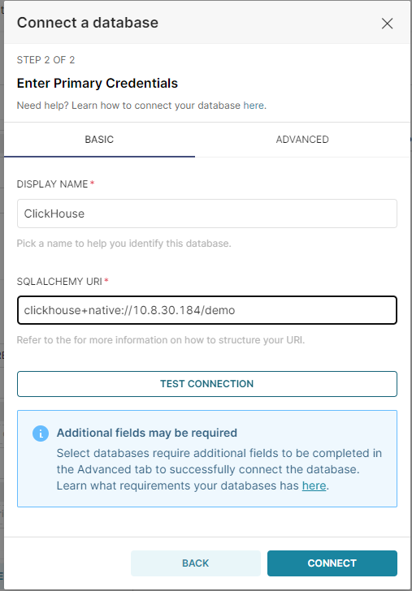

### Docker-Compose启动[[GO](https://superset.apache.org/docs/installation/installing-superset-using-docker-compose)]

```sh
git clone https://github.com/apache/superset.git
```

https://github.com/apache/superset/tree/master/docker#readme

配置文件`docker/.env-non-dev`。其中`SUPERSET_LOAD_EXAMPLES` 标识是否在`superset_init` 加载负载数据实例（加载过程比较消耗`cpu`时间).

> docker-compose中组成:
>
> + redis 
> + db
> + superset
> + superset-init 初始化数据库脚本和用户、角色
> + superset-worker
> + superset-worker-beat


```shell
# 清理之前安装环境
#docker rm -f $(docker ps -a -q)
#docker volume rm $(docker volume ls -q)

#按官网步骤尝试不行 
#docker-compose -f docker-compose-non-dev.yml down -v --remove-orphans
#docker-compose -f docker-compose-non-dev.yml pull
#docker-compose -f docker-compose-non-dev.yml up

# 最终 修改docker/.env-non-dev环境指向现有数据库（需提前建立superset名的数据库）和现有redis
# 分别启动docker-compose下的组件
docker-compose up superset-init # 初始化数据库
docker-compose up superset # 启动服务
```


访问：http://10.8.30.184:8088/  admin/admin

>  功能菜单：
>
> + HOME
>
> + Dashboards 面板
>
> + Charts 图表
>
> + SQL Lab
>   + SQL Editor SQL编辑器
>   + Saved queries 保存的查询
>   + Query History 查询历史
> + Data
>   + Databases 数据库
>     + Upload CSV to database 上传CSV文件
>     + Upload columnar file to database
>     + Upload Excel file to database 上传Excel文件
>   + Datasets 数据集


问题记录

> https://github.com/apache/superset/issues/11612
>
> I share the following in hopes that my struggle will help someone else. After battling with this issue for over an hour, I was able to get past the error described in this issue by doing the following:
>
> 1. In a terminal window run `docker-compose up`
> 2. Once running, open the browser and observe the error described in this issue.
> 3. In a separate terminal window run `docker-compose down -v --remove-orphans`
> 4. Wait for both docker-compose processes to terminate.
> 5. In the original terminal window run `docker-compose pull` and then `docker-compose up --force-recreate --build`
>
> At this point, I could access the login screen at `http://localhost:8088`, but I could not login with the admin user. I shut down the instance (I don't recall how, most likely `docker-compose down` or `docker-compose down -v --remove-orphans`) and called it a day.
>
> Today, running `docker-compose up` creates an instance that I can access with admin/admin.
>
> p.s. 查找文档中内容命令
>
> ```
> grep -Ril "text-to-find-here" /
> ```


### 安装数据库驱动[[Go](https://superset.apache.org/docs/databases/installing-database-drivers/)]

可以安装Python DB-API数据库驱动引擎，来适配更多的数据库和数据库方言。


| [lickHouse](https://superset.apache.org/docs/databases/clickhouse) | `pip install clickhouse-driver==0.2.0 && pip install clickhouse-sqlalchemy==0.1.6` | `clickhouse+native://{username}:{password}@{hostname}:{port}/{database}` |
| ------------------------------------------------------------ | ------------------------------------------------------------ | ------------------------------------------------------------ |
|                                                              |                                                              |                                                              |


```sh
touch ./docker/requirements-local.txt
echo "clickhouse-driver" >> ./docker/requirements-local.txt
echo "clickhouse-sqlalchemy" >> ./docker/requirements-local.txt
#docker-compose build --force-rm
docker-compose -f docker-compose-nondev.yml up superset
```




clickhouse+native://10.8.30.184/demo




连接成功