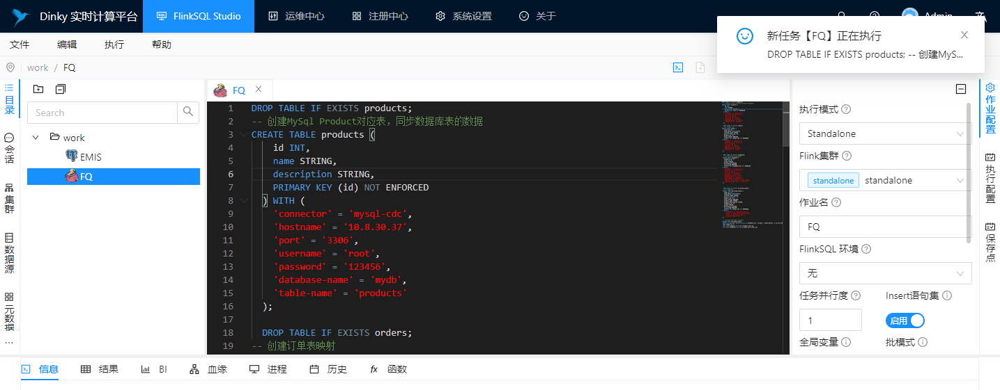
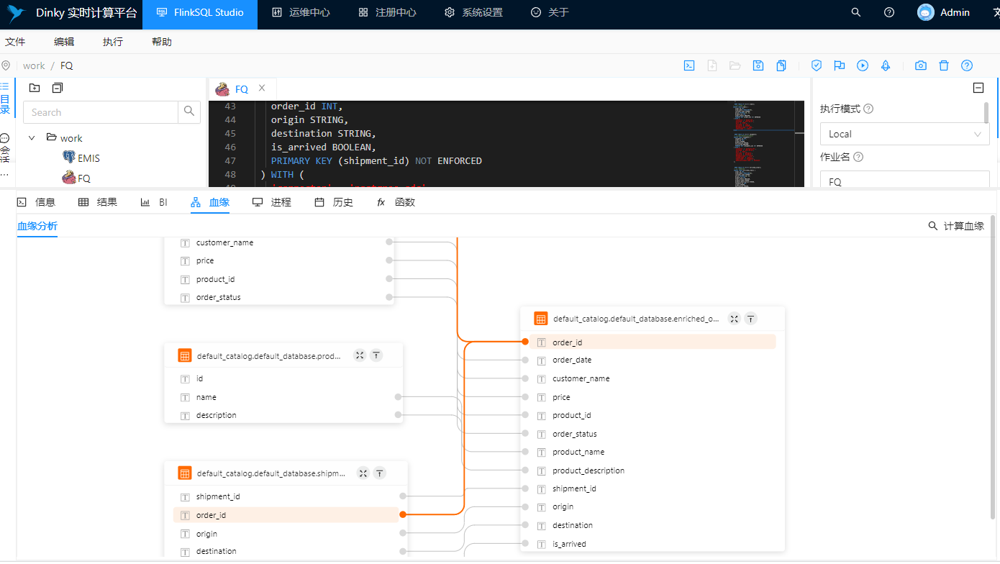
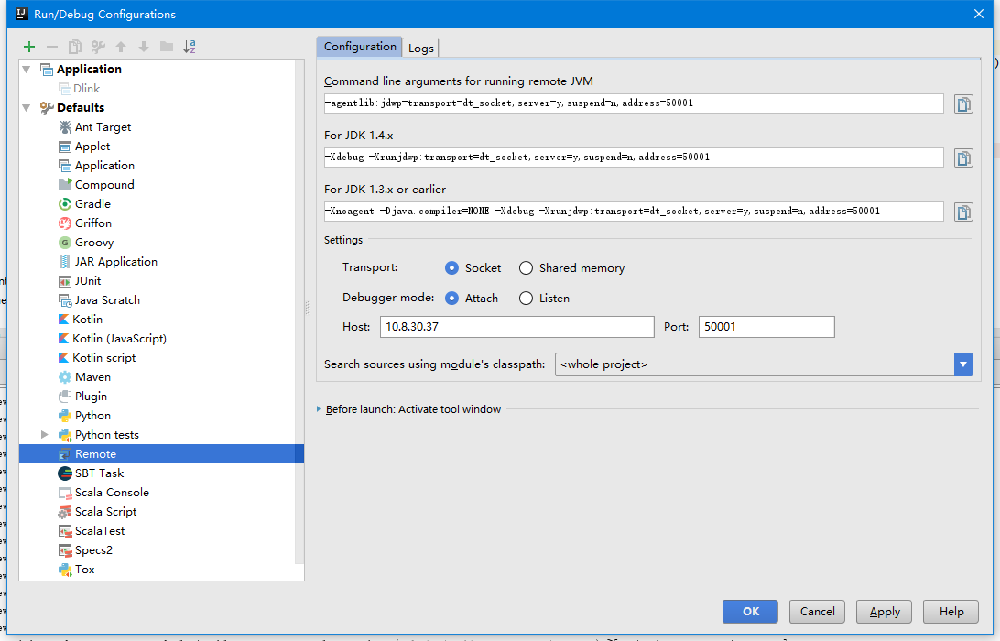
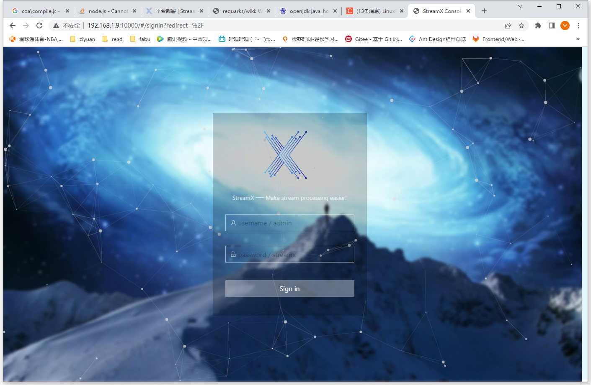
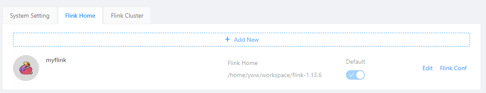
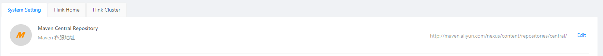
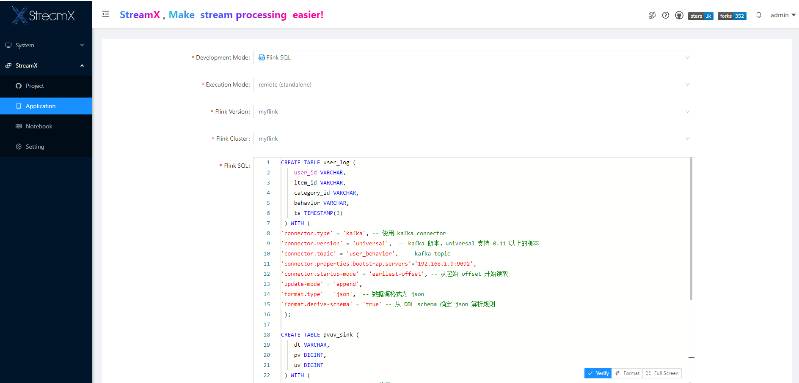
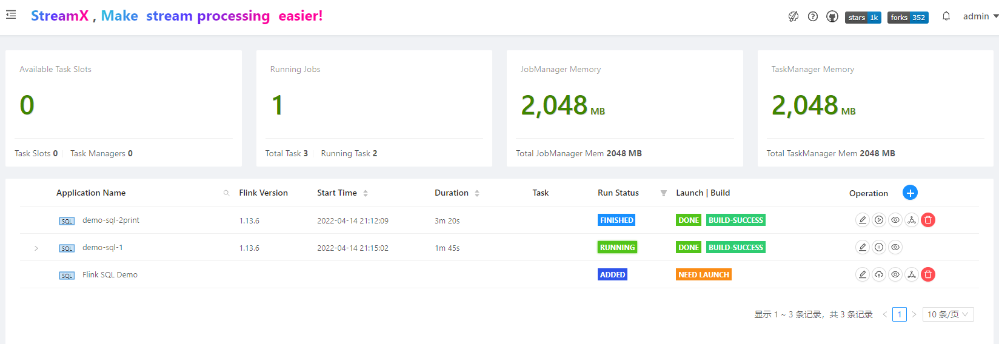
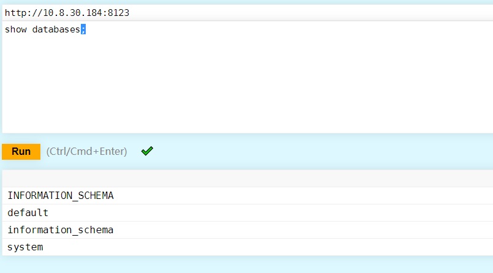
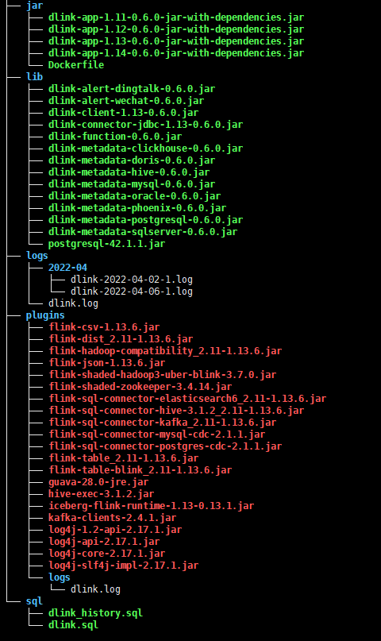

## DLink

**Dlink ** 是一款FlinkSQL交互式开发平台。Github:https://github.com/DataLinkDC/dlink.

`开箱即用` 、`易扩展` 的 `一站式` 实时计算平台，以 `Apache Flink` 为基础，连接 `OLAP` 和 `数据湖` 等众多框架，致力于 `流批一体` 和 `湖仓一体` 的建设与实践。

安装：https://github.com/DataLinkDC/dlink/blob/dev/docs/zh-CN/quick_start/deploy.md

环境版本记录：`2022.04.02`

| 测试机                           | 10.8.30.37 |
| -------------------------------- | ---------- |
| FLINK_HOME                       | 1.13.6     |
| HADOOP_HOME                      | 3.1.1      |
| doris                            | 0.15.0     |
| DLink                            | 0.6.0      |
| flink-sql-connector-postgres-cdc | 2.1.1      |
| flink-doris-connector            | 1.13       |
|                                  |            |

*测试器机：node37； dlink_home: /home/anxin/dlink-release-0.6.0*

> 用作我司数据中台平台，todo改造
>
> + 目前是flink on yarn的运行方式，需要支持k8s

 

## Dlink实操

> 最终执行任务提交时失败，最终切换到 StreamX

### 安装运行

解压运行

> `sh auto.sh start`执行报错的话，执行
>
> java -Dloader.path=./lib,./plugins -Ddruid.mysql.usePingMethod=false -jar -Xms512M -Xmx2048M -XX:PermSize=512M -XX:MaxPermSize=1024M "./dlink-admin-0.6.0.jar"


Jar包准备：

> 1. Postgres数据库驱动postgresql-42.1.1.jar，安装到 $DLINK_HOME/lib
> 2. 插件包安装到 $DLINK_HOME/plugins 。具体参考 [附录](#附录)
> 3. 注意：flink-shaded-hadoop-3-uber.jar 需要将jar中javax/srvlet文件夹删除


### 运行截图

首先在 注册中心>添加集群实例

执行SQL：



数据血缘：




### 运行SQL

报错：

解决方式：

1. 类加载顺序问题，flink默认是child-first，在flink的flink-conf.yaml文件中添加`classloader.resolve-order: parent-first` 改成parent-first，重启集群即可。（https://github.com/ververica/flink-cdc-connectors/discussions/644） 【未解决】
2. 


### 远程调试

https://mp.weixin.qq.com/s/1MwJ6cJZmVWWzMk3z_ETKQ

启动命令中添加 

```sh
java -Dloader.path=./lib,./plugins -Ddruid.mysql.usePingMethod=false -Xdebug -Xrunjdwp:transport=dt_socket,server=y,suspend=n,address=50001 -jar -Xms512M -Xmx2048M -XX:PermSize=512M -XX:MaxPermSize=1024M "./dlink-admin-0.6.0.jar"
```


IDEA中设置



启动后即可在代码中进行debug：


## StreamX

StreamX V.S. DLink

| StreamX                               | DLink                               | FlinkX                             |
| ------------------------------------- | ----------------------------------- | ---------------------------------- |
| https://github.com/streamxhub/streamx | https://github.com/DataLinkDC/dlink | https://github.com/DTStack/chunjun |
| starts 1k                             | 700                                 | 2.9k                               |
|                                       |                                     |                                    |

> 首先是 StreamX，它定义为 Make Spark|Flink easier ，即使 Spark 和 Flink 的开发和应用更加便捷，与近期较火的 SeaTunnel 较为相似，均是架构与 Spark 和 Flink 之上，其区别是 StreamX 更偏重于 Flink 的支持，Spark 的支持还在孵化，此外StreamX 提供 Yarn 和 K8S 的 Application 部署模式的 Jar 任务和 FlinkSQL 任务定义及运维，其更适合作为久驻的 Flink 流任务的运维，而 SeaTunnel 则更专注于依赖 Spark 的数据同步，2.0 也支持了 Flink 的架构。
>
> 那 Dlink 和他们相比又有什么不同呢？首先，Dlink 更侧重于 FlinkSQL 的开发交互过程，尽管其具备较为齐全的任务提交能力与集群交互能力，但其未进行平台化功能的设计，在平台运维方面功能缺乏；其次 Dlink 的 K8S 起步较晚，由于其敏捷 FlinkSQL 提交的设计增加了部署门槛，目前需要人工提前搭建好需求的镜像才能自动化提交 FlinkSQL，而 StreamX 则可以通过 Flink 任务的定义来自动化部署 K8S 的任务；最后其实现思路与架构设计区别较大，StreamX 使用 Java 和 Scala 的混合开发以及前端更适合开源参与的 Vue 框架，后端门槛较高，Dlink 则完全使用 Java 开发，其前端为更偏企业应用的 Ant Design Pro 的 React 框架，前端门槛较高。
>
> 那二者选择哪个更好呢？其实，他们之间的关系目前并不是互相竞争的关系，两者可以互相协作生产，即 Dlink 负责 FlinkSQL 的开发与调试，StreamX 负责 Flink 任务的运维。然而，在两者的 Roadmap 上却发现，StreamX 将实现 Data Studio 来支撑 FlinkSQL 的开发，而 Dlink 则将实现专门的运维中心来支持任务的运维需求，或许后续两者的应用场景会出现冲突。
>
> 那为什么不融合在一起做强做大呢？因为 Dlink 与 StreamX 在底层 Flink 任务提交的实现完全不同，扩展架构也完全不兼容，导致他们难以融合在一块。不如让其各自发展，或许可以达到更好的效果与成绩。
>
> by dlink作者


环境准备：

down下源码进行编译，环境要求如下

- Maven 3.6+
- npm 7.11.2 ( https://nodejs.org/en/ )
- JDK 1.8+

```sh
# 下载maven 3.8
https://maven.apache.org/download.cgi
mvn -version
mvn clean install -DskipTests

# 升级npm
nvm install 16.14.2
npm install -g npm
>npm -version
8.6.0


npm cache clean --force
npm install 
```

数据库准备：

```sh
# mysql
create database streamx
执行 script/final.sql
```

配置

`conf/application.yml` 中修改数据库地址

```yaml
datasource:
        # 数据源-1，名称为 primary
        primary:
          username: root
          password: 123456
          driver-class-name: com.mysql.cj.jdbc.Driver
          url: jdbc:mysql://10.8.30.37:3306/streamx?useUnicode=true&characterEncoding=UTF-8&useJDBCCompliantTimezoneShift=true&useLegacyDatetimeCode=false&serverTimezone=GMT%2B8

streamx:
  # HADOOP_USER_NAME
  hadoop-user-name: hdfs
  # 本地的工作空间,用于存放项目源码,构建的目录等.
  workspace:
    local: /opt/streamx_workspace
    remote: hdfs:///streamx   # support hdfs:///streamx/ 、 /streamx 、hdfs://host:ip/streamx/

```

启动

```sh
cd streamx-console-service-1.0.0/bin
bash startup.sh
```


通过官方二进制文件安装

http://www.streamxhub.com/docs/user-guide/deployment/

> 必须在linux环境安装



默认密码: **admin / streamx**

设置`flinkhome` `maven私服地址`  `Flink Cluster`






184环境安装位置：

/home/dragon/services/streamx/streamx-console-service-1.2.2

http://10.8.30.184:10000/


### 运行官网sql例子

> 准备本机docker-compose kafka环境。需要在 windows机器中访问ubuntu中的kafka，需要进行如下设置
>
> ```yaml
> version: '3.8'
> services:
> zookeeper:
> image: confluentinc/cp-zookeeper:5.4.0
> env_file: zookeeper/env/docker.env
> hostname: zookeeper
> container_name: zookeeper
> ports:
>       - "2181:2181"
>     volumes:
>       - zkdata2:/var/opt/zookeeper
> 
>   broker:
>     image: confluentinc/cp-kafka:5.4.0
>     env_file: broker/env/docker.env
>     hostname: broker
>     container_name: broker
>     environment:
>       KAFKA_ZOOKEEPER_CONNECT: zookeeper:2181
>       KAFKA_LISTENERS: INTERNAL://0.0.0.0:9092,OUTSIDE://0.0.0.0:9094
>       KAFKA_ADVERTISED_LISTENERS: INTERNAL://192.168.1.9:9092,OUTSIDE://localhost:9094
>       KAFKA_LISTENER_SECURITY_PROTOCOL_MAP: INTERNAL:PLAINTEXT,OUTSIDE:PLAINTEXT
>       KAFKA_INTER_BROKER_LISTENER_NAME: INTERNAL
>     depends_on:
>       - zookeeper
>     ports:
>       - "29092:29092"
>       - "9092:9092"
>     volumes:
>       - broker2:/var/lib/kafka/data/
> ```
>
> 这里的volume后面的数字，是因为kafka重新启动后提示
>
> kafka.common.InconsistentClusterIdException: The Cluster ID YJp5qd4NQF2WCrx1C8aY0w doesn't match stored clusterId Some(VMwp9k2GR_6EHZsMpdAwTA) in meta.properties. The broker is trying to join the wrong cluster. Configured zookeeper.connect may be wrong.
> 	at kafka.server.KafkaServer.startup(KafkaServer.scala:220)
> 	at io.confluent.support.metrics.SupportedServerStartable.startup(SupportedServerStartable.java:114)
>
> 

创建mysql表

```sql
create table test.pvuv_sink
(
	dt varchar(100) null,
	pv bigint null,
	uv bigint null
);
```

创建sql Application



Flink SQL:

```sql
CREATE TABLE user_log (
    user_id VARCHAR,
    item_id VARCHAR,
    category_id VARCHAR,
    behavior VARCHAR,
    ts TIMESTAMP(3)
 ) WITH (
  'connector' = 'kafka',
  'topic' = 'user_behavior',
  'properties.bootstrap.servers' = '192.168.1.9:9092',
  'properties.group.id' = 'testGroup',
  'scan.startup.mode' = 'earliest-offset',
  'value.format' = 'debezium-json',
  'value.debezium-json.ignore-parse-errors' = 'true'
 );

CREATE TABLE pvuv_sink (
    dt VARCHAR,
    pv BIGINT,
    uv BIGINT
 ) WITH (
'connector.type' = 'jdbc', -- 使用 jdbc connector
'connector.url' = 'jdbc:mysql://192.168.1.9:3306/test?createDatabaseIfNotExist=true&useSSL=false', -- jdbc url
'connector.table' = 'pvuv_sink', -- 表名
'connector.username' = 'root', -- 用户名
'connector.password' = 'root', -- 密码
'connector.write.flush.max-rows' = '1' -- 默认 5000 条，为了演示改为 1 条
 );

INSERT INTO pvuv_sink
SELECT
  DATE_FORMAT(ts, 'yyyy-MM-dd HH:00') dt,
  COUNT(*) AS pv,
  COUNT(DISTINCT user_id) AS uv
FROM user_log
GROUP BY DATE_FORMAT(ts, 'yyyy-MM-dd HH:00');
```

Kafka消息

```shell
{"user_id": "543462", "item_id":"1715", "category_id": "1464116", "behavior": "pv", "ts":"2021-02-01T01:00:00Z"}
{"user_id": "662867", "item_id":"2244074","category_id":"1575622","behavior": "pv", "ts":"2021-02-01T01:00:00Z"}
{"user_id": "662867", "item_id":"2244074","category_id":"1575622","behavior": "pv", "ts":"2021-02-01T01:00:00Z"}
{"user_id": "662867", "item_id":"2244074","category_id":"1575622","behavior": "learning flink", "ts":"2021-02-01T01:00:00Z"}
```

maven

```xml
<dependency>
    <groupId>mysql</groupId>
    <artifactId>mysql-connector-java</artifactId>
    <version>5.1.48</version>
</dependency>

<dependency>
    <groupId>org.apache.flink</groupId>
    <artifactId>flink-sql-connector-kafka_2.11</artifactId>
    <version>1.13.6</version>
</dependency>

<dependency>
    <groupId>org.apache.flink</groupId>
    <artifactId>flink-connector-jdbc_2.11</artifactId>
    <version>1.13.6</version>
</dependency>

<dependency>
    <groupId>org.apache.flink</groupId>
    <artifactId>flink-json</artifactId>
    <version>1.13.6</version>
</dependency>
```


点击提交，进入任务列表界面，点击执行：





如果报错，可以进入详细查看


## Doris

[Github](https://github.com/apache/incubator-doris)  [Offical](https://doris.apache.org/installing/compilation.html#developing-mirror-compilation-using-docker-recommended)

baidu开发（原名Palo），一个基于MPP支持交互式SQL查询的OLAP数据仓库。

+ 提供高并发低延迟的查询性能，同事有即席查询的高吞吐量
+ 提供批量加载和实时小批量数据加载
+ 提供高可用性、可靠性、容错和弹性伸缩

### 安装试用

下载源码 https://doris.apache.org/downloads/downloads.html

在ubuntu 20.04.3 LTS上执行 (`184 test`)

```sh
sudo apt install build-essential openjdk-8-jdk maven cmake byacc flex automake libtool-bin bison binutils-dev libiberty-dev zip unzip libncurses5-dev curl git ninja-build python
sudo add-apt-repository ppa:ubuntu-toolchain-r/ppa
sudo apt update
sudo apt install gcc-10 g++-10
sudo apt-get install autoconf automake libtool autopoint

# 设置JAVA HOME ...

# 编译doris
bash ./build.sh

# 这里构建会现在很多github上的库宝
# 在ubuntu上设置网络代理超简单，只需要执行：export http_proxy="10.8.30.183:7890"


export http_proxy=""
apt  install protobuf-compiler

# 重新安装需要删除 thirdparty/installed目录

# 这个方式安装最终还是报错了
# 参考下节：使用docker编译
```

通过docker安装 【[ref](https://doris.apache.org/installing/compilation.html#developing-mirror-compilation-using-docker-recommended)】

```sh
docker run --rm -v /home/dragon/services/doris/docker/docker2:/root/workspace -v /root/.m2:/root/.m2 -it apache/incubator-doris:build-env-for-0.15.0

sh build.sh --clean --be --fe --ui
```


Doris是通过MySQL协议通信的，可以用MySQL客户端连接其：

```sh
mysql -h FE_HOST -P9030 -uroot
# 任意FE node地址  fe.conf->query_port 
SET PASSWORD FOR 'root' = PASSWORD('your_password');

create database emis;
# GRANT ALL ON example_db TO test;

show databases;
show tables;
DESC table;

```

简单分区和复杂分区的例子：

**Single partition**

```sql
CREATE TABLE table1
(
    siteid INT DEFAULT '10',
    citycode SMALLINT,
    username VARCHAR(32) DEFAULT '',
    pv BIGINT SUM DEFAULT '0'
)
AGGREGATE KEY(siteid, citycode, username)
DISTRIBUTED BY HASH(siteid) BUCKETS 10
PROPERTIES("replication_num" = "1");
```

pv列会通过内部聚集形成索引列. 数据根据`siteid`的Hash值分布存储到10个`桶`中。

**Composite partition**

如下按照数据时间范围创建了3个分区，每个分区分布10个buckets存储。

```sql
CREATE TABLE table2
(
    event_day DATE,
    siteid INT DEFAULT '10',
    citycode SMALLINT,
    username VARCHAR(32) DEFAULT '',
    pv BIGINT SUM DEFAULT '0'
)
AGGREGATE KEY(event_day, siteid, citycode, username)
PARTITION BY RANGE(event_day)
(
    PARTITION p201706 VALUES LESS THAN ('2017-07-01'),
    PARTITION p201707 VALUES LESS THAN ('2017-08-01'),
    PARTITION p201708 VALUES LESS THAN ('2017-09-01')
)
DISTRIBUTED BY HASH(siteid) BUCKETS 10
PROPERTIES("replication_num" = "1");
```


**数据导入**

提供 Flow-in (HTTP协议) 和Broker-Load (从外部存储介质中导入)


## ClickHouse

### 安装

```shell
sudo apt-get install apt-transport-https ca-certificates dirmngr
sudo apt-key adv --keyserver hkp://keyserver.ubuntu.com:80 --recv 8919F6BD2B48D754

echo "deb https://packages.clickhouse.com/deb stable main" | sudo tee \
    /etc/apt/sources.list.d/clickhouse.list
sudo apt-get update

sudo apt-get install -y clickhouse-server clickhouse-client

sudo service clickhouse-server start
clickhouse-client # or "clickhouse-client --password" if you set up a password.

Start clickhouse-server with:
 sudo clickhouse start

Start clickhouse-client with:
 clickhouse-client

```

注意修改 /etc/clickhouse-server/config.xml中监听地址改成 0.0.0.0 ,重启clickhouse服务

浏览器进入http://10.8.30.184:8123/play，亦可执行sql查询指令

```sql
SHOW DATABASES

SHOW TABLES IN system

CREATE DATABASE demo

CREATE TABLE demo.stream (
    name String,
    time_stamp Date,
    source_id UInt64
)
ENGINE = MergeTree()
Order by (time_stamp);

INSERT INTO demo.stream values('customer1','2022-04-15',93289);
```




Clickhouse@是列式存储数据库，类似的库有Vertica/Paraccel/kdb+等

适用于以下OLAP场景：

+ The vast majority of requests are for read access.
+ Data is updated in fairly large batches (> 1000 rows), not by single rows; or it is not updated at all.
+ Data is added to the DB but is not modified.
+ For reads, quite a large number of rows are extracted from the DB, but only a small subset of columns.
+ Tables are “wide,” meaning they contain a large number of columns.
+ Queries are relatively rare (usually hundreds of queries per server or less per second).
+ For simple queries, latencies around 50 ms are allowed.
+ Column values are fairly small: numbers and short strings (for example, 60 bytes per URL).
+ Requires high throughput when processing a single query (up to billions of rows per second per server).
+ Transactions are not necessary.
+ Low requirements for data consistency.
+ There is one large table per query. All tables are small, except for one.
+ A query result is significantly smaller than the source data. In other words, data is filtered or aggregated, so the result fits in a single server’s RAM.


### 概念语法

[建表语法](https://clickhouse.com/docs/zh/sql-reference/statements/create/)

```sql
-- 基础语法
CREATE TABLE [IF NOT EXISTS] [db.]table_name [ON CLUSTER cluster]
(
    name1 [type1] [DEFAULT|MATERIALIZED|ALIAS expr1] [compression_codec] [TTL expr1],
    name2 [type2] [DEFAULT|MATERIALIZED|ALIAS expr2],
    ...,
     CONSTRAINT constraint_name_1 CHECK boolean_expr_1, -- 约束
) ENGINE = engine

-- 临时表 CREATE TEMPORARY TABLE
-- 视图 CREATE VIEW view AS SELECT ..
```

### [表引擎](https://clickhouse.com/docs/zh/engines/table-engines/)

### [数据类型](https://clickhouse.com/docs/en/sql-reference/data-types/)


## ClickHouse2

https://clickhouse.com/docs/en/quick-start/

```sh
curl https://clickhouse.com/ | sh
sudo ./clickhouse install
sudo clickhouse start 
```


访问 http://10.8.30.38:8123/play 默认用户default


物化视图同步postgresql

https://clickhouse.com/docs/en/engines/database-engines/materialized-postgresql/

> 需要提前将postgres数据中wal日志级别调制logical以上
>
> `logical decoding requires wal_level >= logical`
>
> 重启postgresql数据库：service postgres restart || sudo /etc/init.d/postgresql restart
>
> 
>
> 确保pg_hba.conf
> local  replication   all                   peer
> host  replication   all       127.0.0.1/32      scram-sha-256
> host  replication   all       ::1/128         scram-sha-256
>
> 
>
> 在node36上（PG9.6做如下设置）：
>
> max_wal_senders = 20            # max number of walsender processes
> \# (change requires restart)
> \#wal_keep_segments = 0          # in logfile segments, 16MB each; 0 disables
> \#wal_sender_timeout = 60s       # in milliseconds; 0 disables
>
> max_replication_slots = 20      # max number of replication slots
>
> 也无法创建slot，报错
>
> >  relation "pg_publication" does not exist
>
> 确保使用的用户有REPLICATION权限
>
> ALTER USER "FashionAdmin" REPLICATION;


```sql
-- sql要一起选中执行
SET allow_experimental_database_materialized_postgresql=1;

-- DROP database anxinyun;
CREATE DATABASE IF NOT EXISTS anxinyun
ENGINE = MaterializedPostgreSQL('10.8.30.75', 'Anxinyun0810', 'postgres', 'postgres') ;

-- 上面的写法，无法实现新增数据同步。加上表名列表后可以
CREATE DATABASE IF NOT EXISTS anxinyun
ENGINE = MaterializedPostgreSQL('10.8.30.75', 'Anxinyun0810', 'postgres', 'postgres');
SETTINGS materialized_postgresql_max_block_size = 65536,
         materialized_postgresql_tables_list = 't_user_token,api_log';

-- 上面的写法必须列举表名比较麻烦，可以使用如下方式
SET allow_experimental_database_materialized_postgresql=1;
CREATE DATABASE IF NOT EXISTS pepca8
ENGINE = MaterializedPostgreSQL('10.8.30.75', 'emis0630', 'postgres', 'postgres')
SETTINGS materialized_postgresql_max_block_size = 65536,
        materialized_postgresql_schema = 'public';
```

>
>
>p.s.
>
>查询库中所有表名
>
>```sql
>select string_agg(b.relname,',') from (
>              select cls.relname
>from pg_class cls
>  join pg_roles rol on rol.oid = cls.relowner
>  join pg_namespace nsp on nsp.oid = cls.relnamespace
>where nsp.nspname not in ('information_schema', 'pg_catalog')
>  and cls.relkind='r'
>  and rol.rolname = current_user  --- remove this if you want to see all objects
>order by nsp.nspname, cls.relname
>                  ) as b;
>```
>
>

注意事项：

```sql
-- 要确保待同步的表必须包含主键或唯一索引
-- 查询没有主键的表
select tab.table_schema,
       tab.table_name
from information_schema.tables tab
left join information_schema.table_constraints tco
          on tab.table_schema = tco.table_schema
          and tab.table_name = tco.table_name
          and tco.constraint_type = 'PRIMARY KEY'
where tab.table_type = 'BASE TABLE'
      and tab.table_schema not in ('pg_catalog', 'information_schema')
      and tco.constraint_name is null
order by table_schema,
         table_name;
         
-- 没有主键的创建主键，无法单列进行主键的，使用唯一索引做REPLICA IDENTITY
alter table t_project_type
        add constraint t_project_type_pk
                primary key (id);
alter table t_temp_modify
        add constraint t_temp_modify_pk
                primary key (id);
alter table t_weather_history
        add constraint t_weather_history_pk
                primary key (id);

create unique index t_units_name_dimension_uindex
        on t_units (name, dimension);
ALTER TABLE t_units REPLICA IDENTITY USING INDEX t_units_name_dimension_uindex;

```


clickhouse play中执行：

https://clickhouse01.anxinyun.cn?allow_experimental_database_materialized_postgresql=1


### 官网翻译：

必备条件

- 在postgresql配置文件中将[wal_level](https://www.postgresql.org/docs/current/runtime-config-wal.html)设置为`logical`，将`max_replication_slots`设置为`2`。
- 每个复制表必须具有以下一个[replica identity](https://www.postgresql.org/docs/10/sql-altertable.html#SQL-CREATETABLE-REPLICA-IDENTITY):(副本唯一键)

1. **default** (主键)
2. **index**

```sql
postgres# CREATE TABLE postgres_table (a Integer NOT NULL, b Integer, c Integer NOT NULL, d Integer, e Integer NOT NULL);
postgres# CREATE unique INDEX postgres_table_index on postgres_table(a, c, e);
postgres# ALTER TABLE postgres_table REPLICA IDENTITY USING INDEX postgres_table_index;

SELECT CASE relreplident
          WHEN 'd' THEN 'default'
          WHEN 'n' THEN 'nothing'
          WHEN 'f' THEN 'full'
          WHEN 'i' THEN 'index'
       END AS replica_identity
FROM pg_class
WHERE oid = 't_sensor'::regclass;
```

动态添加表到副本（replication）：

```shell
ATTACH TABLE postgres_database.new_table;
```

> 注意：小于22.1的版本需要手动删除pg中的复制槽

动态删除表：

```shel
DETACH TABLE postgres_database.table_to_remove;
```

配置项：

+ materialized_postgresql_tables_list

  选取的表名列表

+ materialized_postgresql_schema

  选取的schema

+ materialized_postgresql_schema_list

  选取的schema列表

+ materialized_postgresql_allow_automatic_update

  \>=22.1 自动加载表的变更。默认是‘0’

+ materialized_postgresql_max_block_size

  Flush之前内存中最大加载的行。默认‘65535’

+ materialized_postgresql_replication_slot

  用户创建的slot

+ materialized_postgresql_snapshot

  必须和materialized_postgresql_replication_slot一并使用，指定从指定快照位置复制。


博文推荐：https://www.cnblogs.com/traditional/tag/ClickHouse%EF%BC%9A%E4%B8%80%E6%AC%BE%E9%80%9F%E5%BA%A6%E5%BF%AB%E5%88%B0%E8%AE%A9%E4%BA%BA%E5%8F%91%E6%8C%87%E7%9A%84%E5%88%97%E5%BC%8F%E5%AD%98%E5%82%A8%E6%95%B0%E6%8D%AE%E5%BA%93/


## 同步ES数据到Clickhouse （1）

通过logstash的额外插件 https://github.com/funcmike/logstash-output-clickhouse

参考：https://www.modb.pro/db/380071

## 同步ES数据到Clickhouse （2）

编写go代码：

> goland安装不上go1.18？
>
>  现在本地sdk后修改 C:\go1.18\src\runtime\internal\sys
>
> ```golang
> // Code generated by go tool dist; DO NOT EDIT.
> 
> package sys
> 
> const StackGuardMultiplierDefault = 1
> 
> const TheVersion = `go1.18.6`
> ```
>
> 


## Data Mesh

https://martinfowler.com/articles/data-mesh-principles.html


## 修改Flink-connector-jdbc支持SQLSERVER

> Flink JDBC Connector官方没有支持SQLSERVER数据库；同时Flink-CDC支持SQLSERVER版本必须大于14；
>
> 拟修改Flink-connector代码实现该需求（以下基于flink 1.13.6版本修改）

下载代码

```sh
# 因为是在tag上修改，需要本地创建分支，提交后重建该分支，最后同步到remote
# git config --global http.proxy http://127.0.0.1:7890
git clone https://github.com/yinweiwen/flink.git
git branch mssql-branch release-1.13.6
git checkout mssql-branch

git add .
git ci -m 'some log'

git tag -d release-1.13.6
git tag release-1.13.6

git push origin :release-1.13.6
git push origin release-1.13.6

git fetch --tags
```


切换到项目目录下 `flink-release-1.13.6\flink-connectors\flink-connector-jdbc`

修改 `pom.xml`

```xml

<!-- 配置项目发布到私库 -->
	<repositories>
		<repository>
			<id>fs-releases</id>
			<name>fs-releases</name>
			<url>http://10.8.30.22:8081/repository/fs-releases/</url>
		</repository>
	</repositories>


	<distributionManagement>
		<repository>
			<id>fs-releases</id>
			<name>fs-releases</name>
			<url>http://10.8.30.22:8081/repository/fs-releases/</url>
		</repository>
	</distributionManagement>


<!-- 配置跳过代码样式检查 -->
	<build>
		<plugins>

			<plugin>
				<groupId>com.diffplug.spotless</groupId>
				<artifactId>spotless-maven-plugin</artifactId>
				<configuration>
					<skip>true</skip>
				</configuration>
			</plugin>
		</plugins>
	</build>
```

新增sqlserver方言处理类

```java
package org.apache.flink.connector.jdbc.dialect;

import org.apache.commons.lang3.StringUtils;
import org.apache.flink.connector.jdbc.internal.converter.JdbcRowConverter;
import org.apache.flink.connector.jdbc.internal.converter.MSSQLRowConverter;
import org.apache.flink.table.types.logical.LogicalTypeRoot;
import org.apache.flink.table.types.logical.RowType;

import java.util.Arrays;
import java.util.List;
import java.util.Optional;
import java.util.stream.Collectors;

public class MSSQLDialect extends AbstractDialect {

    private static final long serialVersionUID = 1L;

    // Define MAX/MIN precision of TIMESTAMP type according to Mysql docs:
    // https://dev.mysql.com/doc/refman/8.0/en/fractional-seconds.html
    private static final int MAX_TIMESTAMP_PRECISION = 6;
    private static final int MIN_TIMESTAMP_PRECISION = 1;

    // Define MAX/MIN precision of DECIMAL type according to Mysql docs:
    // https://dev.mysql.com/doc/refman/8.0/en/fixed-point-types.html
    private static final int MAX_DECIMAL_PRECISION = 65;
    private static final int MIN_DECIMAL_PRECISION = 1;
    @Override
    public String dialectName() {
        return "MSSQL";
    }

    @Override
    public boolean canHandle(String url) {
        return url.startsWith("jdbc:sqlserver:");
    }

    @Override
    public JdbcRowConverter getRowConverter(RowType rowType) {
        return new MSSQLRowConverter(rowType);
    }

    @Override
    public Optional<String> defaultDriverName() {
        return Optional.of("com.microsoft.sqlserver.jdbc.SQLServerDriver");
    }

    @Override
    public String getLimitClause(long limit) {
        return "#SELECT TOP " + limit;
    }
    @Override
    public String quoteIdentifier(String identifier) {
        return "[" + identifier + "]";
    }

    @Override
    public Optional<String> getUpsertStatement(
        String tableName, String[] fieldNames, String[] uniqueKeyFields) {

        StringBuilder sb = new StringBuilder();
        sb.append(
            "MERGE INTO "
                + tableName
                + " T1 USING "
                + "("
                + buildDualQueryStatement(fieldNames)
                + ") T2 ON ("
                + buildConnectionConditions(uniqueKeyFields)
                + ") ");

        String updateSql = buildUpdateConnection(fieldNames, uniqueKeyFields, true);

        if (StringUtils.isNotEmpty(updateSql)) {
            sb.append(" WHEN MATCHED THEN UPDATE SET ");
            sb.append(updateSql);
        }

        sb.append(
            " WHEN NOT MATCHED THEN "
                + "INSERT ("
                + Arrays.stream(fieldNames)
                .map(this::quoteIdentifier)
                .collect(Collectors.joining(","))
                + ") VALUES ("
                + Arrays.stream(fieldNames)
                .map(col -> "T2." + quoteIdentifier(col))
                .collect(Collectors.joining(","))
                + ")");
        sb.append(";");
        return Optional.of(sb.toString());
    }

    /**
     * build T1."A"=T2."A" or T1."A"=nvl(T2."A",T1."A")
     *
     * @param fieldNames
     * @param uniqueKeyFields
     * @param allReplace
     * @return
     */
    private String buildUpdateConnection(
        String[] fieldNames, String[] uniqueKeyFields, boolean allReplace) {
        List<String> uniqueKeyList = Arrays.asList(uniqueKeyFields);
        return Arrays.stream(fieldNames)
            .filter(col -> !uniqueKeyList.contains(col))
            .map(
                col -> {
                    return allReplace
                        ? quoteIdentifier("T1")
                        + "."
                        + quoteIdentifier(col)
                        + " ="
                        + quoteIdentifier("T2")
                        + "."
                        + quoteIdentifier(col)
                        : quoteIdentifier("T1")
                        + "."
                        + quoteIdentifier(col)
                        + " =ISNULL("
                        + quoteIdentifier("T2")
                        + "."
                        + quoteIdentifier(col)
                        + ","
                        + quoteIdentifier("T1")
                        + "."
                        + quoteIdentifier(col)
                        + ")";
                })
            .collect(Collectors.joining(","));
    }

    private String buildConnectionConditions(String[] uniqueKeyFields) {
        return Arrays.stream(uniqueKeyFields)
            .map(col -> "T1." + quoteIdentifier(col) + "=T2." + quoteIdentifier(col))
            .collect(Collectors.joining(","));
    }

    /**
     * build select sql , such as (SELECT ? "A",? "B" FROM DUAL)
     *
     * @param column destination column
     * @return
     */
    public String buildDualQueryStatement(String[] column) {
        StringBuilder sb = new StringBuilder("SELECT ");
        String collect =
            Arrays.stream(column)
                .map(col -> ":" + quoteIdentifier(col) + " " + quoteIdentifier(col))
                .collect(Collectors.joining(", "));
        sb.append(collect);
        return sb.toString();
    }

    @Override
    public int maxDecimalPrecision() {
        return MAX_DECIMAL_PRECISION;
    }

    @Override
    public int minDecimalPrecision() {
        return MIN_DECIMAL_PRECISION;
    }

    @Override
    public int maxTimestampPrecision() {
        return MAX_TIMESTAMP_PRECISION;
    }

    @Override
    public int minTimestampPrecision() {
        return MIN_TIMESTAMP_PRECISION;
    }

    @Override
    public List<LogicalTypeRoot> unsupportedTypes() {
        return Arrays.asList(
            LogicalTypeRoot.BINARY,
            LogicalTypeRoot.TIMESTAMP_WITH_LOCAL_TIME_ZONE,
            LogicalTypeRoot.TIMESTAMP_WITH_TIME_ZONE,
            LogicalTypeRoot.INTERVAL_YEAR_MONTH,
            LogicalTypeRoot.INTERVAL_DAY_TIME,
            LogicalTypeRoot.ARRAY,
            LogicalTypeRoot.MULTISET,
            LogicalTypeRoot.MAP,
            LogicalTypeRoot.ROW,
            LogicalTypeRoot.DISTINCT_TYPE,
            LogicalTypeRoot.STRUCTURED_TYPE,
            LogicalTypeRoot.NULL,
            LogicalTypeRoot.RAW,
            LogicalTypeRoot.SYMBOL,
            LogicalTypeRoot.UNRESOLVED);
    }
}
```

get使用的地方做修改

```java
if (limit >= 0) {
            String limitClause = dialect.getLimitClause(limit);
            if (limitClause.startsWith("#")) {
                String changed = limitClause.substring(1);
                String replace = changed.split(" ")[0];
                query = query.replaceFirst(replace, changed);
            } else {
                query = String.format("%s %s", query, limitClause);
            }
        }
```

最后JdbcDialects.java中添加sqlserver方言的引用


执行构建部署

```sh
E:\Github\flink-release-1.13.6\flink-connectors\flink-connector-jdbc>mvn clean deploy -Dcheckstyle.skip=true -DskipTests
```


### 使用案列：

`pom.xml`

```xml
        <dependency>
            <groupId>org.apache.flink</groupId>
            <artifactId>flink-connector-jdbc_2.11</artifactId>
            <version>${flink.version}</version>
        </dependency>

        <dependency>
            <groupId>com.microsoft.sqlserver</groupId>
            <artifactId>mssql-jdbc</artifactId>
            <version>7.4.1.jre8</version>
        </dependency>
```

main.scala

```scala
package com.fs

import comm.utils.Loader
import org.apache.flink.api.scala.ExecutionEnvironment
import org.apache.flink.runtime.state.filesystem.FsStateBackend
import org.apache.flink.streaming.api.scala.StreamExecutionEnvironment
import org.apache.flink.table.api.{EnvironmentSettings, TableEnvironment}
import org.apache.flink.table.api.bridge.scala.StreamTableEnvironment

/**
  * Created by yww08 on 2022/4/14.
  */
object SqlserverDemo {
    private val JDBC_URl: String = "jdbc:sqlserver://10.8.30.32:1433;DatabaseName=trunk;"
    private val JDBC_USER: String = "sa"
    private val JDBC_PASSWORD: String = "123"
    private val JDBC_DRIVER_CLASS: String = "com.microsoft.sqlserver.jdbc.SQLServerDriver"

    def main(args: Array[String]): Unit = {
        val props = Loader.from("/config.properties", args: _*)
        val env = ExecutionEnvironment.getExecutionEnvironment
        val bsSetting = EnvironmentSettings.newInstance().useBlinkPlanner().inBatchMode().build()
        val tenv = TableEnvironment.create(bsSetting)

        val sql =
            s"""CREATE TABLE if not exists `T_THEMES_ENVI_TEMP_HUMI` (
              |`SENSOR_ID` INT
              |) WITH (
              |   'connector' = 'jdbc',
              |   'url' = '$JDBC_URl',
              |   'table-name' = 'T_THEMES_ENVI_TEMP_HUMI',
              |   'driver'='$JDBC_DRIVER_CLASS',
              |   'username'='$JDBC_USER',
              |   'password'='$JDBC_PASSWORD'
              |)""".stripMargin

        tenv.executeSql(sql)

        val tb = tenv.sqlQuery("select * from `T_THEMES_ENVI_TEMP_HUMI`")
        tb.execute().print()
    }
}

```


## 修改Flink-connector-jdbc支持Clickhouse

同上,其中clickhouseDialect.java如下：

```java
package org.apache.flink.connector.jdbc.dialect;


import org.apache.flink.connector.jdbc.internal.converter.ClickHouseRowConverter;
import org.apache.flink.connector.jdbc.internal.converter.JdbcRowConverter;
import org.apache.flink.table.types.logical.LogicalTypeRoot;
import org.apache.flink.table.types.logical.RowType;

import java.util.Arrays;
import java.util.List;
import java.util.Optional;
import java.util.stream.Collectors;

/**
 * JDBC dialect for ClickHouse.
 */
public class ClickHouseDialect extends AbstractDialect {

    private static final long serialVersionUID = 1L;

    private static final String SQL_DEFAULT_PLACEHOLDER = " :";
    private static final int MAX_TIMESTAMP_PRECISION = 6;
    private static final int MIN_TIMESTAMP_PRECISION = 1;
    private static final int MAX_DECIMAL_PRECISION = 65;
    private static final int MIN_DECIMAL_PRECISION = 1;


    @Override
    public String dialectName() {
        return "ClickHouse";
    }

    @Override
    public boolean canHandle(String url) {
        return url.startsWith("jdbc:clickhouse:");
    }

    @Override
    public JdbcRowConverter getRowConverter(
        RowType rowType) {
        return new ClickHouseRowConverter(rowType);
    }

    @Override
    public String getLimitClause(long limit) {
        return "LIMIT " + limit;
    }

    @Override
    public Optional<String> defaultDriverName() {
        return Optional.of("ru.yandex.clickhouse.ClickHouseDriver");
    }

    @Override
    public String quoteIdentifier(String identifier) {
        return "`" + identifier + "`";
    }

    @Override
    public Optional<String> getUpsertStatement(
        String tableName, String[] fieldNames, String[] uniqueKeyFields) {
        String updateClause =
            Arrays.stream(fieldNames)
                .map(f -> quoteIdentifier(f) + "=VALUES(" + quoteIdentifier(f) + ")")
                .collect(Collectors.joining(", "));
        return Optional.of(
            getInsertIntoStatement(tableName, fieldNames)
                + " ON DUPLICATE KEY UPDATE "
                + updateClause);
    }

    @Override
    public int maxDecimalPrecision() {
        return MAX_DECIMAL_PRECISION;
    }

    @Override
    public int minDecimalPrecision() {
        return MIN_DECIMAL_PRECISION;
    }

    @Override
    public int maxTimestampPrecision() {
        return MAX_TIMESTAMP_PRECISION;
    }

    @Override
    public int minTimestampPrecision() {
        return MIN_TIMESTAMP_PRECISION;
    }

    @Override
    public List<LogicalTypeRoot> unsupportedTypes() {
        return Arrays.asList(
            LogicalTypeRoot.BINARY,
            LogicalTypeRoot.TIMESTAMP_WITH_LOCAL_TIME_ZONE,
            LogicalTypeRoot.TIMESTAMP_WITH_TIME_ZONE,
            LogicalTypeRoot.INTERVAL_YEAR_MONTH,
            LogicalTypeRoot.INTERVAL_DAY_TIME,
            LogicalTypeRoot.ARRAY,
            LogicalTypeRoot.MULTISET,
            LogicalTypeRoot.MAP,
            LogicalTypeRoot.ROW,
            LogicalTypeRoot.DISTINCT_TYPE,
            LogicalTypeRoot.STRUCTURED_TYPE,
            LogicalTypeRoot.NULL,
            LogicalTypeRoot.RAW,
            LogicalTypeRoot.SYMBOL,
            LogicalTypeRoot.UNRESOLVED
        );
    }
}
```


## 附录

### 依赖的jar包

需要放到dlink的plugins目录下

> maven项目中已经调试的依赖包导出
>
> mvn dependency:copy-dependencies -DoutputDirectory=lib

| jar包 | 描述 |
| ----- | ---- |
|       |      |

版本1 (2022.04.07)




### 报错堆栈

1. 提交dlink sql后jobmanager报错

```
Job failed during initialization of JobManager
org.apache.flink.runtime.client.JobInitializationException: Could not start the JobMaster.
	at org.apache.flink.runtime.jobmaster.DefaultJobMasterServiceProcess.lambda$new$0(DefaultJobMasterServiceProcess.java:97)
	at java.util.concurrent.CompletableFuture.uniWhenComplete(CompletableFuture.java:774)
	at java.util.concurrent.CompletableFuture$UniWhenComplete.tryFire(CompletableFuture.java:750)
	at java.util.concurrent.CompletableFuture.postComplete(CompletableFuture.java:488)
	at java.util.concurrent.CompletableFuture$AsyncSupply.run(CompletableFuture.java:1609)
	at java.util.concurrent.Executors$RunnableAdapter.call(Executors.java:511)
	at java.util.concurrent.FutureTask.run(FutureTask.java:266)
	at java.util.concurrent.ScheduledThreadPoolExecutor$ScheduledFutureTask.access$201(ScheduledThreadPoolExecutor.java:180)
	at java.util.concurrent.ScheduledThreadPoolExecutor$ScheduledFutureTask.run(ScheduledThreadPoolExecutor.java:293)
	at java.util.concurrent.ThreadPoolExecutor.runWorker(ThreadPoolExecutor.java:1149)
	at java.util.concurrent.ThreadPoolExecutor$Worker.run(ThreadPoolExecutor.java:624)
	at java.lang.Thread.run(Thread.java:750)
Caused by: java.util.concurrent.CompletionException: java.lang.RuntimeException: org.apache.flink.runtime.JobException: Cannot instantiate the coordinator for operator Source: TableSourceScan(table=[[default_catalog, default_database, orders]], fields=[order_id, order_date, customer_name, price, product_id, order_status])
	at java.util.concurrent.CompletableFuture.encodeThrowable(CompletableFuture.java:273)
	at java.util.concurrent.CompletableFuture.completeThrowable(CompletableFuture.java:280)
	at java.util.concurrent.CompletableFuture$AsyncSupply.run(CompletableFuture.java:1606)
	... 7 more
Caused by: java.lang.RuntimeException: org.apache.flink.runtime.JobException: Cannot instantiate the coordinator for operator Source: TableSourceScan(table=[[default_catalog, default_database, orders]], fields=[order_id, order_date, customer_name, price, product_id, order_status])
	at org.apache.flink.util.ExceptionUtils.rethrow(ExceptionUtils.java:316)
	at org.apache.flink.util.function.FunctionUtils.lambda$uncheckedSupplier$4(FunctionUtils.java:114)
	at java.util.concurrent.CompletableFuture$AsyncSupply.run(CompletableFuture.java:1604)
	... 7 more
Caused by: org.apache.flink.runtime.JobException: Cannot instantiate the coordinator for operator Source: TableSourceScan(table=[[default_catalog, default_database, orders]], fields=[order_id, order_date, customer_name, price, product_id, order_status])
	at org.apache.flink.runtime.executiongraph.ExecutionJobVertex.<init>(ExecutionJobVertex.java:217)
	at org.apache.flink.runtime.executiongraph.DefaultExecutionGraph.attachJobGraph(DefaultExecutionGraph.java:792)
	at org.apache.flink.runtime.executiongraph.DefaultExecutionGraphBuilder.buildGraph(DefaultExecutionGraphBuilder.java:196)
	at org.apache.flink.runtime.scheduler.DefaultExecutionGraphFactory.createAndRestoreExecutionGraph(DefaultExecutionGraphFactory.java:107)
	at org.apache.flink.runtime.scheduler.SchedulerBase.createAndRestoreExecutionGraph(SchedulerBase.java:342)
	at org.apache.flink.runtime.scheduler.SchedulerBase.<init>(SchedulerBase.java:190)
	at org.apache.flink.runtime.scheduler.DefaultScheduler.<init>(DefaultScheduler.java:122)
	at org.apache.flink.runtime.scheduler.DefaultSchedulerFactory.createInstance(DefaultSchedulerFactory.java:132)
	at org.apache.flink.runtime.jobmaster.DefaultSlotPoolServiceSchedulerFactory.createScheduler(DefaultSlotPoolServiceSchedulerFactory.java:110)
	at org.apache.flink.runtime.jobmaster.JobMaster.createScheduler(JobMaster.java:340)
	at org.apache.flink.runtime.jobmaster.JobMaster.<init>(JobMaster.java:317)
	at org.apache.flink.runtime.jobmaster.factories.DefaultJobMasterServiceFactory.internalCreateJobMasterService(DefaultJobMasterServiceFactory.java:107)
	at org.apache.flink.runtime.jobmaster.factories.DefaultJobMasterServiceFactory.lambda$createJobMasterService$0(DefaultJobMasterServiceFactory.java:95)
	at org.apache.flink.util.function.FunctionUtils.lambda$uncheckedSupplier$4(FunctionUtils.java:112)
	... 8 more
Caused by: java.io.StreamCorruptedException: unexpected block data
	at java.io.ObjectInputStream.readObject0(ObjectInputStream.java:1686)
	at java.io.ObjectInputStream.defaultReadFields(ObjectInputStream.java:2431)
	at java.io.ObjectInputStream.readSerialData(ObjectInputStream.java:2311)
	at java.io.ObjectInputStream.readOrdinaryObject(ObjectInputStream.java:2213)
	at java.io.ObjectInputStream.readObject0(ObjectInputStream.java:1669)
	at java.io.ObjectInputStream.defaultReadFields(ObjectInputStream.java:2431)
	at java.io.ObjectInputStream.readSerialData(ObjectInputStream.java:2311)
	at java.io.ObjectInputStream.readOrdinaryObject(ObjectInputStream.java:2213)
	at java.io.ObjectInputStream.readObject0(ObjectInputStream.java:1669)
	at java.io.ObjectInputStream.defaultReadFields(ObjectInputStream.java:2431)
	at java.io.ObjectInputStream.readSerialData(ObjectInputStream.java:2311)
	at java.io.ObjectInputStream.readOrdinaryObject(ObjectInputStream.java:2213)
	at java.io.ObjectInputStream.readObject0(ObjectInputStream.java:1669)
	at java.io.ObjectInputStream.defaultReadFields(ObjectInputStream.java:2431)
	at java.io.ObjectInputStream.readSerialData(ObjectInputStream.java:2311)
	at java.io.ObjectInputStream.readOrdinaryObject(ObjectInputStream.java:2213)
	at java.io.ObjectInputStream.readObject0(ObjectInputStream.java:1669)
	at java.io.ObjectInputStream.defaultReadFields(ObjectInputStream.java:2431)
	at java.io.ObjectInputStream.readSerialData(ObjectInputStream.java:2311)
	at java.io.ObjectInputStream.readOrdinaryObject(ObjectInputStream.java:2213)
	at java.io.ObjectInputStream.readObject0(ObjectInputStream.java:1669)
	at java.io.ObjectInputStream.readArray(ObjectInputStream.java:2094)
	at java.io.ObjectInputStream.readObject0(ObjectInputStream.java:1657)
	at java.io.ObjectInputStream.defaultReadFields(ObjectInputStream.java:2431)
	at java.io.ObjectInputStream.readSerialData(ObjectInputStream.java:2311)
	at java.io.ObjectInputStream.readOrdinaryObject(ObjectInputStream.java:2213)
	at java.io.ObjectInputStream.readObject0(ObjectInputStream.java:1669)
	at java.io.ObjectInputStream.defaultReadFields(ObjectInputStream.java:2431)
	at java.io.ObjectInputStream.readSerialData(ObjectInputStream.java:2311)
	at java.io.ObjectInputStream.readOrdinaryObject(ObjectInputStream.java:2213)
	at java.io.ObjectInputStream.readObject0(ObjectInputStream.java:1669)
	at java.io.ObjectInputStream.defaultReadFields(ObjectInputStream.java:2431)
	at java.io.ObjectInputStream.readSerialData(ObjectInputStream.java:2311)
	at java.io.ObjectInputStream.readOrdinaryObject(ObjectInputStream.java:2213)
	at java.io.ObjectInputStream.readObject0(ObjectInputStream.java:1669)
	at java.io.ObjectInputStream.defaultReadFields(ObjectInputStream.java:2431)
	at java.io.ObjectInputStream.readSerialData(ObjectInputStream.java:2311)
	at java.io.ObjectInputStream.readOrdinaryObject(ObjectInputStream.java:2213)
	at java.io.ObjectInputStream.readObject0(ObjectInputStream.java:1669)
	at java.io.ObjectInputStream.defaultReadFields(ObjectInputStream.java:2431)
	at java.io.ObjectInputStream.readSerialData(ObjectInputStream.java:2355)
	at java.io.ObjectInputStream.readOrdinaryObject(ObjectInputStream.java:2213)
	at java.io.ObjectInputStream.readObject0(ObjectInputStream.java:1669)
	at java.io.ObjectInputStream.readObject(ObjectInputStream.java:503)
	at java.io.ObjectInputStream.readObject(ObjectInputStream.java:461)
	at org.apache.flink.util.InstantiationUtil.deserializeObject(InstantiationUtil.java:615)
	at org.apache.flink.util.InstantiationUtil.deserializeObject(InstantiationUtil.java:600)
	at org.apache.flink.util.InstantiationUtil.deserializeObject(InstantiationUtil.java:587)
	at org.apache.flink.util.SerializedValue.deserializeValue(SerializedValue.java:67)
	at org.apache.flink.runtime.operators.coordination.OperatorCoordinatorHolder.create(OperatorCoordinatorHolder.java:431)
	at org.apache.flink.runtime.executiongraph.ExecutionJobVertex.<init>(ExecutionJobVertex.java:211)
	... 21 more
```

