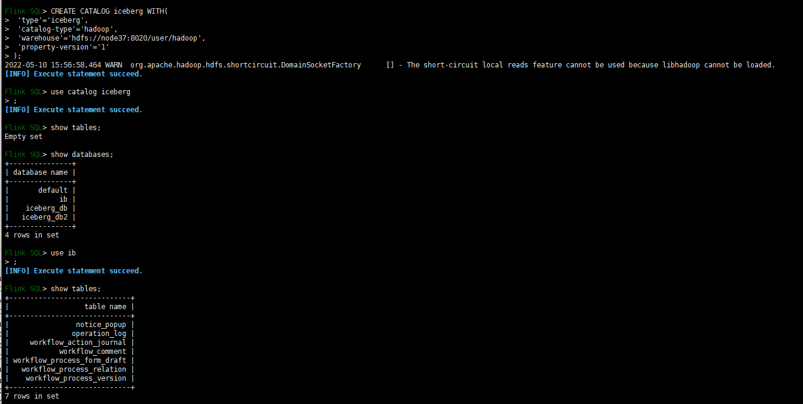

# Flink [#](https://iceberg.apache.org/docs/latest/flink/#flink)

> 官网复制，个人理解翻译


Apache Iceberg 支持 [Apache Flink](https://flink.apache.org/)’s DataStream API and Table API. 当前支持的Flink版本1.12, 1.13, and 1.14. 

| Feature support                                              | Flink | Notes                    |
| ------------------------------------------------------------ | ----- | ------------------------ |
| [SQL create catalog](https://iceberg.apache.org/docs/latest/flink/#creating-catalogs-and-using-catalogs) | ✔️     |                          |
| [SQL create database](https://iceberg.apache.org/docs/latest/flink/#create-database) | ✔️     |                          |
| [SQL create table](https://iceberg.apache.org/docs/latest/flink/#create-table) | ✔️     |                          |
| [SQL create table like](https://iceberg.apache.org/docs/latest/flink/#create-table-like) | ✔️     |                          |
| [SQL alter table](https://iceberg.apache.org/docs/latest/flink/#alter-table) | ✔️     | 不支持修改列和分区       |
| [SQL drop_table](https://iceberg.apache.org/docs/latest/flink/#drop-table) | ✔️     |                          |
| [SQL select](https://iceberg.apache.org/docs/latest/flink/#querying-with-sql) | ✔️     | 流批都支持               |
| [SQL insert into](https://iceberg.apache.org/docs/latest/flink/#insert-into) | ✔️ ️    | 流批都支持               |
| [SQL insert overwrite](https://iceberg.apache.org/docs/latest/flink/#insert-overwrite) | ✔️ ️    |                          |
| [DataStream read](https://iceberg.apache.org/docs/latest/flink/#reading-with-datastream) | ✔️ ️    |                          |
| [DataStream append](https://iceberg.apache.org/docs/latest/flink/#appending-data) | ✔️ ️    |                          |
| [DataStream overwrite](https://iceberg.apache.org/docs/latest/flink/#overwrite-data) | ✔️ ️    |                          |
| [Metadata tables](https://iceberg.apache.org/docs/latest/flink/#inspecting-tables) | ️      | 有JAVA API，没有FlinkAPI |
| [Rewrite files action](https://iceberg.apache.org/docs/latest/flink/#rewrite-files-action) | ✔️ ️    |                          |

## Flink SQL Client 使用准备[#](https://iceberg.apache.org/docs/latest/flink/#preparation-when-using-flink-sql-client)

建议通过 [Flink SQL Client](https://ci.apache.org/projects/flink/flink-docs-stable/dev/table/sqlClient.html) 实践和理解iceberg.

[下载flink](https://flink.apache.org/downloads.html). 

```bash
FLINK_VERSION=1.11.1
SCALA_VERSION=2.12
APACHE_FLINK_URL=archive.apache.org/dist/flink/
wget ${APACHE_FLINK_URL}/flink-${FLINK_VERSION}/flink-${FLINK_VERSION}-bin-scala_${SCALA_VERSION}.tgz
tar xzvf flink-${FLINK_VERSION}-bin-scala_${SCALA_VERSION}.tgz
```

启动独立的flink集群，带hadoop的.

```bash
# HADOOP_HOME is your hadoop root directory after unpack the binary package.
export HADOOP_CLASSPATH=`$HADOOP_HOME/bin/hadoop classpath`

# Start the flink standalone cluster
./bin/start-cluster.sh
```

启动 flink SQL client.

下载flink-runtime包并通过embedded参数启动。

```bash
# HADOOP_HOME is your hadoop root directory after unpack the binary package.
export HADOOP_CLASSPATH=`$HADOOP_HOME/bin/hadoop classpath`

./bin/sql-client.sh embedded -j <flink-runtime-directory>/iceberg-flink-runtime-xxx.jar shell
```

iceberg中使用hadoop catalog，它是默认包含hadoop的jar包；如果要使用hive，需要手动引入hive的依赖。

```bash
# HADOOP_HOME is your hadoop root directory after unpack the binary package.
export HADOOP_CLASSPATH=`$HADOOP_HOME/bin/hadoop classpath`

# download Iceberg dependency
ICEBERG_VERSION=0.11.1
MAVEN_URL=https://repo1.maven.org/maven2
ICEBERG_MAVEN_URL=${MAVEN_URL}/org/apache/iceberg
ICEBERG_PACKAGE=iceberg-flink-runtime
wget ${ICEBERG_MAVEN_URL}/${ICEBERG_PACKAGE}/${ICEBERG_VERSION}/${ICEBERG_PACKAGE}-${ICEBERG_VERSION}.jar

# download the flink-sql-connector-hive-${HIVE_VERSION}_${SCALA_VERSION}-${FLINK_VERSION}.jar
HIVE_VERSION=2.3.6
SCALA_VERSION=2.11
FLINK_VERSION=1.11.0
FLINK_CONNECTOR_URL=${MAVEN_URL}/org/apache/flink
FLINK_CONNECTOR_PACKAGE=flink-sql-connector-hive
wget ${FLINK_CONNECTOR_URL}/${FLINK_CONNECTOR_PACKAGE}-${HIVE_VERSION}_${SCALA_VERSION}/${FLINK_VERSION}/${FLINK_CONNECTOR_PACKAGE}-${HIVE_VERSION}_${SCALA_VERSION}-${FLINK_VERSION}.jar

# open the SQL client.
/path/to/bin/sql-client.sh embedded \
    -j ${ICEBERG_PACKAGE}-${ICEBERG_VERSION}.jar \
    -j ${FLINK_CONNECTOR_PACKAGE}-${HIVE_VERSION}_${SCALA_VERSION}-${FLINK_VERSION}.jar \
    shell
```


## 创建和使用catalog [#](https://iceberg.apache.org/docs/latest/flink/#creating-catalogs-and-using-catalogs)

```sql
CREATE CATALOG <catalog_name> WITH (
  'type'='iceberg',
  `<config_key>`=`<config_value>`
); 
```

- `type`:类型必须是`iceberg`. (required)
- `catalog-type`: `hive` or `hadoop` 内置catalog
- `catalog-impl`: catalog自定义实现类（catalog-type必须没有设置）
- `property-version`: 属性的版本号，之前向后兼容，当前 `1`. 
- `cache-enabled`: 默认 `true`

### Hive catalog [#](https://iceberg.apache.org/docs/latest/flink/#hive-catalog)

示例：

```sql
CREATE CATALOG hive_catalog WITH (
  'type'='iceberg',
  'catalog-type'='hive',
  'uri'='thrift://localhost:9083',
  'clients'='5',
  'property-version'='1',
  'warehouse'='hdfs://nn:8020/warehouse/path'
);
```

需要指定如下参数:

- `uri`: Hive metastore’s thrift URI. (Required)
- `clients`: The Hive metastore client pool size, default value is 2. (Optional)
- `warehouse`: Hive warehouse location.
- `hive-conf-dir`: 包含hive配置的目录`hive-site.xml` .

### Hadoop catalog [#](https://iceberg.apache.org/docs/latest/flink/#hadoop-catalog)

示例：

```sql
CREATE CATALOG hadoop_catalog WITH (
  'type'='iceberg',
  'catalog-type'='hadoop',
  'warehouse'='hdfs://nn:8020/warehouse/path',
  'property-version'='1'
);
```

使用如下参数:

- `warehouse`: HDFS存储元数据的目录

通过命令使用指定catalog `USE CATALOG hive_catalog` 

### Custom catalog [#](https://iceberg.apache.org/docs/latest/flink/#custom-catalog)

使用用户自定义的catalog

```sql
CREATE CATALOG my_catalog WITH (
  'type'='iceberg',
  'catalog-impl'='com.my.custom.CatalogImpl',
  'my-additional-catalog-config'='my-value'
);
```

### Create through YAML config [#](https://iceberg.apache.org/docs/latest/flink/#create-through-yaml-config)

在使用sql-client启动的时候，可以预先配置 `sql-client-defaults.yaml` ，示例

```yaml
catalogs: 
  - name: my_catalog
    type: iceberg
    catalog-type: hadoop
    warehouse: hdfs://nn:8020/warehouse/path
```

## DDL commands [#](https://iceberg.apache.org/docs/latest/flink/#ddl-commands)

### `CREATE DATABASE` [#](https://iceberg.apache.org/docs/latest/flink/#create-database)

```sql
CREATE DATABASE iceberg_db;
USE iceberg_db;
```

### `CREATE TABLE` [#](https://iceberg.apache.org/docs/latest/flink/#create-table)

```sql
CREATE TABLE `hive_catalog`.`default`.`sample` (
    id BIGINT COMMENT 'unique id',
    data STRING
);
```

Table create commands support the most commonly used [flink create clauses](https://ci.apache.org/projects/flink/flink-docs-release-1.11/dev/table/sql/create.html#create-table) now, including:

- `PARTITION BY (column1, column2, ...)`配置分区。flink目前还不支持影藏分区.
- `COMMENT 'table document'`设置表描述.
- `WITH ('key'='value', ...)` 设置[表配置](https://iceberg.apache.org/docs/latest/configuration) .

### `PARTITIONED BY` [#](https://iceberg.apache.org/docs/latest/flink/#partitioned-by)

```sql
CREATE TABLE `hive_catalog`.`default`.`sample` (
    id BIGINT COMMENT 'unique id',
    data STRING
) PARTITIONED BY (data);
```


### `CREATE TABLE LIKE` [#](https://iceberg.apache.org/docs/latest/flink/#create-table-like)

复制一个表的结构，分区和表属性（schema, partitioning, and table properties）。

```sql
CREATE TABLE `hive_catalog`.`default`.`sample` (
    id BIGINT COMMENT 'unique id',
    data STRING
);

CREATE TABLE  `hive_catalog`.`default`.`sample_like` LIKE `hive_catalog`.`default`.`sample`;
```


### `ALTER TABLE` [#](https://iceberg.apache.org/docs/latest/flink/#alter-table)

只支持修改表属性

```sql
ALTER TABLE `hive_catalog`.`default`.`sample` SET ('write.format.default'='avro')
```

### `ALTER TABLE .. RENAME TO` [#](https://iceberg.apache.org/docs/latest/flink/#alter-table--rename-to)

重命名表

```sql
ALTER TABLE `hive_catalog`.`default`.`sample` RENAME TO `hive_catalog`.`default`.`new_sample`;
```

### `DROP TABLE` [#](https://iceberg.apache.org/docs/latest/flink/#drop-table)

删除表

```sql
DROP TABLE `hive_catalog`.`default`.`sample`;
```

## SQL查询 [#](https://iceberg.apache.org/docs/latest/flink/#querying-with-sql)

支持批流读取。通过如下命令切换（SQL-Client中）

```sql
-- Execute the flink job in streaming mode for current session context
SET execution.type = streaming

-- Execute the flink job in batch mode for current session context
SET execution.type = batch
```

批量读取

```sql
-- Execute the flink job in batch mode for current session context
SET execution.type = batch ;
SELECT * FROM sample       ;
```

流式读取

从一个历史快照id开始读取（historical snapshot-id）

```sql
-- Submit the flink job in streaming mode for current session.
SET execution.type = streaming ;

-- Enable this switch because streaming read SQL will provide few job options in flink SQL hint options.
SET table.dynamic-table-options.enabled=true;

-- Read all the records from the iceberg current snapshot, and then read incremental data starting from that snapshot.
SELECT * FROM sample /*+ OPTIONS('streaming'='true', 'monitor-interval'='1s')*/ ;

-- Read all incremental data starting from the snapshot-id '3821550127947089987' (records from this snapshot will be excluded).
SELECT * FROM sample /*+ OPTIONS('streaming'='true', 'monitor-interval'='1s', 'start-snapshot-id'='3821550127947089987')*/ ;
```

flink SQL Hint

- monitor-interval: 持续监控新提交的时间间隔（默认1s）
- start-snapshot-id: 流任务开始的快照ID.

## SQL写入 [#](https://iceberg.apache.org/docs/latest/flink/#writing-with-sql)

+  `INSERT INTO` 
+ `INSERT OVERWRITE`.

### `INSERT INTO` [#](https://iceberg.apache.org/docs/latest/flink/#insert-into)

流式任务中执行，插入一条记录

```sql
INSERT INTO `hive_catalog`.`default`.`sample` VALUES (1, 'a');
INSERT INTO `hive_catalog`.`default`.`sample` SELECT id, data from other_kafka_table;
```

### `INSERT OVERWRITE` [#](https://iceberg.apache.org/docs/latest/flink/#insert-overwrite)

使用查询结果，替换表中的数据，在批量任务模式下使用 `INSERT OVERWRITE`

Partitions that have rows produced by the SELECT query will be replaced, for example:

select结果对应分区的内容将被替换

```sql
INSERT OVERWRITE sample VALUES (1, 'a');
```

Iceberg also support overwriting given partitions by the `select` values:

Iceberg也支持重写指定分区的select内容

```sql
INSERT OVERWRITE `hive_catalog`.`default`.`sample` PARTITION(data='a') SELECT 6;
```

翻译失败“”

For a partitioned iceberg table, when all the partition columns are set a value in `PARTITION` clause, it is inserting into a static partition, otherwise if partial partition columns (prefix part of all partition columns) are set a value in `PARTITION` clause, it is writing the query result into a dynamic partition. For an unpartitioned iceberg table, its data will be completely overwritten by `INSERT OVERWRITE`.

## Reading with DataStream [#](https://iceberg.apache.org/docs/latest/flink/#reading-with-datastream)

通过Stream API读取.

### Batch Read [#](https://iceberg.apache.org/docs/latest/flink/#batch-read)

```java
StreamExecutionEnvironment env = StreamExecutionEnvironment.createLocalEnvironment();
TableLoader tableLoader = TableLoader.fromHadoopTable("hdfs://nn:8020/warehouse/path");
DataStream<RowData> batch = FlinkSource.forRowData()
     .env(env)
     .tableLoader(tableLoader)
     .streaming(false)
     .build();

// Print all records to stdout.
batch.print();

// Submit and execute this batch read job.
env.execute("Test Iceberg Batch Read");
```

### Streaming read [#](https://iceberg.apache.org/docs/latest/flink/#streaming-read)

流式读取:

```java
StreamExecutionEnvironment env = StreamExecutionEnvironment.createLocalEnvironment();
TableLoader tableLoader = TableLoader.fromHadoopTable("hdfs://nn:8020/warehouse/path");
DataStream<RowData> stream = FlinkSource.forRowData()
     .env(env)
     .tableLoader(tableLoader)
     .streaming(true)
     .startSnapshotId(3821550127947089987L)
     .build();

// Print all records to stdout.
stream.print();

// Submit and execute this streaming read job.
env.execute("Test Iceberg Streaming Read");
```

可以对表选项进行设置 [FlinkSource#Builder](https://iceberg.apache.org/javadoc/0.13.1/org/apache/iceberg/flink/source/FlinkSource.html).

## Writing with DataStream [#](https://iceberg.apache.org/docs/latest/flink/#writing-with-datastream)

### Appending data. [#](https://iceberg.apache.org/docs/latest/flink/#appending-data)

```java
StreamExecutionEnvironment env = ...;

DataStream<RowData> input = ... ;
Configuration hadoopConf = new Configuration();
TableLoader tableLoader = TableLoader.fromHadoopTable("hdfs://nn:8020/warehouse/path", hadoopConf);

FlinkSink.forRowData(input)
    .tableLoader(tableLoader)
    .build();

env.execute("Test Iceberg DataStream");
```

The iceberg API also allows users to write generic `DataStream<T>` to iceberg table, more example could be found in this [unit test](https://github.com/apache/iceberg/blob/master/flink/src/test/java/org/apache/iceberg/flink/sink/TestFlinkIcebergSink.java).

### Overwrite data [#](https://iceberg.apache.org/docs/latest/flink/#overwrite-data)

To overwrite the data in existing iceberg table dynamically, we could set the `overwrite` flag in FlinkSink builder.

```java
StreamExecutionEnvironment env = ...;

DataStream<RowData> input = ... ;
Configuration hadoopConf = new Configuration();
TableLoader tableLoader = TableLoader.fromHadoopTable("hdfs://nn:8020/warehouse/path", hadoopConf);

FlinkSink.forRowData(input)
    .tableLoader(tableLoader)
    .overwrite(true)
    .build();

env.execute("Test Iceberg DataStream");
```

## Inspecting tables. [#](https://iceberg.apache.org/docs/latest/flink/#inspecting-tables)

Iceberg does not support inspecting table in flink sql now, we need to use [iceberg’s Java API](https://iceberg.apache.org/docs/latest/api) to read iceberg’s meta data to get those table information.

## Rewrite files action. [#](https://iceberg.apache.org/docs/latest/flink/#rewrite-files-action)

Iceberg provides API to rewrite small files into large files by submitting flink batch job. The behavior of this flink action is the same as the spark’s [rewriteDataFiles](https://iceberg.apache.org/docs/latest/maintenance/#compact-data-files).

```java
import org.apache.iceberg.flink.actions.Actions;

TableLoader tableLoader = TableLoader.fromHadoopTable("hdfs://nn:8020/warehouse/path");
Table table = tableLoader.loadTable();
RewriteDataFilesActionResult result = Actions.forTable(table)
        .rewriteDataFiles()
        .execute();
```

For more doc about options of the rewrite files action, please see [RewriteDataFilesAction](https://iceberg.apache.org/javadoc/0.13.1/org/apache/iceberg/flink/actions/RewriteDataFilesAction.html)

## Future improvement. [#](https://iceberg.apache.org/docs/latest/flink/#future-improvement)

There are some features that we do not yet support in the current flink iceberg integration work:

- Don’t support creating iceberg table with hidden partitioning. [Discussion](http://mail-archives.apache.org/mod_mbox/flink-dev/202008.mbox/) in flink mail list.
- Don’t support creating iceberg table with computed column.
- Don’t support creating iceberg table with watermark.
- Don’t support adding columns, removing columns, renaming columns, changing columns. [FLINK-19062](https://issues.apache.org/jira/browse/FLINK-19062) is tracking this.


## Do it one more time

by yinweiwen@ node37

import data with flink-iceberg program;

```sh
./bin/sql-client.sh embedded -j iceberg-flink-runtime-1.13-0.13.1.jar 
```





jdbc批量导入到iceberg

```sh
use catalog default_catalog;
use default_database;
CREATE TABLE if not exists `user_customize` (
 `id` INT,
`company` INT,
`name` VARCHAR,
`type` INT,
`option` STRING,
`prompt` VARCHAR,
`required` BOOLEAN,
`order` INT,
`state` INT,
`test` INT,
PRIMARY KEY (`id`) NOT ENFORCED
 ) WITH (
   'connector' = 'jdbc',
   'url' = 'jdbc:postgresql://10.8.30.156:5432/emis0430',
   'table-name' = 'user_customize',
   'driver'='org.postgresql.Driver',
   'username'='postgres',
   'password'='postgres'
);

select * from `user_customize`;

CREATE CATALOG iceberg_flink WITH(
 'catalog-type'='hadoop',
'warehouse'='hdfs://10.8.30.37:8020/user/hadoop',
'property-version'='1',
'type'='iceberg'
);

use catalog iceberg_flink;
CREATE TABLE if not exists `user_customize` (
 `id` INT,
`company` INT,
`name` VARCHAR,
`type` INT,
`option` STRING,
`prompt` VARCHAR,
`required` BOOLEAN,
`state` INT,
PRIMARY KEY (`id`) NOT ENFORCED
 ) WITH (
 'table.exec.sink.not-null-enforcer'='DROP',
 'format-version'='2'
);

insert into `iceberg_flink`.`ib`.`user_customize`
select `id`,`company`,`name`,`type`,`option`,`prompt`,`required`,`order`,`state`
from `default_catalog`.`default_database`.`user_customize`;

# 在批处理模式下，重写整改库
SET execution.type = batch;

insert overwrite `iceberg_flink`.`ib`.`user_customize`
select `id`,`company`,`name`,`type`,`option`,`prompt`,`required`,`state`,`test`
from `default_catalog`.`default_database`.`user_customize`;

```


全量同步camunda工作流数据到Iceberg的时候出现：

```sh
org.postgresql.util.PSQLException: FATAL: number of requested standby connections exceeds max_wal_senders (currently 10)
```

去设置数据库：

max_wal_senders = 100