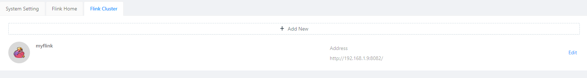
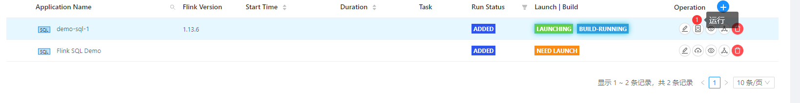
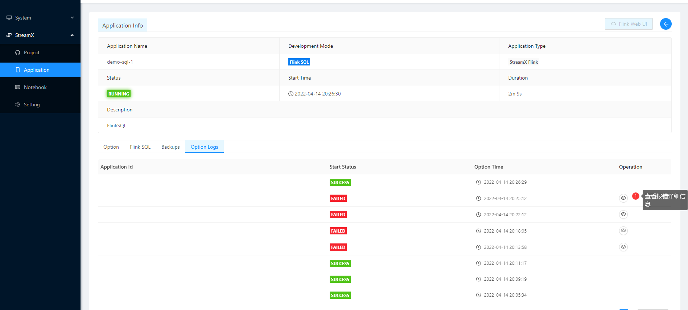

## StreamX

### 安装

http://www.streamxhub.com/docs/user-guide/deployment/

> 必须在linux环境安装


默认密码: **admin / streamx**

设置`flinkhome` `maven私服地址`  `Flink Cluster`





### 运行官网sql例子

> 准备本机docker-compose kafka环境。需要在 windows机器中访问ubuntu中的kafka，需要进行如下设置
>
> ```yaml
> version: '3.8'
> services:
> zookeeper:
>  image: confluentinc/cp-zookeeper:5.4.0
>  env_file: zookeeper/env/docker.env
>  hostname: zookeeper
>  container_name: zookeeper
>  ports:
>       - "2181:2181"
>     volumes:
>       - zkdata2:/var/opt/zookeeper
> 
>   broker:
>     image: confluentinc/cp-kafka:5.4.0
>     env_file: broker/env/docker.env
>     hostname: broker
>     container_name: broker
>     environment:
>       KAFKA_ZOOKEEPER_CONNECT: zookeeper:2181
>       KAFKA_LISTENERS: INTERNAL://0.0.0.0:9092,OUTSIDE://0.0.0.0:9094
>       KAFKA_ADVERTISED_LISTENERS: INTERNAL://192.168.1.9:9092,OUTSIDE://localhost:9094
>       KAFKA_LISTENER_SECURITY_PROTOCOL_MAP: INTERNAL:PLAINTEXT,OUTSIDE:PLAINTEXT
>       KAFKA_INTER_BROKER_LISTENER_NAME: INTERNAL
>     depends_on:
>       - zookeeper
>     ports:
>       - "29092:29092"
>       - "9092:9092"
>     volumes:
>       - broker2:/var/lib/kafka/data/
> ```
> 这里的volume后面的数字，是因为kafka重新启动后提示
>
> kafka.common.InconsistentClusterIdException: The Cluster ID YJp5qd4NQF2WCrx1C8aY0w doesn't match stored clusterId Some(VMwp9k2GR_6EHZsMpdAwTA) in meta.properties. The broker is trying to join the wrong cluster. Configured zookeeper.connect may be wrong.
> 	at kafka.server.KafkaServer.startup(KafkaServer.scala:220)
> 	at io.confluent.support.metrics.SupportedServerStartable.startup(SupportedServerStartable.java:114)
>
> 

创建mysql表

```sql
create table test.pvuv_sink
(
	dt varchar(100) null,
	pv bigint null,
	uv bigint null
);
```

创建sql Application


Flink SQL:

```sql
CREATE TABLE user_log (
    user_id VARCHAR,
    item_id VARCHAR,
    category_id VARCHAR,
    behavior VARCHAR,
    ts TIMESTAMP(3)
 ) WITH (
  'connector' = 'kafka',
  'topic' = 'user_behavior',
  'properties.bootstrap.servers' = '192.168.1.9:9092',
  'properties.group.id' = 'testGroup',
  'scan.startup.mode' = 'earliest-offset',
  'value.format' = 'debezium-json',
  'value.debezium-json.ignore-parse-errors' = 'true'
 );

CREATE TABLE pvuv_sink (
    dt VARCHAR,
    pv BIGINT,
    uv BIGINT
 ) WITH (
'connector.type' = 'jdbc', -- 使用 jdbc connector
'connector.url' = 'jdbc:mysql://192.168.1.9:3306/test?createDatabaseIfNotExist=true&useSSL=false', -- jdbc url
'connector.table' = 'pvuv_sink', -- 表名
'connector.username' = 'root', -- 用户名
'connector.password' = 'root', -- 密码
'connector.write.flush.max-rows' = '1' -- 默认 5000 条，为了演示改为 1 条
 );

INSERT INTO pvuv_sink
SELECT
  DATE_FORMAT(ts, 'yyyy-MM-dd HH:00') dt,
  COUNT(*) AS pv,
  COUNT(DISTINCT user_id) AS uv
FROM user_log
GROUP BY DATE_FORMAT(ts, 'yyyy-MM-dd HH:00');
```

Kafka消息

```shell
{"user_id": "543462", "item_id":"1715", "category_id": "1464116", "behavior": "pv", "ts":"2021-02-01T01:00:00Z"}
{"user_id": "662867", "item_id":"2244074","category_id":"1575622","behavior": "pv", "ts":"2021-02-01T01:00:00Z"}
{"user_id": "662867", "item_id":"2244074","category_id":"1575622","behavior": "pv", "ts":"2021-02-01T01:00:00Z"}
{"user_id": "662867", "item_id":"2244074","category_id":"1575622","behavior": "learning flink", "ts":"2021-02-01T01:00:00Z"}
```

maven

```xml
<dependency>
    <groupId>mysql</groupId>
    <artifactId>mysql-connector-java</artifactId>
    <version>5.1.48</version>
</dependency>

<dependency>
    <groupId>org.apache.flink</groupId>
    <artifactId>flink-sql-connector-kafka_2.11</artifactId>
    <version>1.13.6</version>
</dependency>

<dependency>
    <groupId>org.apache.flink</groupId>
    <artifactId>flink-connector-jdbc_2.11</artifactId>
    <version>1.13.6</version>
</dependency>

<dependency>
    <groupId>org.apache.flink</groupId>
    <artifactId>flink-json</artifactId>
    <version>1.13.6</version>
</dependency>
```


点击提交，进入任务列表界面，点击执行：




如果报错，可以进入详细查看



