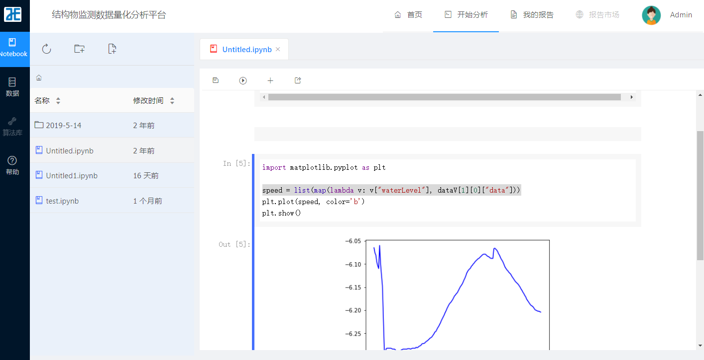
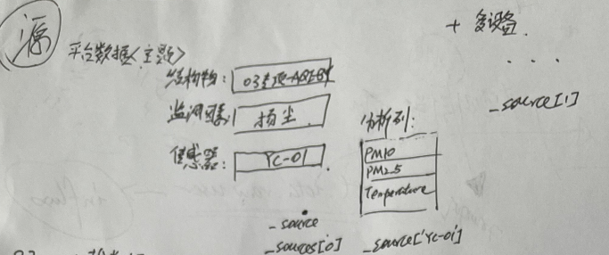
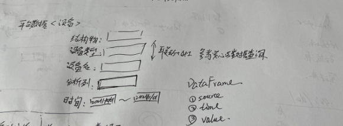
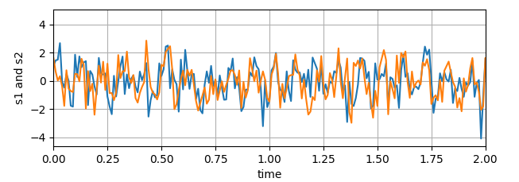
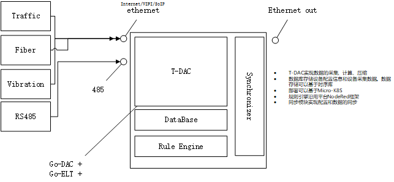
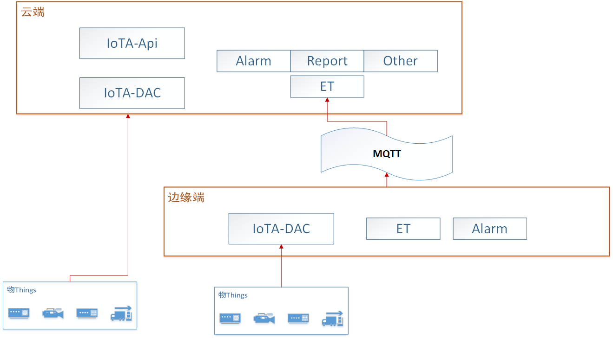
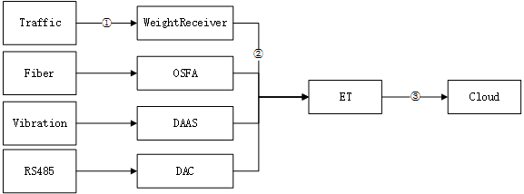
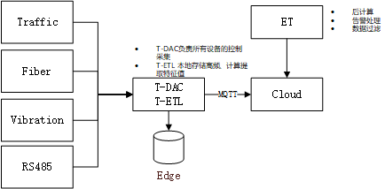
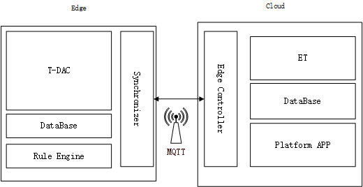

[飞尚Iot](https://iot.free-sun.vip/)三件套

# 1. IOT物联网感知平台

现有以太和安心云功能合并


# 2. 线上分析工具

[TOC]

> 本文档为线上分析工具设计思路，部分细节和技术方案待定

## 整体

基于现有数据分析平台`analyser` 开发可视化交互分析平台，做进一步功能扩展

组成: 

web应用 http://10.8.30.22/FS-Anxinyun/trunk/codes/web/analysis； 包括web/api/编排器功能组合

jupyter服务 http://10.8.30.22/FS-Anxinyun/trunk/codes/services/anxinyun-notebook

现有功能界面： 




功能模块：

+ 数据源: 列出当前用户所能访问的所有结构物数据源

+ Notebook工作区： 文件目录、notebook工作区
+ 算法库：算法功能，包括算法输入输出、算法代码块以及对应UI组成
+ 我的报告：工作区内执行的结果保存，提供下载功能


现有架构图：by Tyr.Liu


## 功能

### 数据源

数据源分类

| 数据源      |      |      |
| ----------- | ---- | ---- |
| 安心云3.0   |      |      |
| 安心云2.0   |      |      |
| 上载数据CSV |      |      |

上载数据：

用户想要分析本地数据（CSV），需要首先将文件上传到安心云平台。上传过程除了需要提交文件外，还需提交相关的元数据信息。包括：

项目名称、数据类型(设备/主题)、数据文件格式（总结现有几种格式后提供选项）；

后端服务对文件进行再处理后存储到HDFS：

提取到设备名称（测点名称）、将数据格式转换成标准格式（平台3.0数据文件格式）；

>  注意：上传过程不创建3.0结构物，单独维护上载数据的项目-设备-监测类型-测点信息。


以上三种数据源均需实现以下接口：

1. 获取所有结构物

2. 查询结构物下的所有测点

   /structures/{struct}/stations?factorId={factor}

3. 获取结构物所有设备

   /structures/{struct}/devices?type={deviceType}

4. 获取设备数据

5. 获取测点数据

   目前支持从API接口获取和HDFS数据获取。后续考虑支持HIVE接口查询


数据源从HDFS文档系统中的CSV文件获取，通过Pandas库读取CSV后输出DataFrame数据源。统一后的数据源格式如下：

| 数据列 | 描述                 |
| ------ | -------------------- |
| souce  | 传感器名称或测点名称 |
| time   | 数据时间             |
| data1  | 数据列1              |
| data2  | 数据列2              |
| ...    | ...                  |


UI设计：

数据源对应的UI可参考目前平台实现，即可以通过结构物、监测因素过滤选择测点；通过结构物、设备类型选择设备。

测点选择设计草图：




设备选择设计草图：



> + 可以选择多个点位
> + 分析列不选默认输出所有数据列


数据源选定后，执行python单元格内容时，对应的参数将被赋值

```python
_sources=DataApi.get_data(stations=${stationIds}, begin=${begin}, end=${end})
```


### 算法库

算法库包含具体算法的脚本代码和参数输入设计，这些算法通常包括过滤、计算、输出(图表)；参数输入设计采用动态UI和关系映射绑定，形成可视化的算法模块。

通过整理`线下分析工具`，整理目前算法的类别，主要有：

| 分析方法     | 描述                      | Input                 | Output    | 举例           |
| ------------ | ------------------------- | --------------------- | --------- | -------------- |
| 过滤方法     | 过滤数据                  | DataFrame             | DataFrame | 标准差倍数过滤 |
| 单列分析方法 | 单列数据的统计分析和绘图* | DataFrame -DataSeries | 图表      | 热力图         |
| 多列分析方法 | 多列数据的统计分析和绘图  | DataFrame             | 图表      | 实时趋势图     |
| 多点分析     | 数据的关联对比            | DataFrame             | 图表      | 关联分析       |
| 综合分析     | 结构物下测点数据的统计    | DataFrame             | 图表      | 数据连续性统计 |


举例来说明期望的算法定义和具体应用方式：

#### 1. 标准差滤波算法

> 以下示例包含伪代码；
>
> numpy、pandas、matplotlib为默认引入，分别记为别名 np/pd/plt

算法定义，代码 `std_filter`

```python
# data -- 数据源：DataFrame
# field -- 数据列
# times -- 参数：标准差倍数
# out -- 输出：过滤后的DataFrame
def std_filter(data,field,times):
    bz=np.std(data[field])*times
    return data.loc[data[field]>bz]
```

UI：该算法需要指定对取哪列数据做判断，以及输入标准差倍数参数，所以动态UI中应该包括如下两个输入框：

数据列： [ -- ]

标准差倍数: [ -- ]


使用：

工作区中，插入单元格时选择该算法，此时应该在Notebook下生成如下工作单元

```python
from std_filter import *
for src in _sources.indexs
	_sources[i]=std_filter(src,${data_filed},${times})
```


#### 2. 中值绘图

算法定义

代码 `avg_draw`

```python
# data -- 数据源：DataFrame
def avg_draw(data):
    fig, axs = plt.subplots(2, 1)
    axs[0].plot(data['time'], data['data1'], data['time'], data['data2'])
    axs[0].set_xlim(0, 2)
    axs[0].set_xlabel('time')
    axs[0].set_ylabel('data1')
    axs[0].grid(True)
    plt.show()
```

UI：

无参数


使用：

工作区中选择算法，此时应该在Notebook下生成如下工作单元

```python
from avg_draw import *
for src in _sources.indexs
	_sources[i]=avg_draw(_sources[i])
```

[Out]




算法定义界面设计草图：


### Notebook·工作区

在工作区内，用户除可以手动编写代码外，可以引入算法。在原Notebook工作区单元格右侧，增加可视化交互界面，如下；

工作区设计草图：


工作区左侧为文件目录，目录下的文件可以进行新建、拷贝、重命名和删除等操作。每个用户可以创建自己的工作区，工作区的文件序列化到用户的七牛目录。

工作区右侧的内容，可以通过配置或不同用户权限，仅显示UI操作界面。

### 我的报告

工作区内执行完成后，可以保存当前页（html格式）到七牛，在“我的报告”菜单中，可以查看下载所有保存的报告


# 3. IOT边缘网关

> 本文档描写IOT边缘网关的设计思想，不包含具体实现方案和技术实现方案。
>
> 不涉及硬件， 使用现有工控机或购买第三方边缘服务器

## 功能

实现边缘端设备采集控制、数据ETL和存储、数据分发控制，能和**物联平台**实现配置同步和数据上传的功能。

## 定位

+ 实现本地高频接入（FBG/Vibration）。用户可以在本地存储所有采集的原始粒度数据，特征数据上报到平台(远端)。

  用户可以在远端（平台/APP）跟踪数据的整体变化趋势、设置感知状态的预告警值，也可以通过接口获取到设备边缘的设备动态数据。

+ 和自研设备绑定，实现标准化产品。配套设备使用，开箱插电即用，可以通过网线/wifi连接，通过WEB进行简单设备配置（自动组网识别、配置采集粒度、公式参数设置、数据转发配置）；同时简单配置后，可以将数据同步到云平台（或私有云）

+ 替代简易本地化系统（仅包含简单数据展示、转发三方平台的应用场景）


:question:  和本地化平台的区别 

> 一方面，替代本地化现有集成方案中的‘工控机’，负责设备自动采集。除此，还应包括数据计算和传输控制，另外，在动态数据处理上，负责转换、存储和压缩。
>
> 另外，可以替代简单的本地系统，实现准平台功能（类似统一采集软件应用场景）；

:question: 和云网关的区别

> 云网关的扩展版；
>
> 在“云边协同”思想上，类似FS-云网关。云网关-云节点可以作为一个独立的离线系统，数据自动采集并保存在云网关，待与平台网络连接后，可将数据文件上传平台；云网关-节点上的协议和公式参数等配置，是通过云网关和平台之间的配置“下发”完成。
>
> 边缘网关类似，可以完成离线工作，同时可以和平台实现同步。但期望，边缘上有更强的“数据处理”和“存储”能力。在动态数据处理方面，也是云网关所不具有的。（动态数据方面，云振动设备实现了振动数据在边缘的采集和存储，它更加接近我们设想的边缘网关）

:question: 和统一采集软件的区别

> 统一采集软件的加强版；
>
> 类似统一采集软件，有配置、采集控制、数据展示的业务闭环；区别： 期望实现T-DAC涵盖动态设备的采集能力；同时要具备和云平台协同工作的能力。

:question: 和云平台的关系

> 可以看作是云平台中DAC和ETL部分功能的下层。
>
> 尤其对动态数据，对解决远程传输带宽限制和平台能力瓶颈，有非常重要的意义


框图：



## 设计要求

作为边缘计算服务系统，设计有如下一些要求，参考 *kubeedge.io*

1. **Co-Cloud-Edge & Offline** 云边协同和离线工作

   a. 支持云边协同工作：边缘系统可以0配置接入云，同时云上可以对边缘节点进行控制(初始化)；数据可同步上云

   b. 支持离线工作：自动化调度工作，提供数据存储能力，以及友好的配置操作界面

2. **Kubernetes Based** 基于Kubernetes的容器化部署 （MicroK8S）

3. **Resource Optimized** 高效：优化服务，支持在低资源模式运行；同时支持高效存储、数据

4. **Data & Analytics** 支持数据处理分析：数据转换和过滤处理，尤其高频动态数据

5. **Simplified**  部署和运维操作简单。

6. **Heterogenous** 支持跨不同的操作系统（windows/linux）/ 支持X86/ARM不同架构服务器


## 在IOT系统中位置

在《物联网接入服务架构思考》中，表述了边缘端在系统中的位置，如下。




## 整体架构思考

现有集成框图大致：



上图中动态设备，称重、光纤光栅、振动分别依赖不同的采集软件，大多数为只能在windows机器上运行的C#或QT程序。采集完成后数据均是通过文件保存，部分还依赖“提取”软件将数据格式转换成需要的文件格式。同时服务器上一般要求有文件接收程序，文件通过ET解析入库。

缺点(针对动态数据)：

+ **结构复杂**：必须依赖windows工控机，同时工控机上通常需要安装多个采集软件和提取转发软件
+ **延迟高**：“采集 - 文件 - 传输 - 解析”，动态采集的数据按时间分段写入文件，写完一个文件后传输到平台进行解析，这就决定了数据从采集到最终展示，可能有高达数十分钟的延后
+ **脱离平台配置**：实际的采集控制配置是在“采集软件”上，平台无法干涉
+ **性能问题**：实际上，目前使用的动态采集软件，集采集、调试和分析功能与一体，包含了很多不适于长期在线服务的功能，如：数据动态展示、数据分析操作界面。


采用边缘网关，结构如下



**边缘网关（T-DAC + T-ETL）**,包含了动态数据采集，并实现本地存储，过滤、压缩转换后上传平台。平台ET作为后处理程序，只需进行必要的数据组合计算、告警判断。

至此，期望的云端和边缘端整体服务架构大致如下：



+ **T-DAC**: 泛采集组件，上面已介绍

+ **Synchronizer**： Edge端同步控制器，负责配置和数据的同步，可通过mqtt与云端控制器通信
+ **Edge Controller**:  Cloud端同步控制器，监视Edge端变化，缓存和对比配置，下发云端配置同步和控制指令
+ **Rule Engine**：Edge端数据和事件流控制规则引擎


边缘端各个模块的详细描述：

实现动态采集的统一（标准化）是一项比较大的工作，期望通过Golang （Rust??）改造实现动态采集T-DAC的如下功能：

+ **统一**的数据采集：DAC (统一采集软件) + 振动采集DAAS + 光纤光栅采集OSFA + 称重软件(Weight Receiver)

+ 使用本地**配置** （可以通过本地WEB配置或平台配置下发），响应配置变更
+ 采集能力**插件**化，可以统一由平台的协议工厂分配 （比如工控机只有485的应变，仅下发对应的应变协议）（或者定制不同的网关产品类目，分配不同能力）
+ 采用轻量级**消息**通道，数据（采集结果）和事件（采集错误/连接事件等）通过消息中间件和规则引擎进行任意转发。

T-ETL (精简的ETL功能)，在边缘端，实现

+ 数据计算
+ 数据过滤（合理值、滑窗之类）
+ 数据入库
+ 数据聚集

规则引擎（Rule Engine）使用平台的Node-Red方案，支持通过MQTT/HTTP向云平台或第三方平台推送数据。


动态数据应用场景：

1. 压缩聚集后的数据，同通用数据上传平台和展示
2. 原始粒度的数据存储在本地（滚动存储，可配置ttl）（建议使用时序库存储）
3. 边缘端提供接口查询历史数据 （本地组网，平台可以通过此接口查询高频数据；云上想查询边缘端高频数据，需要边缘端提供固定ip）
4. 动态数据也可以通过规则引擎，转入第三方存储介质或云厂商OSS/NAS
5. 提供ws发布服务，支持应用动态数据刷新

