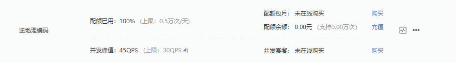
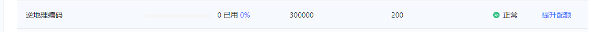

百度地图开发平台

https://lbsyun.baidu.com/index.php?title=webapi/guide/webservice-geocoding [envy717/****]

配额




高德开放平台

https://lbs.amap.com/api/webservice/guide/api/georegeo/  [1826195********/****]

配额




https://restapi.amap.com/v3/geocode/regeo?output=json&location=118.1837796113281,36.73937593595928&key=<key>


```json
{
    "status":"1",
    "regeocode":{
        "addressComponent":{
            "city":"淄博市",
            "province":"山东省",
            "adcode":"370305",
            "district":"临淄区",
            "towncode":"370305108000",
            "streetNumber":{
                "number":"32号",
                "location":"118.183953,36.743174",
                "direction":"北",
                "distance":"422.626",
                "street":"南沣路"
            },
            "country":"中国",
            "township":"金山镇",
            "businessAreas":[
                [

                ]
            ],
            "building":{
                "name":[

                ],
                "type":[

                ]
            },
            "neighborhood":{
                "name":[

                ],
                "type":[

                ]
            },
            "citycode":"0533"
        },
        "formatted_address":"山东省淄博市临淄区金山镇兴边路"
    },
    "info":"OK",
    "infocode":"10000"
}
```

