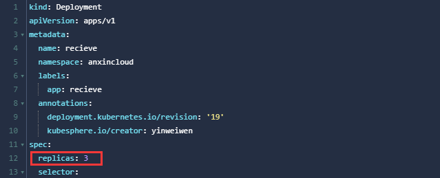

# 通过共享订阅实现MQTT接收横向扩展

> 引言： 安心云的Receiver进程(MQTT->Kafka消息管道)，运行一段时间后出现异常退出。虽做了重连/重启保护机制，但是还是会造成一部分数据丢失。

## 问题排查

MQTT重连后，订阅消息时报错 （另外收到一条信息）

```shell
SEVERE: receiver.production20429120721: Timed out as no activity, keepAlive=60,000,000,000 lastOutboundActivity=8,545,217,349,987,626 lastInboundActivity=8,545,157,349,155,183 time=8,545,277,349,973,460 lastPing=8,545,217,349,991,742
```

这里有类似问题的描述，作者通过抓包发现Java程序给emqx服务发送TCP ZeroWindow，告诉服务自己的接收buff已满，不要再发送数据。同理心跳包也不能发送了，emqx服务收不到心跳包，认为客户端已不存活，会主动断连。

https://blog.csdn.net/u012134942/article/details/103965155 
显然是因为emqx服务发送数据快，程序处理数据慢。审查代码才发现业务数据已经多线程处理，但emqx客户端的上下线消息并没有多线程处理，处理速度慢，导致tcp连接接收buffer被占满。

结论：

**数据处理效率不足，接收缓冲满导致。**

## [EMQX共享订阅](https://docs.emqx.cn/broker/v4.3/advanced/shared-subscriptions.html#%E5%B8%A6%E7%BE%A4%E7%BB%84%E7%9A%84%E5%85%B1%E4%BA%AB%E8%AE%A2%E9%98%85)

共享订阅是在多个订阅者之间实现负载均衡的订阅方式：

### 带群组的共享订阅

```bash
                                                   [subscriber1] got msg1
             msg1, msg2, msg3                    /
[publisher]  ---------------->  "$share/g/topic"  -- [subscriber2] got msg2
                                                 \
                                                   [subscriber3] got msg3
```

上图中，共享 3 个 subscriber 用共享订阅的方式订阅了同一个主题 `$share/g/topic`，其中`topic` 是它们订阅的真实主题名，而  `$share/g/` 是共享订阅前缀。g是group名称，类似kafka的group.id。

### 不带群组的共享订阅

以 `$queue/` 为前缀的共享订阅是不带群组的共享订阅。它是 `$share` 订阅的一种特例，相当与所有订阅者都在一个订阅组里面：

```bash
                                       [s1] got msg1
        msg1,msg2,msg3               /
[emqx]  --------------->  "$queue/topic" - [s2] got msg2
                                     \
                                       [s3] got msg3
```

### 均衡策略与派发 Ack 配置

EMQ X 的共享订阅支持均衡策略与派发 Ack 配置：

```bash
# etc/emqx.conf

# 均衡策略
broker.shared_subscription_strategy = random

# 适用于 QoS1 QoS2 消息，启用时在其中一个组离线时，将派发给另一个组
broker.shared_dispatch_ack_enabled = false
```
|  均衡策略    |             描述             |
| :---------- | :--------------------------- |
| random      | 在所有订阅者中随机选择       |
| round_robin | 按照订阅顺序                 |
| sticky      | 一直发往上次选取的订阅者     |
| hash        | 按照发布者 ClientID 的哈希值 |


## 应用修改

### 修改订阅的topic

直接修改配置文件中的topic

```properties
# 修改前
topics=${topic.perfix}_data
# 修改后
topics=$queue/${topic.perfix}_data
```


### 修改client.id

多实例运行，需保证各MQTT客户端实例的ID不一样。

```java
String clientId = System.getenv("HOSTNAME"); // 直接取k8s的容器实例的名称作为MQTT Client.Id
if (clientId == null) {
    clientId = this.props.getProperty("client.id") + UUID.randomUUID();
}
logger.info("mqtt client id:" + clientId);
```


### k8s部署

直接增加副本数。后面可以通过KUBESPHERE的弹性伸缩配置，按需增减实例数。

