## Blazor

`Blazor`是一个使用.Net生成交互客户端的web UI框架。可以通过`Blazor Server`或`Blazor WebAssembly`托管。

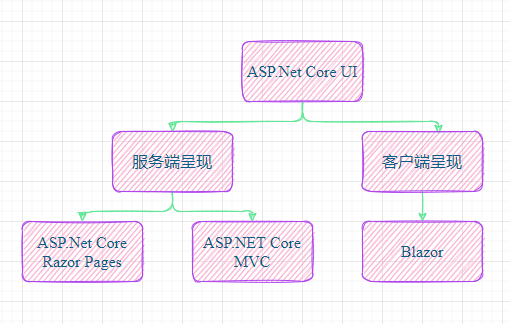

通过 [WebAssembly](https://webassembly.org/)（缩写为 `wasm`），可在 Web 浏览器内运行 .NET 代码。


Blazor Server托管方式，运行时停留在server端处理：


Blazor项目可以使用 .NET Standard 标准库。

开发准备：安装vs2022、安装.Net 5.0


```sh
dotnet new blazorserver -o BlazorApp --no-https

dotnet watch run
```

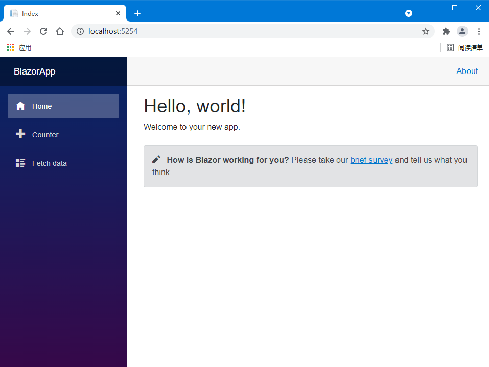


添加Razor组件Todo。

Shared/NavMenu.razor中添加到导航栏。

> 通过控制台dotnet watch run 可以热更新重载界面。VS F5启动不会热更新。

敲一遍官方简单todolist代码：

@bind实现html元素和C#代码中变量的绑定（双向）

```c#
@page "/todo"

<h1>Todo (@todos.Count(todo=>!todo.IsDone))</h1>

<ul>
    @foreach (var todo in todos)
    {
        <li>
            <input type="checkbox" @bind="todo.IsDone"/>
            <input @bind="todo.Title"/>
        </li>
    }
</ul>

<input placeholder="something todos" @bind="newTodo" />
<button @onclick="AddTodo">Add Todo</button>

@code {
    private List<TodoItem> todos = new();
    private string newTodo;

    private void AddTodo()
    {
        if (!string.IsNullOrEmpty(newTodo))
        {
            Console.WriteLine(newTodo);
            todos.Add(new TodoItem { Title = newTodo });
            newTodo = string.Empty;
        }
    }
}
```


## [Ant Design Blazor](https://github.com/ant-design-blazor/ant-design-blazor)

 https://ant-design-blazor.gitee.io/

快速上手：https://ant-design-blazor.gitee.io/zh-CN/docs/introduce

组件库：https://ant-design-blazor.gitee.io/zh-CN/components/overview


例子：[Antd Charts](https://github.com/ant-design-blazor/ant-design-charts-blazor) 组件使用：

```sh
dotnet add package AntDesign.Charts
```

- Link the static files in `wwwroot/index.html` (WebAssembly) or `Pages/_Host.razor` (Server)

```html
<script src="https://unpkg.com/@antv/g2plot@latest/dist/g2plot.min.js"></script>
<script src="_content/AntDesign.Charts/ant-design-charts-blazor.js"></script>
```

- Add namespace in `_Imports.razor`

```C#
@using AntDesign.Charts
```

使用：

```c#
<Line Data="data" Config="config"></Line>

@code {
    object[] data = new object[]
                    {
        new  { year= "1991", value= 3 },
        new  { year= "1992", value= 4 },
                    };

    LineConfig config = new LineConfig()
        {
            Title = new Title()
            {
                Visible = true,
                Text = "aline",
            },
            Padding = "auto",
            ForceFit = true,
            XField = "year",
            YField = "value",
            Smooth = true,
        };
}
```


## 会画图的程序员

系统架构师需要用更加系统的视图去观察和思考，具象化思考设计。

https://draw.io/

> 需要FQ

可以用github登录并把工作区保存到GitHub仓库中。工作区界面如下:

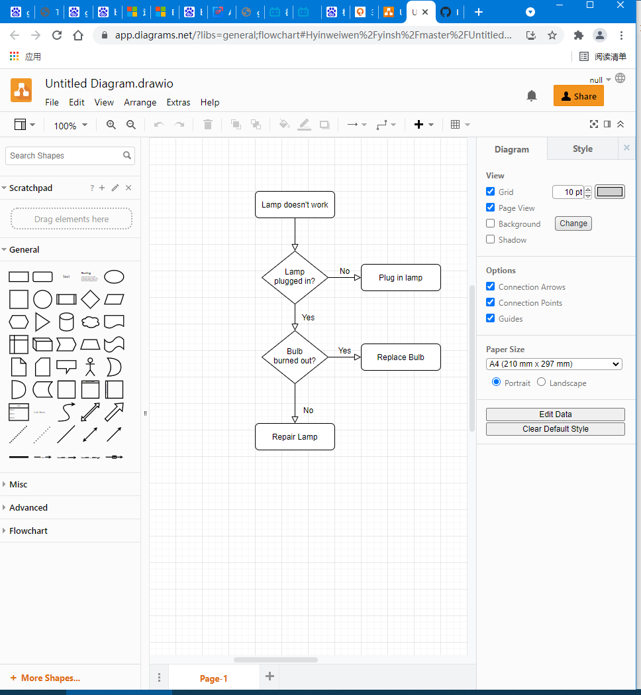

可以从以下位置导入：本地磁盘、Github、GoogleDrive、OneDriver、Dropbox、Gitlab。

可以到处成如下格式：png、jpeg、svg、pdf、vsdx、html、xml、url等。

**添加自定义字体三种的方法:**

直接输入系统中字体名称；输入[google字体](https://fonts.google.com/)的名称；输入web字体名称和url。

中文字体资源：https://www.fonts.net.cn/fonts-zh-1.html

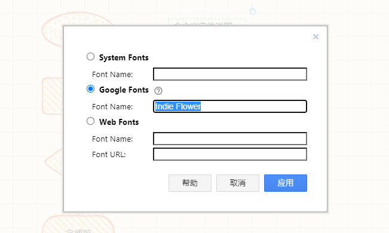

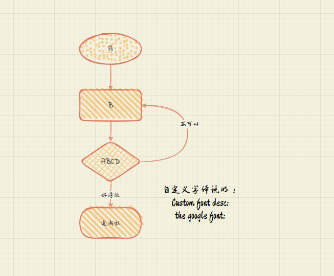


## 图片上牛

注册个人七牛账户yww0828@126.com [七牛](https://portal.qiniu.com/cdn/domain)。域名管理中添加域名，等待生成CNAME后拷贝。

到华为云管理域名，添加CNAME的解析记录，如下：

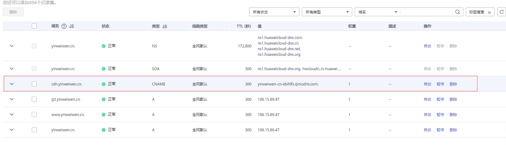

查看是否生效：

```shell
λ nslookup cdn.yinweiwen.cn
服务器:  dns1.ctcdma.com
Address:  218.2.2.2

非权威应答:
名称:    tinychinacdnweb.qiniu.com.w.kunlunno.com
Addresses:  240e:944:1:e00:3::3fb
          240e:944:1:e00:3::3fc
          59.37.142.223
          59.37.142.2
          59.37.142.226
          59.37.142.3
          59.37.142.4
          59.37.142.5
          59.37.142.220
          59.37.142.1
Aliases:  cdn.yinweiwen.cn
          yinweiwen-cn-idvhlfx.qiniudns.com
          dt003.china.line.qiniudns.com
```

对象存储》空间管理》文件管理》上传文件》复制外链》CDN》刷新预取


插播：

## 有人物联网

https://www.usr.cn/

DTU厂家有人的物联网平台介绍（182****2313）。


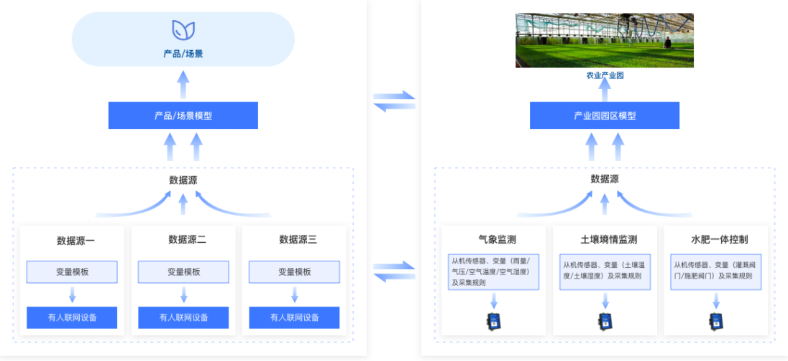

使用步骤：创建产品和场景模型(设备的组合，实际应用场景)、添加设备和场景。


功能：个性化、定时任务、透传管理、视频接入、第三方推送、维保档案、二次开发。

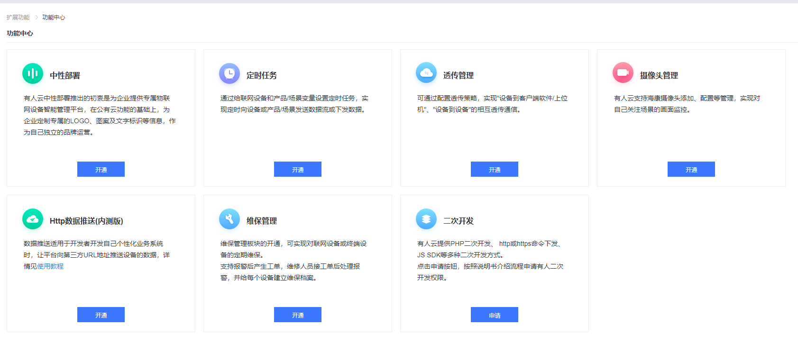

场景模型创建：分为产品模型和运算型。

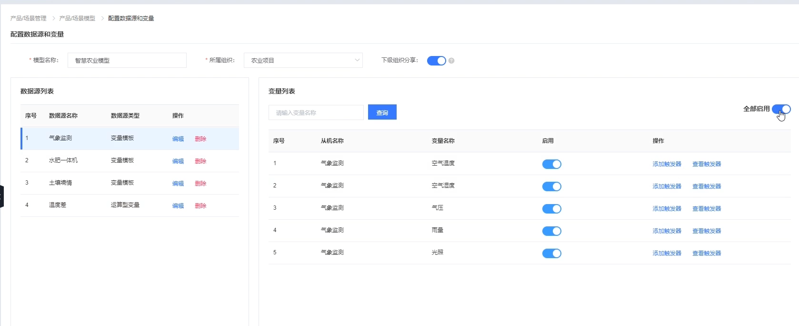

有人的触发器和联动设置：

报警死区，如下定义，在<45时报警、高于50时恢复

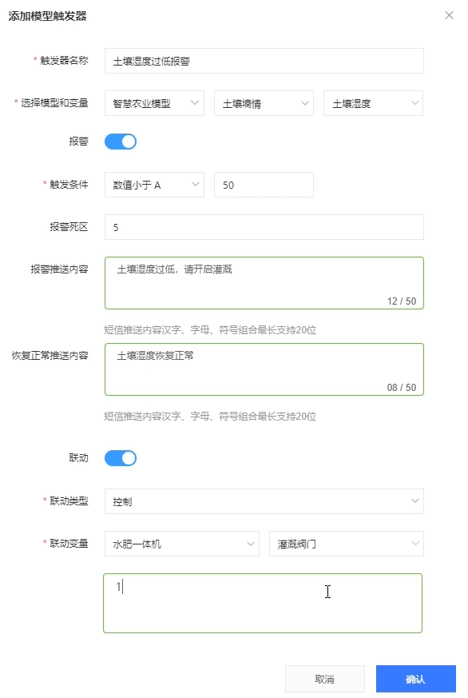


针对场景模型，可以设置对应的组态设计：

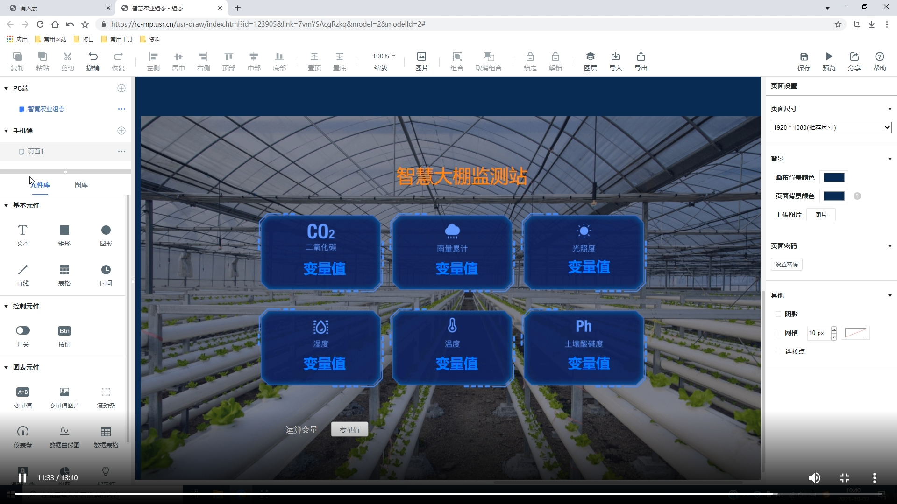


## Github

FQ Pull & Push

Github> Developer setting > Personal access tokens:

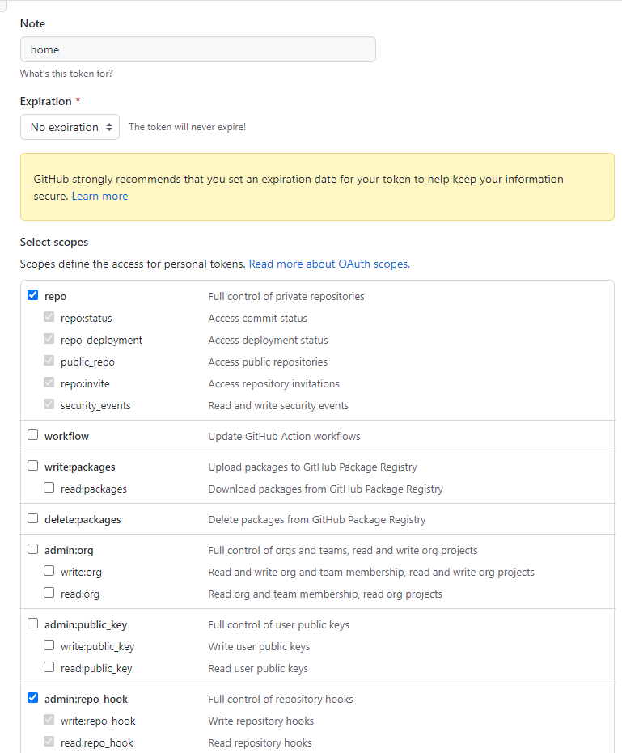


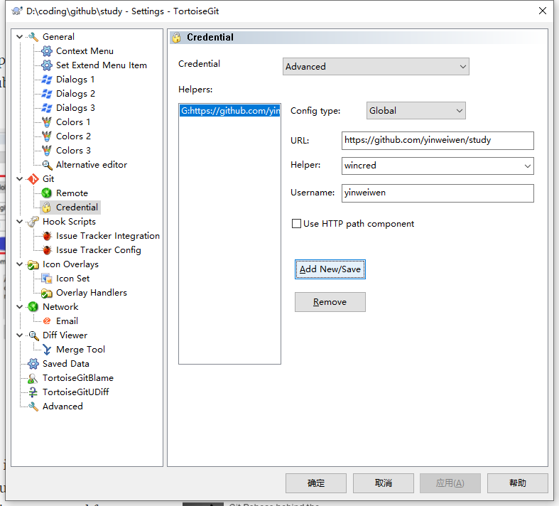


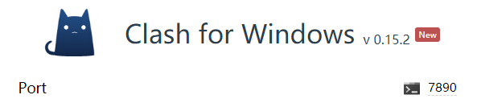

```shell
git config --global http.postBuffer 524288000
git config --global http.version HTTP/1.1
# git config --global http.version HTTP/2

git config --global http.sslVerify "false"

git config --global http.proxy

git config --global http.proxy "http://127.0.0.1:7890"
git config --global https.proxy "socks5://127.0.0.1:7890"
```

