##  [5G 与 MEC 边缘计算](https://www.cnblogs.com/jmilkfan-fanguiju/p/11825026.html)

MSC（Mobile Switching Center，移动交换中心）

| 缩写   | ---                                                          |
| ------ | ------------------------------------------------------------ |
| MSC    | Mobile Switching Center，移动交换中心                        |
| NFV    | Network Functions Virtualization(网络功能虚拟化)  NF：Net Function网络功能； VNF： Virtual NF虚拟网元 |
| OSS    | Operations Support System 操作支撑系统；Object Storage Service 对象存储服务‘； |
| SBI    | Service Based Interface，基于服务的接口                      |
| EC     | Edge Computing，边缘计算                                     |
| MEC    | Mobile Edge Computing 移动边缘计算（最早有Nokia和IBM提出）； 后续扩展为 Multi-Access Edge Computing |
| CDN    | Content Delivery Network 网络内容分发服务。本质属于边缘计算  |
| RAN    | 无线接入网                                                   |
| UE     | User-Endpoint 用户终端                                       |
| CFS    | Customer-Facing Service 面向用户的服务                       |
| CRD    | Custom Resource Definitions大约在两年前引入，作为使用定制资源扩展Kubernetes API的主要方法。 |
|        |                                                              |
|        |                                                              |
|        |                                                              |
|        |                                                              |
|        |                                                              |
|        |                                                              |
|        |                                                              |
| 云原生 | 使命是改变世界如何构建软件，其主要由微服务架构、DevOps 和以容器为代表的敏捷基础架构几部分组成，目标是实现交付的弹性、可重复性和可靠性。（关键词 敏捷、微服务、容器、DevOps） |

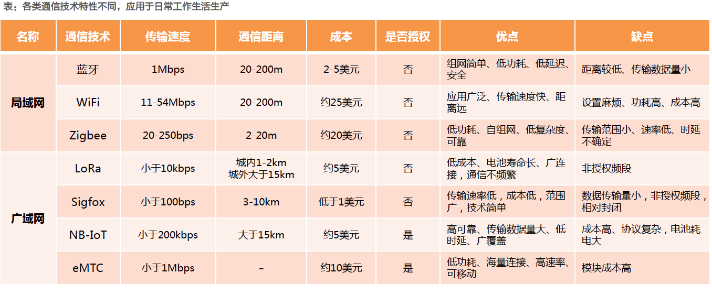

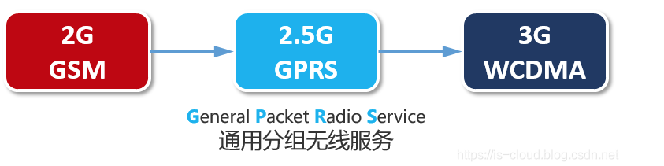

### 2G

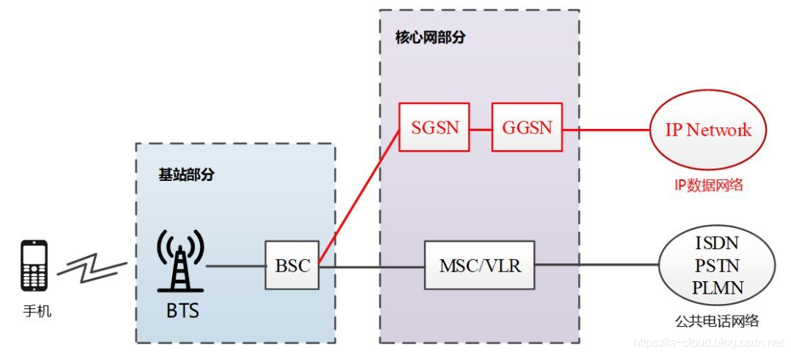

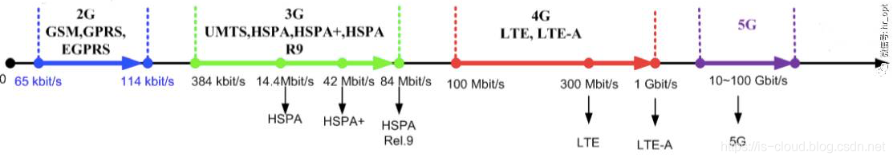

### 3G

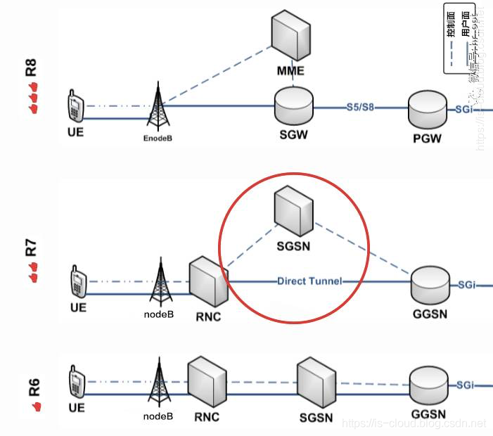

### 4G

SGSN演变成 MME(Mobility Management Entity); GGSN演变成SGW/PGW (Serving Gateway服务网关；PDN Gateway，PDN网关)

MME（移动性管理实体）的主要功能是支持 NAS（非接入层）信令及其安全、跟踪区域（TA）列表的管理、PGW 和 SGW 的选择、跨 MME 切换时进行 MME 的选择、在向 2G/3G 接入系统切换过程中进行 SGSN 的选择、用户的鉴权、漫游控制以及承载管理、3GPP 不同接入网络的核心网络节点之间的移动性管理（终结于 S3 节点），以及 UE 在 ECM_IDLE 状态下可达性管理（包括寻呼重发的控制和执行）。

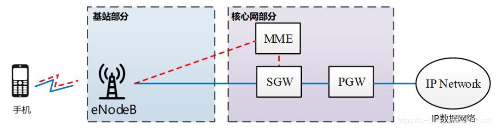

### 5G

5G 是一个端到端的生态系统，它将打造一个全移动和全连接的社会。5G 主要包括三方面：生态、客户和商业模式。它交付始终如一的服务体验，通过现有的和新的用例，以及可持续发展的商业模式，为客户和合作伙伴创造价值。

1. 更好的使用者传输速率体验（User Experienced Data Rate）：100 Mb/s 以上
2. 更高的峰值传输速率（Peak Data Rate）：20Gb/s
3. 单位面积在单位时间内更高的传输数据量（Traffic Capacity）：10~100Mb/s/m2
4. 更高的频谱使用率（Spectrum Effiency）：3 倍以上
5. 更快的移动速度（Mobility）：500km/h
6. 更低的延迟（Latency）：1ms 以下
7. 更高密度的装置联机（Connection Dencity）：100 万 devices/km2
8. 更低的耗能（Network Energy Efficiency）：电力消耗为 1/100 以下

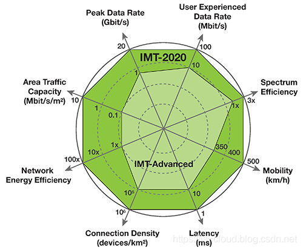

为了应对这这样的技术挑战，**5G 网络设计原则**为：

- 从集中化向分布式发展
- 从专用系统向虚拟系统发展
- 从闭源向开源发展

 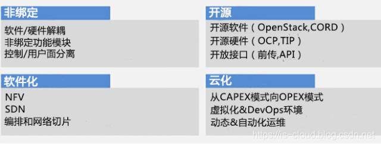

5G网络逻辑架构

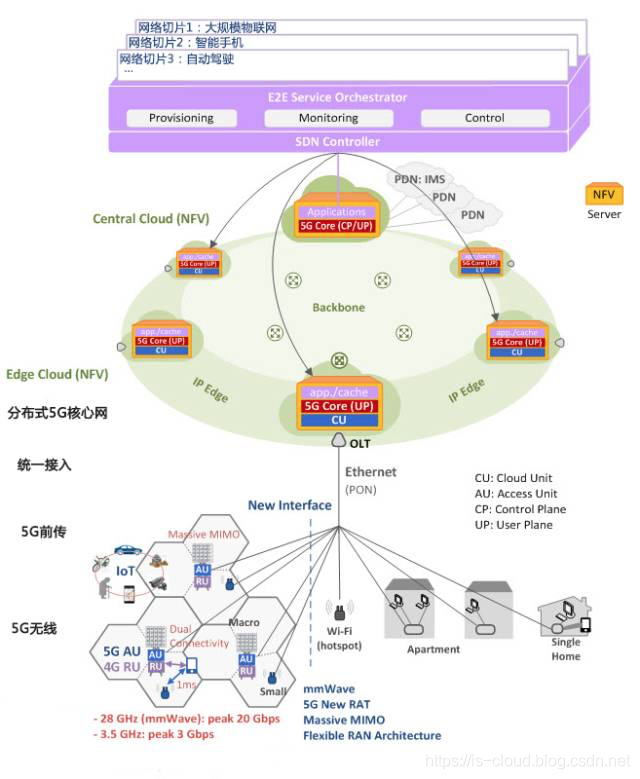

三大关键技术：

1. SBA 基于服务的架构

2. 微服务化
3. SBI 基于服务的接口

 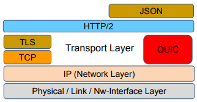

 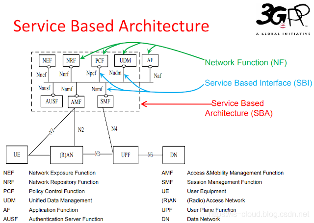

### MEC边缘计算

ETSI（欧洲电信标准化协会）的 **`MEC`**(多接入边缘计算)架构

【[ESTI GS MEC 003](https://www.etsi.org/deliver/etsi_gs/MEC/001_099/003/02.01.01_60/gs_MEC003v020101p.pdf)】【[ESTI GS MEC 011](https://www.etsi.org/deliver/etsi_gs/MEC/001_099/011/02.01.01_60/gs_MEC011v020101p.pdf)】

 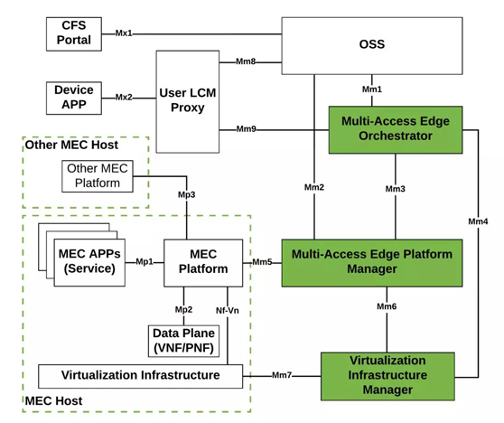

 

- **ME 主机（移动边缘主机）** 由 ME 平台、ME 应用和虚拟化基础设施组成。虚拟化基础设施可以为 ME 应用提供计算、存储和网络资源，并且可以为 ME 应用提供持续的存储和时间相关的信息，它包含一个数据转发平面来为从 ME 平台接收到的数据执行转发规则，并在各种应用、服务和网络之间进行流量的路由。
- **ME 平台（移动边缘平台，MEP）** 从 ME 平台管理器、ME 应用或 ME 服务处接收流量转发规则，并且基于转发规则向转发平面下发指令。另外，ME 平台还支持本地域名系统（DNS）、代理服务器的配置，可以将数据流量重定向到对应的应用和服务。ME 平台还可以通过 Mp3 参考点与其他的 ME 平台进行通信，在分布式 MEC 系统的协作机制中，Mp3 参考点可以作为不同 ME 平台互联的基础。
- **ME 应用（移动边缘应用，ME APP）** 是运行在 ME 虚拟化基础设施上的虚拟机实例，这些应用通过 Mp1 参考点与 ME 平台相互通信。Mp1 参考点还可提供标识应用可用性、发生 ME 切换时为用户准备或重定位应用状态等额外功能。
- **ME 平台管理器（ME platform manager，移动边缘平台管理器，MEPM）** 具有 ME 平台元素管理、ME 应用生命周期管理以及 ME 应用规则和需求管理等功能。ME 平台和 MEPM 之间使用 Mm5 参考点，该参考点实现平台和流量过滤规则的配置，并且负责管理应用的重定位和支持应用的生命周期程序。Mm2 是操作支持系统（OSS）和 MEPM 之间的参考点，负责 ME 平台的配置和性能管理。Mm3 是 MEO 和 MEPM 之间的参考点，负责为应用的生命周期管理和应用相关的策略提供支持，同时为 ME 的可用服务提供时间相关的信息。
  - ME 应用生命周期管理包括 ME 应用程序的创建和终止，并且为 ME 编排器（ME orchestrator，MEO，移动边缘编排器）提供应用相关事件的指示消息。
  - ME 应用规则和需求管理包括认证、流量规则、DNS 配置和冲突协调等。
- **ME 编排器（ME orchestrator，MEO，移动边缘编排器）** 是 ME 提供的核心功能，MEO 宏观掌控 ME 网络的资源和容量，包括所有已经部署好的 ME 主机和服务、每个主机中的可用资源、已经被实例化的应用以及网络的拓扑等。在为用户选择接入的目标 ME 主机时，MEO 衡量用户需求和每个主机的可用资源，为其选择最为合适的 ME 主机，如果用户需要进行 ME 主机的切换，则由 MEO 来触发切换程序。MEO 与OSS 之间通过 Mm1 参考点来触发 ME 应用的实例化和终止。MEO 与虚拟化基础设施管理器（VIM）之间通过 Mm4 参考点来管理虚拟化资源和应用的虚拟机映像，同时维持可用资源的状态信息。
- 从 ME 系统的角度来看，**OSS（Operations Support System 操作支持系统）** 是支持系统运行的最高水平的管理实体。OSS 从面向用户服务（Customer-Facing Service，CFS）门户和用户终端（UE）接收实例化或终止 ME 应用的请求，检查应用数据分组和请求的完整性和授权信息。经过 OSS 认证授权的请求数据分组会通过 Mm1 参考点被转发到 MEO 进行进一步处理。
- **面向用户服务门户（Customer-Facing Service Portal，CFS Portal）** 实体相当于第三方接入点，开发商使用该接口将自己开发的各种应用接入运营商的 ME 系统中，企业或者个人用户也可以通过该接口选择其感兴趣的应用，并指定其使用的时间和地点。CFS 通过 Mx1 参考点与 OSS 实现通信。
- **用户终端应用（User app，UEAPP）**
- **用户应用生命周期代理（user app LCM proxy，UEAPPLCM proxy）** 是供 ME 用户使用来请求应用相关的实例化和终止等服务的实体。该实体可以实现外部云和 ME 系统之间的应用重定位，负责对所有来自外部云的请求进行认证，然后分别通过 Mm8 和 Mm9 参考点发送给 OSS 和 MEO 做进一步处理。值得注意的是，LCM 只能通过移动网络接入，Mx2 参考点提供了 UE 与 LCM 相互通信的基础。
- **虚拟化基础设施管理器（VIM）** 用于管理 ME 应用的虚拟资源，管理任务包括虚拟计算、存储和网络资源的分配和释放，软件映像也可以存储在 VIM 上以供应用的快速实例化。同时，VIM 还负责收集虚拟资源的信息，并通过 Mm4 参考点和 Mm6 参考点分别上报给MEO 和 MEPM 等上层管理实体。

MEC设计原则

- **网络开放**：MEC 可提供平台开放能力，在服务平台上集成第三方应用或在云端部署第三方应用。
- **能力开放（APIs 经济）**：通过公开 API 的方式为运行在 MEC 平台主机上的第三方 MEC 应用提供包括无线网络信息、位置信息等多种服务。能力开放子系统从功能角度可以分为能力开放信息、API 和接口。API 支持的网络能力开放主要包括网络及用户信息开放、业务及资源控制功能开放。
- **资源开放**：资源开放系统主要包括 IT 基础资源的管理（如 CPU、GPU、计算能力、存储及网络等），能力开放控制以及路由策略控制。
- **管理开放**：平台管理系统通过对路由控制模块进行路由策略设置，可针对不同用户、设备或者第三方应用需求，实现对移动网络数据平面的控制。
- **本地转发**：MEC 可以对需要本地处理的数据流进行本地转发和路由。
- **移动性**：终端在基站之间移动，在小区之间移动，跨 MEC 平台的移动。
- **计费和安全**。