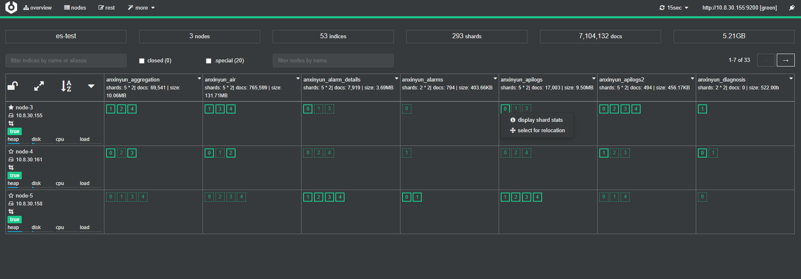

# ElasticSearch

启动：
	bin/elasticsearch -d
关闭：
	ps -ef | grep elastic
	kill -9
	

## 创建索引

```
PUT raw_data
{
 "mappings":{
	...
 }
}
```

### 安装head插件

https://github.com/mobz/elasticsearch-head
	git clone git://github.com/mobz/elasticsearch-head.git
	cd elasticsearch-head
	npm install
	npm run start
	open http://localhost:9100/


### 安装x-pack监视性能：
	bin/elasticsearch-plugin install x-pack
 没学会。。。

```
 ES性能监视
	监视内存
	ps -ef | grep elastic
	top -p xxx -d 1
	监视存储
	head http://10.8.30.35:9100/
		savoir_raws
		size: 56.9Gi (117Gi)
		docs: 812,228 (1,624,456)
		
		GET _cat/indices/savoir_raws
				health status index uuid pri rep docs.count docs.deleted   store.size  pri.store.size
				green open savoir_raws X3OCrzSwSwKEZrQhkn9Rrw 5 1 819361 0 118gb 57.2gb
```

+
LUCENSE:
document -> 索引和搜索的主要数据载体，对应写入到ES中的一个doc
field -> 字段
term -> 词项，搜索时单位
token -> 词项(term)在字段(field)中的一次出现,包括词项的文本、开始和结束的位移、类型等信息

index 类似db
shard is an instance of Lucene. It is a fully functional search engine in its own right. primary shard&& replica shard ,提供容错和读取吞吐量
segment 每个shard包含多个segment，在shard中的搜索会按顺序手搜索该shard上所有的segment。 segment(逆向索引)不可变

分片处理机制：
https://blog.csdn.net/mgxcool/article/details/49250341

/_cat/allocation
	shards disk.indices disk.used disk.avail disk.total disk.percent host          ip            node
   101      655.7mb   172.8gb     50.5gb    223.4gb           77 192.168.0.106 192.168.0.106 node-0
   101      655.6mb    48.3gb    853.3gb    901.7gb            5 192.168.0.109 192.168.0.109 node-1
   ?v 显示详细信息

/_cat/shards
	所有分片大小位置
/_cat/shards/{index}
	
/_cat/master 主节点信息
/_cat/nodes 节点信息
/_cat/indices 索引信息
/_cat/indices/{index}
/_cat/segments 
/_cat/segments/{index}
/_cat/count
/_cat/count/{index}
/_cat/recovery
/_cat/recovery/{index}
/_cat/health
/_cat/pending_tasks
/_cat/aliases
/_cat/aliases/{alias}
/_cat/thread_pool
/_cat/plugins
/_cat/fielddata
/_cat/fielddata/{fields}
/_cat/nodeattrs
/_cat/repositories
/_cat/snapshots/{repository}


## ES Script

> Stored Scripts

获取当前所有脚本
```shell
GET _cluster/state/metadata?pretty&filter_path=**.stored_scripts
```
获取脚本信息
```shell
GET _scripts/savoir-alarm-update
```
新建脚本
```shell
curl -X POST "localhost:9200/_scripts/calculate-score" -H 'Content-Type: application/json' -d'
{
  "script": {
    "lang": "painless",
    "source": "Math.log(_score * 2) + params.my_modifier"
  }
}
'
```

> Script Fields
返回经过脚本加工的数据
```json
GET savoir_alarms/_search
{
  "query": {
    "match_all": {}
  },
  "script_fields": {
    "test1": {
      "script": {
        "lang": "painless",
        "source":"doc['alarm_count'].value* params.factor",
        "params": {
          "factor":500
        }
      }
    }
  }
}
```

使用`doc['my_field'].value`和`params['_source']['my_field']`区别：
1. 前者将匹配项加载到内存(快)
2. 后者每次使用时解析，执行慢
3. 前者只支持简单数据类型(例如不能返回json对象)

[脚本支持的语言](https://www.elastic.co/guide/en/elasticsearch/reference/current/modules-scripting.html)
+ painless <built-in>
	+ inline
	+ stored
+ expression <built-in>
+ mustache <built-in>
+ java

> Prefer parameters
同样的脚本会编译后缓存，使用相同的脚本，并使用params可以提高脚本执行效率
；脚本编译受限script.max_compilations_rate，超出会抛出异常


## 数据更新 UPDATE
-- 部分更新
GET anxinyun_alarms/alarm/4506871f-5671-4c04-bf94-0338f8b3b69c/_update
{
  "doc":{
    "state":1
  }
}


## 包含指定字段
GET anxinyun_aggregation/_search
{
  "query": {
    "exists": {
      "field": "data.wqLevel"
    }
  }
}

## ARRAY | NESTED 下字段查询
GET savoir_alarms/_search
{
  "query": {
    "nested": {
      "path": "details",
      "query": {
        "bool": {
          "must": [
            {"exists": {"field": "details.alarm_pic"}}
          ]
        }
      }
    }
  }
}

## update_by_query
GET anxinyun_aggregation/_update_by_query?timeout=20m
{
  "script":{
    "source": "ctx._source['data']['physicalvalue']=ctx._source['data']['physicalvalue']*10"
  },,
  "query": {
    "exists": {
      "field": "data.wqLevel"
    }
  }
}

## aggs
### TOP HIT EX.
GET anxinyun_themes/_search
{
  "query": {
    "bool": {
      "must": [
        {
          "range": {
            "structure": {
              "gte": 10,
              "lte": 2000
            }
          }
        }
      ]
    }
  },
  "size": 0, 
  "aggs": {
    "struct": {
      "terms": {
        "field": "structure",
        "size": 10000
      },
      "aggs": {
        "LATEST": {
          "top_hits": {
            "size": 1,
            "sort": [
              {
                "collect_time": {
                  "order": "desc"
                }
              }  
            ],
            "_source": {
              "includes": ["structure","collect_time"]
            }
          }
        }
      }
    }
  }
}

## 输出指定项
GET iota-log-2021.05.10/_search?_source=log
{
  "query": {
    
    "bool": {
      "must": [
        {"match": {
          "log": "60774519"
        }}
      ]
    }
  }
}

## ES-DUMP

```
docker run --rm -ti -v /data:/tmp elasticdump/elasticsearch-dump \
  --input=http://10.8.25.211:9200/raw_data \
  --output=/tmp/my_index_mapping.json \
  --type=data \
  --searchBody='{"query": { "bool": { "must": [{"term": {"deviceId": {"value": "e155b882-d2df-4092-b57d-0a02fae8fca6"}}}, { "range": { "triggerTime": { "lt": "2020-10-24T00:00:00.000+08:00","gt":"2020-10-01T00:00:00.000+08:00" } } } ] } } }'
  

docker run --rm -ti  -v /data:/tmp elasticdump/elasticsearch-dump --input=./data1.json --output=http://10.8.30.36:9200 --type=data
```

## ES 数据导出到CSV
[https://www.cnblogs.com/sanduzxcvbnm/p/12092412.html](https://www.cnblogs.com/sanduzxcvbnm/p/12092412.html)

logstash.yml
```yml
path.config: /usr/share/logstash/conf.d/*.conf
path.logs: /var/log/logstash
```

convert_csv.conf
```yml
input {
 elasticsearch {
    hosts => "localhost:9200"
    index => "anxinyun_weather"
    query => '{  
    "query": {
        "bool": {
		  "must": [
			{"term": {
			  "cityName.keyword": {
				"value": "南昌"
			  }
			}},
			{
			  "term": {
				"dataType.keyword": {
				  "value": "hour"
				}
			  }
			}
		  ]
		}
      }
    }'
  }
}
 
output {
  csv {
    # This is the fields that you would like to output in CSV format.
    # The field needs to be one of the fields shown in the output when you run your
    # Elasticsearch query
 
    fields => ["cityName", "precip", "time"]
  
    # This is where we store output. We can use several files to store our output
    # by using a timestamp to determine the filename where to store output.    
    path => "/tmp/csv-export.csv"
  }
}
```
docker run --rm -ti -v /home/anxinyun/logstash/data:/tmp -v /home/anxinyun/logstash/logstash.yml:/usr/share/logstash/config/logstash.yml -v /home/anxinyun/logstash/conf.d/:/usr/share/logstash/conf.d/ logstash:6.8.2


## kibana 使用的lucene语法：
https://zhuanlan.zhihu.com/p/33791813
https://segmentfault.com/a/1190000002972420

双引号匹配短语 ""

## ES管理工具

### cerebro

docker run -p 9000:9000 lmenezes/cerebro

