[官网](https://ci.apache.org/projects/flink/flink-docs-release-1.8/)

##  创建Flink Maven项目

```
$ mvn archetype:generate \
    -DarchetypeGroupId=org.apache.flink \
    -DarchetypeArtifactId=flink-walkthrough-datastream-scala \
    -DarchetypeVersion=1.14.0 \
    -DgroupId=frauddetection \
    -DartifactId=frauddetection \
    -Dversion=0.1 \
    -Dpackage=spendreport \
    -DinteractiveMode=false
```

dependency：
```xml
<dependency>
  <groupId>org.apache.flink</groupId>
  <artifactId>flink-scala_2.11</artifactId>
  <version>1.8.0</version>
  <scope>provided</scope>
</dependency>
<dependency>
  <groupId>org.apache.flink</groupId>
  <artifactId>flink-streaming-scala_2.11</artifactId>
  <version>1.8.0</version>
  <scope>provided</scope>
</dependency>

<dependency>
    <groupId>org.apache.flink</groupId>
    <artifactId>flink-connector-kafka-0.10_2.11</artifactId>
    <version>1.8.0</version>
</dependency>
```
## API基础概念

### File Sink

在项目中添加引用
```xml
<dependency>
	<groupId>org.apache.flink</groupId>
	<artifactId>flink-connector-filesystem_${scala.binary.version}</artifactId>
	<version>${flink.version}</version>
</dependency>

### Flink 1.9(Or Older)
[Sink to HDFS](https://liurio.github.io/2020/03/14/Flink-sink%E5%88%B0hdfs/)

```
#### Bucketing File Sink

Bucket: 分桶策略 （无界数据流按指定策略划分）
+ BasePathBucketer 不分桶
+ DateTimeBucketer 基于系统时间
+ 自定义 实现Bucketer接口

Writer： 写入方式
+ StringWriter 默认；tostring然后换行写入
+ SequenceFileWriter Hadoop序列文件写入方式
+ 自定义 实现Writer接口

```java
BucketingSink sink = new BucketingSink<T>("") //文件目录地址
    .setBucketer(new MemberBucket()) //自定义桶名称
    .setWriter(new MemberWriter()) //自定义写入
    .setBatchSize(120*1024*1024) //设置每个文件的最大大小，默认384M
    .setBatchRolloverInterval(Long.MaxValue) //滚动写入新文件的时间，默认无限大
    .setInactiveBucketCheckInterval(60*1000) //1分钟检查一次不写入的文件
    .setInactiveBucketThreshold(5*60*1000) //5min不写入，就滚动写入新的文件
    .setPartSuffix(".log") //文件后缀
```

#### Streaming File Sink (@Flink>=1.6)

分桶策略：BucketAssigner
+ BasePathBucketAssigner  不分桶，所有文件写入根目录
+ DateTimeBucketAssigner 基于系统时间(yyyy-MM-dd–HH)分桶
+ 自定义分桶 实现BucketAssigner接口


滚动策略：RollingPolicy
+ DefaultRollingPolicy (可按照最大桶大小(128M default)，滚动周期(60s)，未写入/不活跃状态超时(60s))
+ OnCheckpointRollingPolicy  当checkpoint的时候滚动

写入方式：
+ SimpleStringEncoder  __forRawFormat__ 基于行存储
+ BulkWriterFactory __forBulkFormat__  按列存储，批量编码方式，可以将输出结果用 Parquet 等格式进行压缩存储


## Flink1.12 版本

[Flink 1.12 Doc](https://ci.apache.org/projects/flink/flink-docs-release-1.12/dev/connectors/streamfile_sink.html)


## Metrics

Flink的指标获取

Flink supports `Counters`, `Gauges`, `Histograms` and `Meters`.

```scala
class MyMapper extends RichMapFunction[String,String] {
  @transient private var counter: Counter = _

  override def open(parameters: Configuration): Unit = {
    counter = getRuntimeContext()
      .getMetricGroup()
      .counter("myCounter")
  }

  override def map(value: String): String = {
    counter.inc()
    value
  }
}
```

Gauge:

```scala
new class MyMapper extends RichMapFunction[String,String] {
  @transient private var valueToExpose = 0

  override def open(parameters: Configuration): Unit = {
    getRuntimeContext()
      .getMetricGroup()
      .gauge[Int, ScalaGauge[Int]]("MyGauge", ScalaGauge[Int]( () => valueToExpose ) )
  }

  override def map(value: String): String = {
    valueToExpose += 1
    value
  }
}
```

[Metrics]:https://ci.apache.org/projects/flink/flink-docs-release-1.9/monitoring/metrics.html


已经集成到Dashboard：


## 極客時間學習

## Day 1

### **Flink集群架構**

+ `JobManager`
  + Checkpoint coordinator 協調器
  + JobGraph->ExecutionGraph
  + Task部署調度。RPC通信。JobDispatch。
  + ResourceManager 資源管理器
  + TaskManager注冊管理
+ `TaskManager`
  + 執行任務
  + 網絡管理
  + Shuffle Environment管理 /DataExchange
  + RPC通信
  + 心跳<->JM&RM
  + 内存管理（序列化/反序列化）
  + 注冊到RM
  + 提供卡槽到JobManager （Slot類似JVM中的綫程池）

+ `Client`執行用戶代碼`main()`方法解析成JobGraph對象提交到Jobmanager，同時監控Job執行狀態。
  + 還包括：Dependency Jar Ship；RPC with JM；集群部署（不同環境：yarn、k8s等）


### **JobGraph**

StreamGraph: 僅是表示轉換的大致關係

JobGraph: 并發算子描述

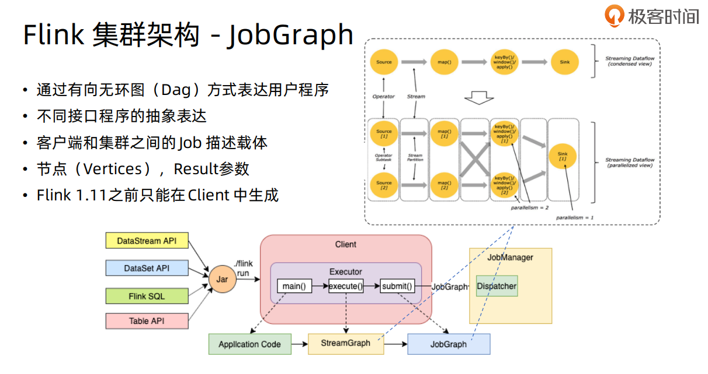

### **Flink集群部署模式**

1. 集群的生命周期和資源隔離
2. 根據Main方法執行在client還是JobManager

+ Session Mode
  + 共享JM&TM，所有提交的Job運行在相同的runtime中。
  + 目前我們平臺部署的Flink1.9然後提交Job的方式，屬於`Session Mode`。
+ Per-Job Mode
  + **獨享**JM&TM集群資源.
+ Application Mode
  + main方法運行在JobManager，生產JobGraph。Jar包可以存儲在分佈式系統HDFS上。
  + 實現Application級別資源隔離。
  + 僅支持yarn和kubernetes


### **集群資源管理器** 

(ClusterManagement)

Standalone、Hadoop yarn、Apache Mesos、Docker、Kubernetes

`Native集群部署`：（彈性）Session集群根據實際提交的Job資源動態申請和啓動TaskManager計算資源。


### **Standalone部署**

單機部署，開箱即用。執行/bin/start-cluster.sh啓動。

多機部署時候，需要修改：

```yaml
#flink-conf.yaml
jobmanager.rpc.address: node1

# master
node1

#work
node2
node3
...
```

提交作業：

```sh
bin/flink run ./xxx.jar
```


### **Flink On Yarn**

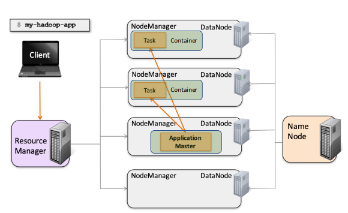

## Day 2

> 2021-12-5

### Flink On Kubernetes

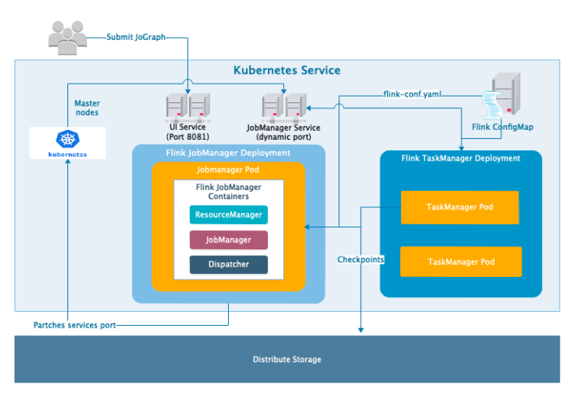

包含如下組成部分：

+ JobManager
+ TaskManager
+ UI Service
+ JobManager Service
+ Flink ConfigMap

jobmanager-service中組要有三個端口：rpc-和taskmanager通信、blob-server文件服務接口、web-ui

访问flink web ui的几种方式：

1. kubectl proxy
2. kubectl port-forward ${flink-jobmanager-pod} 8081:8081
3. 创建nodeport的服务
4. 通过LoadBalancer暴露

提交作业：

```sh
./bin/flink run -m localhost:8081 ./WordCount.jar
```

Session模式不再介绍。

Per-Job模式：独享JM和TM。启动方式和Session类似，区别：

JobManager-deployment.yaml和TaskManager-deployment.yaml中mount对应job所在jar的目录

```yaml
apiVersion: batch/v1
kind: Job
metadata:
  name: flink-jobmanager-per-job
spec:
  template:
    metadata:
      labels:
        app: flink
        component: jobmanager
    spec:
      restartPolicy: OnFailure
      containers:
        - name: jobmanager
          image: flink:1.11.1-scala_2.11
          env:
          args: ["standalone-job", "--job-classname", "org.apache.flink.streaming.examples.windowing.TopSpeedWindowing", --allowNonRestoredState, --output hdfs://node02:8020/flink-training/wordcount-output] 
          # optional arguments: ["--job-id", "<job id>", "--fromSavepoint", "/path/to/savepoint", "--allowNonRestoredState"]
          ports:
            - containerPort: 6123
              name: rpc
            - containerPort: 6124
              name: blob-server
            - containerPort: 8081
              name: webui
          livenessProbe:
            tcpSocket:
              port: 6123
            initialDelaySeconds: 30
            periodSeconds: 60
          volumeMounts:
            - name: flink-config-volume
              mountPath: /opt/flink/conf
            - name: job-artifacts-volume
              mountPath: /opt/flink/usrlib/
          securityContext:
            runAsUser: 9999  # refers to user _flink_ from official flink image, change if necessary
      volumes:
        - name: flink-config-volume
          configMap:
            name: flink-config-per-job
            items:
              - key: flink-conf.yaml
                path: flink-conf.yaml
              - key: log4j-console.properties
                path: log4j-console.properties
        - name: job-artifacts-volume
          hostPath:
            path: /home/flink-training/flink-1.11.1/examples/streaming/
```


Native部署：


````sh
通过Flink安装路径./bin/kubernetes-session.sh脚本启动Session集群
```bash
$ ./bin/kubernetes-session.sh \
-Dkubernetes.cluster-id=flink-k8s-native-session-cluster \
-Dkubernetes.container.image=flink:latest \
-Djobmanager.heap.size=4096m \
-Dtaskmanager.memory.process.size=4096m \
-Dtaskmanager.numberOfTaskSlots=4 \
-Dkubernetes.jobmanager.cpu=1 \
-Dkubernetes.taskmanager.cpu=2 \
-Dkubernetes.namespace=default \
-Dkubernetes.jobmanager.service-account=flink
```
kubernetes.cluster-id如果不指定，则生成UUID

# 提交Job到指定Session集群
$ ./bin/flink run -d -t kubernetes-session -Dkubernetes.cluster-id=flink-k8s-native-session-cluster examples/streaming/WindowJoin.jar
````


Application Mode部署

需要将用户jar打包到镜像中，目前还不支持hdfs等文件系统

```docker
FROM flink
RUN mkdir -p $FLINK_HOME/usrlib
COPY /path/of/my-flink-job-*.jar $FLINK_HOME/usrlib/my-flink-job.jar
```
启动Application应用
```bash
$ ./bin/flink run-application -p 8 -t kubernetes-application \
  -Dkubernetes.cluster-id=flink-k8s-application-cluster \
  -Dtaskmanager.memory.process.size=4096m \
  -Dkubernetes.taskmanager.cpu=2 \
  -Dtaskmanager.numberOfTaskSlots=4 \
  -Dkubernetes.container.image=flink:latest \
  local:///opt/flink/examples/streaming/TopSpeedWindowing.jar
```


### 高可用性

通过zk，提交job的时候实现 job graph的持久化；task执行生成snapshots后JM checkpoint持久化；

standalone模式下高可用：

```sh
high-availability: zookeeper
high-availability.zookeeper.quorum: node01:2181,node02:2181,node03:2181,node04:2181,node05:2181 
high-availability.zookeeper.path.root: /flink 
# high-availability.cluster-id: /cluster_one # important: customize per cluster 
high-availability.storageDir: hdfs:///flink/recovery
```


## Day 3

### 概念

分布式流处理模型

主要包含三部分：Source / Operation(Transformation) / Sink。

具有洗牌shuffle过程，但是不像MapReduce模型，Reduce从Map端拉取数据。


DataStream API:

```java
// get the execution environment
final StreamExecutionEnvironment env = StreamExecutionEnvironment.getExecutionEnvironment();

// get input data by connecting to the socket
DataStream<String> text = env.socketTextStream(hostname, port, "\n");

// parse the data, group it, window it, and aggregate the counts
DataStream<WordWithCount> windowCounts = text
    .flatMap(...)
    .keyBy("word")
    .timeWindow(Time.seconds(5))
    .reduce(new ReduceFunction<WordWithCount>() {});

// print the results with a single thread, rather than in parallel
windowCounts.print().setParallelism(1);

env.execute("Socket Window WordCount");
```

env中包含的内容如下：

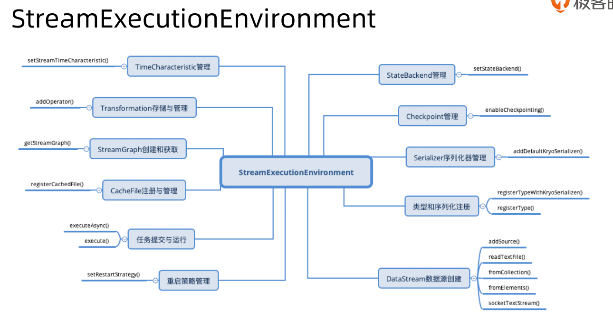

主要的Operation有以下几种：

1. 基于单条记录 map filter
2. 基于窗口 window
3. 合并多条流 union join connect
4. 拆分单条流 split

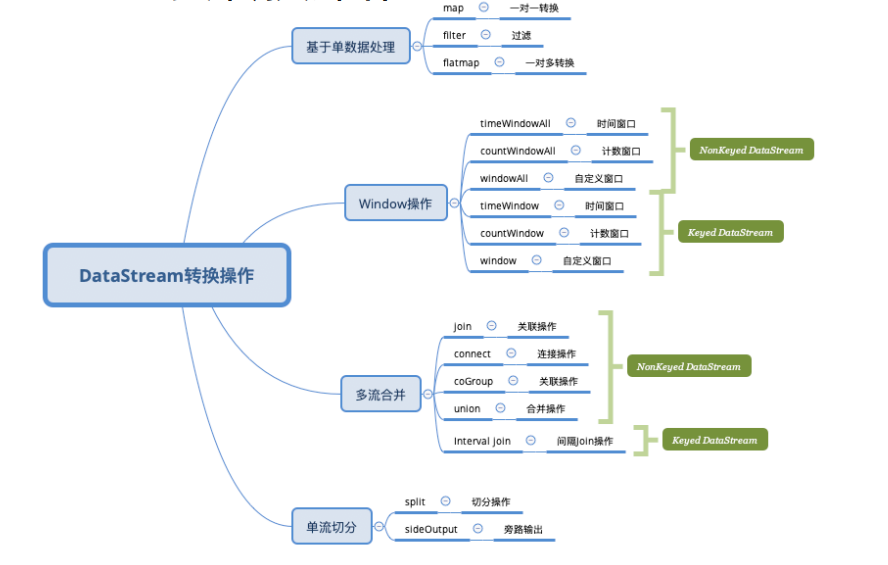

KeyBy生成 KeyedStream,可以继续执行Keyed Operator.

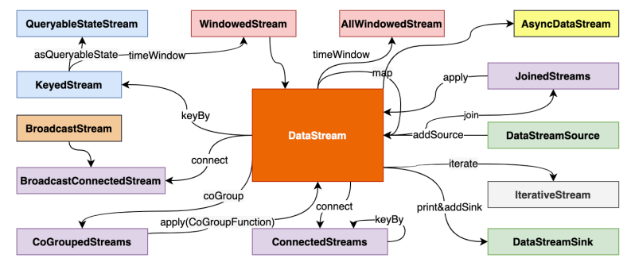

物理分组操作：

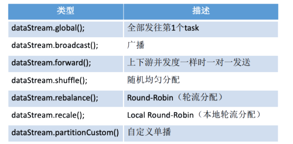

### Flink中的**时间**

+ event time 事件发生的具体时间 （确定性、一致的保障）
+ processing time 事件的处理时间 （性能消耗最小、最高效）

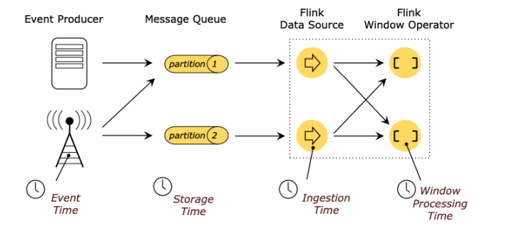

```java
env.setStreamTimeCharacteristic(TimeCharacteristic.EventTime) // IngestionTime/ProcessingTime
```

**WaterMark**

+ 顺序流 stream in order: 理想的watermark。
+ 乱序流 stream out of order  : 通过watermark实现

如下，maxOutOfOrderness=4 （4个时间单位）的情况下watermark：（自右向左，7-4=3生成w(3), 9小于当前watermark不生成最新的水印）。source接入中生成watermark，随着数据流转，每个算子的watermark时钟进行更新（TimeService）。 watermark通常和window结合，发挥作用。

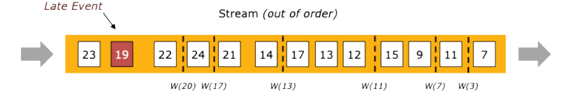

+ watermark = Max EventTime - Late Threshold
+ LateThreshold越高，数据处理延时越高
+ 解决一定范围内的乱序事件
+ 窗口出发条件：Current WaterMark > Window EndTime; watermark的主要目的是告诉窗口不会再有比当前watermark更晚到达

```java
public SingleOutputStreamOperator<T> assignTimeStampsAndWatermarks()
```

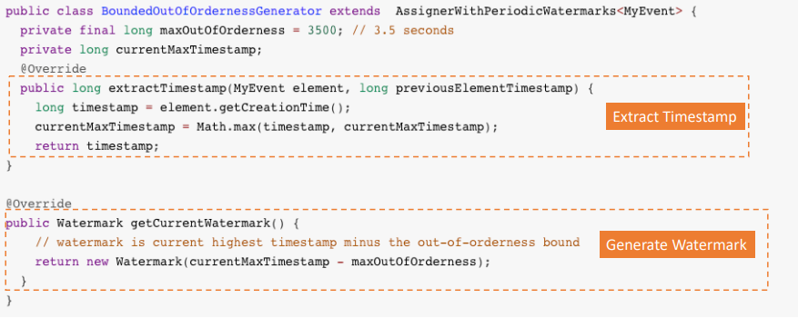

也可以通过WatermarkStrategy中的watermarkGenerator接口实现：

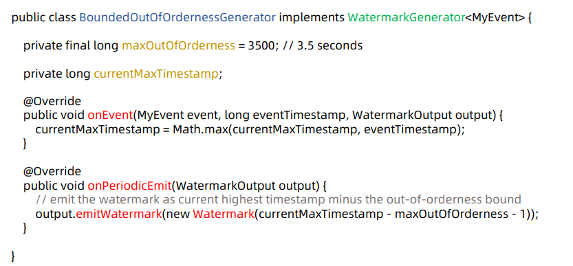


### 窗口

窗口就是将流式数据中的无界数据集转换为有界数据集的过程。窗口的应用场景主要有：

+ 聚合 aggregate
+ 合并 merge
+ join，对两个流窗口内的数据进行join。

window中的概念：

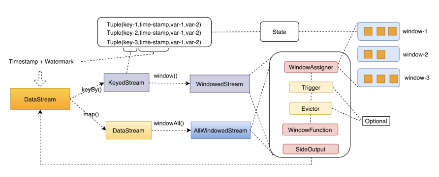

#### Window Assigner 窗口分配器

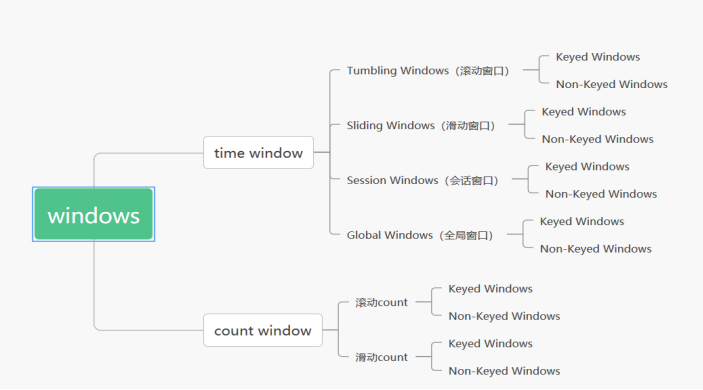

+ sliding ：
  + window size 窗口大小+ window slide滑动步长

+ tumbling 滚动
  + 特殊的sliding：size=slide
+ session 会话
  + 大于session gap的时间内没有新数据
+ global
  + 用户指定窗口切分

```java
input
    .keyBy()
    .window(SlidingProcessingTimeWindows.of(Time.hours(12),Time.hours(1),Time.hours(-8)))
    // 窗口大小 步长 时区
```


#### Window Trigger 

触发器决定何时启动window function来处理窗口中的数据：

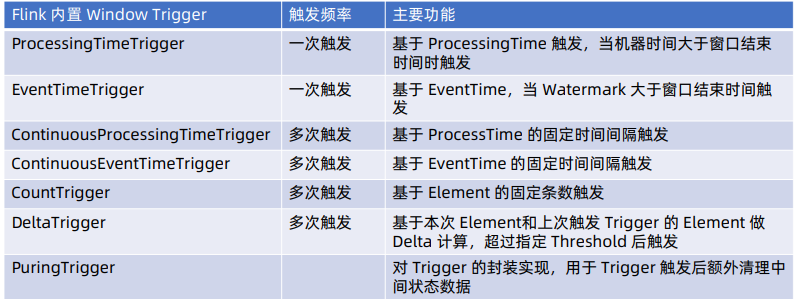

默认使用EventTimeTrigger,即通过水印时间判断是否进行计算。

ContinuousEventTime: 会根据两次eventtime间隔判断是否计算，属于append模式，需要调用PuringTrigger.of()清理窗口中的数据状态

#### Window Evictor

数据剔除器

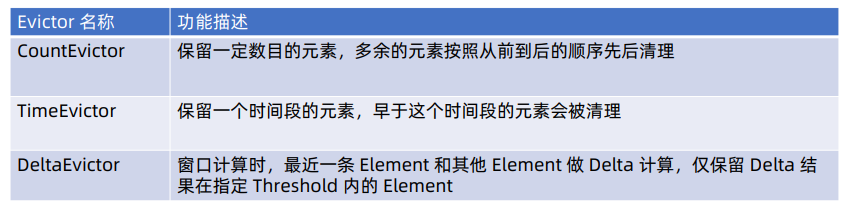

Evictor接口包含两个方法：evictBefore / evictAfter,自定义实现该接口可以实现，在windowfunction前后的一些数据清理工作。

#### Window Function

+ Window Function: sum/max/min
  + ReduceFunction
  + Aggregation: 高级的reduce
  + Fold

+ Window Process Function:  process(全量数据处理) 对window中所有数据进行一次计算。

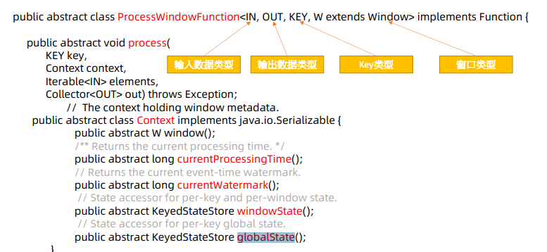


### 多流合并

+ window join

  多流共用一个窗口，进行join。

  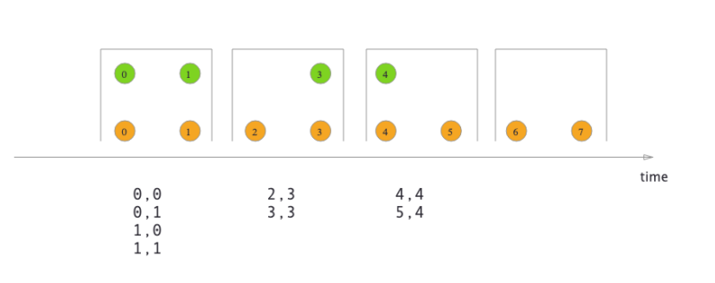

  stream api:

  ```java
  streamA.join(streamB)
      .where() // join 字段和条件
      .equalTo()
      .window(WindowAssigner)
      .apply(joinFunction)
  ```

  watermark的选取：多流取最小，单流取最大

  

+ interval join

​	仅支持EventTime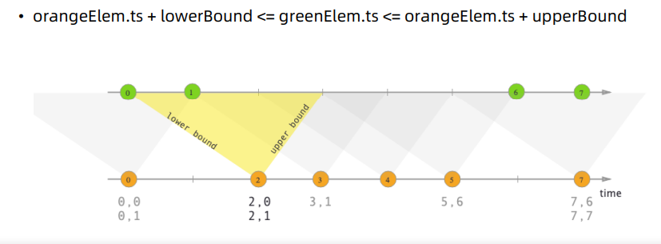

stream api:

```java
streamOne.intervalJoin(streamTwo)
    .between(Time,Time)
```


### Process Function

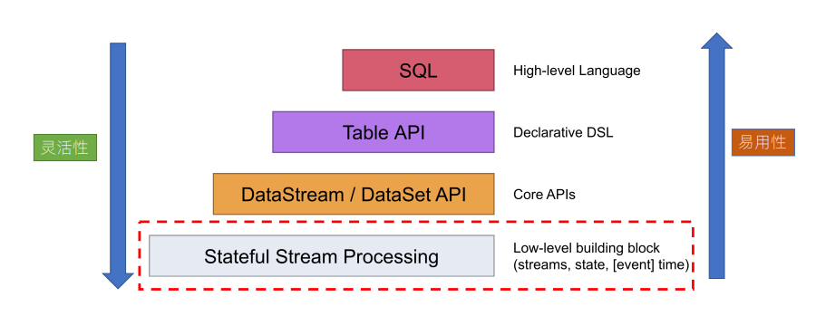

可以处理：

+ 事件（数据流元素） Event
+ 状态（容错和一致性） State
+ 定时器（事件时间和处理时间）Timer

Process Function

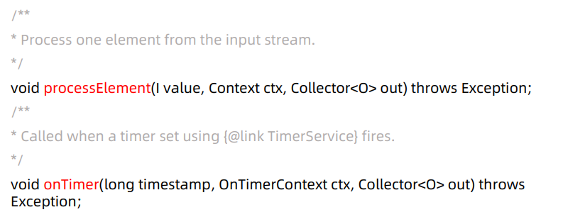

processElement中注册定时器：

```java
ctx.timeService().registerEventTimeTimer(current.lastModified+100)
```

e.g. ET中聚集处理函数（新数据触发或每小时15分钟出发）

```scala
package et.flink

class StationData2AggDataProcessFunction extends KeyedProcessFunction[(Int), (Int, StationData), (Array[RealTimeAggData])] with Logging {

    var aggState: ValueState[(AggContainer)] = _

    override def processElement(value: (Int, StationData),
                                ctx: KeyedProcessFunction[Int, (Int, StationData), Array[RealTimeAggData]]#Context,
                                out: Collector[Array[RealTimeAggData]]): Unit = {

        try {
            val stationData = value._2
            val meta = stationData.deviceDatas.headOption.map(_._2.deviceInfo.model)
            var input: AggContainer = null
            var output: Array[RealTimeAggData] = null

            logger.info(s"aggregation window added: ${stationData.station.id}-${stationData.station.name}-${stationData.acqTime}")

            if (aggState.value() != null) {
                //如果aggState不为null 赋值给input
                input = aggState.value()
            } else {
                input = AggWindowFactory.window(value._1, stationData.station.factor.protoCode, meta)
                //设置定时的触发时间为下一个小时15分钟
                val calendar = Calendar.getInstance()
                calendar.set(Calendar.HOUR_OF_DAY, calendar.get(Calendar.HOUR_OF_DAY) + 1) //小时+1
                calendar.set(Calendar.MINUTE, 15)
                calendar.set(Calendar.SECOND, 0)
                calendar.set(Calendar.MILLISECOND, 0)
                val time = calendar.getTime.getTime //获取当前时间的下一小时15分钟
                ctx.timerService().registerEventTimeTimer(time)
            }
            //计算
            output = input.add(stationData)
            //更新缓存
            aggState.update(input)
            if (output.nonEmpty)
            logger.info(s"aggregation data: ${output.mkString(",")}")
            //抛出
            out.collect(output)

            //给缓存重新赋值
        } catch {
            case e: Exception =>
        }
    }


    override def open(parameters: Configuration): Unit = {
        aggState = getRuntimeContext.getState[(AggContainer)](
            new ValueStateDescriptor[(AggContainer)]("AggStationDataFunction", classOf[(AggContainer)])
        )
    }

    override def onTimer(timestamp: Long,
                         ctx: KeyedProcessFunction[Int, (Int, StationData), Array[RealTimeAggData]]#OnTimerContext,
                         out: Collector[Array[RealTimeAggData]]): Unit = {

        //重新注册定时器
        try {
            val time = System.currentTimeMillis() + 3600 * 1000
            ctx.timerService().registerEventTimeTimer(time)

            if (aggState.value() != null) {
                var input = aggState.value()
                val now = DateTime.now
                val triggerTime = now.withMinuteOfHour(0).withSecondOfMinute(0).withMillisOfSecond(0)
                val result = input.add(StationData(null, triggerTime, "_timing", None))
                //  更新state
                aggState.update(input)
                out.collect(result)
            }
        } catch {
            case e: Exception =>
                logger.error("StationData2AggDataProcessFunction onTimer have error ，reason is：" + e.printStackTrace())
        }
    }
}

```


## Day 4

### 旁路输出

1.7版本之前支持 SplitStream

```java
sc= stream.split(OutputSelector());
sc.select(KEY1).addSink();
sc.select(KEY2).Process();
```

SideOutput (在ProcessFunction中处理标签化，可以按不同的格式类型输出)。

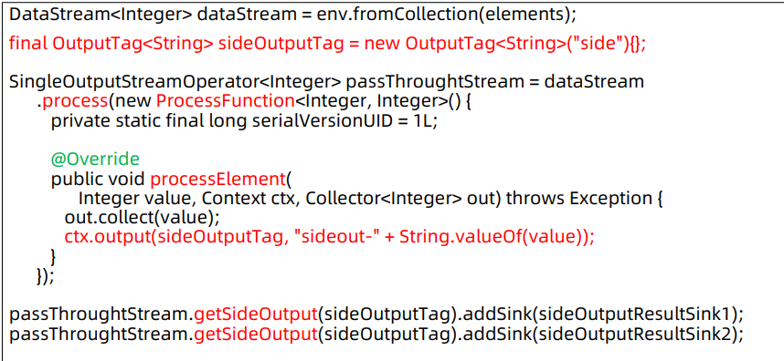

```scala
```


### 异步函数

查询外部数据库，对数据的补充（例如读取测点配置）的耗时操作。

可以通过异步操作 Async. I/O 提高吞吐量。

```java
public interface AsyncFunction<IN,OUT> extends Function,Serializable {
    // trigger async operation for each stream input
    void asyncInvoke(IN in,ResultFuture<OUT> resultFuture) throws Exception;
    
    // timeout handle
    default void timeout(IN in,ResultFuture<OUT> result) throw Exception{
        result.completeExceptionally(
         new TimeoutException("async function call has timed out."));
    }
}
```

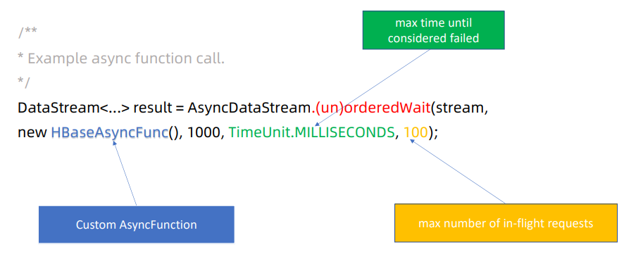

几个参数：异步处理函数；最大超时时间；最大等待队列(buff池 in-flight requests)；


### DataStream结构

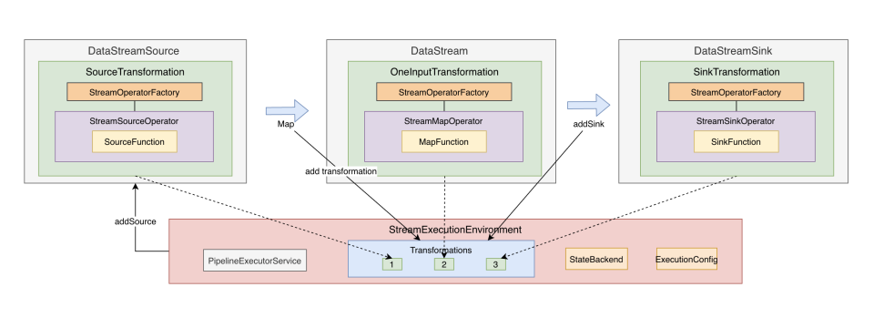

上图，Source->DataStream->Sink的通用过程，每个过程的transformation会记录到Env的transformation队列中。Transformation中包括具体算子的生成工厂，在执行的时候通过该工厂生成对应的算子操作；

其他概念：DataFlow 、 StreamGraph/ JobGraph、DAG。

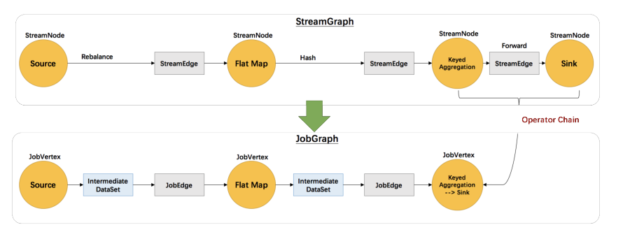


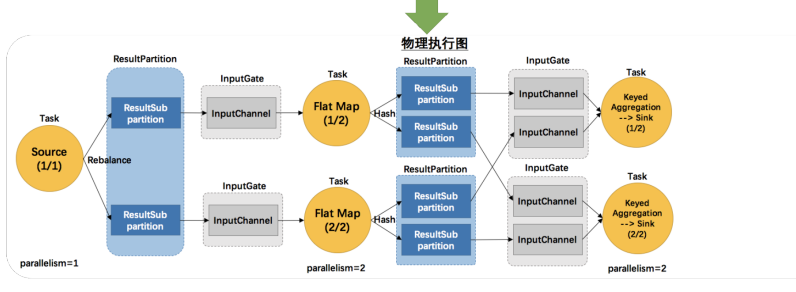


### 类型系统 TypeInformation

基础类型、数组类型、复合类型(Tuple/Row/POJO)、辅助类型（Option/Map..）、泛型和其他（通过Kyro提供序列化支持）。

Values类型（ByteValue/IntValue/... 性能上一些升级）。

Table转DataStream的时候需要手动创建TypeInformation：

```java
DataStream<Row> s=env.toAppendStream(result,Types.ROW(Types.INI,Types.SQL_TIMESTAMP))
```


### SourceFunction

```java
public interface SourceFunction<T> extends Function, Serializable {
    void run(SourceFunction.SourceContext<T> var1) throws Exception;

    void cancel();

    @Public
    public interface SourceContext<T> {
        void collect(T var1);

        @PublicEvolving
        void collectWithTimestamp(T var1, long var2);

        @PublicEvolving
        void emitWatermark(Watermark var1);

        @PublicEvolving
        void markAsTemporarilyIdle();

        Object getCheckpointLock();

        void close();
    }
}
```

Flink 1.11 开始对批处理InputFormat和流处理SourceFunction做整合，实现流批一体操作，主要概念：Split、SplitEnumerator（JM上的分批处理）、SourceReader（TM上）。批处理时当文件读取完毕，SplitEnumerator会发送NoMoreSplits到Reader。


### 项目实战

电商PV/UV项目


## Day 5

有状态计算

+ Raw State
  + 用户自行处理：序列化、反序列化。仅支持byte[]数据。

+ Managed State
  + flink Runtime处理
  + 分为
    + Operator State
      + 实现CheckpointedFunction或ListCheckpointed接口创建
      + 横向拓展：状态重分配问题
      + ListState/BroadcastState
    + Keyed State
      + 只能用于KeyedStream
      + 每个Key对应一个状态
      + 一般在RichFunction中通过runtime获取调用
      + ValueState/ListState/ReducingState/AggregationState,MapState

