## Day 6

### Operator State

和Keyed State相对. 支持状态的重新分布，不常用，主要用于Source和Sink，例如KafkaConsumer中offset的管理。

+ ListState
+ UnionListState
+ BroadcastState

两种定义：

+ 实现CheckpointedFunction接口
+ 实现ListCheckpointed接口定义（已废弃）

通过operatorState实现BufferSink

```java
class BufferingSinkFunction
        implements SinkFunction<Tuple2<String, Integer>>,
        CheckpointedFunction {

    private final int threshold;

    // operator state
    private transient ListState<Tuple2<String, Integer>> checkpointedState;

    private List<Tuple2<String, Integer>> bufferedElements;

    public BufferingSinkFunction(int threshold) {
        this.threshold = threshold;
        this.bufferedElements = new ArrayList<>();
    }

    @Override
    public void invoke(Tuple2<String, Integer> value, Context contex) throws Exception {
        bufferedElements.add(value);
        if (bufferedElements.size() == threshold) {
            for (Tuple2<String, Integer> element : bufferedElements) {
                // send it to the sink
            }
            bufferedElements.clear();
        }
    }

            // CheckpointedFunction 将数据存储到checkpoint state中
    @Override
    public void snapshotState(FunctionSnapshotContext context) throws Exception {
        checkpointedState.clear();
        for (Tuple2<String, Integer> element : bufferedElements) {
            checkpointedState.add(element);
        }
    }

            // CheckpointedFunction 从checkpoint中加载数据
    @Override
    public void initializeState(FunctionInitializationContext context) throws Exception {
        ListStateDescriptor<Tuple2<String, Integer>> descriptor =
                new ListStateDescriptor<>(
                        "buffered-elements",
                        TypeInformation.of(new TypeHint<Tuple2<String, Integer>>() {
                        }));

        checkpointedState = context.getOperatorStateStore().getListState(descriptor);

        if (context.isRestored()) {
            for (Tuple2<String, Integer> element : checkpointedState.get()) {
                bufferedElements.add(element);
            }
        }
    }
}
```


### Broadcast State

常用在动态规则（例如告警规则更新事件）、数据丰富过程。要求广播的数据吞吐量较低。

```java
...
KeyedStream<Action, Long> actionsByUser = actions
                .keyBy((KeySelector<Action, Long>) action -> action.userId);

        MapStateDescriptor<Void, Pattern> bcStateDescriptor =
                new MapStateDescriptor<>("patterns", Types.VOID, Types.POJO(Pattern.class));

        BroadcastStream<Pattern> bcedPatterns = patterns.broadcast(bcStateDescriptor);

        DataStream<Tuple2<Long, Pattern>> matches = actionsByUser
                .connect(bcedPatterns) // 用户行为流和操作规则流connect
                .process(new PatternEvaluator());
...

public static class PatternEvaluator
            extends KeyedBroadcastProcessFunction<Long, Action, Pattern, Tuple2<Long, Pattern>> {

        // handle for keyed state (per user)
        ValueState<String> prevActionState;
        // broadcast state descriptor
        MapStateDescriptor<Void, Pattern> patternDesc;

        @Override
        public void open(Configuration conf) {
            // initialize keyed state
            prevActionState = getRuntimeContext().getState(
                    new ValueStateDescriptor<>("lastAction", Types.STRING));
            patternDesc =
                    new MapStateDescriptor<>("patterns", Types.VOID, Types.POJO(Pattern.class));
        }

        /**
         * Called for each user action.
         * Evaluates the current pattern against the previous and
         * current action of the user.
         */
        @Override
        public void processElement(
                Action action,
                ReadOnlyContext ctx,
                Collector<Tuple2<Long, Pattern>> out) throws Exception {
            // get current pattern from broadcast state
            Pattern pattern = ctx
                    .getBroadcastState(this.patternDesc)
                    // access MapState with null as VOID default value
                    .get(null);
            // get previous action of current user from keyed state
            String prevAction = prevActionState.value();
            if (pattern != null && prevAction != null) {
                // user had an action before, check if pattern matches
                if (pattern.firstAction.equals(prevAction) &&
                        pattern.secondAction.equals(action.action)) {
                    // MATCH
                    out.collect(new Tuple2<>(ctx.getCurrentKey(), pattern));
                }
            }
            // update keyed state and remember action for next pattern evaluation
            prevActionState.update(action.action);
        }

        /**
         接收到广播流
         * Called for each new pattern.
         * Overwrites the current pattern with the new pattern.
         */
        @Override
        public void processBroadcastElement(
                Pattern pattern,
                Context ctx,
                Collector<Tuple2<Long, Pattern>> out) throws Exception {
            // store the new pattern by updating the broadcast state
            BroadcastState<Void, Pattern> bcState = ctx.getBroadcastState(patternDesc);
            // storing in MapState with null as VOID default value
            bcState.put(null, pattern);
        }
    }
```

注意：

1. 广播流侧(processBroadcastElement)可以修改broadcast state。数据流侧（processElement）只能读broadcast state。
2. 目前broadcast state只支持存储在内存中。


### 容错

状态计算函数，通过检查点（checkpoint）将算子中的数据异步存储到文件系统中。

基于异步屏障快照方法实现。

实现AtleastOnce和ExactlyOnce容错。

JM中checkpoint coordinator触发source节点task的checkpoint动作，source节点向下游广播`barrier`。当task完成备份后会将备份数据的地址（state handle）通知给checkpoint coordinator。JM的checkpoint coordinator再将checkpoint元数据持久化。

`barrier`（栅栏）将datastream分段进行checkpoint。算子之间会进行align（对齐）操作，会照成task的一定阻塞。Unaligned Checkpoint（>1.11）做了优化。

```java
StreamExecutionEnvironment enableCheckpointing(long interval,CheckpointingMode mode)
```

```java

        //获取flink的运行环境
        StreamExecutionEnvironment env = StreamExecutionEnvironment.getExecutionEnvironment();

        // 每隔1000 ms进行启动一个检查点【设置checkpoint的周期】
        env.enableCheckpointing(1000);
        // 高级选项：
        // 设置模式为exactly-once （这是默认值）
        env.getCheckpointConfig().setCheckpointingMode(CheckpointingMode.EXACTLY_ONCE);
        // 确保检查点之间有至少500 ms的间隔【checkpoint最小间隔】
        env.getCheckpointConfig().setMinPauseBetweenCheckpoints(500);
        // 检查点必须在一分钟内完成，或者被丢弃【checkpoint的超时时间】
        env.getCheckpointConfig().setCheckpointTimeout(60000);
        // 同一时间只允许进行一个检查点
        env.getCheckpointConfig().setMaxConcurrentCheckpoints(1);
        // 表示一旦flink处理程序被cancel后，会保留Checkpoint数据，以便根据实际需要恢复到指定的Checkpoint
        //ExternalizedCheckpointCleanup.RETAIN_ON_CANCELLATION:表示一旦Flink处理程序被cancel后，会保留Checkpoint数据，以便根据实际需要恢复到指定的Checkpoint
        //ExternalizedCheckpointCleanup.DELETE_ON_CANCELLATION: 表示一旦Flink处理程序被cancel后，会删除Checkpoint数据，只有job执行失败的时候才会保存checkpoint
  env.getCheckpointConfig().enableExternalizedCheckpoints(CheckpointConfig.ExternalizedCheckpointCleanup.RETAIN_ON_CANCELLATION);

        //设置statebackend
        env.setStateBackend(new FsStateBackend("file://" + System.getProperty("user.dir") + "/WorkSpace/checkpoints"));
//        env.setStateBackend(new FsStateBackend("hdfs://node02:8020/com.elephent.flink/checkpoints"));

```


### Savepoint

特殊的checkpoint。人为干预的检查点（保存点）。checkpoint目标是程序异常时保存状态以恢复，savepoint是人为停机维护时进行。checkpoint时flink runtime自发管理和触发，savepoint是用户手动触发。checkpoint支持增量更新，较轻量。Savepoint会长久持久化，作业可以人为地从Savepoint中恢复。

```sh
bin/flink savepoint :jobId [:targetDirectory]
bin/flink cancle -s [:targetDirectory] :jobId # cancel job时savepoint
bin/flink run -s :savepointPath [:runArgs] # 从savepoint中恢复
```

在flink-conf.yaml中设定：

```yaml
state.savepoints.dir: hdfs:///flink/savepoints
```

通常需要指定算子的uid，才能做代码升级过程中的savepoint，实现向下兼容。

```scala
val stream=env
.addSource(new StatefulSource())
.uid("sourceid")
.shuffle()
.map(new StatefulMapper())
.uid("mapperid")
.print()
```


### StateBackend

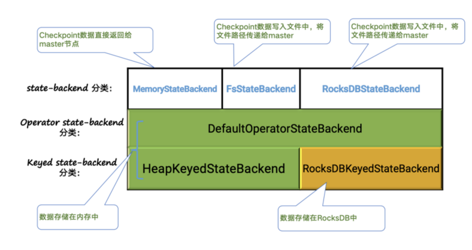

分为MemoryStateBackend (jobmanager)/FsStateBackend (filesystem)/RocksDBStateBackend (rocksdb)（K-V）。

JVM Heap -> FileSystem

RocksDB -> FileSystem在使用rocksdb作为backend的时候，需要在项目中引入

```xml
<dependency>
    <groupId>org.apache.flink</groupId>
    <artifactId>flink-statebackend-rocksdb_2.11</artifactId>
    <version>${flink.version}</version>
</dependency>
```

在flink-conf.yaml中配置 `state.backend.incremental: true` 实现rocksdb的增量检查点保存。

```java
env.setStateBackend(new RocksDBStateBackend("file://...").configure(conf,classLoader))
```


### State Schema Evolution

状态架构升级。

POJO type字段增删,Flink支持它的模式演进。

Avro types Flink完全支持其模式状态演进。 Kryo不支持模式演进。

其他：用户自己定义序列化工具。

```java
ValueStateDescriptor<MyStateType> desc=
                new ValueStateDescriptor<MyStateType>(
                        "mystatetype",
                        new SerializerV1()
                );
```


State serialization 分为 in heap-based和off-heap两种模式。rockdbs是off-heap模式。


### Querable State

可查询状态。

不需要事先写入到外围存储介质，直接通过rpc到taskmanager获取state统计数据。(将flink系统作为数据库使用。)

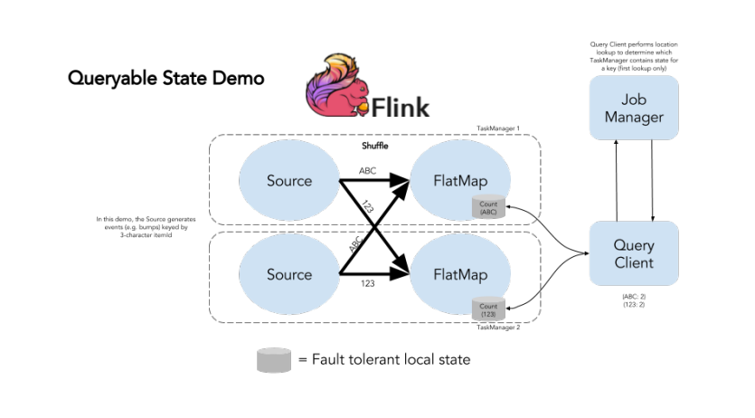

flink-conf.yaml

```yaml
querable-state.enable: true
```

添加flink querable支持

```sh
cp ${FLINK_HOME}/opt/flink-qurable-state-runtime_2.11-1.11.0.jar  ${FLINK_HOME}/lib/
```

重启flink集群,TM日志：

```sh
》Started Queryable State Server @ /x.x.x.x:9067
> Started Queryable State Proxy @ /x.x.x.x:9096
```

应用代码中 KeyedStream -> QueryableStream.


### 交易欺诈项目

先跑起来：[windows安装docker](https://www.cnblogs.com/yunfeifei/p/13158845.html)

```sh
#Powershell
Enable-WindowsOptionalFeature -Online -FeatureName Microsoft-Windows-Subsystem-Linux
Enable-WindowsOptionalFeature -Online -FeatureName VirtualMachinePlatform
wsl --set-default-version 2
# 商店中安装ubuntu
# https://docs.microsoft.com/en-us/windows/wsl/install-manual#downloading-distributions
# WslRegisterDistribution failed with error: 0x800701bc
# 下载最新wsl2 linux支持包 https://wslstorestorage.blob.core.windows.net/wslblob/wsl_update_x64.msi
# WslRegisterDistribution failed with error: 0x80370102
# 未启用虚拟化，进入BIOS设置
# 不受支持的控制台设置.若要使用此功能,必须禁用旧的控制台
# 

sudo apt-get install apt-transport-https ca-certificates curl gnupg2 software-properties-common

# 信任 Docker 的 GPG 公钥：
#curl -fsSL https://download.docker.com/linux/ubuntu/gpg | sudo apt-key add -

cp /etc/apt/sources.list /etc/apt/sources.list.bak

echo "deb http://mirrors.aliyun.com/ubuntu/ focal main restricted
deb http://mirrors.aliyun.com/ubuntu/ focal-updates main restricted
deb http://mirrors.aliyun.com/ubuntu/ focal universe
deb http://mirrors.aliyun.com/ubuntu/ focal-updates universe
deb http://mirrors.aliyun.com/ubuntu/ focal multiverse
deb http://mirrors.aliyun.com/ubuntu/ focal-updates multiverse
deb http://mirrors.aliyun.com/ubuntu/ focal-backports main restricted universe multiverse
deb http://mirrors.aliyun.com/ubuntu/ focal-security main restricted
deb http://mirrors.aliyun.com/ubuntu/ focal-security universe
deb http://mirrors.aliyun.com/ubuntu/ focal-security multiverse">/etc/apt/sources.list
apt update && apt upgrade -y

$ curl -fsSL https://get.docker.com -o get-docker.sh
$ sudo sh get-docker.sh
$ sudo service docker start

# 安装docker-compose
curl -L https://get.daocloud.io/docker/compose/releases/download/1.12.0/docker-compose-`uname -s`-`uname -m` > /usr/local/bin/docker-compose

chmod +x /usr/local/bin/docker-compose
docker-compose version

　　
docker images
docker search nginx

#最简单的测试方法，运行docker的helloworld，命令如下：

docker run hello-world
#这里使用了nginx的镜像进行了测试，命令如下：

docker pull nginx
docker run --name nginx -p 8080:80 -d nginx
```


docker-compose的配置

```yaml
　　version: '2' # docker 的版本

　　services: # 配置的容器列表

　　CONTAINER_NAME: # 容器的名称

　　image: BASE_IMAGE # 这个一个容器的基础镜像

　　ports: # 你的容器需不需要做端口映射

　　- "host_port:container_port"

　　volumes: # 数据卷配置

　　- host_dir:container_dir

　　environment: # 环境变量(map 的配置方式 key: value)

　　PARAM: VALUE

　　environments: # 环境变量(数组的配置方式 - key=value)

　　- PARAM=VALUE

　　restart: always # 容器的重启策略

　　dns: # dns 的配置

　　- 8.8.8.8
```


cb() never called!

```sh
1、经典四连击
npm cache clean -f
npm install -g n --force
npm stable

npm install

2、删除package-lock.json再安装（建议先备份）

3、更改为淘宝的镜像源后再安装
一、安装cnpm
npm install -g cnpm --registry=https://registry.npm.taobao.org
二、cnpm install
三、cnpm start运行
使用cnpm安装的依赖库文件名和npm相差很大，不过反正一般而言不会看依赖库源码，不必理会
```

在WSL子系统中安装

```sh
# 安装nodejs
curl -fsSL https://deb.nodesource.com/setup_16.x | sudo -E bash -
sudo apt install -y nodejs
node -v

npm cache clear --force
npm install -g npm@latest
npm install -g cnpm --registry=https://registry.npm.taobao.org
cnpm install

# windows shell
cd D:\coding\github\geektime-Flink-master\project-2-fraud-detection\webapp
npm run server
```


## Day 7

Flink Table/SQL API 是更高阶的API

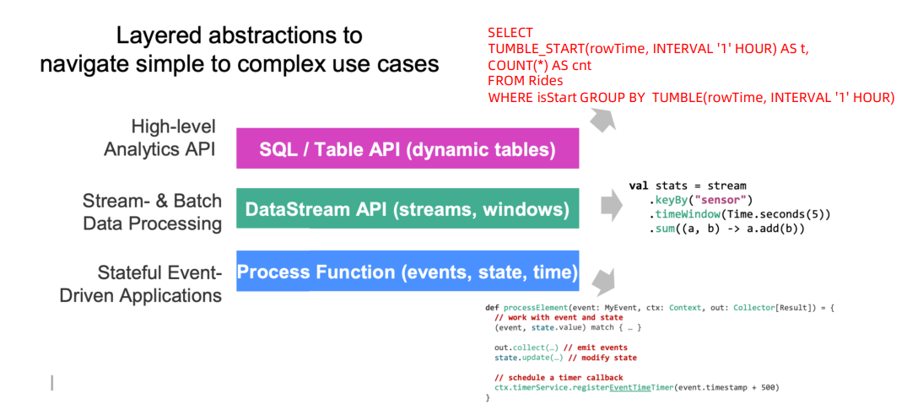

**声明式编程**（英语：Declarative programming）是一种编程范式，与命令式编程相对立。

实现批流一体，SQL同时支持DataSet和DataStream。

应用场景：

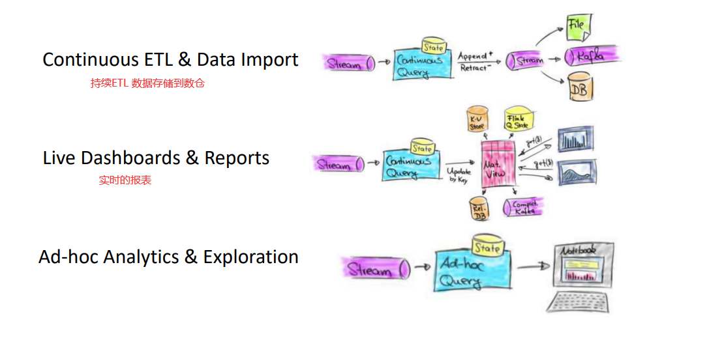

### 概念

Flink中存在两个计划器(Planner)（一个原来的，一个Blink集成进来的）。

Blink Planner会将Table批作业也转换成DataStream。


代码结构：

```java
TableEnvironment tableEnv=...;
tebleEnv.connet(...).createTemporaryTable("table1");
tebleEnv.connet(...).createTemporaryTable("table2");
// 通过Table API创建表
Table tablResult=tableEnv.from("table1").select(...);
// 通过SQL API查询创建表
Table sqlReult=tableEnv.sqlQuery("SELECT... FROM table1...");
Table tableResult=tapiResult.executeInsert("outputTable");

// Table API查询数据
Table orders=tableEnv.from("table1");
Table revenue=orders.filter($("country").isEqual("FRANCE")).groupBy($("name"))
    .select($("name"),$("revenue").sum().as("revSum"));
// 结果输出到csv
final Schema schema=new Schema().field("a",DataTypes.INT());
// 将csv注册成一张表
tableEnv.connect(new FileSystem().path(""))
    .withFormat(new Csv()
               .fieldDelimiter(',')
               .deriveSchema()
               .withSchema(schema)
               .createTemporaryTable("csvSinkTable"));
revenue.executeInsert("csvSinkTable");

tableEnv.execute("job1");
```

TableEnvironment:

```java
// 在内部的catalog中注册table
// 注册到外部的catalog
// 加载可插拔模块 (例如加载flink/blink planner)
// 执行SQL查询
// 注册自定义函数 (scalar/table/aggregation)
// 将DataStream、DataSet转换成Table

// 处理流式数据例子：
EnvironmentSettings fsSettings=
    EnvironmentSettings.newInstance().useOldPlanner().InStreamingMode().build();
StreamExecutionEnvironment env=StreamExecutionEnvironment.getExecutionEnvironment();
StreamTableEnvironment fsTableEnv=StreamTableEnvironment.create(env,fsSettings);
```


### DataSet/DataStream <=> Table

```scala
val table=tableEnv.fromDataStream(stream) // 生成默认列 f0,f1...
val table=tableEnv.fromDataStream(stream,$("field1"),$("field2"))

// 注册临时试图
tableEnv.createTemporaryView("mytable",stream)

// Table 转 DataStream
// 1. Append Mode 仅当动态Table仅通过INSERT更改时，才可以使用该模式
// 2. Retract Mode. 使用bool值对insert/delete操作的数据进行标记
val dsRow=tableEnv.toAppendStream(table,Row.class)
// Tuple2<Bool,Row> bool=true insert、 false delete
val retractStream=tableEnv.toRetractStream(table,Row.class)

// 字段映射： 基于位置的映射 和 基于名称的映射
val table=tableEnv.fromDataStream(stream,$("field1"),$("field2"))
val table=tableEnv.fromDataStream(stream,$"_2".as("field1"),$"_1".as("field2"))
```


### Table Connector

分为TableSource和TableSink

```scala
tableEnv
.connect(...) // 连接器 如kafka
.withFormat(...) // 格式 如json
.withSchema(...) // 表结构
.inAppendMode(...) // update mode
.createTemporaryTable("table") // registry table
```

Flink SQL Client客户端中可以通过yaml文件中配置提前注册一些表进入：

```yaml
tables:
  - name: UserTable
    type: source
    connector:
      type: kafka
      version: "0.10"
      topic: user
      stratup-mode: earliest-offset
      properties:
        bootstrap.servers: localhost:9092
    format:
      type: json
      schema:
        - name: rowtime
          data-type: TIMESTAMP(3)
          rowtime:
            timestamps:
              type: from-field
              from: ts
            watermarks:
              type: periodic-bounded
              delay: "60000"
        - name: user
          data-type: BIGINT
        - name: message
          data-type: STRING
```

官方连接器：

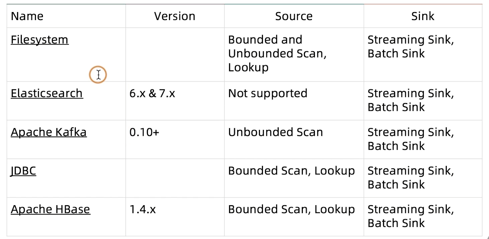

### 动态表查询

流式数据转换成Table后是动态的，查询动态表会生成一个连续查询，查询不断更新其结果表。

**物化视图**(Materialized Views) 会缓存查询的结果。防止缓存过期，有即时视图维护的机制。


带窗口Windows的SQL查询、普通regular查询。普通查询可能导致

+ 避免内存无限增长。必须定义 State Clean-Up timeout
+ 避免输入触发全量计算。

数据流类型：

1. Append-Only
2. Retract流 （update <> delete + insert）
3. Upsert流 ( upsert + delete)


## Day 8

### 时间定义

```java
// 在环境中指定使用哪种类型时间
env.setStreamTimeCharacteristic(TimeCharacteristic.ProcessingTime); // default
```

**Processing Time**

1. DDL中定义ProcessingTime

```sql
CREATE TABLE user_actions (
user_name STRING,
data STRING,
user_action_time AS PROCTIME() -- 声明一个额外的列作为处理时间属性
) WITH (
...
);
```

2. DataStream转Table过程中指定

   ```java
   Table table = tEnv.fromDataStream(stream, $("user_name"), $("data"),
   $("user_action_time").proctime());
   WindowedTable windowedTable = table.window(
   Tumble.over(lit(10).minutes())
   .on($("user_action_time"))
   .as("userActionWindow"));
   ```

3. 自定义TableSource时指定

   ```java
   public class X implements StreamTableSource<Row>,DefinedProctimeAttribute {
       @Override
       public String getProctimeAttribute() {
       // 这个名字的列会被追加到最后
       return "user_action_time";
       }
   }
   ```

**EventTime**

1. DDL中定义

   ```sql
   CREATE TABLE user_actions (
       user_action_time TIMESTAMP(3),
       -- 声明 user_action_time 是事件时间属性，并且用 延迟 5 秒的策略来生成 watermark
       WATERMARK FOR user_action_time AS user_action_time - INTERVAL '5' SECOND
   ) WITH (
   ...
   );
   ```

   

2. DataStream转Table过程中指定

   ```java
   // 在datastream中指定
   inputStream.assignTimestampsAndWatermarks(...)
   ```

   

3. Tablesource定义

   ```java
   public class X implements StreamTableSource<Row>,DefinedRowtimeAttributes {
       @Override
       public List<RowtimeAttributeDescriptor> getRowtimeAttributeDescriptors() {
       RowtimeAttributeDescriptor rowtimeAttrDescr = new RowtimeAttributeDescriptor(
       "user_action_time",
       new ExistingField("user_action_time"),
       new AscendingTimestamps());
       List<RowtimeAttributeDescriptor> listRowtimeAttrDescr = Collections.singletonList(rowtimeAttrDescr);
       return listRowtimeAttrDescr;
       }
   }
   ```

   

### 基于时间条件的查询

Temporal Operators

输入为Append-only，输出也是Append-only, 查询条件含有时间关联的条件和算子：

+ group by window

  ```sql
  SELECT user,
  TUMBLE_END(cTime, INTERVAL '1' HOURS) AS endT,
  COUNT(url) AS cnt
  FROM clicks
  GROUP BY TUMBLE(cTime, INTERVAL '1' HOURS), user
  -- HOP滑动窗口 SESSION会话窗口
  ```

  

+ over window

  某一个事件发生之前（后）窗口统计.

  每条数据都会去触发窗口计算。

  ```sql
  SELECT
  user,
  url,
  COUNT(*) OVER w
  FROM clicks
  WINDOW w AS (
  PARTITION BY url
  ORDER BY cTime
  RANGE BETWEEN INTERVAL ’2’ HOUR PRECEDING AND
  CURRENT ROW)
  ```

  

+ time-windowed join

+ Join with a temporal table

+ pattern matching


Interval Join关联查询：

需要至少一个等值谓词(equi-join)和限制时间的join条件：

```sql
select * FROM Orders o,Shipments s
Where o.id = s.orderId
and o.ordertime Between s.Shiptime-INTERVAL '4' HOUR AND s.shiptime
```


Join表函数（UDTF User Defined Table Function）.e.g.

```sql
SELECT users, tag FROM Orders, LATERAL TABLE(unnest_udtf(tags)) AS t(tag)
```

和时态表的关联*（Temporal Tables），主要用于维表关联

```sql
SELECT o.amout,
o.currency,
r.rate,
o.amount * r.rate
FROM Orders AS o JOIN LatestRates
FOR SYSTEM_TIME AS OF o.proctime AS r ON r.currency = o.currency
```


### 时态表函数关联

join with temporal table function. 

时态表代表某个时间点的快照数据。e.g 最新汇率表查询。

```java
// 汇率数据流。使用processing time
val ratesHistory = tEnv.fromDataStream(ratesHistoryStream,$("r_currency"), $("r_rate"), $("r_proctime").proctime());
tEnv.createTemporaryView("RatesHistory", ratesHistory);
// 创建和注册时态表函数
// 指定 "r_proctime" 为时间属性，指定 "r_currency" 为主键
val rates = ratesHistory.createTemporalTableFunction("r_proctime","r_currency"); // <==== (1)
tEnv.registerFunction("Rates", rates); 
```


### 时态表关联

不同于时态表函数，它可以直接查询：

```sql
SELECT * FROM LatestRates FOR SYSTEM_TIME AS OF TIME ‘11:50';
```

必须是实现LookupableTableSource接口、仅支持BlinkPlanner、仅支持SQL、不支持EventTime（目前）。


### Catalog

Flink Table中元数据的管理。临时的(UDF)或持久化（Hive Metastore）的.

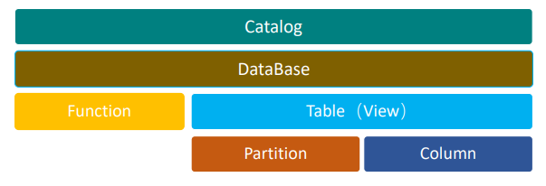

主要的类型有：

+ GenericInMemoryCatalog
+ JdbcCatalog (PostgreSQL)
+ HiveCatalog 
+ Custom Catalog

在Flink SQL架构中的位置：

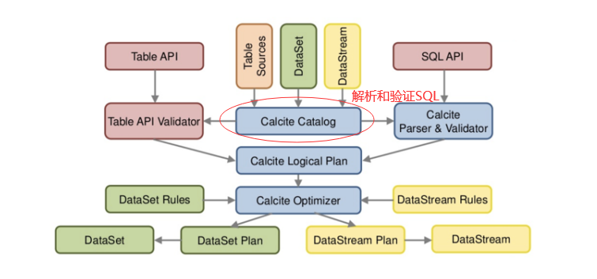

操作：

```sql
TableEnvironment tableEnv = ...
// Create a HiveCatalog
Catalog catalog = new HiveCatalog("myhive", null, "<path_of_hive_conf>");
// Register the catalog
tableEnv.registerCatalog("myhive", catalog);
// Use the caltalog
tableEnv.useCatalog("myCatalog");
// Create a catalog database
tableEnv.executeSql("CREATE DATABASE mydb WITH (...)");
```

其他操作：创建删除Database、Table、Function、View、Partition等。不建议使用，一般通过DDL直接操作。


### ApachHive集成

1. 利用Hive Metastore持久化Catalog
2. 直接读取Hive表

需要集成包： flink-sql-connector-hive-1.2.2.jar. (flink-connetor-hive_2.11-1.11.2.jar + hive-exec-2.3.4.jar)

Is_Generic区分Hive Catalog功能是 `Hive-compatible` (可读写Hive数据) 还是`Generic`（仅存储元数据）。

```sql
Flink SQL> set table.sql-dialect=hive; // default
```

HiveStreaming （类似数据湖概念）

增量写入（或读取）、或通过Temporal Table读取数据。

+ Write

  ```sql
  SET table.sql-dialect=hive;
  CREATE TABLE hive_table (
  user_id STRING,
  order_amount DOUBLE
  ) PARTITIONED BY (dt STRING, hr STRING)
  STORED AS parquet TBLPROPERTIES (
  'partition.time-extractor.timestamp-pattern'='$dt $hr:00:00',
  'sink.partition-commit.trigger'='partition-time',
  'sink.partition-commit.delay'='1 h',
  'sink.partition-commit.policy.kind'='metastore,success-file’
  );
      
  -- 创建kafka表
  SET table.sql-dialect=default;
  CREATE TABLE kafka_table (
  user_id STRING,
  order_amount DOUBLE,
  log_ts TIMESTAMP(3),
  WATERMARK FOR log_ts AS log_ts - INTERVAL '5'
  SECOND
  ) WITH (...);
      
  -- 写入
  -- streaming sql, insert into hive table
  INSERT INTO TABLE hive_table SELECT user_id, order_amount, DATE_FORMAT(log_ts, 'yyyy-MM-dd'),
  DATE_FORMAT(log_ts, 'HH') FROM kafka_table;
  -- batch sql
  SELECT * FROM hive_table WHERE dt='2020-05-20' and hr='12';
  ```

  

+ Read

  + Partition Table

    监听分区变化

  + Non-Partition Table

    监听分区内文件的变化

+ Hive Table 作为时态表


### SQL Client


可视化模式：

+ 表格模式 （分页表格）
+ 变更日志模式
+ Tableau模式 （类似传统数据库制表展示）

可以在配置文件中定义表、视图、函数、Catalog（需要事先定义）。

`sql-client-default.yaml`

```yaml
execution:
    planner: blink # 可选： 'blink' （默认）或 'old’
    type: streaming # 必选：执行模式为 'batch' 或 'streaming’
    result-mode: table # 必选：'table' 或 'changelog’
    max-table-result-rows: 1000000 # 可选：'table' 模式下可维护的最大行数（默认为 1000000，小于 1 则表示无限制）
    time-characteristic: event-time # 可选： 'processing-time' 或 'event-time' （默认） parallelism: 1 # 可选：Flink 的并
    行数量（默认为 1）
    periodic-watermarks-interval: 200 # 可选：周期性 watermarks 的间隔时间（默认 200 ms）
    max-parallelism: 16 # 可选：Flink 的最大并行数量（默认 128）
    min-idle-state-retention: 0 # 可选：表程序的最小空闲状态时间
    max-idle-state-retention: 0 # 可选：表程序的最大空闲状态时间
    current-catalog: catalog_1 # 可选：当前会话 catalog 的名称（默认为 'default_catalog’）
    current-database: mydb1 # 可选：当前 catalog 的当前数据库名称 # （默认为当前 catalog 的默认数据库）
    restart-strategy: # 可选：重启策略（restart-strategy）
    type: fallback # 默认情况下“回退”到全局重启策略
```


### DataType

作用：定义逻辑类型（JVM java/scala、python）、给Planner创建物理模型提示信息。

物理提示e.g.

```java
// 告诉运行时不要产生或者消费装箱的整数数组,而是使用基本数据类型的整数数组
DataType t = DataTypes.ARRAY(DataTypes.INT().notNull()).bridgedTo(int[].class);
```

Blink Planner中除了支持Flink的全部类型（TypeInformation），尤其包括：Time/TimeStamp/INTERVAL/ARRAY/MULTISET.

复合类型：

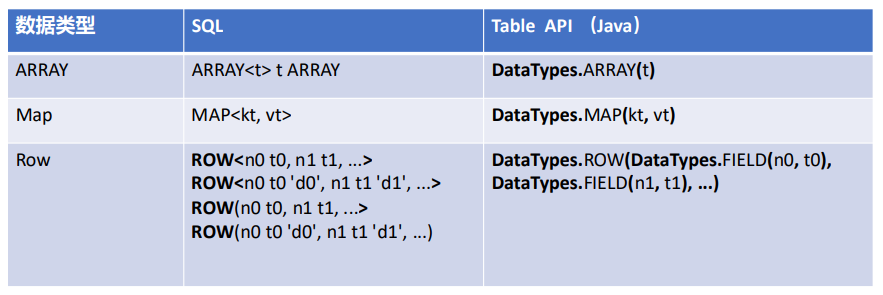

[数据类型官网](https://nightlies.apache.org/flink/flink-docs-release-1.14/docs/dev/table/types/)

自定义数据类型：

```scala
case class User(

    // extract fields automatically
    age: Int,
    name: String,

    // enrich the extraction with precision information
    @DataTypeHint("DECIMAL(10, 2)") totalBalance: java.math.BigDecimal,

    // enrich the extraction with forcing using a RAW type
    @DataTypeHint("RAW") modelClass: Class[_]
)

DataTypes.of(classOf[User])
```


## Day 9

函数类型：

+ 系统函数+Catalog函数
+ 临时函数和持久化函数

精确调用 catalog.mydb.myfunc(); 模糊调用 myfunc(); 模糊调用的顺序：临时系统函数->系统函数->临时Catalog函数（当前会话）->Catalog函数。

+ Scalar 函数。一对一输出
+ Aggregtaion 
+ Column 列操作的一些函数

系统已经内置的函数，参见官网：https://nightlies.apache.org/flink/flink-docs-release-1.14/docs/dev/table/functions/systemfunctions/


### 用户自定义函数

+ Scalar Function 例如 hash(str)
+ Table Function  例如 split(str)
+ Aggregation Function 例如max(price)
+ Table Aggregation Function 例如 Top2Accum()
+ Async Function 例如 lookup


e.g. scalar

```scala

// define function logic
class SubstringFunction extends ScalarFunction {
  def eval(s: String, begin: Integer, end: Integer): String = {
    s.substring(begin, end)
  }
}

val env = TableEnvironment.create(...)

//1 call function "inline" without registration in Table API 
env.from("MyTable").select(call(classOf[SubstringFunction], $"myField", 5, 12))

// register function
env.createTemporarySystemFunction("SubstringFunction", classOf[SubstringFunction])

//2 call registered function in Table API
env.from("MyTable").select(call("SubstringFunction", $"myField", 5, 12))

//3 call registered function in SQL
env.sqlQuery("SELECT SubstringFunction(myField, 5, 12) FROM MyTable")
```

e.g 自定义聚集函数

```scala
import org.apache.flink.configuration.Configuration
import org.apache.flink.table.api._
import org.apache.flink.table.functions.AggregateFunction

import java.lang

class main {
  val env=TableEnvironment.create(new Configuration());
  env.from("MyTable")
    .groupBy($"field")
    .select($"field",call(classOf[WeightedAvg],$"value",$"weight"))
}

case class WeightedAvgAccumulator(
                                 var sum:Long=0,
                                 var count:Int=0
                                 )


class WeightedAvg extends AggregateFunction[java.lang.Long,WeightedAvgAccumulator]{
  override def getValue(acc: WeightedAvgAccumulator): lang.Long = {
    return acc.sum/acc.count
  }

  override def createAccumulator(): WeightedAvgAccumulator = {
    WeightedAvgAccumulator()
  }

  def accumulate(acc: WeightedAvgAccumulator, iValue: java.lang.Long, iWeight: java.lang.Integer): Unit = {
    acc.sum += iValue * iWeight
    acc.count += iWeight
  }

  def retract(acc: WeightedAvgAccumulator, iValue: java.lang.Long, iWeight: java.lang.Integer): Unit = {
    acc.sum -= iValue * iWeight
    acc.count -= iWeight
  }

  def merge(acc: WeightedAvgAccumulator, it: java.lang.Iterable[WeightedAvgAccumulator]): Unit = {
    val iter = it.iterator()
    while (iter.hasNext) {
      val a = iter.next()
      acc.count += a.count
      acc.sum += a.sum
    }
  }

  def resetAccumulator(acc: WeightedAvgAccumulator): Unit = {
    acc.count = 0
    acc.sum = 0L
  }
}
```


### Connector

目前TableApi支持的连接器：

https://nightlies.apache.org/flink/flink-docs-release-1.14/docs/connectors/table/overview/

FileSystem、ES、Kafka、JDBC、HBase。

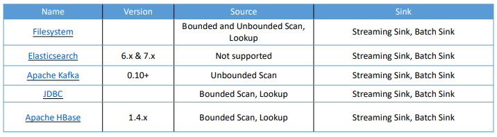

DDL中使用系统Connector：

```sql
CREATE TABLE MyUserTable (
  -- 定义表结构
  `user` BIGINT,
  `message` STRING,
  `rowtime` TIMESTAMP(3) METADATA FROM 'timestamp',    -- METADATA定义
  `proctime` AS PROCTIME(),    -- proctime 处理时间
  WATERMARK FOR `rowtime` AS `rowtime` - INTERVAL '5' SECOND    -- 定义水印
) WITH (
  -- declare the external system to connect to
  'connector' = 'kafka',
  'topic' = 'topic_name',
  'scan.startup.mode' = 'earliest-offset',
  'properties.bootstrap.servers' = 'localhost:9092',
  'format' = 'json'   -- declare a format for this system
)
```


### 自定义Table Connector

Flink TableAPI中通过Descriptor去定义，实现TableFactory接口。

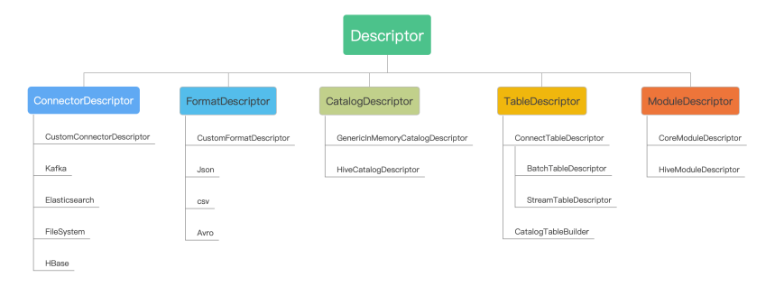

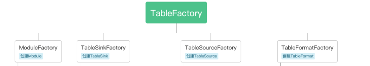


自定义的Connector通过java SPI（service provider interface）技术注册到Connector Descriptor中。

实现对应的TableSource/TableSink接口，再集成到对应的TableFactor中，然乎通过descriptor实现关键参数映射（connector-type等）。

### 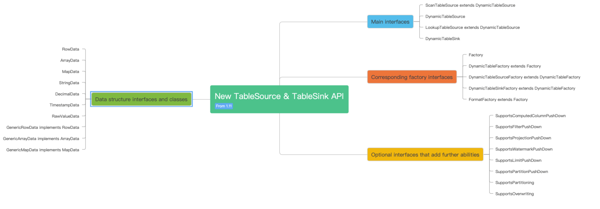

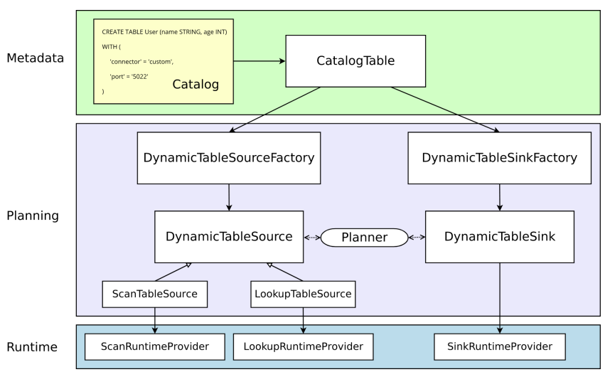


## Day 10

Flink Runtime整体架构

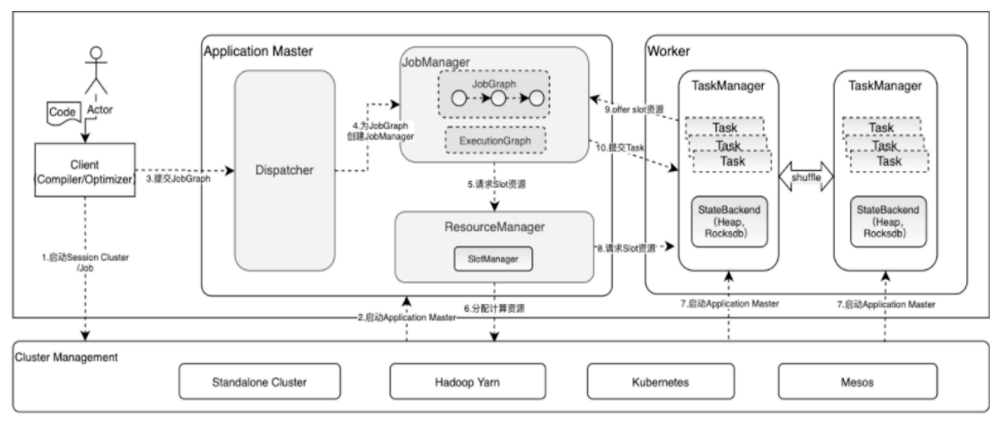


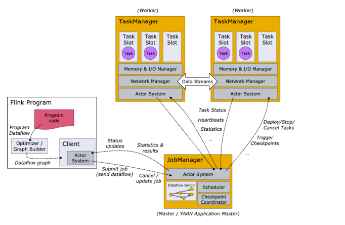

### Flink Client

主要作用： 运行代码，提取JobGraph；任务管理（提交、取消、savepoint、JobStatus Tack）、集群管理（创建、停止集群）；

主要组件：ContextEnvironment(执行环境)、PipelineExecutor（pipeline执行器）、ClusterDescriptor（创建集群）。

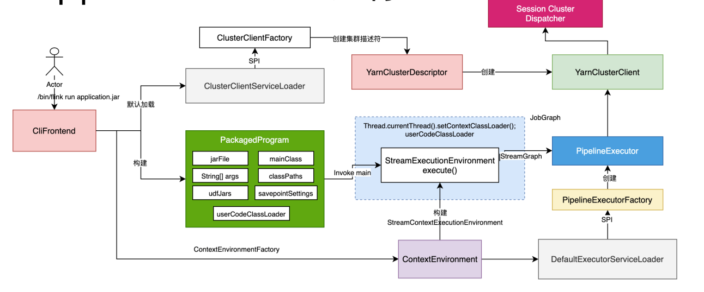


### Resource Manager

双重资源管理：

ResourceManager: 管理、申请、释放资源

Taskmanager： 管理slot、内存/CPU管理


ResourceManager分为StandaloneResourceManager/ActiveResourceManager.


### Dispatcher

任务分发器。

+ JobGraph接收
+ 根据JobGraph启动JM
+ RpcEndpoint服务
+ 通过DispatcherGateway Rpc对外提供服务
+ 从ZK中恢复JobGraph（HA）
+ 保存整个集群的Job运行状态

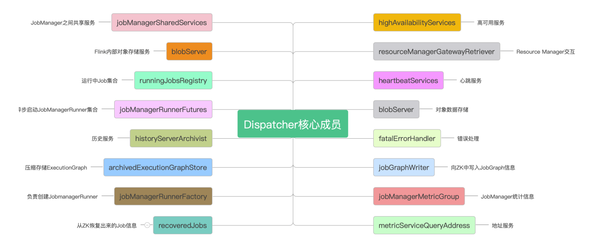


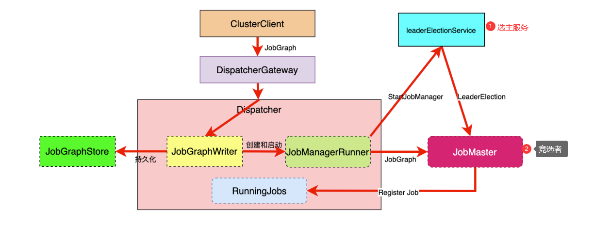

### JobGraph转换

ApplicationCode=> StreamGraph => JobGraph => ExecutionGraph => 物理执行图

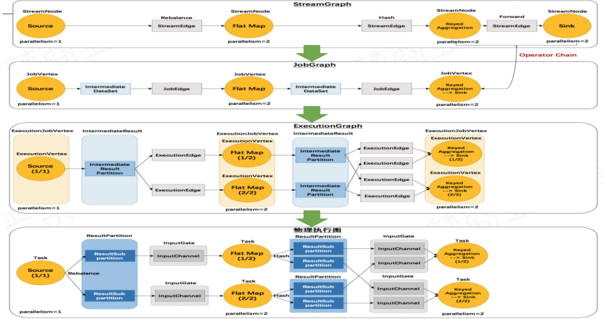

+ StreamGraph
  + StateBackend 状态管理
  + userArtifacts 用户文件
  + 迭代计算
  + 拓扑关系 
    + Map[StreamNode]
    + Map[Source]
    + Map[Sink]
  + 配置信息
  + TimeCharacteristic
+ 


## FAQ

1. No ExecutorFactory found to execute the application.

   ```xml
   <dependency>
       <groupId>org.apache.flink</groupId>
       <artifactId>flink-clients_2.11</artifactId>
       <version>${flink.version}</version>
   </dependency>
   ```

2. 

