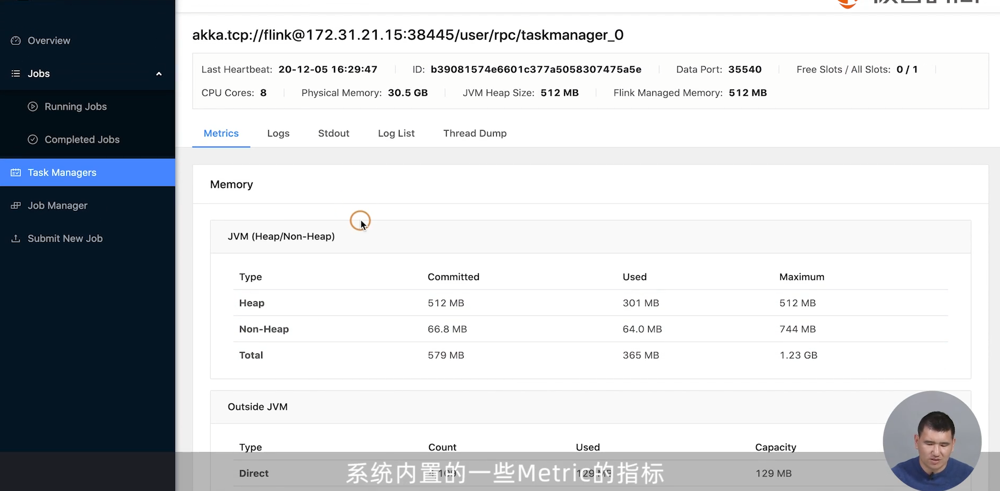
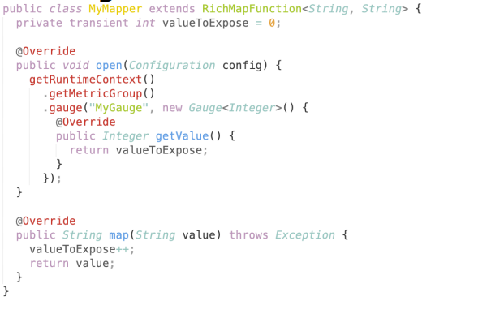
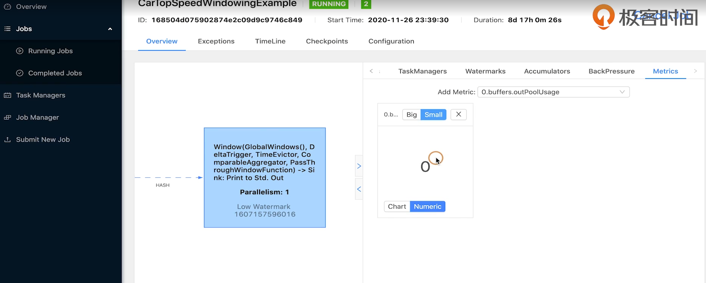
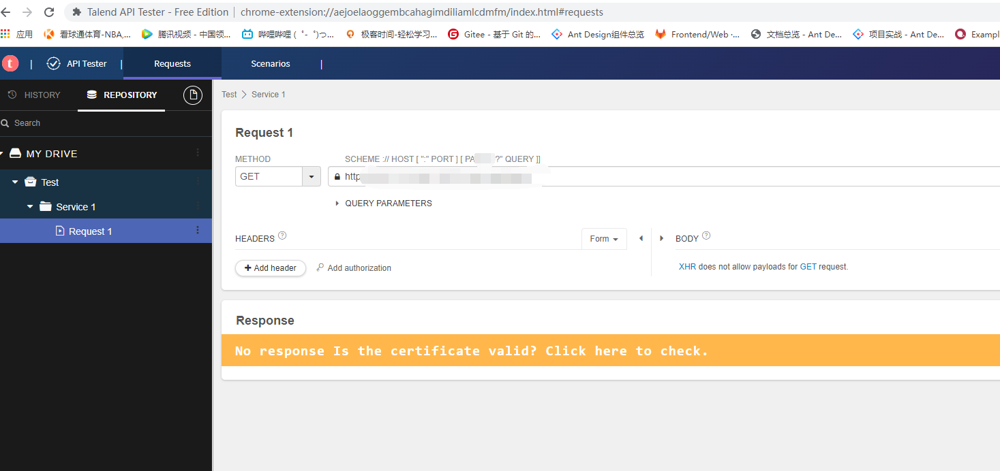

## Day N

### Flink监控与性能优化

Metric指标统计：

+ Count 计数器
+ Gauge 一个值
+ Meter 单位时间内发生次数
+ Histogram 直方图统计：Mean/Max/Min/StdDec等


Metric路径：

`localhost.taskmanager.1234.Job.Task.Operator`


Flink UI中可以查看内置的一些Metrics：




自定义Metrics：如Gauge



在FlinkUI中查看Metrics:




通过不同的MetricReport可以将Metrics推送给第三方：

包括：Ganglia/Graphite/JMX/StatsD/InfluxDB/Prometheus


### RestAPI

https://nightlies.apache.org/flink/flink-docs-release-1.14/docs/ops/rest_api/

```url
/config
/overview
/jobmanager/metrics
/jobs
/jobs/<id>/metrics
/jobs/<id>/checkpoints
/taskmanagers/<id>/metrics
...
```


安利Chrome插件 Talend Api Tester；




Run Job接口：

