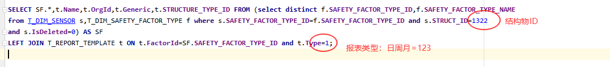
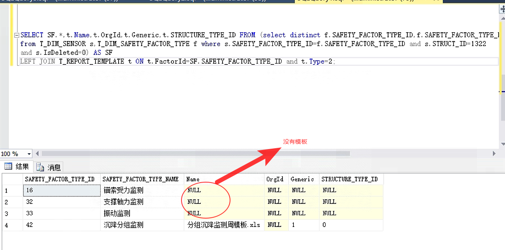
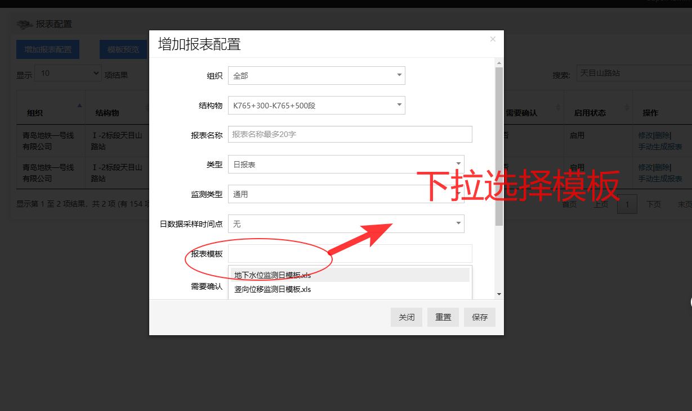
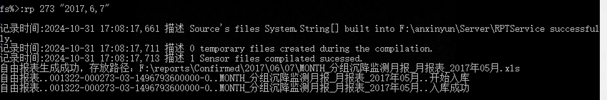

## 2.0添加报表模板方法

统计各个结构物下的监测因素是否有报表模板



返回结果如下，其中Name为空的代表该监测项没有对应的日/周/月报表模板：




添加报表模板步骤：

1、查找类似的模板

```sql
-- 如：原来没有分组沉降的周报表模板，故搜索沉降周模板
SELECT TOP (1000) [Id]
      ,[Name]
      ,[HandleName]
      ,[Description]
      ,[FactorId]
      ,[Type]
      ,[Generic]
      ,[OrgId]
      ,[STRUCTURE_TYPE_ID]
  FROM [DW_iSecureCloud_Empty].[dbo].[T_REPORT_TEMPLATE]
  WHERE Name like '%沉降%' and Type=2;
```

如果有类似的模板可以直接迁移复用：

2、在数据库中报表模板表中添加记录

```sql
INSERT INTO [T_REPORT_TEMPLATE] ([Name]
      ,[HandleName]
      ,[Description]
      ,[FactorId]
      ,[Type]
      ,[Generic]
      ,[OrgId]
      ,[STRUCTURE_TYPE_ID]) values(
	  '分组沉降监测周模板.xls','CjWeekReport',
	  '分组沉降监测周报',42,2,1,NULL,0);
	  

  INSERT INTO [T_REPORT_TEMPLATE] ([Name]
      ,[HandleName]
      ,[Description]
      ,[FactorId]
      ,[Type]
      ,[Generic]
      ,[OrgId]
      ,[STRUCTURE_TYPE_ID]) values(
	  '分组沉降监测月模板.xls','CjMonthReport',
	  '分组沉降监测月报',42,3,1,NULL,0);
```

> 注意：
>
> + `Name`新命名，必须唯一
> + `HandleName`复用源模板的
> + `FactorId`是当前监测因素的ID.
> + `Type` 日周月:123

3、复制模板

在进程目录 `F:\anxinyun\Server\RPTService\ReportTemplate`，将源模板文件复制一份，重命名为上面添加的模板记录的`Name`


模板添加完成之后，就可以在前端进行配置了：

https://v2.anxinyun.cn/Support/ReportConfig.aspx




配置之后，到数据库中查询当前配置的ID。

```sql
select * from T_REPORT_CONFIG where StructId=1322;
```


得到`ReportConfigId`之后，就可以到`RPTService`进程中去执行补生成操作了。(在控制台界面按下Ctrl+C进入命令模式)

```sh
# 执行指定日期的报表
fs%>: rp [ReportConfigId] "[年,月,日]"
# 执行指定日期范围的报表
fs%>: rp [ReportConfigId] "[年,月,日]" "[年,月,日]"
```


报表生成成功，打印日志如下：




这时就可以到前端进行下载了。


特殊说明：

月报模板添加后，前端还是选不到，我们只能在数据库中手动添加报表配置了：

```sql

-- 添加报表配置，需要：组织ID、结构物ID
  insert into T_REPORT_CONFIG([OrgId]
      ,[StructId]
      ,[FactorId]
      ,[RptType]
      ,[DateType]
      ,[ReportName]
      ,[IsEnabled]
      ,[CreateInterval]
      ,[NeedConfirmed]
      ,[GetDataTime]
      ,[CombinationMode])
	  values(856,1322,null,null,3,'MONTH',1,'0 0 0 1 * ?',0,null,0);

-- 报表配置需要关联模板（就是上面步骤添加的模板ID），需要：报表配置ID、报表模板ID
insert into T_REPORT_CONFIG_TEMPLATE (ReportConfigId,ReportTemplateId,CalculationRules,BuildCount) 
values(273,98,0,0);
```

