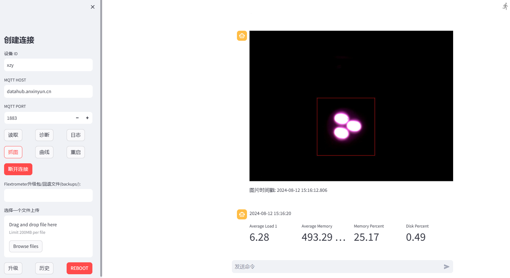

## 4G光电挠度仪设备远程管理功能

4G光电挠度仪是一款通过4G模块进行数据传输的无线采集设备。它可以将现场采集的标靶位移数据同步传输到平台。 为方便故障排查，快速定位现场问题，以及设备在线状态查看、配置管理、远程升级，实现光电挠度仪远程设备管理功能。


主题框架如上所示，其中设备端为嵌入式开发板Android系统，包括三个软件系统：

+ `FlexometerApp` 为光电挠度仪采集应用
+ `Flexometer` 数据提取转发程序（网关代理）
+ `FlexDog` 看门狗程序以及负责与平台管理接口通信；

平台端提供设备管理可视化界面，主要包括：

+ `chatFlexometer` WEB端管理工具，使用 `Streamlit` 作为前端界面，结合 `paho-mqtt` 进行 MQTT 通信，用于管理和监控远程设备。设备通过 MQTT 代理传输数据（如图片、传感器数据等），管理程序可以接收、处理这些数据，并提供上传固件、抓图、数据可视化等功能。


### 1. **主要功能**

- **连接设备**：通过输入设备 ID、MQTT 服务器地址和端口，用户可以连接到远程设备，开始接收并处理设备发送的数据。
- **显示图片**：设备传输图片数据时，程序会将其解码、保存，并在前端显示，支持在图片上标注红色矩形框（传感器检测区域）。
- **展示传感器数据**：程序能够接收并显示传感器的数据曲线，数据存储在 `st.session_state.data_dict` 中，曲线通过 `st.line_chart` 展示。
- **命令发送**：支持通过 MQTT 向设备发送各种命令，如读取传感器数据、抓图、诊断、重启等。同时支持任意`shell`指令下发。发送的命令会记录在会话中，并实时显示。
- **固件上传与升级**：程序集成了七牛云的 API，可以上传固件到七牛云，并通过 MQTT 向设备发送升级命令。支持查看升级备份归档，支持版本回退。


### 2. **主要模块和函数**

**`FlexDog`**

> 下位机提取软件看门狗工具，以及MQTT通信设备管理程序。负责接收平台下发的指令，对设备进行配置或者查询性能指标。

+ 初始化日志系统：设置日志文件名为“`watchdog`”。
+ **`startWeb`**：启动本地HTTP服务，用于接收和处理HTTP请求。用于安装程序启停服务、
+ **`watch`**：监控提取进程，若进程停止则重启。
+ **`Diagnosis`**：启动定期诊断功能，每分钟执行一次。并将诊断信息以心跳的数据的格式通过MQTT发送到平台。
+ **`restartFlexometer`** 和 **`stopFlexometer`**：用于重启和停止提取进程，改变运行模式。
+ **`killProcess`** 和 **`startProcess`**：用于在Windows或Linux系统上杀死和启动进程。
+ **`Diagnosis`** 和 **`diagnosisTick`**：每分钟执行一次诊断，收集系统状态和软件信息，并通过MQTT发布诊断结果。
+ 系统性能监控：获取系统的平均负载、内存使用、磁盘使用等信息。
+ **`connectToMqtt`**：连接到MQTT服务器，并设置自动重连、连接处理和断开处理的回调函数。
+ **`OnMqttConnectionLostHandler`** 和 **`OnMqttConnectHandler`**：处理MQTT连接丢失和重新连接时的逻辑。
+ **`handleMsg`**：处理接收来自平台的MQTT消息指令，执行对应的命令。这些指令包括：
  + 命令解析：处理来自MQTT的命令，例如执行Shell命令、获取配置、更新软件等。
+ **`upgrade`**：下载并更新提取程序，支持备份旧版本并恢复。


**`ChatFlextometer`**

> 平台管理工具，通过stream-lit实现的网站，负责与设备的可视化交互

- **`mqtt_thread(client)`**：启动 MQTT 客户端的主循环，在独立线程中运行，保持与设备的长连接。
- **`savePic(base64_string, device_id)`**：将设备发送的 base64 编码的图片解码并保存，若有传感器数据，会在图片上标注红色矩形框。
- **`add_data(pos, xReal, yReal, timestamp)`**：将接收到的传感器数据存储在 `st.session_state.data_dict` 中，并限制每个传感器的最大数据点数为 `MAX_DATA_POINTS`。
- **`add_message(message_type, payload=None, raw=None)`**：将接收到的消息添加到会话记录中，以便在前端界面显示。
- **`on_message(client, userdata, msg)`**：处理设备发送的 MQTT 消息，解析数据类型，并根据不同的数据类型执行相应的处理逻辑。
- **`close_session()`**：断开与设备的连接，停止 MQTT 线程，并清空当前会话的所有状态。


在诊断信息中，各个字段的意义如下表所示：

| 字段               | 说明                                                         |
| ------------------ | ------------------------------------------------------------ |
| `avgLoad1`         | 系统最近 1 分钟的平均负载。                                  |
| `avgLoad5`         | 系统最近 5 分钟的平均负载。                                  |
| `avgLoad15`        | 系统最近 15 分钟的平均负载。                                 |
| `avgMemory`        | 系统当前使用的内存量（字节数）。                             |
| `avgMemoryPct`     | 系统当前使用的内存百分比。                                   |
| `diskUsage`        | 系统当前使用的磁盘空间（字节数）。                           |
| `diskUsagePct`     | 系统当前使用的磁盘空间百分比。                               |
| `collectorStatus`  | 采集进程的状态（1 表示运行中，0 表示未运行）。               |
| `extractorStatus`  | 提取进程的状态（1 表示运行中，0 表示未运行）。               |
| `collectorVersion` | 当前运行的采集软件版本号。                                   |
| `mac`              | 设备的 MAC 地址。                                            |
| `lastLostConnect`  | 最近一次 MQTT 连接丢失的时间。                               |
| `reconnectCount`   | MQTT 连接丢失后的重连次数。                                  |
| `extractorVersion` | 当前运行的提取软件版本号。                                   |
| `upTime`           | 提取进程的运行时间。                                         |
| `mqtt`             | 提取进程的 MQTT 状态（true 表示连接正常，false 表示连接异常）。 |
| `tcp`              | 提取进程的 TCP 状态（true 表示连接正常，false 表示连接异常）。 |
| `mqttConnectTimes` | 提取进程的 MQTT 连接次数。(根据重连次数判断与平台网络通信稳定性) |
| `tcpConnectTimes`  | 提取进程的 TCP 连接次数。(根据重连次数判断与设备网络通信稳定性) |
| `dogVersion`       | 当前运行的守护进程版本号，包括构建号。                       |
| time               | 当前诊断时间（本地时间）。                                   |

###  **3. 前端界面**

- **侧边栏**：

  - 设备连接设置：输入设备 ID、MQTT 服务器地址和端口后，点击“连接到服务器”按钮以启动与设备的会话。
  - 快捷命令按钮：提供常用命令的快速操作，如读取传感器、抓图、升级固件等。
  - 固件上传和升级：允许用户上传固件到七牛云，并发送升级命令。

- **主界面**：

  - 消息展示：接收到的图片、传感器数据、命令响应等会按时间顺序显示在主界面。
  - 命令输入：用户可以直接输入命令，通过 MQTT 发送给设备。

  

### 4. **使用注意事项**

- **MQTT 连接管理**：若超过 **2** 小时未与设备进行交互，程序会自动断开连接，以节省资源。
- **图片标注**：确保 `st.session_state.sensors` 中有数据时，图片才会被标注红色矩形框。

以下是一些**常用功能**介绍：

> 目前发布测试地址：https://shell.ngaiot.com/

#### 读取（参数）

点击”**读取**“查询设备传感器配置。具体返回内容：

```json
{
  "command":"sensors"
  "type":"get"
  "values":[
    0:{
      "arg":"0.448"
      "des":""
      "h":"600"
      "pos":"1"
      "tar":"n"
      "w":"600"
      "x":"700"
      "xZero":-286.23634673350733
      "y":"700"
      "yZero":279.2888026317511
    }
  ]
}
```

**`arg`**: `"0.448"` - 变换系数，由焦距等参数确定。

**`des`**: `""` - 描述字段。

**`pos`**: `"1"` - 表示传感器的位置编号或序号。

**`tar`**: `"n"` - 测量量。

**`x`**: `"700"` - 设定标靶范围的坐标X。

**`y`**: `"700"` -  设定标靶范围的坐标Y。

**`h`**: `"600"` - 设定标靶范围的高度。

**`w`**: `"600"` - 设定标靶范围的宽度。

**`xZero`**: `-286.23634673350733` - x 轴的零点偏移值，可能用于校准或修正传感器数据。

**`yZero`**: `279.2888026317511` - y 轴的零点偏移值，可能用于校准或修正传感器数据。


> 支持设备通信协议透传（在原先命令`json`内容中增加`"cmd":"app"`字段）。例如，读取设备参数指令，实际下发的指令如下：
>
> ```json
> {
> 	"cmd":"app",
> 	"command":"sensors",
> 	"type":"get"
> }
> ```
>
> 可以类似下发设置指令或者读取系统配置指令：
>
> ```json
> {
> 	"cmd":"app",
> 	"command":"sensors",
> 	"type":"set",
>     "values":[......]
> }
> ```

#### 执行bash脚本指令：

支持任意shell指令的输入。如在命令输入框中输入以下内容，查看设备上代理程序运行情况:

```json
{
    "cmd":"bash",
    "arg":"ps | grep flex"
}
```


#### 抓图

执行抓图指令，将返回一帧图形。（红色矩形框显示，需要先执行“读取”指令）



#### 曲线

可以显示最新数据曲线。


#### 升级

支持在线升级提取代理程序。执行构建后（https://jenkins.ngaiot.com/job/flexometer/）解压获取到最新的`flexometer`二进制执行程序。点击”Browse files“选择文件，点击”上传到七牛“。上传完成后，上方的”`Flextrometer升级包/回退文件(backups/)`“输入框中将显示上传后文件的URL（也可以直接输入在线文件地址）。点击”升级“，将执行在线升级功能。

+ 升级完成，消息界面将返回ok。设备将重启，可执行诊断命令，查看最新版本信息。
+ 点击”历史“可以查看备份的历史执行文件。”`Flextrometer升级包/回退文件(backups/)`“输入框中输入`”backups/flexometer_20240809_092616`“后，点击”升级“可以回退到指定的版本。
+ 升级失败程序无法自动回退。

