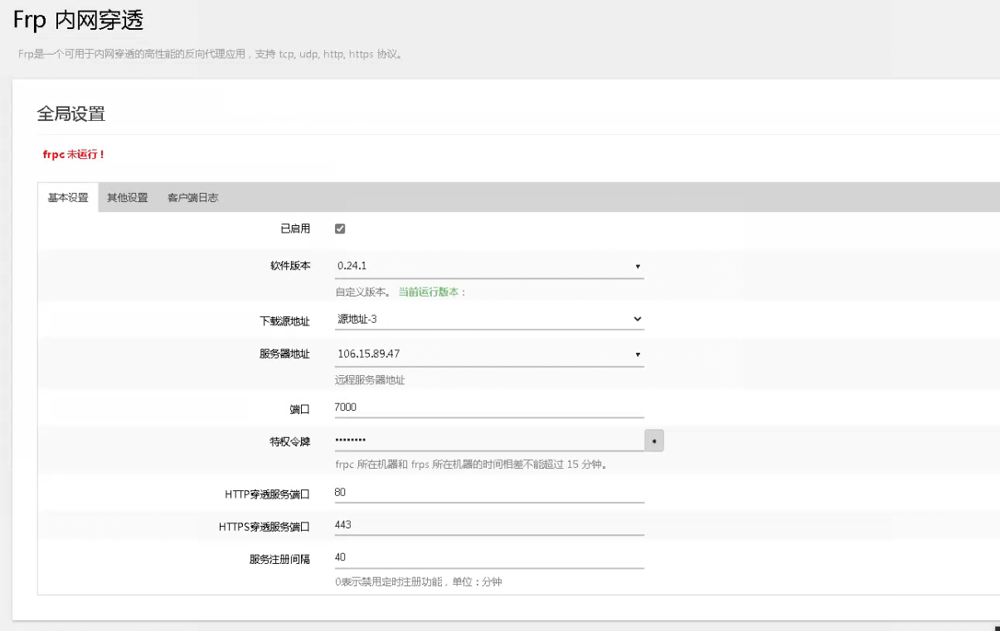
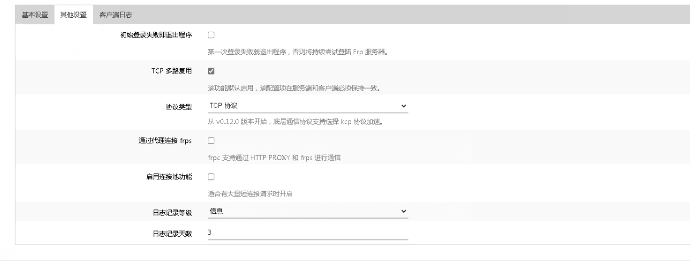
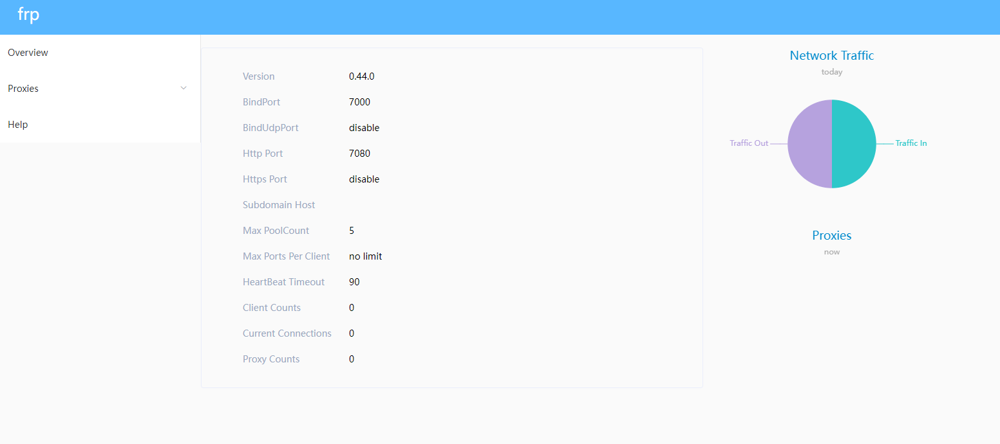

#### 4G路由器组网方式

我们的需求是，4G路由器放在户外桥梁上工作，传感器设备通过网线连接到路由器上。我们的物联网平台需要通过ip能访问到这款设备（TCP和UDP连接到设备），需要为设备分配固定ip。

期望的组网方式如下图所示：


### 问题汇总


1. 使用VPN。说明书章节中有介绍路由器做VPN服务器，那么这款路由器能否作为客户端，接入我们平台公网的VPN服务器呢?

   

2. Frp内网穿透，我们准备接入我们自己的FRP服务器，但是有报错：

   已尝试不通的FRP版本(0..16.1  0.24.1)以及打开或关闭“FRP多路复用的开关”。

   ```code
   。。。
   2024/01/05 00:00:00: frpc ok...
   2024-01-05 00:00:01: Target Arch: mipsle
   2024/01/05 00:00:01: Start downloading FRPC binaries from d(3)...
   2024/01/05 00:00:11: frpc mipsle Download completed!
   2024/01/05 00:00:11: The FRP service failed to start. First add the list of services！
   2024/01/05 00:00:12: The FRP service failed to start. Please check the TCP Multiplexing (tcp_mux) settings on the server to ensure that they are exactly the same as the client！
   2024/01/05 00:40:01: frpc ok...
   2024-01-05 00:40:01: Target Arch: mipsle
   2024/01/05 00:40:01: Start downloading FRPC binaries from d(3)...
   2024/01/05 00:40:12: frpc mipsle Download completed!
   2024/01/05 00:40:12: The FRP service failed to start. First add the list of services！
   2024/01/05 00:40:12: The FRP service failed to start. Please check the TCP Multiplexing (tcp_mux) settings on the server to ensure that they are exactly the same as the client！
   
   ```
   
   配置：
   
   
   
   
   
   
   
   

