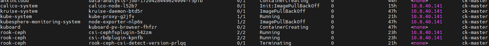
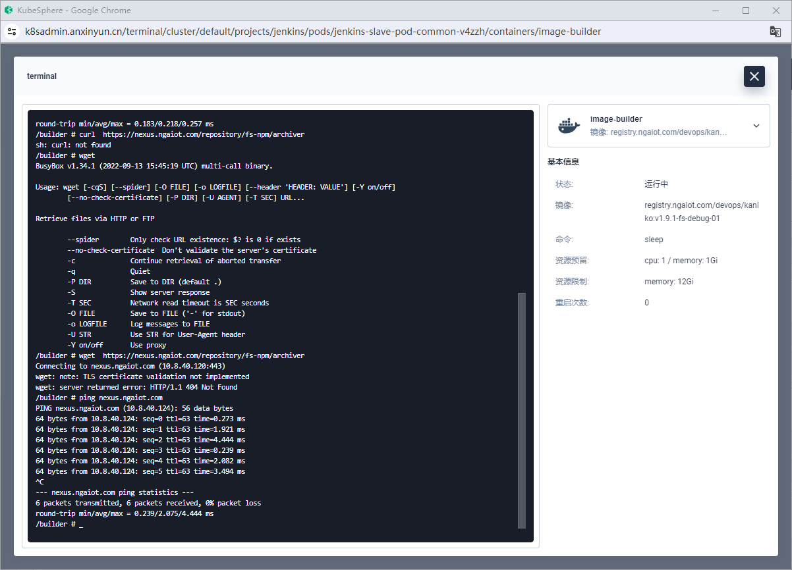
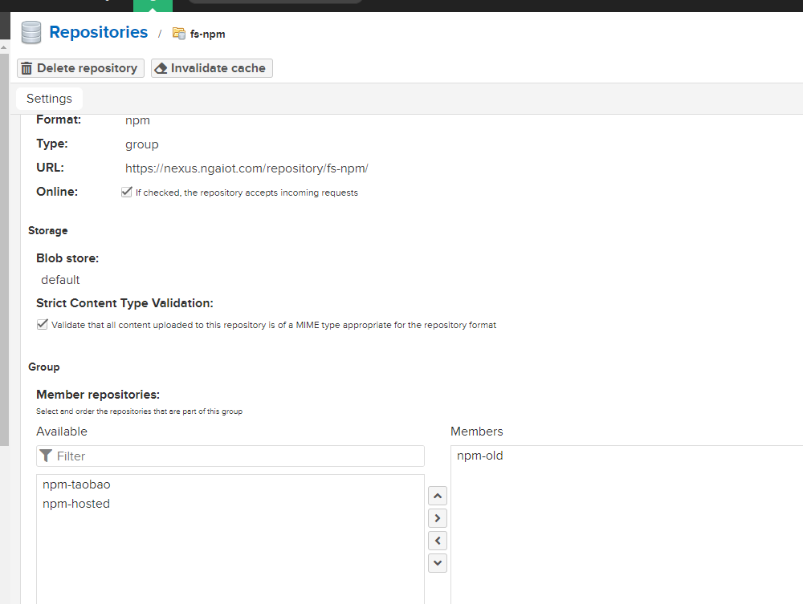
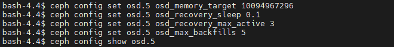

## CEPH ODS 无法启动

>  参考 https://access.redhat.com/solutions/6999849
>
>  https://github.com/rook/rook/issues/9885

省流：最终解决办法是将Ceph中副本数由3改为2，释放了一部分空间，暂时恢复了。


```sh
debug     -4> 2024-07-08T07:59:07.904+0000 7f80ef3c93c0  1 bluefs _allocate unable to allocate 0x10000 on bdev 1, allocator name block, allocator type hybrid, capacity 0x11774196000, block size 0x1000, alloc size 0x10000, free 0xdedc09000, fragmentation 0.5334715, allocated 0x0
debug     -3> 2024-07-08T07:59:07.904+0000 7f80ef3c93c0 -1 bluefs _allocate allocation failed, needed 0x9399
debug     -2> 2024-07-08T07:59:07.904+0000 7f80ef3c93c0 -1 bluefs _flush_range_F allocated: 0x0 offset: 0x0 length: 0x9399
debug     -1> 2024-07-08T07:59:07.912+0000 7f80ef3c93c0 -1 /home/jenkins-build/build/workspace/ceph-build/ARCH/x86_64/AVAILABLE_ARCH/x86_64/AVAILABLE_DIST/centos8/DIST/centos8/MACHINE_SIZE/gigantic/release/17.2.5/rpm/el8/BUILD/ceph-17.2.5/src/os/bluestore/BlueFS.cc: In function 'int BlueFS::_flush_range_F(BlueFS::FileWriter*, uint64_t, uint64_t)' thread 7f80ef3c93c0 time 2024-07-08T07:59:07.907432+0000
/home/jenkins-build/build/workspace/ceph-build/ARCH/x86_64/AVAILABLE_ARCH/x86_64/AVAILABLE_DIST/centos8/DIST/centos8/MACHINE_SIZE/gigantic/release/17.2.5/rpm/el8/BUILD/ceph-17.2.5/src/os/bluestore/BlueFS.cc: 3137: ceph_abort_msg("bluefs enospc")

 ceph version 17.2.5 (98318ae89f1a893a6ded3a640405cdbb33e08757) quincy (stable)
```

这个错误消息表明 `Ceph` 的 `BlueStore` 文件系统在尝试进行空间分配时遇到了“没有剩余空间”（ENOSPC）的问题。即使文件系统报告有可用空间（`free 0xdedc09000`），但由于碎片化或其他原因，它无法满足分配请求。


```sh
sh-4.4$ ceph -s
  cluster:
    id:     a62a9110-a804-4dca-af81-fa8d80031926
    health: HEALTH_WARN
            4 backfillfull osd(s)
            Low space hindering backfill (add storage if this doesn't resolve itself): 89 pgs backfill_toofull
            Degraded data redundancy: 7796200/38415381 objects degraded (20.294%), 87 pgs degraded, 87 pgs undersized
            4 pool(s) backfillfull
            1130 daemons have recently crashed
            1 mgr modules have recently crashed

  services:
    mon: 3 daemons, quorum b,d,e (age 3d)
    mgr: b(active, since 2d), standbys: a
    mds: 1/1 daemons up, 1 hot standby
    osd: 5 osds: 4 up (since 3m), 4 in (since 7m); 89 remapped pgs

  data:
    volumes: 1/1 healthy
    pools:   4 pools, 177 pgs
    objects: 12.81M objects, 1.6 TiB
    usage:   4.0 TiB used, 351 GiB / 4.4 TiB avail
    pgs:     7796200/38415381 objects degraded (20.294%)
             296861/38415381 objects misplaced (0.773%)
             87 active+clean
             86 active+undersized+degraded+remapped+backfill_toofull
             2  active+remapped+backfill_toofull
             1  active+undersized+degraded+remapped+backfill_wait+backfill_toofull
             1  active+clean+scrubbing+deep

  io:
    client:   108 KiB/s rd, 35 KiB/s wr, 74 op/s rd, 11 op/s wr
```


到`ceph-tool`容器中执行：


## 横向节点扩容

拟通过增加1台服务器作为Ceph节点加入，提高整体存储容量。

修改`cluster.yaml`:

```yaml
 nodes:
      - name: "node-01"
        devices:
          - name: "sda"
      ...
      - name: "ck-master"
        devices:
          - name: "sda"
```


在修改`Cluster.yaml`后增加节点

```
CephBlockPool/rook-ceph/ceph-blockpool dry-run failed, reason: InternalError, error: Internal error occurred: failed calling webhook "cephblockpool-wh-rook-ceph-admission-controller-rook-ceph.rook.io": failed to call webhook: Post "https://rook-ceph-admission-controller.rook-ceph.svc:443/validate-ceph-rook-io-v1-cephblockpool?timeout=5s": x509: certificate signed by unknown authority (possibly because of "x509: invalid signature: parent certificate cannot sign this kind of certificate" while trying to verify candidate authority certificate "serial:336976302276413441245920813253687075705")
```

这个错误解决办法：https://github.com/rook/rook/issues/10719

```sh
 kubectl delete secret -n rook-ceph rook-ceph-admission-controller

```

等待operator自动重启后正常了。


进入cep-tool使用查看:

```sh
sh-4.4$ ceph osd df
ID  CLASS  WEIGHT   REWEIGHT  SIZE     RAW USE   DATA     OMAP     META     AVAIL    %USE   VAR   PGS  STATUS
 0    hdd  1.09160   1.00000  1.1 TiB   1.0 TiB  1.0 TiB  3.8 GiB  9.8 GiB   73 GiB  93.51  1.01  105      up
 2    hdd  1.09160   1.00000  1.1 TiB   1.0 TiB  1.0 TiB  6.2 GiB  8.9 GiB   65 GiB  94.21  1.02   17      up
 1    hdd  1.09160   1.00000  1.1 TiB   1.0 TiB  1.0 TiB  4.0 GiB  9.4 GiB   56 GiB  94.97  1.03  103      up
 4    hdd  1.09160   1.00000  1.1 TiB  1007 GiB  992 GiB  5.5 GiB  9.3 GiB  111 GiB  90.04  0.97  106      up
 3    hdd  1.09160   1.00000  1.1 TiB  1007 GiB  992 GiB  6.1 GiB  9.4 GiB  110 GiB  90.12  0.97  113      up
                       TOTAL  5.5 TiB   5.1 TiB  5.0 TiB   26 GiB   47 GiB  415 GiB  92.57
MIN/MAX VAR: 0.97/1.03  STDDEV: 2.08
sh-4.4$ ceph osd tree
ID   CLASS  WEIGHT   TYPE NAME         STATUS  REWEIGHT  PRI-AFF
 -1         5.45799  root default
 -3         1.09160      host node-01
  0    hdd  1.09160          osd.0         up   1.00000  1.00000
 -9         1.09160      host node-02
  2    hdd  1.09160          osd.2         up   1.00000  1.00000
 -5         1.09160      host node-03
  1    hdd  1.09160          osd.1         up   1.00000  1.00000
-11         1.09160      host node-04
  4    hdd  1.09160          osd.4         up   1.00000  1.00000
 -7         1.09160      host node-05
  3    hdd  1.09160          osd.3         up   1.00000  1.00000
```


**列出所有 Pod 并查找引用 PVC 的 Pod**:

```
sh
复制代码
kubectl get pods --all-namespaces -o jsonpath="{range .items[*]}{.metadata.name}{'\t'}{.metadata.namespace}{'\t'}{.spec.volumes[*].persistentVolumeClaim.claimName}{'\n'}{end}" | grep <pvc-name>
```

**注意**: 将 `<pvc-name>` 替换为你的 PVC 名称。

**找到管理 Pod 的控制器**：

1. 列出所有 Pod：

   ```sh
   kubectl get pods --all-namespaces
   ```
   
2. 查看 Pod 的详细信息以找到控制器：

   ```sh
   kubectl describe pod <pod-name> -n <namespace>
   ```
   
   在输出的详细信息中，查找 `Controlled By` 字段。例如：

   ```tex
Name:         my-pod
   Namespace:    default
   ...
   Controlled By:  ReplicaSet/my-replicaset
   ```
   
   **删除管理 Pod 的控制器**： 根据找到的控制器类型（Deployment、`ReplicaSet`、`StatefulSet` 等），删除相应的控制器。

   **删除 Deployment**:

   ```sh
kubectl delete deployment <deployment-name> -n <namespace>
   ```
   
   **删除 ReplicaSet**:
   
   ```sh
kubectl delete replicaset <replicaset-name> -n <namespace>
   ```

   **删除 StatefulSet**:
   
   ```sh
   kubectl delete statefulset <statefulset-name> -n <namespace>
   ```

   **删除 DaemonSet**:

   ```sh
   kubectl delete daemonset <daemonset-name> -n <namespace>
   ```
   
   使用 Rook Ceph 工具查看 Ceph OSD 的状态，以确保存储空间已被回收。

   ```sh
kubectl -n rook-ceph exec -it $(kubectl -n rook-ceph get pod -l app=rook-ceph-tools -o jsonpath='{.items[0].metadata.name}') -- ceph status
   
   kubectl -n rook-ceph exec -it $(kubectl -n rook-ceph get pod -l app=rook-ceph-tools -o jsonpath='{.items[0].metadata.name}') -- ceph df
   
   
   root@jumper-02:/home/cloud# kubectl -n rook-ceph exec -it $(kubectl -n rook-ceph get pod -l app=rook-ceph-tools -o jsonpath='{.items[0].metadata.name}') -- ceph osd status

   ID  HOST      USED  AVAIL  WR OPS  WR DATA  RD OPS  RD DATA  STATE
 0  node-01  1045G  72.7G      0        0       1       90   backfillfull,exists,up
    1  node-03  1061G  55.8G      0        0       1     1531   exists,full,up
    2  node-02  1053G  64.4G      0        0       0        0   backfillfull,exists,up
    3  node-05  1007G   110G      0        0       0        0   backfillfull,exists,up
    4  node-04  1006G   111G      0        0       0        3   backfillfull,exists,up
   root@jumper-02:/home/cloud# kubectl -n rook-ceph exec -it $(kubectl -n rook-ceph get pod -l app=rook-ceph-tools -o jsonpath='{.items[0].metadata.name}') -- ceph osd tree
   ID   CLASS  WEIGHT   TYPE NAME         STATUS  REWEIGHT  PRI-AFF
    -1         5.45799  root default
    -3         1.09160      host node-01
     0    hdd  1.09160          osd.0         up   1.00000  1.00000
    -9         1.09160      host node-02
     2    hdd  1.09160          osd.2         up   1.00000  1.00000
    -5         1.09160      host node-03
     1    hdd  1.09160          osd.1         up   1.00000  1.00000
   -11         1.09160      host node-04
     4    hdd  1.09160          osd.4         up   1.00000  1.00000
    -7         1.09160      host node-05
     3    hdd  1.09160          osd.3         up   1.00000  1.00000
   root@jumper-02:/home/cloud#  kubectl get pod -nrook-ceph -o wide
   NAME                                                READY   STATUS      RESTARTS        AGE     IP                NODE        NOMINATED NODE   READINESS GATES
   csi-cephfsplugin-542zm                              2/2     Running     0               18m     10.8.40.141       ck-master   <none>           <none>
   csi-cephfsplugin-5wq75                              2/2     Running     8 (48d ago)     320d    10.8.40.131       node-06     <none>           <none>
   csi-cephfsplugin-5xgzv                              2/2     Running     4 (229d ago)    320d    10.8.40.130       node-05     <none>           <none>
   csi-cephfsplugin-8dn2p                              2/2     Running     6 (53d ago)     320d    10.8.40.133       node-02     <none>           <none>
   csi-cephfsplugin-c8mxx                              2/2     Running     8 (53d ago)     320d    10.8.40.128       node-03     <none>           <none>
   csi-cephfsplugin-provisioner-7cc6b9c99-sdx9s        5/5     Running     5 (229d ago)    285d    100.160.173.195   node-05     <none>           <none>
   csi-cephfsplugin-provisioner-7cc6b9c99-tg8jv        5/5     Running     0               48d     100.160.184.5     node-02     <none>           <none>
   csi-cephfsplugin-th8wc                              2/2     Running     6 (229d ago)    320d    10.8.40.127       node-04     <none>           <none>
   csi-cephfsplugin-w9tht                              2/2     Running     6 (53d ago)     320d    10.8.40.134       node-01     <none>           <none>
   csi-rbdplugin-bws67                                 2/2     Running     14 (53d ago)    545d    10.8.40.134       node-01     <none>           <none>
   csi-rbdplugin-cjm4m                                 2/2     Running     16 (53d ago)    545d    10.8.40.128       node-03     <none>           <none>
   csi-rbdplugin-f7fbw                                 2/2     Running     16 (48d ago)    545d    10.8.40.131       node-06     <none>           <none>
   csi-rbdplugin-g2tnl                                 2/2     Running     14 (229d ago)   545d    10.8.40.127       node-04     <none>           <none>
   csi-rbdplugin-kpnfb                                 2/2     Running     0               8m40s   10.8.40.141       ck-master   <none>           <none>
   csi-rbdplugin-p5j7p                                 2/2     Running     14 (229d ago)   545d    10.8.40.130       node-05     <none>           <none>
   csi-rbdplugin-provisioner-5486664c96-7llvl          5/5     Running     4 (41d ago)     48d     100.160.227.9     node-04     <none>           <none>
   csi-rbdplugin-provisioner-5486664c96-lmhwr          5/5     Running     0               48d     100.160.184.181   node-02     <none>           <none>
   csi-rbdplugin-zxcq4                                 2/2     Running     14 (53d ago)    545d    10.8.40.133       node-02     <none>           <none>
   rook-ceph-crashcollector-node-01-55bfc58d54-4j92t   1/1     Running     0               43d     100.160.190.1     node-01     <none>           <none>
   rook-ceph-crashcollector-node-02-c74cd7787-wqsjx    1/1     Running     0               48d     100.160.184.43    node-02     <none>           <none>
   rook-ceph-crashcollector-node-03-7c656f8b64-hmh2x   1/1     Running     3 (53d ago)     319d    100.160.254.83    node-03     <none>           <none>
   rook-ceph-crashcollector-node-04-566d45795f-p4tr7   1/1     Running     1 (229d ago)    281d    100.160.227.4     node-04     <none>           <none>
   rook-ceph-crashcollector-node-05-7d78cf748-rzzll    1/1     Running     0               202d    100.160.173.216   node-05     <none>           <none>
   rook-ceph-mds-myfs-a-597b48fb8c-jshr5               2/2     Running     3 (62d ago)     202d    100.160.174.26    node-05     <none>           <none>
   rook-ceph-mds-myfs-b-d49f7945d-892s2                2/2     Running     1 (4d2h ago)    48d     100.160.184.7     node-02     <none>           <none>
   rook-ceph-mgr-a-7fc4bcc88b-rbr2d                    3/3     Running     0               5d20h   100.160.190.22    node-01     <none>           <none>
   rook-ceph-mgr-b-68c794b8bb-4rndl                    3/3     Running     1 (2d20h ago)   49d     100.160.184.9     node-02     <none>           <none>
   rook-ceph-mon-b-68d55cc69-trxjk                     2/2     Running     16 (53d ago)    545d    100.160.254.84    node-03     <none>           <none>
   rook-ceph-mon-d-7c6f976fcf-4l56m                    2/2     Running     0               43d     100.160.190.42    node-01     <none>           <none>
   rook-ceph-mon-e-7577548647-9tbjb                    2/2     Running     0               48d     100.160.184.22    node-02     <none>           <none>
   rook-ceph-operator-f45cb444c-lz7v9                  1/1     Running     5 (21h ago)     48d     100.160.174.60    node-05     <none>           <none>
   rook-ceph-osd-0-65f679cbf-bdt8r                     2/2     Running     0               43d     100.160.190.17    node-01     <none>           <none>
   rook-ceph-osd-1-f9fb9b548-d5clr                     2/2     Running     0               20h     100.160.254.156   node-03     <none>           <none>
   rook-ceph-osd-2-686785cdd-l48wp                     2/2     Running     2 (20h ago)     20h     100.160.184.38    node-02     <none>           <none>
   rook-ceph-osd-3-5569bcb6c4-c6h9g                    2/2     Running     6 (229d ago)    360d    100.160.173.231   node-05     <none>           <none>
   rook-ceph-osd-4-58cc5f5b99-wvx8c                    2/2     Running     5 (41d ago)     319d    100.160.227.56    node-04     <none>           <none>
   rook-ceph-osd-prepare-node-01-s8p74                 0/1     Completed   0               21h     100.160.190.43    node-01     <none>           <none>
   rook-ceph-osd-prepare-node-02-hrf4z                 0/1     Completed   0               21h     100.160.184.15    node-02     <none>           <none>
   rook-ceph-osd-prepare-node-03-5qnds                 0/1     Completed   0               21h     100.160.254.184   node-03     <none>           <none>
   rook-ceph-osd-prepare-node-04-psn6x                 0/1     Completed   0               21h     100.160.227.8     node-04     <none>           <none>
   rook-ceph-osd-prepare-node-05-7ldhr                 0/1     Completed   0               21h     100.160.173.207   node-05     <none>           <none>
   rook-ceph-tools-54bdbfc7b7-c5hfk                    1/1     Running     0               53d     100.160.174.24    node-05     <none>           <none>
   
   ```
   
   

## 单机磁盘扩容：

https://blog.51cto.com/u_14458428/9017267

排查过程：

```sh
root@jumper-02:/home/cloud# kubectl -n rook-ceph exec -it $(kubectl -n rook-ceph get pod -l app=rook-ceph-tools -o jsonpath='{.items[0].metadata.name}') -- ceph status
  cluster:
    id:     a62a9110-a804-4dca-af81-fa8d80031926
    health: HEALTH_ERR
            4 backfillfull osd(s)
            1 full osd(s)
            Low space hindering backfill (add storage if this doesn't resolve itself): 95 pgs backfill_toofull
            Degraded data redundancy: 7798716/38428311 objects degraded (20.294%), 87 pgs degraded, 87 pgs undersized
            8 pgs not deep-scrubbed in time
            4 pool(s) full
            1620 daemons have recently crashed
            1 mgr modules have recently crashed

  services:
    mon: 3 daemons, quorum b,d,e (age 5d)
    mgr: b(active, since 3d), standbys: a
    mds: 1/1 daemons up, 1 hot standby
    osd: 5 osds: 5 up (since 43h), 5 in (since 43h); 95 remapped pgs

  data:
    volumes: 1/1 healthy
    pools:   4 pools, 177 pgs
    objects: 12.81M objects, 1.6 TiB
    usage:   5.1 TiB used, 415 GiB / 5.5 TiB avail
    pgs:     7798716/38428311 objects degraded (20.294%)
             541352/38428311 objects misplaced (1.409%)
             87 active+undersized+degraded+remapped+backfill_toofull
             82 active+clean
             8  active+remapped+backfill_toofull

  io:
    client:   6.6 KiB/s rd, 3.3 KiB/s wr, 2 op/s rd, 0 op/s wr

root@jumper-02:/home/cloud# kubectl -n rook-ceph exec -it $(kubectl -n rook-ceph get pod -l app=rook-ceph-tools -o jsonpath='{.items[0].metadata.name}') -- ceph df
--- RAW STORAGE ---
CLASS     SIZE    AVAIL     USED  RAW USED  %RAW USED
hdd    5.5 TiB  415 GiB  5.1 TiB   5.1 TiB      92.58
TOTAL  5.5 TiB  415 GiB  5.1 TiB   5.1 TiB      92.58

--- POOLS ---
POOL             ID  PGS   STORED  OBJECTS     USED   %USED  MAX AVAIL
.mgr              1    1   10 MiB        3   31 MiB  100.00        0 B
replicapool       2   32     19 B        1   12 KiB  100.00        0 B
myfs-metadata     3   16   11 GiB  150.53k   27 GiB  100.00        0 B
myfs-replicated   4  128  2.0 TiB   12.66M  5.0 TiB  100.00        0 B

root@jumper-02:/home/cloud# kubectl -n rook-ceph exec -it $(kubectl -n rook-ceph get pod -l app=rook-ceph-tools -o jsonpath='{.items[0].metadata.name}') -- ceph osd df
ID  CLASS  WEIGHT   REWEIGHT  SIZE     RAW USE   DATA     OMAP     META     AVAIL    %USE   VAR   PGS  STATUS
 0    hdd  1.09160   1.00000  1.1 TiB   1.0 TiB  1.0 TiB  3.8 GiB  9.6 GiB   73 GiB  93.50  1.01  105      up
 2    hdd  1.09160   1.00000  1.1 TiB   1.0 TiB  1.0 TiB  6.2 GiB  9.3 GiB   64 GiB  94.24  1.02   17      up
 1    hdd  1.09160   1.00000  1.1 TiB   1.0 TiB  1.0 TiB  4.3 GiB  9.7 GiB   56 GiB  95.03  1.03  103      up
 4    hdd  1.09160   1.00000  1.1 TiB  1007 GiB  992 GiB  5.5 GiB  9.5 GiB  111 GiB  90.05  0.97  106      up
 3    hdd  1.09160   1.00000  1.1 TiB  1007 GiB  992 GiB  6.1 GiB  9.0 GiB  111 GiB  90.08  0.97  113      up
                       TOTAL  5.5 TiB   5.1 TiB  5.0 TiB   26 GiB   47 GiB  415 GiB  92.58
MIN/MAX VAR: 0.97/1.03  STDDEV: 2.11

root@jumper-02:/home/cloud# kubectl -n rook-ceph exec -it $(kubectl -n rook-ceph get pod -l app=rook-ceph-tools -o jsonpath='{.items[0].metadata.name}') -- ceph osd status
ID  HOST      USED  AVAIL  WR OPS  WR DATA  RD OPS  RD DATA  STATE
 0  node-01  1045G  72.7G      0        0       1       90   backfillfull,exists,up
 1  node-03  1062G  55.5G      0        0       0        0   exists,full,up
 2  node-02  1053G  64.3G      0        0       0        0   backfillfull,exists,up
 3  node-05  1006G   110G      0        0       1       16   backfillfull,exists,up
 4  node-04  1006G   111G      0        0       0        0   backfillfull,exists,up

```




```sh
docker pull docker.io/calico/pod2daemon-flexvol:v3.24.5
docker pull openkruise/kruise-manager:v1.4.0
```


Jenkins容器中无法正确访问Nexus




查看该容器下的/etc/hosts 看到nexus指向两个ip地址

修改coredns

```sh
 kubectl edit configmap coredns -n kube-system
```


Nexus报错:

```
2024-07-10T21:03:08.745775026+08:00 2024-07-10 13:03:08,744+0000 ERROR [qtp1100486876-1340] *UNKNOWN org.sonatype.nexus.blobstore.file.FileBlobStore - Unable to load BlobAttributes for blob id: 60011fdd-252b-4e0c-a45f-3b614c6863eb, path: /nexus-data/blobs/default/content/vol-07/chap-25/60011fdd-252b-4e0c-a45f-3b614c6863eb.properties, exception: null

2024-07-10T21:03:08.747025111+08:00 2024-07-10 13:03:08,746+0000 WARN  [qtp1100486876-1340] *UNKNOWN org.sonatype.nexus.repository.httpbridge.internal.ViewServlet - Failure servicing: GET /repository/fs-npm/string_decoder/-/string_decoder-1.3.0.tgz

2024-07-10T21:03:08.747036024+08:00 org.sonatype.nexus.repository.MissingBlobException: Blob default@5278F4C3-BCFBB109-411FE1EC-FB20F1AF-A94AFA88:60011fdd-252b-4e0c-a45f-3b614c6863eb exists in metadata, but is missing from the blobstore
```


在nexus界面中执行如下：

```sh
更新元数据：

使用 Nexus 的修复工具（Repair - Reconcile component database from blob store）来修复元数据和 blob 存储的一致性。
在 Nexus 管理界面，导航到 Admin > System > Tasks，创建一个新的任务选择 Repair - Reconcile component database from blob store，然后运行该任务。
```

还是没有解决问题

修改nexus中`npm` group只代理`npm-old`后 ，能解决部分构建，




rock ceph安装
https://github.com/rook/rook/blob/release-1.12/Documentation/Getting-Started/quickstart.md
注意：根据官方文档安装，不同的rock的版本对kubernetes的最小版本也有要求。
比如安装的版本是v1.12那么对应kubernetes最小的版本是v1.22或者更高。

当前ZWY和安心云有各自都有一个ceph，如果合并集群的话，可以只保留一个，但是数据咋搞？
商用zwy集群部署的路径：master-01
远程到196jump-02，ssh到master-01，切换root，进入文件夹root@master-01:~/services/rook-1.10.8/deploy/examples#

\####准备开始Go####
$ git clone --single-branch --branch v1.12.7 https://github.com/rook/rook.git
cd rook/deploy/examples
\####部署rock operator####
kubectl create -f crds.yaml -f common.yaml -f operator.yaml
kubectl create -f cluster.yaml


\# verify the rook-ceph-operator is in the `Running` state before proceeding
kubectl -n rook-ceph get pod

cluster.yaml中需要修改：
resource，根据实际配置修改，如下图所示

nodes
当前集群中可被使用的服务器名称以及当前服务的devices名称，如下图所示

filesystem.yml修改资源限制，并应用

kubectl apply -f pool.yaml
ceph配置修改
root@master-01:cd ~/services/rook-1.10.8/deploy/examples/csi/cephfs

kubectl apply -f storageclass.yaml


```sh
ceph osd pool ls detail

[myfs-replicated]

ceph osd pool get myfs-replicated size
ceph osd pool set myfs-replicated size 2
ceph osd pool set myfs-metadata size 2
ceph osd pool set myfs-replicated size 2


```


```sh
resize2fs 工具不支持在线缩小文件系统。在这种情况下，需要将文件系统卸载，然后再进行缩小操作。具体步骤如下：

umount /home

终止占用 /home 的进程：
fuser -km /home

3. 缩小文件系统

lsblk
lvdisplay /dev/node18-vg/home

resize2fs /dev/node18-vg/home 200G
4. 缩小逻辑卷
缩小文件系统后，缩小逻辑卷：

lvreduce -L 200G /dev/node18-vg/home
5. 挂载 /home
完成后，重新挂载 /home 文件系统：

mount /home

6. 扩展 node18--vg-root
将释放的空间分配给 vg-root：
lvextend -l +100%FREE /dev/node18-vg/root

7. 扩展根文件系统

resize2fs /dev/node18--vg-root

8. 验证
使用 df -h / 和 df -h /home 命令，检查扩展后的空间。

```


```shell
bash-4.4$ ceph pg stat
305 pgs: 2 active+clean+remapped, 13 active+remapped+backfilling, 161 active+clean, 2 active+undersized+degraded+remapped+backfilling, 52 undersized+degraded+remapped+backfilling+peered, 71 undersized+degraded+remapped+backfill_toofull+peered, 4 down; 1.7 TiB data, 2.5 TiB used, 1.6 TiB / 4.1 TiB avail; 639 B/s rd, 3.5 KiB/s wr, 1 op/s; 20818006/41177574 objects degraded (50.557%); 1882597/41177574 objects misplaced (4.572%); 1023 KiB/s, 88 keys/s, 11 objects/s recovering
bash-4.4$ ceph osd tree
ID   CLASS  WEIGHT   TYPE NAME         STATUS  REWEIGHT  PRI-AFF
 -1         5.93968  root default
 -3         1.09160      host node-01
  0    hdd  1.09160          osd.0         up   1.00000  1.00000
 -9         1.09160      host node-02
  2    hdd  1.09160          osd.2         up   0.85004  1.00000
 -5         1.09160      host node-03
  1    hdd  1.09160          osd.1         up   0.85004  1.00000
-11         1.09160      host node-04
  4    hdd  1.09160          osd.4       down         0  1.00000
 -7         1.57329      host node-05
  3    hdd  0.70000          osd.3        DNE         0
  5    ssd  0.87329          osd.5         up   1.00000  1.00000
bash-4.4$ ceph status
  cluster:
    id:     a62a9110-a804-4dca-af81-fa8d80031926
    health: HEALTH_WARN
            2 clients failing to respond to capability release
            1 MDSs report slow metadata IOs
            1 MDSs report slow requests
            2 MDSs behind on trimming
            mon b is low on available space
            2 backfillfull osd(s)
            1 osds exist in the crush map but not in the osdmap
            Reduced data availability: 123 pgs inactive, 4 pgs down
            Low space hindering backfill (add storage if this doesn't resolve itself): 71 pgs backfill_toofull
            Degraded data redundancy: 20817850/41177574 objects degraded (50.556%), 125 pgs degraded, 125 pgs undersized
            52 pgs not deep-scrubbed in time
            52 pgs not scrubbed in time
            8 pool(s) backfillfull
            1356 daemons have recently crashed

  services:
    mon: 3 daemons, quorum b,e,f (age 26h)
    mgr: b(active, since 16m), standbys: a
    mds: 1/1 daemons up, 1 hot standby
    osd: 5 osds: 4 up (since 16m), 4 in (since 16m); 140 remapped pgs

  data:
    volumes: 1/1 healthy
    pools:   8 pools, 305 pgs
    objects: 13.73M objects, 1.7 TiB
    usage:   2.5 TiB used, 1.6 TiB / 4.1 TiB avail
    pgs:     41.639% pgs not active
             20817850/41177574 objects degraded (50.556%)
             1882540/41177574 objects misplaced (4.572%)
             161 active+clean
             71  undersized+degraded+remapped+backfill_toofull+peered
             52  undersized+degraded+remapped+backfilling+peered
             13  active+remapped+backfilling
             4   down
             2   active+undersized+degraded+remapped+backfilling
             2   active+clean+remapped

  io:
    client:   1022 B/s rd, 1 op/s rd, 0 op/s wr
    recovery: 963 KiB/s, 81 keys/s, 15 objects/s

```


删除重建：

```sh
sudo wipefs -a /dev/sda


kubectl delete deploy -n rook-ceph rook-ceph-osd-3
ceph osd out osd.3
ceph osd crush remove osd.3
ceph auth del osd.3
ceph osd rm osd.3

kubectl -n rook-ceph scale deployment rook-ceph-operator --replicas=0 

ceph osd out <ID>
ceph osd crush remove osd.<ID>
ceph osd purge <osd-id> --yes-i-really-mean-it
ceph auth del osd.<ID>
ceph osd rm <ID>

kubectl -n rook-ceph scale deployment rook-ceph-operator --replicas=1


sudo apt update
sudo apt install xfsprogs
mkfs.xfs -V
mkfs.xfs -f /dev/sda


[root@172-17-27-92 ~]# cat ceph.sh
#!/bin/bash
DISK="/dev/sdX"

# Zap the disk to a fresh, usable state (zap-all is important, b/c MBR has to be clean)
sgdisk --zap-all $DISK

# Wipe a large portion of the beginning of the disk to remove more LVM metadata that may be present
dd if=/dev/zero of="$DISK" bs=1M count=100 oflag=direct,dsync

# SSDs may be better cleaned with blkdiscard instead of dd
blkdiscard $DISK

# Inform the OS of partition table changes
partprobe $DISK


lsblk -f
rm  -rf /var/lib/rook/*


修改cluster 删除node-04 之后apply

```





## Slow query排查

查看磁盘属性

```sh
lsblk -f
fdisk -l
```


重新加入OSD。需要重新格式化OSD磁盘

```sh
sudo apt update
sudo apt install xfsprogs
mkfs.xfs -V


```


排查节点磁盘性能

```sh
sudo apt-get install sysstat
iostat -xz 1

# 其中 %wrqm 每秒写请求的合并率（Write Request Merge Percentage）
其中各个字段的含义如下：

r/s 和 w/s: 每秒读取和写入请求数。
rkB/s 和 wkB/s: 每秒读取和写入的千字节数。
await: 每个 I/O 操作的平均等待时间（以毫秒为单位）。
%util: 磁盘的利用率（100% 表示磁盘已经饱和）。
排查方法：

如果 await 时间过长，说明磁盘 I/O 等待时间较高，可能存在性能瓶颈。
如果 %util 接近或等于 100%，说明磁盘已经达到饱和状态。


sudo apt-get install iotop
sudo iotop

```


网络带宽检查

```sh
# 安装并使用bmon
bmon

```


是ceph配置问题吗

```sh
bash-4.4$ ceph config get osd osd_recovery_op_priority
200


bash-4.4$ ceph config get osd
WHO     MASK  LEVEL     OPTION                         VALUE        RO
global        basic     log_to_file                    true
global        advanced  mon_allow_pool_delete          true
global        advanced  mon_allow_pool_size_one        true
global        advanced  mon_cluster_log_file
global        advanced  mon_pg_warn_min_per_osd        0
global        basic     ms_client_mode                 crc secure   *
global        basic     ms_cluster_mode                crc secure   *
global        advanced  ms_osd_compress_mode           none
global        basic     ms_service_mode                crc secure   *
osd           advanced  osd_client_op_priority         3
osd           advanced  osd_max_backfills              50
osd           dev       osd_max_pg_log_entries         10000
osd           basic     osd_memory_target              10094967296
osd           dev       osd_min_pg_log_entries         1500
osd           advanced  osd_recovery_max_active        5
osd           advanced  osd_recovery_max_active_hdd    5
osd           advanced  osd_recovery_max_active_ssd    5
osd           advanced  osd_recovery_max_single_start  5
osd           advanced  osd_recovery_op_priority       63
osd           advanced  osd_recovery_priority          63
osd           advanced  osd_recovery_sleep             0.000000


```

> 会被配置文件重载，直接配置：
>
> ```sh
> ceph config set osd.5 osd_client_op_priority         3
> ceph config set osd.5 osd_max_backfills              20
> ceph config set osd.5 osd_min_pg_log_entries         1500
> ceph config set osd.5 osd_max_pg_log_entries         10000
> ceph config set osd.5 osd_memory_target              10094967296
> ceph config set osd.5 osd_recovery_max_active        10
> ceph config set osd.5 osd_recovery_max_active_hdd    10
> ceph config set osd.5 osd_recovery_max_active_ssd    10
> ceph config set osd.5 osd_recovery_max_single_start  10
> ceph config set osd.5 osd_recovery_op_priority       63
> ceph config set osd.5 osd_recovery_priority          63
> ceph config set osd.5 osd_recovery_sleep             0.000000
> ```

<html>

<table border="1" cellspacing="0" cellpadding="5">
  <thead>
    <tr>
      <th>级别</th>
      <th>osd_max_backfills</th>
      <th>osd_recovery_max_active</th>
      <th>osd_recovery_max_single_start</th>
      <th>osd_recovery_sleep</th>
      <th>osd_min_pg_log_entries</th>
      <th>osd_max_pg_log_entries</th>
    </tr>
  </thead>
  <tbody>
    <tr>
      <td>5%</td>
      <td>1</td>
      <td>1</td>
      <td>1</td>
      <td>1</td>
      <td>1</td>
      <td>2</td>
    </tr>
    <tr>
      <td>25%</td>
      <td>50</td>
      <td>5</td>
      <td>5</td>
      <td>0.25</td>
      <td>1</td>
      <td>2</td>
    </tr>
    <tr>
      <td>50%</td>
      <td>50</td>
      <td>5</td>
      <td>5</td>
      <td>0.15</td>
      <td>1</td>
      <td>2</td>
    </tr>
    <tr>
      <td>75%</td>
      <td>50</td>
      <td>5</td>
      <td>5</td>
      <td>0</td>
      <td>1</td>
      <td>2</td>
    </tr>
    <tr>
      <td>100%</td>
      <td>50</td>
      <td>5</td>
      <td>5</td>
      <td>0</td>
      <td>1500</td>
      <td>10000</td>
    </tr>
  </tbody>
</table>

</html>

> REFER https://blog.51cto.com/wendashuai/2492689

> 官网配置说明： https://docs.ceph.com/en/quincy/rados/configuration/osd-config-ref/#recovery


> 因为之前在osd.5上单独设置了一些参数，现在需要把这些参数删除
>
> ```sh
> ceph config show osd.5
> ceph config rm osd.5 osd_recovery_sleep
> ceph config rm osd.5 osd_max_backfills
> ceph config rm osd.5 osd_recovery_max_active
> ```
>
> 

查看和设置POOL

```sh
ceph osd pool ls
ceph osd pool get myfs-replicated size
ceph osd pool set myfs-replicated size 2
```

`ceph osd pool get <pool_name> <param>`

| 参数                          | 含义                                                       |
| ----------------------------- | ---------------------------------------------------------- |
| size                          | 池的副本数量。                                             |
| min_size                      | 允许进行读写操作的最小副本数。                             |
| pg_num                        | 池的 PG 数量。                                             |
| pgp_num                       | 对象放置组的数量（Placement Group Pseudo-random Number）。 |
| crush_rule                    | 池使用的 CRUSH 规则，决定数据如何分布在 OSD 上。           |
| hashpspool                    | 如果启用，哈希基于池而不是对象。                           |
| nodelete                      | 禁止删除池。                                               |
| nopgchange                    | 禁止更改 PG 数量。                                         |
| nosizechange                  | 禁止更改池的副本数量。                                     |
| write_fadvise_dontneed        | 如果启用，写操作后不缓存数据。                             |
| noscrub                       | 禁止 Scrub 操作。                                          |
| nodeep-scrub                  | 禁止 Deep Scrub 操作。                                     |
| hit_set_type                  | 命中集合的类型，用于跟踪最近访问的数据。                   |
| hit_set_period                | 命中集合更新的时间间隔。                                   |
| hit_set_count                 | 命中集合保留的最大数量。                                   |
| hit_set_fpp                   | 假阳性概率，用于控制命中集合的精度。                       |
| use_gmt_hitset                | 是否使用 GMT 时间跟踪命中集合。                            |
| target_max_objects            | 池中对象的最大目标数量。                                   |
| target_max_bytes              | 池中最大数据量（以字节为单位）。                           |
| cache_target_dirty_ratio      | 缓存池的目标脏数据比例。                                   |
| cache_target_dirty_high_ratio | 缓存池的高水位脏数据比例。                                 |
| cache_target_full_ratio       | 缓存池的满水位比例。                                       |
| cache_min_flush_age           | 缓存池数据的最小刷新年龄。                                 |
| cache_min_evict_age           | 缓存池数据的最小驱逐年龄。                                 |
| erasure_code_profile          | 使用的纠删码配置文件。                                     |
| min_read_recency_for_promote  | 多少次读取后将数据提升为热数据。                           |
| min_write_recency_for_promote | 多少次写入后将数据提升为热数据。                           |
| fast_read                     | 启用快速读取模式。                                         |
| scrub_min_interval            | Scrub 操作的最小间隔时间。                                 |
| scrub_max_interval            | Scrub 操作的最大间隔时间。                                 |
| deep_scrub_interval           | Deep Scrub 操作的间隔时间。                                |
| recovery_priority             | 恢复操作的优先级。                                         |
| compression_mode              | 启用数据压缩模式（none、passive、aggressive）。            |
| pg_autoscale_mode             | PG 自动扩展模式（on、off、warn）。                         |
| target_size_bytes             | 池的目标大小（字节）。                                     |
| eio                           | 错误输入输出策略。                                         |


查看恢复进度

```sh
ceph -w
```


```
ceph osd set norebalance
ceph osd set norecover
ceph osd set nobackfill
```

在业务空闲时，打开数据重建及迁移：

```
ceph osd unset norebalance
ceph osd unset norecover
ceph osd unset nobackfill
```