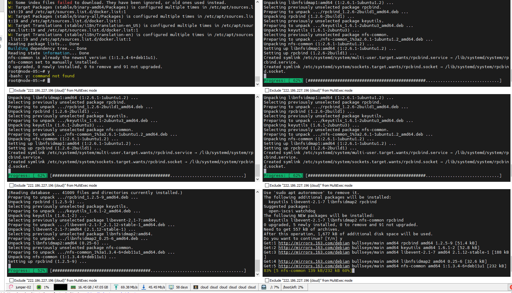

## Ceph事故处理总结

本次Ceph存储崩溃导致安心云新集群K8S上

+ 镜像仓库 - 构建输出物，已重建

+ Nexus - 公司开发私有仓库。重建重推

+ git代码 - 已重建。代码重新提交。 【丢失了BaseImage库】

+ 禅道附件 - 丢失

应用关联的文件存储：

| Pod 名称                            | 命名空间      | PVC 名称                   | 说明 |
| ----------------------------------- | ------------- | -------------------------- | ---- |
| fs-email-sender-79b78644dc-7wtqn    | anxincloud    | fs-email-sender            |      |
| openai-api-redis-5445c66849-dgwz8   | anxincloud    | openai-api-redis           |      |
| sensor-data-ck-9f4f55854-z7n9h      | anxincloud    | data-analysis-job          |      |
| web-project4-test-5b6db9d867-mhkdm  | anxincloud    | api-pvc                    |      |
| tools-6b9d49b69d-m786x              | devops-tools  | data-gitea-0               |      |
| openldap-7c86847589-s9995           | devops        | openldap-data              |      |
| ops-kubectl-wmcjl                   | devops        | pvc-ops-kubectl            |      |
| fs-gonghui-7874bfbf-qm85p           | free-sun      | ncgh                       |      |
| fs-party-5966878c8d-6ctjl           | free-sun      | party-pvc                  |      |
| fs-wiki-6dc847dd9b-79n7n            | free-sun      | pvc-fs-wiki                |      |
| harbor-chartmuseum-74bfcc8997-jcb9k | harbor-system | harbor-chartmuseum         |      |
| harbor-chartmuseum-74bfcc8997-km85t | harbor-system | harbor-chartmuseum         |      |
| harbor-chartmuseum-74bfcc8997-kv8gr | harbor-system | harbor-chartmuseum         |      |
| harbor-jobservice-6986df5849-tr4br  | harbor-system | harbor-jobservice          |      |
| harbor-jobservice-6986df5849-tr4br  | harbor-system | harbor-jobservice-scandata |      |


本次事故说明：


用NFS补救


```sh
sudo apt update
sudo apt install nfs-kernel-server

sudo mkdir -p /srv/nfs/k8s
sudo chown root:root /srv/nfs/k8s
sudo chmod 777 /srv/nfs/k8s
```

在所有节点上安装nfs-comm

```sh
sudo apt update
sudo apt install nfs-common

```




```sh
helm repo add nfs-subdir-external-provisioner https://kubernetes-sigs.github.io/nfs-subdir-external-provisioner/
helm install nfs-subdir-external-provisioner nfs-subdir-external-provisioner/nfs-subdir-external-provisioner \
    --set nfs.server=node-05 \
    --set nfs.path=/srv/nfs/k8s
```


创建StorageClass

创建一个 YAML 文件，例如 `nfs-storageclass.yaml`，其内容如下：

```yaml
apiVersion: storage.k8s.io/v1
kind: StorageClass
metadata:
  name: nfs
provisioner: nfs-client-provisioner
parameters:
  share: "node-05:/srv/nfs/k8s"
reclaimPolicy: Retain
```


