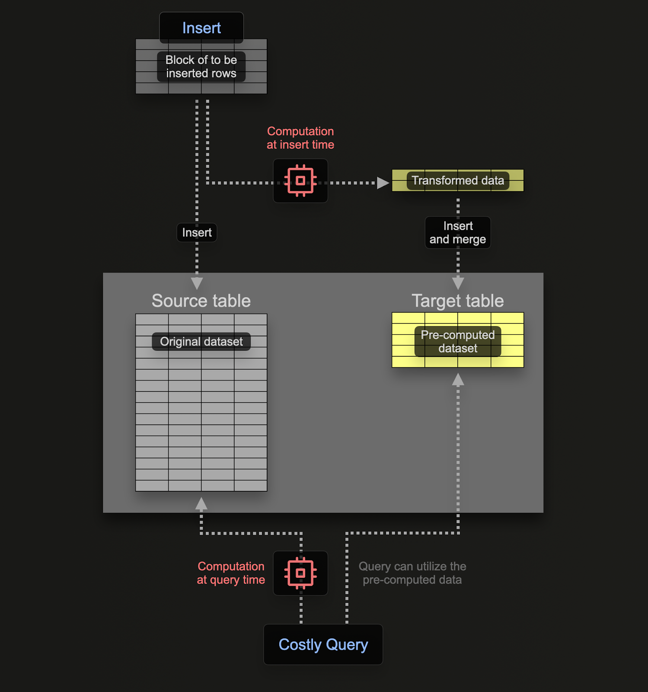

## Clickhouse-LASTA

> This time, the Free-Sun (飞尚) CK cluster was redeployed as a single instance. The original distributed tables were deleted, and a single table was rebuilt. Additionally, some data was transferred from Local to Beacon.
>
> 

```sql
-- 设备状态
drop table alarm.DeviceStatus;
select * from alarm.DeviceStatus limit 10;
create table alarm.DeviceStatus
(
	DeviceId String,
	Instance String,
	ThingId String,
	UserId LowCardinality(String),
	Status Int32,
	Time DateTime64(3, 'Asia/Shanghai')
)
engine = MergeTree ORDER BY (DeviceId, Time)
PARTITION BY toYYYYMM(Time)
SETTINGS index_granularity = 8192;

-- 设置TTL
ALTER TABLE alarm.DeviceStatus
MODIFY TTL toDateTime(Time) + INTERVAL 1 DAY;
-- [1002] ClickHouse exception, message: Code: 450. DB::Exception: TTL expression result column should have DateTime or Date type, but has DateTime64(3, 'Asia/Shanghai'). (BAD_TTL_EXPRESSION) (version 24.3.2.23 (official build)) , host: 218.3.126.49, port: 18125;

-- 24.3.2.23
select Version();
-- newest 2024.12.19   24.11.1.2557


-- 告警详情信息
drop table alarm.alarm_details;
select * from alarm.alarm_details limit 10;
create table alarm.alarm_details
(
	AlarmId String,
	AlarmState Int32,
	Sponsor LowCardinality(String),
	Content String,
	CurrentLevel Int32,
	AlarmCode LowCardinality(String),
	Time DateTime64(3, 'Asia/Shanghai')
)
engine = MergeTree ORDER BY (AlarmId, Time)
PARTITION BY toYYYYMM(Time)
SETTINGS index_granularity = 8192;

-- 告警表
drop table alarm.alarms;
select * from alarm.alarms limit 10;
create table alarm.alarms
(
	AlarmId String,
	SourceId String,
	SourceTypeId Int32,
	SourceName String,
	StructureId Int32,
	InitialLevel Int32,
	CurrentLevel Int32,
	StartTime DateTime64(3, 'Asia/Shanghai'),
	EndTime DateTime64(3, 'Asia/Shanghai'),
	AlarmCount Int32,
	AlarmTypeCode LowCardinality(String),
	AlarmTypeId Int32,
	AlarmCode LowCardinality(String),
	AlarmContent String,
	State Int32,
	AlarmGroup Int32,
	AlarmGroupUnit Int32,
	AlarmAdviceProblem String,
	Notice String,
	SubDevices Array(String),
	Project Nullable(String)
)
engine = ReplacingMergeTree ORDER BY AlarmId
PARTITION BY toYYYYMM(StartTime)
SETTINGS index_granularity = 8192;

-- 诊断数据
drop table alarm.diagnosis;
select * from alarm.diagnosis limit 10;
create table alarm.diagnosis
(
	DeviceId String,
	CollectTime DateTime64(3, 'Asia/Shanghai'),
	Data String
)
engine = MergeTree ORDER BY (DeviceId, CollectTime)
PARTITION BY toYYYYMM(CollectTime)
SETTINGS index_granularity = 8192;

-- 原始数据
drop table alarm.raws;
select * from alarm.raws limit 10;
create table alarm.raws
(
	SensorId String,
	CollectTime DateTime64(3, 'Asia/Shanghai'),
	Values Array(Float64),
	ValueStrs Array(String)
)
engine = MergeTree ORDER BY (SensorId, CollectTime)
PARTITION BY toYYYYMM(CollectTime)
SETTINGS index_granularity = 8192;

-- 主题数据
drop table alarm.themes;
select * from alarm.themes limit 10;
select count(*) from alarm.themes;
create table alarm.themes
(
	SensorId String,
	CollectTime DateTime64(3, 'Asia/Shanghai'),
	Values Array(Float64),
	ValueStrs Array(String)
)
engine = MergeTree ORDER BY (SensorId, CollectTime)
PARTITION BY toYYYYMM(CollectTime)
SETTINGS index_granularity = 8192;

-- 振动数据
drop table alarm.vibs;
select * from alarm.vibs limit 10;
create table alarm.vibs
(
	SensorId String,
	CollectTime DateTime64(3, 'Asia/Shanghai'),
	Values Array(Float64),
	Wave Array(Float32),
	Params String
)
engine = MergeTree ORDER BY (SensorId, CollectTime)
PARTITION BY toYYYYMM(CollectTime)
SETTINGS index_granularity = 8192;

-- 物联网卡状态
drop table alarm.CardStatus;
select * from alarm.CardStatus limit 10;
create table alarm.CardStatus
(
	DeviceId String,
	CardNo String,
	ICCID String,
	ValidDate String,
	PerActivationDate String,
	ActiveStatus Int32,
	Status Int32,
	Total Float64,
	Used Float64,
	Allowance Float64,
	PType LowCardinality(String),
	Time DateTime64(3, 'Asia/Shanghai')
)
engine = MergeTree ORDER BY (DeviceId, Time)
PARTITION BY toYYYYMM(Time)
SETTINGS index_granularity = 8192;

-- 同步本地数据
-- INSERT INTO alarm.DeviceStatus SELECT * FROM alarm.DeviceStatusLocal WHERE Time > '2024-11-30';
-- INSERT INTO alarm.alarm_details SELECT * FROM alarm.alarm_details_local WHERE Time > '2024-11-30';
-- INSERT INTO alarm.alarms SELECT * FROM alarm.alarms_local WHERE EndTime > '2024-11-30';
-- INSERT INTO alarm.diagnosis SELECT * FROM alarm.diagnosis_local WHERE CollectTime > '2024-11-30';
INSERT INTO alarm.raws SELECT * FROM alarm.raws_local WHERE CollectTime > '2024-11-30';
INSERT INTO alarm.themes SELECT * FROM alarm.themes_local WHERE CollectTime > '2024-11-30';
-- INSERT INTO alarm.vibs SELECT * FROM alarm.vibs_local WHERE CollectTime > '2024-11-30';
-- INSERT INTO alarm.CardStatus SELECT * FROM alarm.CardStatusLocal WHERE Time > '2024-11-30';

-- 查看当前正在运行的程序（上面的数据语句同步后注释）
select query_id,query,elapsed,total_rows_approx,written_rows from system.processes;
select * from system.processes;
KILL QUERY WHERE query_id = '16fcae7a-471d-416a-a46c-e8e39ec14377';
KILL QUERY WHERE query_id = '5d43e1e6-b47f-43b2-9bb4-e7b2486065da';
KILL QUERY WHERE query_id = '3f8feb92-aec4-4605-98b7-f7c2e7a055e1';


-- 查询分片磁盘胆小
select sum(a.data_uncompressed_gb) from (SELECT
    database,
    name,
    round(sum(data_uncompressed_bytes) / 1024 / 1024 / 1024, 2) AS data_uncompressed_gb,
    round(sum(data_compressed_bytes) / 1024 / 1024 / 1024, 2) AS data_compressed_gb
FROM system.parts
WHERE table = 'themes'
GROUP BY database, name) a;

-- 检查物化表
show tables in peppm;
show tables in pepca;
```

> Attempted to set a TTL for the `themes` table, where data older than one year will be deleted (with potential future plans to store it on local disk). Additionally, a materialized view table `themes_daily` was created to store one entry of data per day.
>
> 

```sql
CREATE MATERIALIZED VIEW themes_daily
ENGINE = MergeTree()
ORDER BY (SensorId, Day)
PARTITION BY toYYYYMM(Day)
AS
SELECT SensorId,
    any(Values) AS Values,
    any(ValueStrs) AS ValueStrs,
    toStartOfDay(CollectTime) AS Day
FROM themes
GROUP BY SensorId,Day;
```




但是考虑性能，没有执行这个物化themes_daily表，后续看还是程序自己聚合吧。


清理/更新数据的方法：

+ `TTL`
+ `ALTER TABLE themes DROP PARTITION '202301';`
+ `ALTER TABLE themes UPDATE Values = ['new_value'] WHERE SensorId = 'sensor_123';`


同步其他节点上的Local表到本地表

```sql
INSERT INTO alarm.themes(SensorId, CollectTime, Values)
SELECT SensorId, CollectTime, Values
FROM remote('ck-n5', alarm.themes_local, 'default', 'Fas123')
WHERE CollectTime between '2024-06-01' and '2024-11-30'
SETTINGS max_execution_time = 0, max_bytes_to_read = 0, log_query_threads = 0;

INSERT INTO alarm.themes SELECT * FROM alarm.themes_local WHERE CollectTime > '2024-06-01' and CollectTime<'2024-11-30';
```

