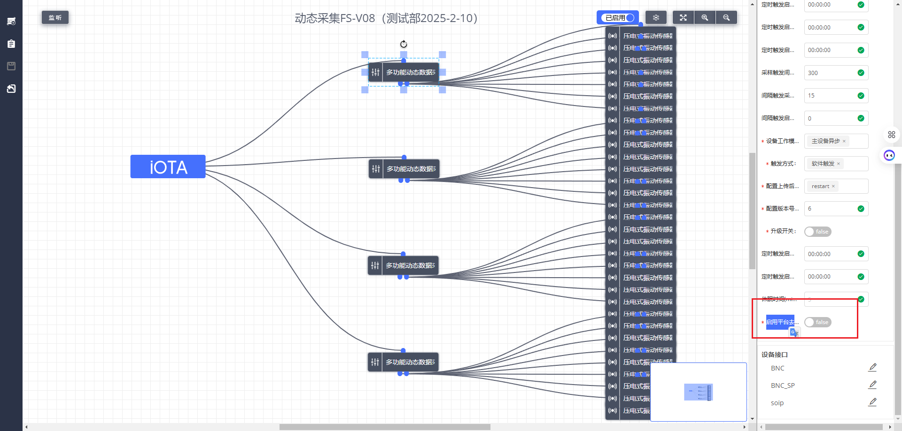
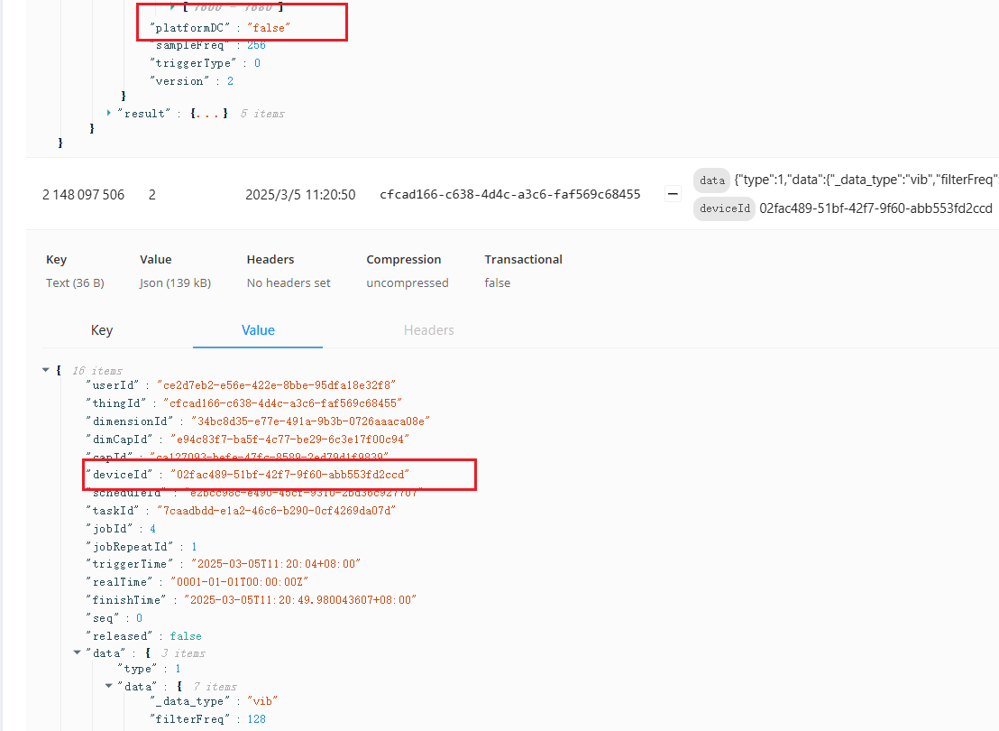
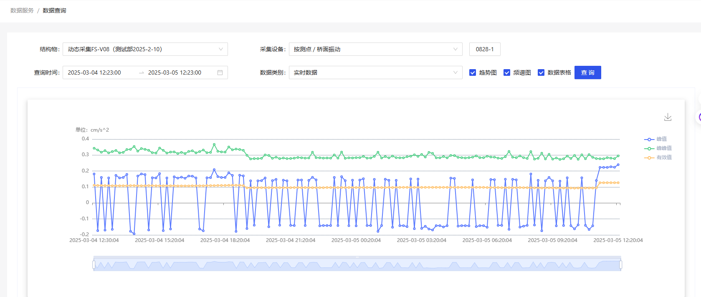
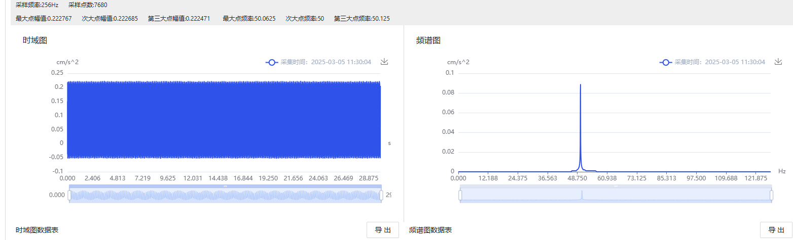

#### FS-V08平台去直流功能

验证结构物：动态采集FS-V08（测试部2025-2-10）

观察设备：`压电式振动传感器0828-1` `02fac489-51bf-42f7-9f60-abb553fd2ccd`

设备属性增加【启用平台去直流】。`FS-V08`设备上默认为关闭，即【平台默认不进行去直流】。

我们观察到Kafka数据中增加了字段Platform DC表示

平台查看11.30的数据，可以看出最新数据**无【去直流】**：

