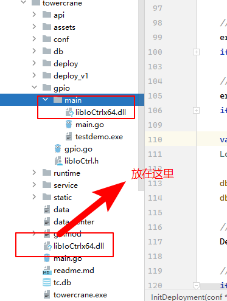

## Golang调用C++库实现GPIO调用

在塔吊防碰撞项目中，需要输出控制开关量，重新采购了开发板（Windows系统/C5750Z-C6 V2.0型号/i5双核/8G内存/128G固态存储）。其中GPIO输出内容：


提供了DLL库文件以及头文件：

`libIoCtrl.h` `libIoCtrlx64.dll`

在golang程序中：

```go
/*
#cgo LDFLAGS: -L. -lIoCtrlx64
#include "libIoCtrl.h"  // 确保包含正确的头文件，可能是 libIoCtrl.h 或相应的头文件
#include <windows.h>
*/
import "C"
import (
   "fmt"
   "unsafe"
)
```

执行初始化：

```go
func main() {
	var input string
	fmt.Print("Press bios id...")
	// 使用 fmt.Scan 读取输入
	_, _ = fmt.Scan(&input)
	// 1. 初始化
	var hlib C.HMODULE
	biosID := C.CString(input)
	defer C.free(unsafe.Pointer(biosID))

	// 调用 libIoCtrlInit
	result := C.libIoCtrlInit(&hlib, biosID)
	if result != 0 {
		fmt.Println("libIoCtrlInit failed:", result)
		return
	}
	fmt.Println("libIoCtrlInit succeeded")
}
```


注意：

1. 没有HMODULE类型

   CGo不原生支持C++，需要加上基础库；

   ```c++
   #ifndef _LIB_IOCTRL_H
   #define _LIB_IOCTRL_H
   #include <windows.h>
   ```

   

2. 不支持extern "C" __declspec(dllexport)

   ```c++
   
   #ifdef __cplusplus
   extern "C" {
   #endif
   
   // 使用 GCC 的导出方式
   __attribute__((visibility("default"))) int libIoCtrlInit(HMODULE *hlib, char* bios_id);
   
   ```

   

3. GPIO_INDEX类型调用

   ```go
   func SetLevel(biosId string, pin int, level int) error {
   	// 1. 初始化
   	var hlib C.HMODULE
   	biosID := C.CString(biosId)
   	defer C.free(unsafe.Pointer(biosID))
   
   	// 调用 libIoCtrlInit
   	result := C.libIoCtrlInit(&hlib, biosID)
   	if result != 0 {
   		return fmt.Errorf("libIoCtrlInit failed: %v", result)
   	}
   	log.Info("libIoCtrlInit succeeded")
   
   	// 设置 GPIO 状态
   	result = C.setPinLevel(&hlib, C.GPIO_INDEX(pin), C.GPIO_LEVEL(level))
   	if result != 0 {
   		return fmt.Errorf("setPinLevel failed: %v", result)
   	}
   	return nil
   }
   ```

   

4. Process finished with the exit code -1073741515 (0xC0000135)

   注意：库文件必须放在相对根目录的位置。

   如：

