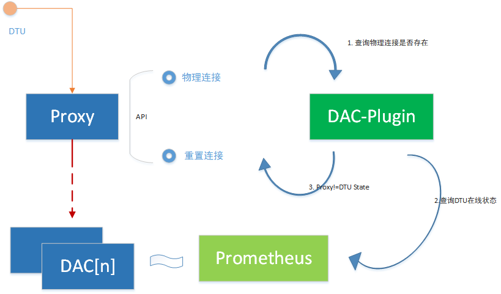
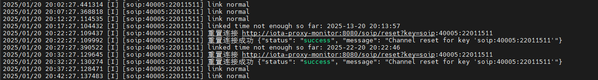
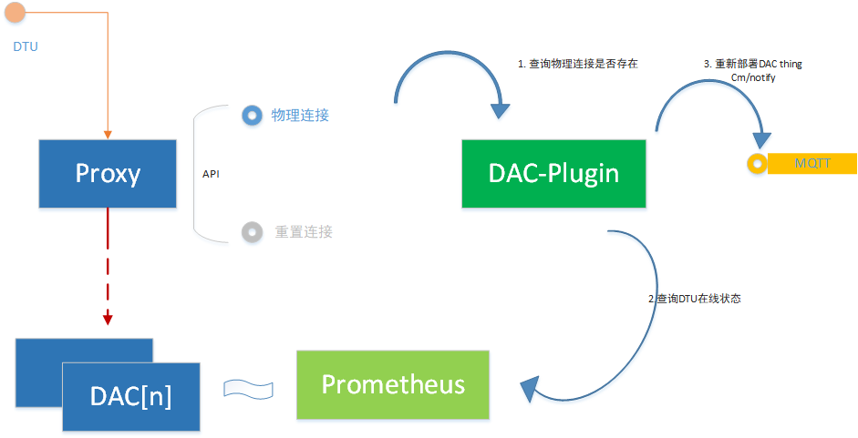

## HYG云振动假连接

### 故障现象：

https://pms.anxinyun.cn/bug-view-20170.html

结构物：河北高速黑崖沟大桥

问题：云振动离线，但是重新保存组网恢复上线。


### 原因不明

日志可以看出来，最后状态，设备已经连接到代理iota-proxy，但是代理没能正确转发到DAC或者DAC未能正确处理该连接。

导致设备看上去是连上平台的，实际平台上连接却是虚挂的。

### 解决思路：

修改Proxy使之暴露连接状态查看的接口，可以查看设备连接是否存在。

增加监控程序DAC-Plugin(补丁程序)，如果查到设备连到Proxy，但是设备显示未连接（DAC状态）的，就在Proxy中关闭当前连接，使得设备连接重置。

设备重新上线后，一般可以恢复此类异常状态（从web界面重新保存部署，效果是一样的，会触发Proxy关闭当前设备的连接）



### 发布部署：

代码：

`DAC-Plugin` \FS-IOT\trunk\code\gowork\src\dac-plugin

`Proxy`: \Iota\trunk\code\gowork\src\proxy


Jenkins:

`DAC-Plugin` https://jenkins.ngaiot.com/job/dac-plugin/

`Proxy`: https://jenkins.ngaiot.com/job/iota-proxy/


Proxy中增设服务：

```yaml
apiVersion: v1
kind: Service
metadata:
  name: iota-proxy-monitor
  labels:
    iota.service: proxy
  namespace: iota
spec:
  type: ClusterIP
  ports:
    - name: "monitor"
      port: 8080
      targetPort: 8080
  selector:
    iota.service: proxy
```


部署新监控程序（`dac-plugin`）

> 以太anxin-m1服务器： /home/anxin/iota/orchestrator 
>
> `iota-dac-plugin-cm.yaml`
> `iota-dac-plugin.yaml`


### 实际效果：

1-20日20点22左右, 出现设备代理上线，但是无DAC上线状态：

```json

时间 	log  	beat.hostname  
	January 20th 2025, 20:22:47.939	[D] [soip] key soip:40005:22011511 data package content: 111501223133393132333435363738000a1020c100	iota-proxy-77ff8c67c5-gqxt5
	January 20th 2025, 20:22:47.939	[I] [soip] key soip:40005:22011511 has been connected, starting transfer...	iota-proxy-77ff8c67c5-gqxt5
	January 20th 2025, 20:13:58.482	[D] [soip] key soip:40005:22011511 data package content: 111501223133393132333435363738000a1020c100	iota-proxy-77ff8c67c5-gqxt5
	January 20th 2025, 20:13:58.482	[I] [soip] key soip:40005:22011511 has been connected, starting transfer...	iota-proxy-77ff8c67c5-gqxt5
	January 20th 2025, 20:13:33.328	[D] Service.OnStatus : soip:40005:22011511 - Closed	iota-dac-14
	January 20th 2025, 20:13:33.328	[D] Link [soip:40005:22011511] closed	iota-dac-14
	January 20th 2025, 20:13:33.328	[E] [soip:40005:22011511] read error: EOF	iota-dac-14
	January 20th 2025, 20:13:33.328	[D] Channel 'soip:40005:22011511' invalid due to link 'soip:40005:22011511' broken.	iota-dac-14
```

查看监控程序日志：



从监控程序日志可以看出，DAC-Plugin在连接假状态后，大概等待10分钟后，调用了重连接口，但是之后设备重新上线，但是DAC还是未上线，直至又过了十分钟之后，第二次Reset该连接后，恢复了。


出现问题的时候，重新点击保存，数据立马恢复上线了。。。


### 最终版本：

修改发送MQTT到DAC，触发重新部署Thing：

