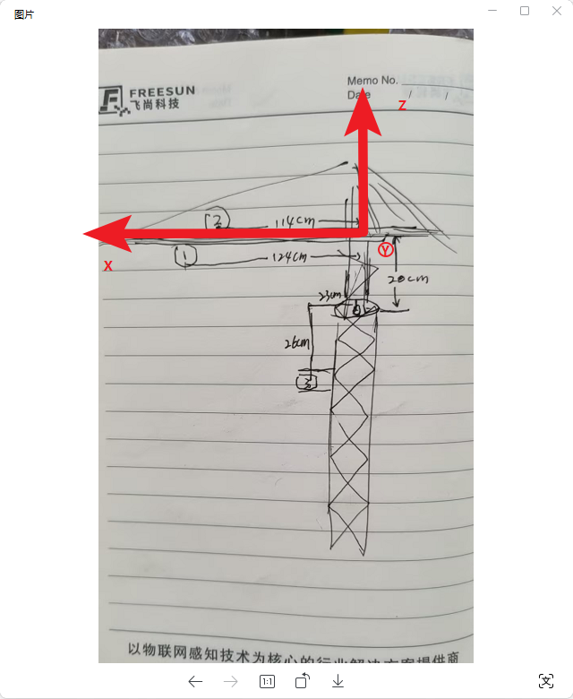
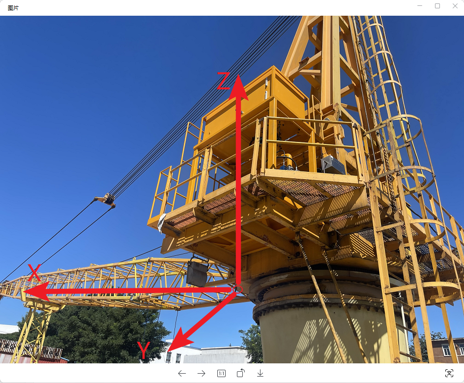
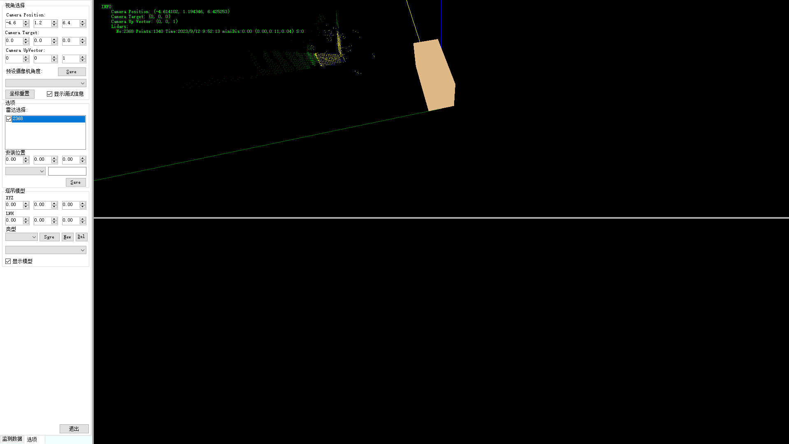
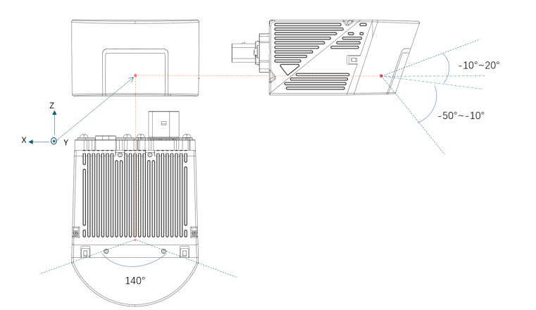
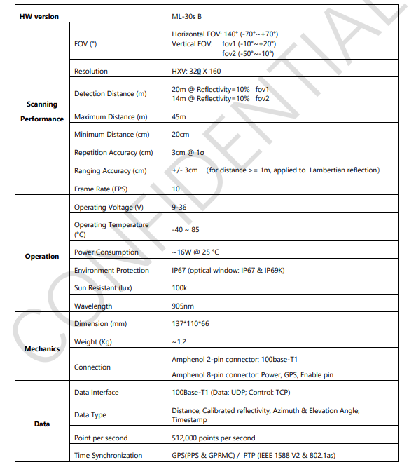
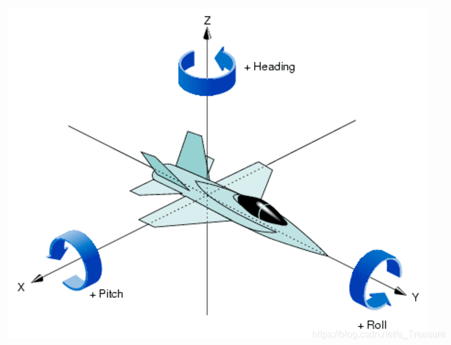

激光雷达扫描到三维点云数据坐标，我们需要将三个激光雷达的坐标系转换到同一坐标系中，由此来判断障碍物与大臂的距离，进行碰撞风险预警。为此，我们需要在我们的系统中建立坐标系统：

## 安装坐标系

> 建立坐标系：
>
> + 塔身和大臂的交界中心点处，位于大臂的下沿，定义为坐标原点
>
> + 平行大臂方向，指向大臂前端为X轴
> + 水平垂直于大臂，位于X轴正向左侧的为Y轴
> + 向上为Z轴
> + 数值单位均为 m（米）

安装要点：

+ 激光雷达必须放置水平（需水平尺）
+ 2台激光雷达安装必须垂直于X轴（垂直于大臂），另外1台激光需平行于X轴

## 坐标配置

1. 测量激光雷达的坐标， 在【雷达选择】中选中待修改的雷达，修改【安装位置】后点击【保存】。

2. 建立塔身、大臂模型

   建立（多个）长方体模型，代表塔吊塔身、大臂等。需测量大臂的长宽高。

   在【塔吊模型】中添加长方体模型块。其中XYZ代表长方体顶点坐标，LWH分别代表长方体长宽高（单位均为m）。

   其中【类型】中，`zone`代表防碰撞本体*（比如大臂），exclude代表排除区域（比如后方和地面）。

   点击【Save】即保存更新到当前选择的模型中，点击【New】使用当前坐标新建模型，【Del】删除选中模型。

   > 算法中，过滤所有在模型体积内的点，在计算到`zone`的距离，求最小距离作为碰撞距离。

## 附录

### 激光雷达的坐标，需要以雷达探头的具体位置为准

HW version ML-30s B Scanning Performance FOV (°) Horizontal FOV: 140° (-70°~+70°) Vertical FOV: fov1 (-10°~+20°) fov2 (-50°~-10°) Resolution HXV: 320 X 160 Detection Distance (m) 20m @ Reflectivity=10% fov1 14m @ Reflectivity=10% fov2 Maximum Distance (m) 45m Minimum Distance (cm) 20cm Repetition Accuracy (cm) 3cm @ 1σ Ranging Accuracy (cm) +/- 3cm （for distance >= 1m, applied to Lambertian reflection） Frame Rate (FPS) 10 Operation Operating Voltage (V) 9-36 Operating Temperature (°C) -40 ~ 85 Power Consumption ~16W @ 25 °C Environment Protection IP67 (optical window: IP67 & IP69K) Sun Resistant (lux) 100k Wavelength 905nm Mechanics Dimension (mm) 137*110*66 Weight (Kg) ~1.2 Connection Amphenol 2-pin connector: 100base-T1 Amphenol 8-pin connector: Power, GPS, Enable pin Data Data Interface 100Base-T1 (Data: UDP; Control: TCP) Data Type Distance, Calibrated reflectivity, Azimuth & Elevation Angle, Timestamp Point per second 512,000 points per second Time Synchronization GPS(PPS & GPRMC) / PTP (IEEE 1588 V2 & 802.1as)

### 通过电子罗盘仪测量坐标系，其中电子罗盘仪的三个值分别是：

Heading(方位角度)、Pitch（俯仰角度）、Roll（ 横滚角度）。

1. **方位角度（Heading）**：方位角度通常用于描述物体相对于地理北方的旋转。在建立坐标系时，你可以将地理北方作为参考方向，然后使用方位角度来表示物体相对于北方的旋转角度。通常，0度表示北方，90度表示东方，180度表示南方，270度表示西方。
2. **俯仰角度（Pitch）**：俯仰角度表示物体绕横轴（通常是X轴）旋转的角度。正的俯仰角表示物体向上旋转，负的俯仰角表示物体向下旋转。在建立坐标系时，俯仰角度可以用来描述物体相对于水平面的倾斜。
3. **横滚角度（Roll）**：横滚角度表示物体绕纵轴（通常是Z轴）旋转的角度。正的横滚角表示物体向右旋转，负的横滚角表示物体向左旋转。横滚角度通常用于描述物体的侧倾。

