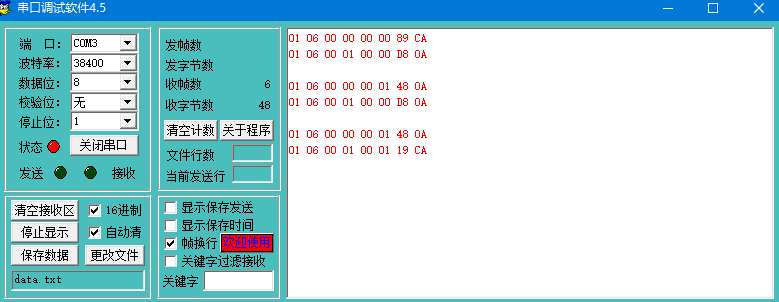

## Modbus信号量输出

默认使用串口COM1，如需修改可以添加以下参数：

```
默认配置：
串口号：COM1  (配置项 output)
地址：1 (配置项 modbus.slave)
波特率：38400 (配置项 modbus.baudrate)
数据位：8
停止位：1
奇偶校验：无

输出口1：Y1 (3级告警) (配置项 modbus.y1)
输出口2：Y2 (2级或更高级别告警（关断）) (配置项 modbus.y2)
```

具体修改方法，是修改/添加 `conf`文件夹下的`edge.conf`。 以下是一个示例：（注意，**默认参数进行连接的时候，不需要做任何修改**）

```json
{
  "db.dir": "conf",
  "db.type": "file",
  "log.file": "true",
  "log.file.loc": "runtime/logs/log",
  "range_lidar": "...",
  "serial_no": "crane001",
  "output":"COM2",
  "modbus.slave":"1",
  "modbus.baudrate":38400,
  "modbus.y1":"1",
  "modbus.y2":"2",
}
```


功能说明：

1. 程序启动时候初始化，会将Y1和Y2均设置为低电平
2. 当触发到 3级告警时，将 Y1设置为高电平，Y2低电平
3. 当触发到 2/1级告警时，将 Y1设置为高电平，Y2高电平
4. 当远离障碍物，告警取消时，会将Y1和Y2重新设置为低电平


自测说明：

使用串口模拟对接端口测试验证下发，模拟设置告警状态等级

1. 初始化，收到报文

   ```
   01 06 00 00 00 00 89 CA 
   01 06 00 01 00 00 D8 0A 
   ```

2. 状态3级告警，收到报文

   ```
   01 06 00 00 00 01 48 0A 
   01 06 00 01 00 00 D8 0A 
   ```

   

3. 状态2/1级告警（关断），收到报文

   ```
   01 06 00 00 00 01 48 0A 
   01 06 00 01 00 01 19 CA 
   ```

   

