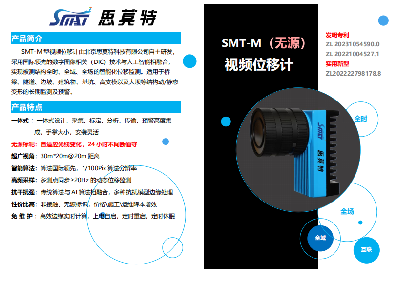
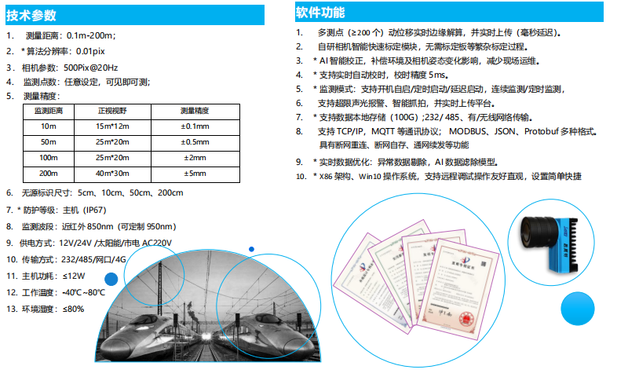

## 无源光电挠度仪技术调研 Passive Flexometer Detector

> 无源光电挠度检测传感器，基于OpenCV可视化的光电挠度仪技术预研

对标产品 **SMT-M**(思莫特)

#### 开发建议

下位机通过红外摄像头、红外光源LED对远端无源标靶进行成像，在设备端对图像进行简单处理（灰度、裁剪、去噪和阈值处理后)将图片上次到云端（处理后上传目的：1.减轻云端压力 2.减少传输带宽），云端对图像点位进行识别，计算测量物体位移量。

技术术语：

| 术语                               | 说明                                                         |
| ---------------------------------- | ------------------------------------------------------------ |
| DIC                                | （Digital Image Correlation，数字图像相关）是一种用于数字图像处理的技术，主要用于测量物体在不同状态下的形变、位移和应变。该技术通过对比不同时间点或不同状态下的图像，来分析物体表面的变化情况。 |
| ROI                                | **（Region of Interest）**OI指图像中用户感兴趣的特定区域。在处理和分析图像时，常常只对特定区域进行处理，而不是整个图像。这样可以减少计算量，提高处理速度 |
| **Optical Flow**                   | **光流**：用于检测图像序列中物体的运动。常用算法包括`Lucas-Kanade`光流法和`Farneback`光流法。 |
| **Feature Detection and Matching** | **特征检测和匹配**：用于图像识别和物体跟踪的技术，包括SIFT（尺度不变特征变换）、SURF（加速鲁棒特征）、ORB（快速和旋转不变的BRIEF）等。 |
| **Hough Transform**                | **霍夫变换**：用于检测图像中的形状（如直线和圆）的算法。`cv2.HoughLines`和`cv2.HoughCircles`是常用的函数 |
| **Contours**                       | **轮廓**：在图像处理中特别重要，用于物体检测和识别。可以使用`cv2.findContours`函数来检测图像中的轮廓，并用`cv2.drawContours`函数来绘制它们。 |
| **Canny边缘检测**                  | 一种流行的边缘检测算法，用于检测图像中的边缘。该算法使用多级边缘检测器来检测图像中的边缘 |
| **阈值处理**                       | Thresholding 用于将灰度图像转换为二值图像。通过设定一个阈值，将图像中的像素值分类为前景和背景。常用的函数包括`cv2.threshold`和自适应阈值处理 |
| 大津法                             | 大津法（Otsu's method）是一种用于图像分割的自动阈值选择方法。它通过计算不同阈值下类间方差的最大值，来确定一个最优的阈值，将图像分为前景和背景。大津法特别适用于灰度图像的二值化处理 |
| 中值去噪                           | 中值去噪（Median Filtering）是一种常用的图像去噪技术，特别适用于去除椒盐噪声（Salt-and-Pepper Noise）或脉冲噪声（Impulse Noise）。它通过取窗口内像素值的中值来替换中心像素值，从而有效地平滑图像而不显著模糊边缘。 |
| 亚像素级                           | 亚像素级分析（Sub-pixel Level Analysis）是一种在图像处理和计算机视觉中用于提高定位精度的技术。它通过计算来确定物体的位置、运动或其他特征，精度超过图像像素级别，达到亚像素级别。这种分析在需要高精度的应用中非常重要，比如目标跟踪、模式识别、图像拼接、3D重建等 |
| NIR                                | 近红外成像，常用于红外成像、夜视设备、生物医学成像、遥感以及工业检测等领域。通常使用的波段有850nm和940nm，其中940nm穿透性更好并且人眼不可见 |
|                                    |                                                              |
|                                    |                                                              |

注意问题：

1、精度问题： 能不能达到0.1mm精度

2、夜间红外摄像头成像效果测试

3、噪声影响